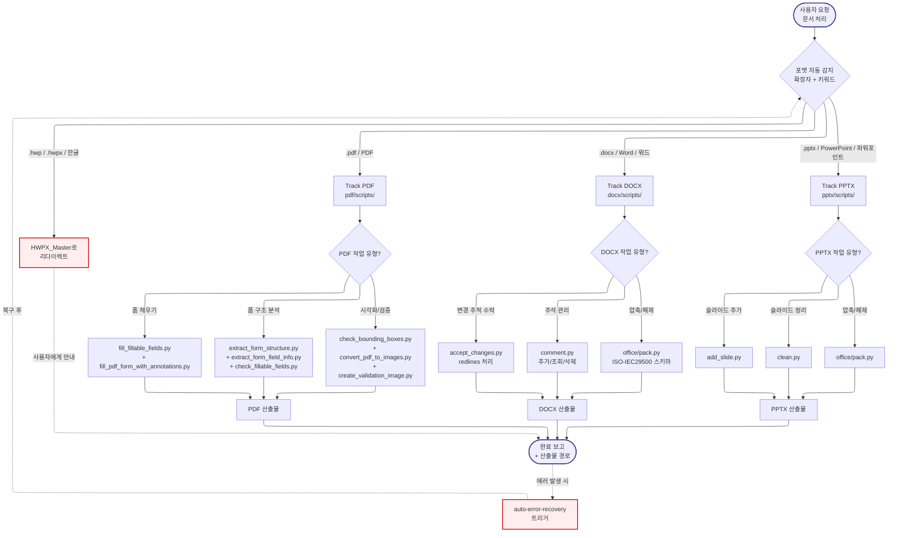

# DocKit -- Navigator

> SYSTEM_NAVIGATOR 스타일 시각적 네비게이터
> 최종 갱신: 2026-04-11 (Tier-B Option A 세션 2 신규 생성)
> SKILL.md와 교차 참조 (이 파일은 SKILL.md의 시각화 계층)

---

## 0. 범례 + 사용법 {#범례--사용법}

### 상태 표시

| 표시 | 의미 |
|------|------|
| **[작동]** | 정상 작동 중 |
| **[부분]** | 일부만 작동 |
| **[미구현]** | 설계만 있고 구현 없음 |

### 다이어그램 규약

- ISO 5807:1985 표준 기호 준수
- Mermaid ELK 렌더러 + `securityLevel: loose`
- 점선 `-.->` = 피드백 루프 (재시도/복귀)
- `:::warning` = 에러/차단/실패 블럭
- `click NODE "#anchor"` = 블럭 상세 카드로 이동

### 스킬 메타

| 항목 | 값 |
|------|-----|
| 이름 | DocKit |
| Tier | B |
| 커맨드 | 자동 트리거 (`.pdf`, `.docx`, `.pptx`, `PDF`, `Word`, `워드`, `PowerPoint`, `파워포인트`, `발표자료`, `보고서 작성`) |
| 프로세스 타입 | Track (3-Track: PDF/DOCX/PPTX + HWP 리다이렉트) |
| 설명 | PDF, DOCX(Word), PPTX(PowerPoint) 3가지 포맷 종합 처리. HWP/HWPX는 HWPX_Master로 리다이렉트 |

---

## 1. 전체 워크플로우 체계도 {#전체-체계도}

<!-- AUTO:DIAGRAM_MAIN:START -->



<!-- AUTO:DIAGRAM_MAIN:END -->

<details><summary><strong>블럭 바로가기 (다이어그램 클릭 대안)</strong></summary>

[진입](#node-start) · [포맷 감지](#node-format-detect) · [Track PDF](#node-track-pdf) · [Track DOCX](#node-track-docx) · [Track PPTX](#node-track-pptx) · [HWP 리다이렉트](#node-redirect) · [PDF 유형](#node-pdf-type) · [PDF Fill](#node-pdf-fill) · [PDF Extract](#node-pdf-extract) · [PDF Visual](#node-pdf-visual) · [PDF 결과](#node-pdf-result) · [DOCX 유형](#node-docx-type) · [DOCX Accept](#node-docx-accept) · [DOCX Comment](#node-docx-comment) · [DOCX Pack](#node-docx-pack) · [DOCX 결과](#node-docx-result) · [PPTX 유형](#node-pptx-type) · [PPTX Add](#node-pptx-add) · [PPTX Clean](#node-pptx-clean) · [PPTX Pack](#node-pptx-pack) · [PPTX 결과](#node-pptx-result) · [완료](#node-end) · [AER 연계](#node-aer)
· [**전체 블럭 카탈로그**](#block-catalog)

</details>

[맨 위로](#범례--사용법)

---

## 2. 블럭 상세 카탈로그 {#block-catalog}

<details><summary>블럭 카드 펼치기 (22개)</summary>

### 진입: 문서 처리 요청 {#node-start}

| 항목 | 내용 |
|------|------|
| 소속 | 진입점 |
| 동기 | PDF/DOCX/PPTX 3가지 포맷을 단일 스킬로 처리해야 사용자 혼란 방지. HWP만 분리 (별도 스킬) |
| 내용 | 사용자가 문서 파일 또는 포맷 키워드를 언급하면 자동 트리거 |
| 동작 방식 | 파일 확장자 + 자연어 키워드 감지 |
| 상태 | [작동] |
| 관련 파일 | `.agents/skills/DocKit/SKILL.md` |

[다이어그램으로 복귀](#전체-체계도)

### 포맷 자동 감지 {#node-format-detect}

| 항목 | 내용 |
|------|------|
| 소속 | 결정 블럭 (Decision, 1차 라우팅) |
| 동기 | 4개 포맷(PDF/DOCX/PPTX/HWP)을 빠르게 분류하여 적절한 Track으로 보냄 |
| 내용 | 파일 확장자 우선 + 키워드 보조 (Word→DOCX, 파워포인트→PPTX, 한글→HWP) |
| 동작 방식 | 확장자 매칭 → 없으면 자연어 키워드 매칭 |
| 상태 | [작동] |
| 관련 파일 | SKILL.md |

[다이어그램으로 복귀](#전체-체계도)

### Track PDF 진입 {#node-track-pdf}

| 항목 | 내용 |
|------|------|
| 소속 | Track A (PDF 전용) |
| 동기 | PDF는 폼 필드가 있는 대화형 문서부터 읽기 전용까지 다양 → 하위 작업 유형 재분기 필요 |
| 내용 | `pdf/scripts/` 하위 8개 스크립트로 라우팅 |
| 동작 방식 | 사용자 요청의 동사(채우기/추출/시각화)에 따라 PDFType 결정 |
| 상태 | [작동] |
| 관련 파일 | `.agents/skills/DocKit/pdf/scripts/` |

[다이어그램으로 복귀](#전체-체계도)

### Track DOCX 진입 {#node-track-docx}

| 항목 | 내용 |
|------|------|
| 소속 | Track B (DOCX 전용) |
| 동기 | DOCX는 변경 추적(redlines), 주석, 압축/해제 등 MS Office 특화 기능이 핵심 |
| 내용 | `docx/scripts/` 하위 스크립트 + `office/` 공통 인프라 호출 |
| 동작 방식 | ISO-IEC29500 스키마 기반 파싱 |
| 상태 | [작동] |
| 관련 파일 | `.agents/skills/DocKit/docx/scripts/`, `office/` |

[다이어그램으로 복귀](#전체-체계도)

### Track PPTX 진입 {#node-track-pptx}

| 항목 | 내용 |
|------|------|
| 소속 | Track C (PPTX 전용) |
| 동기 | 발표자료 생성/수정은 슬라이드 단위 조작이 핵심. DOCX와 다른 구조 |
| 내용 | `pptx/scripts/` 하위 스크립트 + `office/` 공통 인프라 |
| 동작 방식 | 슬라이드 레이아웃 조작 |
| 상태 | [작동] |
| 관련 파일 | `.agents/skills/DocKit/pptx/scripts/`, `office/` |

[다이어그램으로 복귀](#전체-체계도)

### HWP/HWPX 리다이렉트 {#node-redirect}

| 항목 | 내용 |
|------|------|
| 소속 | 에러 처리 (ISO 5807 Error Handling) |
| 동기 | HWP는 한국 특화 포맷으로 처리 로직이 완전히 다름 → DocKit이 아닌 HWPX_Master 전용 |
| 내용 | "HWP 파일은 HWPX_Master 스킬을 사용하세요" 안내 + HWPX_Master 호출 유도 |
| 동작 방식 | 사용자에게 즉시 알림 + DocKit 실행 중단 |
| 상태 | [작동] |
| 관련 파일 | `.agents/skills/HWPX_Master/SKILL.md` |

[다이어그램으로 복귀](#전체-체계도)

### PDF 작업 유형 분기 {#node-pdf-type}

| 항목 | 내용 |
|------|------|
| 소속 | Track A 서브 결정 |
| 동기 | PDF 8개 스크립트를 용도별로 3그룹으로 묶어 선택 효율 향상 |
| 내용 | 폼 채우기 / 폼 구조 분석 / 시각화 검증 3그룹 중 선택 |
| 동작 방식 | 사용자 요청의 동사 매칭 |
| 상태 | [작동] |
| 관련 파일 | SKILL.md |

[다이어그램으로 복귀](#전체-체계도)

### PDF 폼 채우기 {#node-pdf-fill}

| 항목 | 내용 |
|------|------|
| 소속 | Track A 서브 경로 1 |
| 동기 | PDF 폼 필드에 데이터를 자동 입력하여 수동 작성 시간 제거 |
| 내용 | `fill_fillable_fields.py` (기본 필드) + `fill_pdf_form_with_annotations.py` (주석 기반) |
| 동작 방식 | PyPDF2/pdfplumber 폼 필드 탐색 후 값 주입 |
| 상태 | [작동] |
| 관련 파일 | `pdf/scripts/fill_fillable_fields.py`, `fill_pdf_form_with_annotations.py` |

[다이어그램으로 복귀](#전체-체계도)

### PDF 폼 구조 분석 {#node-pdf-extract}

| 항목 | 내용 |
|------|------|
| 소속 | Track A 서브 경로 2 |
| 동기 | 폼 필드의 타입/좌표/필수 여부를 파악해야 자동 채우기 가능 |
| 내용 | 구조 추출 + 필드 정보 추출 + 채울 수 있는 필드 확인 3개 스크립트 조합 |
| 동작 방식 | 스크립트 순차 실행 → JSON 결과 통합 |
| 상태 | [작동] |
| 관련 파일 | `extract_form_structure.py`, `extract_form_field_info.py`, `check_fillable_fields.py` |

[다이어그램으로 복귀](#전체-체계도)

### PDF 시각화 검증 {#node-pdf-visual}

| 항목 | 내용 |
|------|------|
| 소속 | Track A 서브 경로 3 |
| 동기 | 폼 필드 위치가 정확한지, 채워진 결과가 올바른지 시각 확인 필요 |
| 내용 | 바운딩 박스 검사 + PDF → 이미지 변환 + 검증 이미지 생성 |
| 동작 방식 | `convert_pdf_to_images.py`로 렌더링 후 `create_validation_image.py`로 박스 표시 |
| 상태 | [작동] |
| 관련 파일 | `check_bounding_boxes.py`, `convert_pdf_to_images.py`, `create_validation_image.py` |

[다이어그램으로 복귀](#전체-체계도)

### PDF 산출물 {#node-pdf-result}

| 항목 | 내용 |
|------|------|
| 소속 | Track A 종료 |
| 동기 | 3개 서브 경로 결과를 단일 지점으로 수렴 |
| 내용 | 채워진 PDF / 구조 JSON / 검증 이미지 중 선택 |
| 동작 방식 | Output 경로 반환 |
| 상태 | [작동] |
| 관련 파일 | `Projects/*/Output/` |

[다이어그램으로 복귀](#전체-체계도)

### DOCX 작업 유형 분기 {#node-docx-type}

| 항목 | 내용 |
|------|------|
| 소속 | Track B 서브 결정 |
| 동기 | Word의 3가지 핵심 작업(변경추적/주석/압축)을 용도별 분기 |
| 내용 | accept_changes / comment / pack 중 선택 |
| 동작 방식 | 사용자 요청 키워드 매칭 |
| 상태 | [작동] |
| 관련 파일 | SKILL.md |

[다이어그램으로 복귀](#전체-체계도)

### DOCX 변경 추적 수락 {#node-docx-accept}

| 항목 | 내용 |
|------|------|
| 소속 | Track B 서브 경로 1 |
| 동기 | 공동 작업 문서의 redlines(변경 추적)를 일괄 수락하여 최종본 생성 |
| 내용 | `accept_changes.py` 실행 → 모든 redlines 자동 수락 |
| 동작 방식 | office helpers (merge_runs, simplify_redlines) 활용 |
| 상태 | [작동] |
| 관련 파일 | `docx/scripts/accept_changes.py`, `office/helpers/` |

[다이어그램으로 복귀](#전체-체계도)

### DOCX 주석 관리 {#node-docx-comment}

| 항목 | 내용 |
|------|------|
| 소속 | Track B 서브 경로 2 |
| 동기 | 리뷰 과정에서 주석 추가/조회/삭제를 통합 관리 |
| 내용 | `comment.py` 단일 스크립트로 3가지 모드 지원 |
| 동작 방식 | 커맨드 인자로 add/list/delete 선택 |
| 상태 | [작동] |
| 관련 파일 | `docx/scripts/comment.py` |

[다이어그램으로 복귀](#전체-체계도)

### DOCX 압축/해제 {#node-docx-pack}

| 항목 | 내용 |
|------|------|
| 소속 | Track B 서브 경로 3 |
| 동기 | DOCX 내부 XML 직접 수정 시 필요 (ISO-IEC29500 스키마) |
| 내용 | `office/pack.py`로 DOCX → unzip/zip 변환 |
| 동작 방식 | 일반 zip 파일로 처리 가능한 구조 노출 |
| 상태 | [작동] |
| 관련 파일 | `docx/scripts/office/pack.py` |

[다이어그램으로 복귀](#전체-체계도)

### DOCX 산출물 {#node-docx-result}

| 항목 | 내용 |
|------|------|
| 소속 | Track B 종료 |
| 동기 | 3개 서브 경로 결과를 단일 지점으로 수렴 |
| 내용 | 수락된 DOCX / 주석 변경본 / 압축 해제 디렉토리 중 선택 |
| 동작 방식 | Output 경로 반환 |
| 상태 | [작동] |
| 관련 파일 | 대상 DOCX 파일 |

[다이어그램으로 복귀](#전체-체계도)

### PPTX 작업 유형 분기 {#node-pptx-type}

| 항목 | 내용 |
|------|------|
| 소속 | Track C 서브 결정 |
| 동기 | PowerPoint 3가지 핵심 작업(추가/정리/압축) 중 선택 |
| 내용 | add_slide / clean / pack |
| 동작 방식 | 사용자 요청 매칭 |
| 상태 | [작동] |
| 관련 파일 | SKILL.md |

[다이어그램으로 복귀](#전체-체계도)

### PPTX 슬라이드 추가 {#node-pptx-add}

| 항목 | 내용 |
|------|------|
| 소속 | Track C 서브 경로 1 |
| 동기 | 기존 발표자료에 신규 슬라이드를 프로그래밍 방식으로 추가 |
| 내용 | `add_slide.py`로 레이아웃 지정 후 삽입 |
| 동작 방식 | python-pptx 또는 pptxgenjs 활용 |
| 상태 | [작동] |
| 관련 파일 | `pptx/scripts/add_slide.py`, `pptx/pptxgenjs.md` |

[다이어그램으로 복귀](#전체-체계도)

### PPTX 슬라이드 정리 {#node-pptx-clean}

| 항목 | 내용 |
|------|------|
| 소속 | Track C 서브 경로 2 |
| 동기 | 불필요한 빈 슬라이드, 중복, 포맷 오류 제거 |
| 내용 | `clean.py`로 일괄 정리 |
| 동작 방식 | 슬라이드 순회 → 조건부 삭제 |
| 상태 | [작동] |
| 관련 파일 | `pptx/scripts/clean.py`, `pptx/editing.md` |

[다이어그램으로 복귀](#전체-체계도)

### PPTX 압축/해제 {#node-pptx-pack}

| 항목 | 내용 |
|------|------|
| 소속 | Track C 서브 경로 3 |
| 동기 | PPTX 내부 XML 직접 수정 필요 시 |
| 내용 | `office/pack.py`로 PPTX → unzip/zip |
| 동작 방식 | DOCX pack과 동일 인프라 재사용 |
| 상태 | [작동] |
| 관련 파일 | `pptx/scripts/office/pack.py` |

[다이어그램으로 복귀](#전체-체계도)

### PPTX 산출물 {#node-pptx-result}

| 항목 | 내용 |
|------|------|
| 소속 | Track C 종료 |
| 동기 | 3개 서브 경로 결과를 단일 지점으로 수렴 |
| 내용 | 슬라이드 추가된 PPTX / 정리된 PPTX / 압축 해제 디렉토리 |
| 동작 방식 | Output 경로 반환 |
| 상태 | [작동] |
| 관련 파일 | 대상 PPTX 파일 |

[다이어그램으로 복귀](#전체-체계도)

### 완료 보고 {#node-end}

| 항목 | 내용 |
|------|------|
| 소속 | 공통 종료점 |
| 동기 | 3 Track의 모든 결과를 단일 지점으로 수렴 후 사용자에게 보고 |
| 내용 | 산출물 경로 + 작업 요약 |
| 동작 방식 | Markdown 요약 출력 |
| 상태 | [작동] |
| 관련 파일 | 없음 |

[다이어그램으로 복귀](#전체-체계도)

### AER 연계 (에러 복구 루프) {#node-aer}

| 항목 | 내용 |
|------|------|
| 소속 | 에러 처리 (장기 학습 루프) |
| 동기 | Python subprocess 에러 (한글 인코딩, 경로 문제 등) 발생 시 auto-error-recovery 자동 트리거 |
| 내용 | 에러 감지 → AER 스킬 호출 → 복구 후 포맷 감지로 복귀 |
| 동작 방식 | 예외 캐치 + AER 진입점 호출 |
| 상태 | [작동] |
| 관련 파일 | `auto-error-recovery` 스킬 |

[다이어그램으로 복귀](#전체-체계도)

</details>

[맨 위로](#범례--사용법)

---

## 3. 포맷별 스크립트 맵

```
DocKit/
├── pdf/scripts/          ← 8개 스크립트 (폼 채우기/구조/시각화)
│   ├── fill_fillable_fields.py
│   ├── fill_pdf_form_with_annotations.py
│   ├── extract_form_structure.py
│   ├── extract_form_field_info.py
│   ├── check_fillable_fields.py
│   ├── check_bounding_boxes.py
│   ├── convert_pdf_to_images.py
│   └── create_validation_image.py
├── docx/scripts/         ← 3개 스크립트 + office/ 공통 인프라
│   ├── accept_changes.py
│   ├── comment.py
│   └── office/pack.py
└── pptx/scripts/         ← 3개 스크립트 + office/ 공통
    ├── add_slide.py
    ├── clean.py
    └── office/pack.py
```

**참고 문서**:
- `pdf/reference.md`, `pdf/forms.md`
- `pptx/editing.md`, `pptx/pptxgenjs.md`

---

## 4. 사용 시나리오

### 시나리오 1 -- PDF 폼 일괄 채우기

> **상황**: 100개 설문 폼 PDF에 학생 명단을 자동 입력

```bash
python ".agents/skills/DocKit/pdf/scripts/fill_fillable_fields.py" \
  --input "Projects/260411_Survey/Input/template.pdf" \
  --data "Projects/260411_Survey/Input/students.csv" \
  --output "Projects/260411_Survey/Output/filled/"
```

**흐름**: Start → FormatDetect(PDF) → TrackPDF → PDFType(폼 채우기) → PDF_Fill → PDF_Result → End

---

### 시나리오 2 -- Word 변경 추적 일괄 수락

> **상황**: 공동 저자 5명이 작성한 Word 논문의 모든 redlines를 수락하여 최종본 생성

```bash
python ".agents/skills/DocKit/docx/scripts/accept_changes.py" \
  --input "Projects/260411_Paper/Input/draft_v5.docx" \
  --output "Projects/260411_Paper/Output/final.docx"
```

**흐름**: Start → FormatDetect(DOCX) → TrackDOCX → DOCXType(변경추적) → DOCX_Accept → DOCX_Result → End

---

### 시나리오 3 -- PowerPoint 슬라이드 일괄 추가

> **상황**: 기존 발표자료에 부록 슬라이드 10장 자동 추가

```bash
python ".agents/skills/DocKit/pptx/scripts/add_slide.py" \
  --base "Projects/260411_Presentation/Input/main.pptx" \
  --layout "Title and Content" \
  --content "Projects/260411_Presentation/Input/appendix.md" \
  --output "Projects/260411_Presentation/Output/final.pptx"
```

**흐름**: Start → FormatDetect(PPTX) → TrackPPTX → PPTXType(추가) → PPTX_Add → PPTX_Result → End

---

### 시나리오 4 -- HWP 파일 잘못 입력 (리다이렉트)

> **상황**: 사용자가 "이 HWP 파일 편집해줘" 라고 요청

**DocKit 응답**:
```
DocKit은 PDF/DOCX/PPTX를 처리합니다.
HWP/HWPX 파일은 HWPX_Master 스킬을 사용하세요.

/hwpx-master 또는 "HWPX_Master로 이 파일 편집해줘"
```

**흐름**: Start → FormatDetect(HWP) → Redirect → End

---

### 시나리오 5 -- 에러 복구 (AER 연계)

> **상황**: DOCX 처리 중 한글 파일명 인코딩 에러 발생

1. DOCX_Accept 실행 중 UnicodeDecodeError 발생
2. 자동으로 auto-error-recovery 트리거 (`-.->` 피드백 루프)
3. AER Phase 1 (RCA): "cp949 인코딩 필요 - IMP-001 매칭"
4. AER Phase 2: `encoding='cp949', errors='replace'` 추가
5. AER Phase 4: 체크포인트 마커 기록
6. FormatDetect로 복귀 → 재시도 → 성공

---

[맨 위로](#범례--사용법)

---

## 5. 제약사항 및 공통 주의사항

### 포맷 제약

- **HWP/HWPX 처리 금지**: 반드시 `HWPX_Master` 스킬로 리다이렉트
- **단일 포맷 원칙**: 한 번의 호출에 여러 포맷 혼합 금지 (각 포맷별 독립 Track)
- **확장자 우선**: 키워드보다 파일 확장자가 우선 (예: `.pdf.bak` → PDF로 처리)

### 스크립트 실행 안전

- **Python subprocess**: `errors="replace"` 필수 (AER-005, 한글 인코딩 안전)
- **절대경로 금지**: PROJECT_ROOT 기준 상대경로만
- **경로 공백 처리**: OneDrive 경로의 공백/한글은 따옴표 + raw string (IMP-004)

### 산출물 관리

- **Output 폴더**: `Projects/YYMMDD_*/Output/` 하위에만 저장
- **원본 보존**: 원본 파일 직접 수정 금지 (반드시 복사본 생성)
- **이름 충돌**: 출력 파일이 이미 존재하면 `_v2`, `_v3` 접미 추가

### 공통 금지 사항

- 이모티콘 사용 금지 (PostToolUse 훅 차단)
- 절대경로 하드코딩 금지
- API Key 하드코딩 금지

### 각인 참조

- **IMP-001**: 한글 레거시 파일 cp949 + errors='replace'
- **IMP-002**: Windows python PATH 미보장 → node 우선
- **IMP-004**: 공백 포함 경로 따옴표 필수
- **AER-005**: subprocess errors="replace"

[맨 위로](#범례--사용법)

---

## 6. 갱신 이력

| 날짜 | 변경 | 트리거 |
|------|------|--------|
| 2026-04-11 | Tier-B Navigator 신규 생성 (SYSTEM_NAVIGATOR 스타일) | Option A 세션 2 |

[맨 위로](#범례--사용법)
