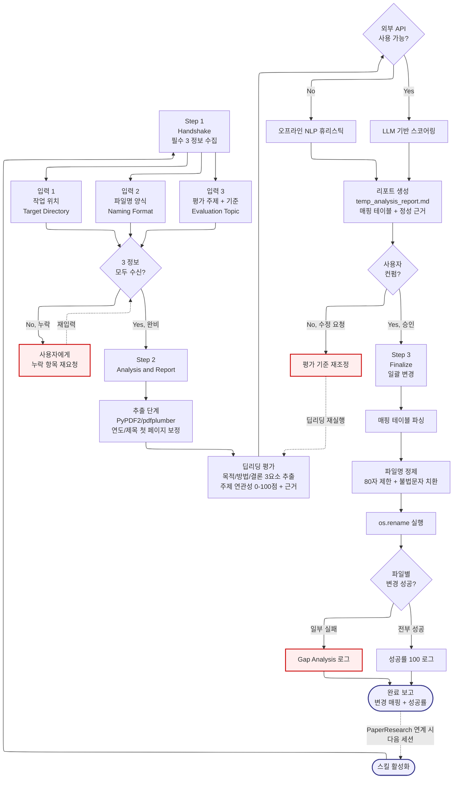

# FileNameMaking -- Navigator

> SYSTEM_NAVIGATOR 스타일 시각적 네비게이터
> 최종 갱신: 2026-04-11 (Tier-B Option A 세션 2 신규 생성)
> SKILL.md와 교차 참조 (이 파일은 SKILL.md의 시각화 계층)

---

## 0. 범례 + 사용법 {#범례--사용법}

### 상태 표시

| 표시 | 의미 |
|------|------|
| **[작동]** | 정상 작동 중 |
| **[부분]** | 일부만 작동 |
| **[미구현]** | 설계만 있고 구현 없음 |

### 다이어그램 규약

- ISO 5807:1985 표준 기호 준수
- Mermaid ELK 렌더러 + `securityLevel: loose`
- 점선 `-.->` = 피드백 루프 (재시도/복귀)
- `:::warning` = 에러/차단/실패 블럭
- `click NODE "#anchor"` = 블럭 상세 카드로 이동

### 스킬 메타

| 항목 | 값 |
|------|-----|
| 이름 | FileNameMaking |
| Tier | B |
| 커맨드 | 자동 트리거 (`파일 이름 바꿔줘`, `파일 정리해줘`, `랭킹 매겨줘`, `FileNameMaking`) |
| 프로세스 타입 | Linear Pipeline (3-Step + Handshake) |
| 설명 | 비정형 문서를 주제 기반 딥리딩 평가(0~100점)하여 사용자 정의 양식으로 파일명 일괄 변경. 0-defect Handshake → 분석 → 컨펌 → 변경 파이프라인 |

---

## 1. 전체 워크플로우 체계도 {#전체-체계도}

<!-- AUTO:DIAGRAM_MAIN:START -->



<!-- AUTO:DIAGRAM_MAIN:END -->

<details><summary><strong>블럭 바로가기 (다이어그램 클릭 대안)</strong></summary>

[진입](#node-start) · [Step 1 Handshake](#node-s1) · [입력 1 위치](#node-s1a) · [입력 2 양식](#node-s1b) · [입력 3 주제](#node-s1c) · [3 정보 체크](#node-hs-check) · [재요청](#node-hs-request) · [Step 2 분석](#node-s2) · [추출](#node-extract) · [딥리딩](#node-deepread) · [API 분기](#node-offline) · [휴리스틱](#node-heuristic) · [LLM 스코어](#node-llmscore) · [리포트](#node-report) · [컨펌](#node-confirm) · [기준 재조정](#node-s2-back) · [Step 3 Finalize](#node-s3) · [파싱](#node-parse) · [정제](#node-sanitize) · [Rename](#node-rename) · [성공 체크](#node-rename-check) · [Gap 로그](#node-gap-log) · [성공 로그](#node-success-log) · [완료](#node-end)
· [**전체 블럭 카탈로그**](#block-catalog)

</details>

[맨 위로](#범례--사용법)

---

## 2. 블럭 상세 카탈로그 {#block-catalog}

<details><summary>블럭 카드 펼치기 (24개)</summary>

### 스킬 활성화 진입 {#node-start}

| 항목 | 내용 |
|------|------|
| 소속 | 진입점 |
| 동기 | 비정형 문서 더미를 주제 기반으로 랭킹 매겨 파일명 자동 정리 → 수동 1시간+ 작업을 자동화 |
| 내용 | 트리거 키워드 감지 또는 사용자 명시 호출로 진입 |
| 동작 방식 | 자동 트리거 키워드 매칭 |
| 상태 | [작동] |
| 관련 파일 | `.agents/skills/FileNameMaking/SKILL.md` |

[다이어그램으로 복귀](#전체-체계도)

### Step 1: Handshake {#node-s1}

| 항목 | 내용 |
|------|------|
| 소속 | Step 1 (필수 입력 수집) |
| 동기 | 3가지 정보(위치/양식/주제) 없이 시작하면 잘못된 결과로 시간 낭비. Zero-Defect 입력 검증 |
| 내용 | 3가지 정보를 동시에 요청하는 대화형 메시지 출력 |
| 동작 방식 | SKILL.md에 명시된 표준 Handshake 메시지 사용 |
| 상태 | [작동] |
| 관련 파일 | SKILL.md |

[다이어그램으로 복귀](#전체-체계도)

### 입력 1: 작업 위치 (Target Directory) {#node-s1a}

| 항목 | 내용 |
|------|------|
| 소속 | Step 1 Input A |
| 동기 | 분석 대상 파일들이 있는 폴더를 명시해야 범위 오염 방지 |
| 내용 | 절대 경로 또는 프로젝트 상대 경로 (예: `D:\Data\Papers`) |
| 동작 방식 | 사용자 입력 수신 후 경로 존재 확인 |
| 상태 | [작동] |
| 관련 파일 | 사용자 지정 폴더 |

[다이어그램으로 복귀](#전체-체계도)

### 입력 2: 파일명 양식 (Naming Format) {#node-s1b}

| 항목 | 내용 |
|------|------|
| 소속 | Step 1 Input B |
| 동기 | 사용자별 네이밍 컨벤션이 다르므로 하드코딩 불가. 템플릿 변수 지원 필요 |
| 내용 | 플레이스홀더 패턴: `[랭킹]_[연도]_[문서종류]_[실제제목].ext` |
| 동작 방식 | 대괄호 안 변수를 파싱 → 스키마 결정 |
| 상태 | [작동] |
| 관련 파일 | SKILL.md |

[다이어그램으로 복귀](#전체-체계도)

### 입력 3: 평가 주제 + 기준 (Evaluation Topic) {#node-s1c}

| 항목 | 내용 |
|------|------|
| 소속 | Step 1 Input C |
| 동기 | 주제 기반 딥리딩의 방향을 결정. "ESG와 연관성 높을수록 고득점" 등 기준 명시 |
| 내용 | 주제 한 문장 + 연관성 해석 기준 |
| 동작 방식 | LLM 평가 프롬프트에 주입되는 핵심 정보 |
| 상태 | [작동] |
| 관련 파일 | SKILL.md |

[다이어그램으로 복귀](#전체-체계도)

### Handshake 완비 체크 {#node-hs-check}

| 항목 | 내용 |
|------|------|
| 소속 | 결정 블럭 (Decision) |
| 동기 | 3가지 중 하나라도 누락되면 Step 2 진입 금지. Zero-Defect 원칙 |
| 내용 | 3 정보 모두 수신 → Step 2, 누락 → 재요청 |
| 동작 방식 | 모든 입력 필드 non-null 체크 |
| 상태 | [작동] |
| 관련 파일 | 없음 |

[다이어그램으로 복귀](#전체-체계도)

### 누락 항목 재요청 {#node-hs-request}

| 항목 | 내용 |
|------|------|
| 소속 | 피드백 루프 (Step 1 내부) |
| 동기 | 사용자가 3 중 1-2개만 제공한 경우 조용히 진행 금지. 명시적 재요청 |
| 내용 | "위치 정보가 누락되었습니다. D:\... 형식으로 입력해주세요" 등 구체적 요청 |
| 동작 방식 | `-.->` 피드백 루프로 HSCheck 재진입 |
| 상태 | [작동] |
| 관련 파일 | SKILL.md |

[다이어그램으로 복귀](#전체-체계도)

### Step 2: Analysis and Report {#node-s2}

| 항목 | 내용 |
|------|------|
| 소속 | Step 2 (핵심 파이프라인) |
| 동기 | 3가지 정보 확보 후 즉시 Python 스크립트 작성 + 실행. 사용자 대기 시간 최소화 |
| 내용 | 추출 → 딥리딩 평가 → 리포트 생성 → 컨펌 요청 4단계 |
| 동작 방식 | 순차 파이프라인 실행 |
| 상태 | [작동] |
| 관련 파일 | `scripts/generic_evaluator.py` (보조) |

[다이어그램으로 복귀](#전체-체계도)

### 추출 단계 {#node-extract}

| 항목 | 내용 |
|------|------|
| 소속 | Step 2 Stage 1 |
| 동기 | 딥리딩 전 텍스트 추출이 선행되어야 함. PDF/HWPX 등 비정형 포맷 지원 |
| 내용 | 폴더 내 파일 순회 → PyPDF2/pdfplumber로 텍스트 추출 + 연도/제목 첫 페이지 보정 |
| 동작 방식 | Python 스크립트 + 정규식 메타데이터 추출 |
| 상태 | [작동] |
| 관련 파일 | `scripts/generic_evaluator.py` |

[다이어그램으로 복귀](#전체-체계도)

### 딥리딩 평가 {#node-deepread}

| 항목 | 내용 |
|------|------|
| 소속 | Step 2 Stage 2 (핵심) |
| 동기 | 파일명이 아닌 내용 기반 평가. 각 문서에서 목적/방법/결론 3요소를 추출해야 주제 연관성 정확 |
| 내용 | [목적/목표], [방법/절차], [결론/시사점] 문장 추출 + 주제 연관성 0-100점 + 근거 도출 |
| 동작 방식 | LLM 프롬프트 또는 NLP 휴리스틱 |
| 상태 | [작동] |
| 관련 파일 | `scripts/generic_evaluator.py` |

[다이어그램으로 복귀](#전체-체계도)

### 외부 API 사용 가능 분기 {#node-offline}

| 항목 | 내용 |
|------|------|
| 소속 | 결정 블럭 (Decision, 오프라인 폴백) |
| 동기 | API 키 없거나 네트워크 차단 환경에서도 동작해야 함 |
| 내용 | API 가능 → LLM 스코어링, 불가 → 오프라인 휴리스틱 |
| 동작 방식 | 환경 변수 + 네트워크 체크 |
| 상태 | [작동] |
| 관련 파일 | `.env` |

[다이어그램으로 복귀](#전체-체계도)

### 오프라인 NLP 휴리스틱 {#node-heuristic}

| 항목 | 내용 |
|------|------|
| 소속 | Step 2 Stage 2 폴백 |
| 동기 | 외부 API 없을 때도 유의미한 점수 도출 필요 (SKILL.md 제약사항) |
| 내용 | TF-IDF + 주제 키워드 매칭 + 문장 위치 가중치 |
| 동작 방식 | scikit-learn 또는 자체 휴리스틱 |
| 상태 | [부분] (LLM 대비 정확도 낮음) |
| 관련 파일 | `scripts/generic_evaluator.py` |

[다이어그램으로 복귀](#전체-체계도)

### LLM 기반 스코어링 {#node-llmscore}

| 항목 | 내용 |
|------|------|
| 소속 | Step 2 Stage 2 메인 경로 |
| 동기 | LLM의 문맥 이해력으로 주제 연관성을 가장 정확히 평가 |
| 내용 | 3요소 추출 → LLM 평가 프롬프트 → 0-100 점수 + 근거 |
| 동작 방식 | Anthropic/OpenAI API 호출 |
| 상태 | [작동] |
| 관련 파일 | `.env` (ANTHROPIC_API_KEY 등) |

[다이어그램으로 복귀](#전체-체계도)

### 리포트 생성 {#node-report}

| 항목 | 내용 |
|------|------|
| 소속 | Step 2 Stage 3 |
| 동기 | 컨펌 전 사용자가 변경 내역을 미리 확인해야 실수 방지 |
| 내용 | `temp_analysis_report.md` 생성. 매핑 테이블(No, 기존이름, 새이름, 점수) + 개별 정성 근거 |
| 동작 방식 | Markdown 템플릿 + 데이터 주입 |
| 상태 | [작동] |
| 관련 파일 | `temp_analysis_report.md` |

[다이어그램으로 복귀](#전체-체계도)

### 사용자 컨펌 분기 {#node-confirm}

| 항목 | 내용 |
|------|------|
| 소속 | 결정 블럭 (Decision, 승인 게이트) |
| 동기 | 파일명 일괄 변경은 되돌리기 어려우므로 사용자 명시 승인 필수 |
| 내용 | "이대로 일괄 변경을 진행할까요?" 질문 → Yes/No |
| 동작 방식 | 사용자 응답 파싱 |
| 상태 | [작동] |
| 관련 파일 | 없음 |

[다이어그램으로 복귀](#전체-체계도)

### 평가 기준 재조정 (피드백 루프) {#node-s2-back}

| 항목 | 내용 |
|------|------|
| 소속 | 피드백 루프 (Step 2 재실행) |
| 동기 | 사용자가 리포트를 보고 "주제 해석이 틀렸다" 등 피드백 시 딥리딩부터 재시도 |
| 내용 | 수정된 평가 기준으로 Step 2 Stage 2(딥리딩)부터 재실행 |
| 동작 방식 | `-.->` 피드백 루프 + 사용자 피드백 반영 |
| 상태 | [작동] |
| 관련 파일 | 없음 |

[다이어그램으로 복귀](#전체-체계도)

### Step 3: Finalize {#node-s3}

| 항목 | 내용 |
|------|------|
| 소속 | Step 3 (최종 변경) |
| 동기 | 컨펌된 매핑 테이블대로 실제 파일명 변경. 되돌리기 불가능한 작업 |
| 내용 | 매핑 파싱 → 정제 → os.rename → 결과 로그 |
| 동작 방식 | Python 스크립트 일괄 실행 |
| 상태 | [작동] |
| 관련 파일 | SKILL.md |

[다이어그램으로 복귀](#전체-체계도)

### 매핑 테이블 파싱 {#node-parse}

| 항목 | 내용 |
|------|------|
| 소속 | Step 3 Stage 1 |
| 동기 | 리포트의 Markdown 테이블에서 기존 → 새 이름 매핑 추출 |
| 내용 | 테이블 행 순회 → 기존이름/새이름 딕셔너리 구축 |
| 동작 방식 | 정규식 기반 파싱 |
| 상태 | [작동] |
| 관련 파일 | `temp_analysis_report.md` |

[다이어그램으로 복귀](#전체-체계도)

### 파일명 정제 {#node-sanitize}

| 항목 | 내용 |
|------|------|
| 소속 | Step 3 Stage 2 |
| 동기 | 제약사항 준수: 80자 제한 + 불법 문자 치환 (OS 파일 시스템 호환) |
| 내용 | `[실제제목]` 80자 자르기 + `\ / : * ? " < > |` → `_` 또는 생략 |
| 동작 방식 | 문자열 정제 함수 |
| 상태 | [작동] |
| 관련 파일 | SKILL.md |

[다이어그램으로 복귀](#전체-체계도)

### os.rename 실행 {#node-rename}

| 항목 | 내용 |
|------|------|
| 소속 | Step 3 Stage 3 |
| 동기 | 실제 파일 시스템 변경. atomic 하게 수행 |
| 내용 | 매핑 순회 → `os.rename(기존, 새이름)` |
| 동작 방식 | Python 내장 함수 + 예외 처리 |
| 상태 | [작동] |
| 관련 파일 | 대상 폴더 |

[다이어그램으로 복귀](#전체-체계도)

### 파일별 변경 성공 체크 {#node-rename-check}

| 항목 | 내용 |
|------|------|
| 소속 | 결정 블럭 (Decision, 성공/실패 집계) |
| 동기 | 일부 실패 시 성공률 로그로 Gap Analysis 제공 |
| 내용 | 전체 성공 → SuccessLog, 일부 실패 → GapLog |
| 동작 방식 | 예외 카운터 + 성공률 계산 |
| 상태 | [작동] |
| 관련 파일 | 없음 |

[다이어그램으로 복귀](#전체-체계도)

### Gap Analysis 로그 {#node-gap-log}

| 항목 | 내용 |
|------|------|
| 소속 | Step 3 복구 경로 |
| 동기 | 일부 파일 변경 실패 시 사용자가 수동 처리할 수 있도록 상세 로그 제공 |
| 내용 | 실패 파일 목록 + 실패 이유 (권한, 중복 이름, 경로 오류 등) |
| 동작 방식 | Markdown 로그 출력 |
| 상태 | [작동] |
| 관련 파일 | `temp_analysis_report.md` (append) |

[다이어그램으로 복귀](#전체-체계도)

### 성공률 100 로그 {#node-success-log}

| 항목 | 내용 |
|------|------|
| 소속 | Step 3 정상 종료 |
| 동기 | 전체 성공 시 사용자 안심 메시지 |
| 내용 | "N개 파일 모두 변경 완료 (100%)" |
| 동작 방식 | 콘솔 출력 |
| 상태 | [작동] |
| 관련 파일 | 없음 |

[다이어그램으로 복귀](#전체-체계도)

### 완료 보고 {#node-end}

| 항목 | 내용 |
|------|------|
| 소속 | 파이프라인 종료점 |
| 동기 | 최종 결과를 사용자에게 요약 |
| 내용 | 변경 매핑 + 성공률 + 리포트 경로 |
| 동작 방식 | Markdown 요약 |
| 상태 | [작동] |
| 관련 파일 | `temp_analysis_report.md` |

[다이어그램으로 복귀](#전체-체계도)

</details>

[맨 위로](#범례--사용법)

---

## 3. 3-Step 요약

| Step | 이름 | 입력 | 출력 |
|:---:|------|------|------|
| 1 | Handshake | 사용자 대화 | 3 정보 (위치/양식/주제) |
| 2 | Analysis and Report | 3 정보 + 폴더 내 파일 | `temp_analysis_report.md` |
| 3 | Finalize | 컨펌된 매핑 테이블 | 변경된 파일명 + 성공률 로그 |

---

## 4. 사용 시나리오

### 시나리오 1 -- ESG 논문 랭킹 정리

> **상황**: 100개 논문 PDF 폴더를 ESG 연관성 기준으로 랭킹 매겨 파일명 변경

**Handshake**:
```
1. 작업 위치: D:\Data\ESG_Papers
2. 파일명 양식: [랭킹]_[연도]_[문서종류]_[실제제목].pdf
3. 평가 주제: ESG 경영 및 탄소중립 실천 사례와 연관성이 높을수록 고득점
```

**실행**:
1. Step 2: 100개 PDF 딥리딩 → 점수화
2. 리포트: `top 10: 95점 이상, bottom 20: 50점 미만`
3. 사용자 컨펌: Yes
4. Step 3: 일괄 변경 → `01_2023_연구논문_ESG실천사례연구.pdf` 등

---

### 시나리오 2 -- PaperResearch 연계

> **상황**: PaperResearch 스킬로 수집한 논문 PDF를 주제별 랭킹으로 정리

```
/PaperResearch AI 교육
(검색 완료, 70개 PDF 다운로드됨)

이 논문들 파일명을 AI 교육 연관성 순으로 정리해줘
```

FileNameMaking 자동 트리거 → Handshake → Step 2/3 → 완료

**파일명 예**: `01_2024_학위논문_초등학교AI융합수업의학습효과분석.pdf`

---

### 시나리오 3 -- Handshake 누락 복구

> **상황**: 사용자가 "이 폴더 정리해줘" 만 말하고 양식/주제 미제공

**AI 응답 (Step 1 재요청)**:
```
파일 위치만 확인되었습니다. 다음 2가지가 추가로 필요합니다:

2. 파일명 양식 (예: [랭킹]_[연도]_[제목].pdf)
3. 평가 주제 (예: 사용자 경험 개선과 연관성)
```

**흐름**: S1 → HSCheck(No) → HSRequest → S1C/S1B 재입력 → HSCheck(Yes) → S2

---

### 시나리오 4 -- 평가 기준 재조정 (피드백 루프)

> **상황**: 리포트를 보니 "교육" 주제로 매긴 점수가 실제로는 "기술" 편향

**사용자 응답**:
```
No. 교육 효과성이 아닌 기술 구현 난이도로 평가해줘
```

**흐름**:
1. Confirm(No) → S2Back (`-.->` 피드백)
2. DeepRead 재실행 (새 기준)
3. Report 재생성
4. Confirm 재요청

---

### 시나리오 5 -- Gap Analysis (일부 실패)

> **상황**: 100개 중 3개 파일이 변경 실패 (파일명에 이미 동일한 이름 존재)

**GapLog 출력**:
```
변경 완료: 97/100 (97%)

실패 3건:
- 05_2023_연구논문_... (이미 존재)
- 12_2022_학위논문_... (권한 없음)
- 45_2024_보고서_... (경로 길이 초과)

수동 처리 권장.
```

사용자가 수동으로 3건 처리 후 완료.

---

[맨 위로](#범례--사용법)

---

## 5. 제약사항 및 공통 주의사항

### 파일명 제약 (SKILL.md 명시)

- **`[실제제목]` 80자 이내**: 자르는 로직 필수
- **불법 문자 치환**: `\ / : * ? " < > |` → `_` 또는 생략
- **외부 API 없을 때**: 오프라인 NLP 휴리스틱으로 폴백

### 파이프라인 안전

- **Handshake 필수**: 3 정보 없이 Step 2 진입 금지 (Zero-Defect)
- **사용자 컨펌 필수**: Step 3 실행 전 명시적 Yes/No 확인
- **Gap Analysis**: 실패 파일 목록 항상 로그

### 공통 금지 사항

- 이모티콘 사용 금지 (PostToolUse 훅 차단)
- 절대경로 하드코딩 금지
- API Key 하드코딩 금지
- 원본 파일 직접 삭제 금지 (rename만)

### 각인 참조

- **IMP-001**: 한글 레거시 파일 cp949 + errors='replace'
- **IMP-004**: 공백 포함 경로 따옴표 필수 (OneDrive 한글 폴더)
- **IMP-015**: API 키 템플릿 분리 (LLM 스코어링 시)

[맨 위로](#범례--사용법)

---

## 6. 갱신 이력

| 날짜 | 변경 | 트리거 |
|------|------|--------|
| 2026-04-11 | Tier-B Navigator 신규 생성 (SYSTEM_NAVIGATOR 스타일) | Option A 세션 2 |

[맨 위로](#범례--사용법)
