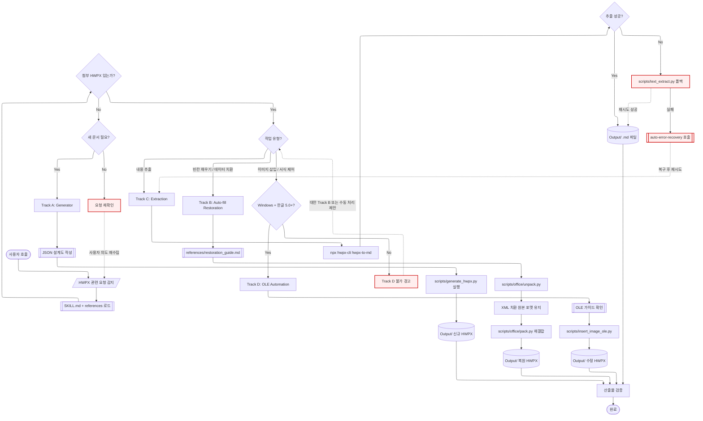

# HWPX_Master -- Navigator

> SYSTEM_NAVIGATOR 스타일 시각적 네비게이터
> 최종 갱신: 2026-04-10 (scaffold + 수동 보완)
> SKILL.md와 교차 참조 (이 파일은 SKILL.md의 시각화 계층)

---

## 0. 범례 + 사용법 {#범례--사용법}

### 상태 표시

| 표시 | 의미 |
|------|------|
| **[작동]** | 정상 작동 중 |
| **[부분]** | 일부만 작동 (예: Track D는 Windows 전용) |
| **[미구현]** | 설계만 있고 구현 없음 |

### 다이어그램 규약

- ISO 5807:1985 표준 기호 준수
- Mermaid ELK 렌더러 + `securityLevel: loose`
- 점선 `-.->` = 피드백 루프 (재시도/복귀)
- `:::warning` = 에러/차단/실패 블럭
- `click NODE "#anchor"` = 블럭 상세 카드로 이동

### 스킬 메타

| 항목 | 값 |
|------|-----|
| 이름 | HWPX_Master |
| Tier | A |
| 커맨드 | 자동 트리거 (HWPX 관련 키워드) |
| 프로세스 타입 | 4-Track (의사결정 분기) |
| 플랫폼 | Cross-platform (Track D만 Windows 전용) |
| 스크립트 위치 | `.agents/skills/HWPX_Master/scripts/` |
| 레퍼런스 | `references/generator_guide.md`, `references/restoration_guide.md` |

---

## 1. 전체 워크플로우 체계도 {#전체-체계도}

<!-- AUTO:DIAGRAM_MAIN:START -->



<!-- AUTO:DIAGRAM_MAIN:END -->

<details><summary><strong>블럭 바로가기 (다이어그램 클릭 대안)</strong></summary>

[시작](#node-start) · [트리거 감지](#node-trigger) · [SKILL 로드](#node-read-skill) · [HWPX 존재 확인](#node-has-hwpx) · [새 문서 필요](#node-need-new) · [작업 유형 판단](#node-intent) · [플랫폼 확인](#node-platform-chk) · [Track A Generator](#node-track-a) · [Track B Restoration](#node-track-b) · [Track C Extraction](#node-track-c) · [Track D OLE](#node-track-d) · [Track D 차단](#node-track-d-block) · [JSON 설계도](#node-gen-json) · [generate_hwpx.py](#node-run-gen) · [unpack.py](#node-unpack) · [XML 치환](#node-edit-xml) · [pack.py](#node-pack) · [hwpx-cli 추출](#node-cli-extract) · [추출 폴백](#node-extract-fallback) · [text_extract 폴백](#node-py-extract) · [auto-error-recovery](#node-aer) · [OLE 스크립트](#node-ole-script) · [검증](#node-verify) · [종료](#node-end) · [**전체 블럭 카탈로그**](#block-catalog)

</details>

**동기**: HWPX 관련 요청의 4가지 분기(Track A/B/C/D)를 한눈에 보여주고, 각 Track의 실제 실행 경로(스크립트 + 폴백 + 에러 복구)를 시각화. Track D의 Windows 전용 제약을 게이트로 명시하여 크로스플랫폼 오작동 방지.

[맨 위로](#범례--사용법)

---

## 2. 블럭 상세 카탈로그 {#block-catalog}

<details><summary>전체 블럭 카드 펼치기 (24개)</summary>

### 시작 {#node-start}

| 항목 | 내용 |
|------|------|
| 소속 | 진입점 |
| 동기 | HWPX 관련 요청을 즉시 감지해야 다른 스킬이 잘못 처리하는 것을 방지 |
| 내용 | 사용자 요청이 HWPX 키워드 포함 시 자동 트리거 |
| 동작 방식 | 키워드 매칭: "hwpx", "한글 문서", "아래아한글", ".hwpx" 등 |
| 상태 | [작동] |
| 관련 파일 | `SKILL.md` (frontmatter triggers) |

[다이어그램으로 복귀](#전체-체계도)

### 트리거 감지 {#node-trigger}

| 항목 | 내용 |
|------|------|
| 소속 | 진입 단계 |
| 동기 | 최우선 구동 원칙 (SKILL.md frontmatter 명시) |
| 내용 | HWPX 관련 작업 지시 감지 시 최우선으로 스킬 구동 |
| 동작 방식 | 다른 스킬보다 먼저 실행. 사용자 의도를 4 Track 중 하나로 분류 |
| 상태 | [작동] |

[다이어그램으로 복귀](#전체-체계도)

### SKILL.md + references 로드 {#node-read-skill}

| 항목 | 내용 |
|------|------|
| 소속 | 초기화 |
| 동기 | 각 Track의 상세 가이드가 references/ 하위에 분산되어 있음. 무시하면 잘못된 스크립트 호출 위험 |
| 내용 | SKILL.md 로드 후 선택된 Track에 해당하는 references/*.md 자동 로드 |
| 동작 방식 | Track A → generator_guide.md, Track B → restoration_guide.md, Track C → 내장, Track D → OLE 가이드 |
| 상태 | [작동] |
| 관련 파일 | `.agents/skills/HWPX_Master/references/` |

[다이어그램으로 복귀](#전체-체계도)

### 첨부 HWPX 존재 확인 {#node-has-hwpx}

| 항목 | 내용 |
|------|------|
| 소속 | 1차 분기 |
| 동기 | 첨부 유무가 Track A(생성) vs Track B/C/D(수정/추출)의 결정적 기준 |
| 내용 | 사용자 요청에 HWPX 파일 첨부 여부 확인 |
| 동작 방식 | 첨부 경로 확인 또는 사용자에게 경로 질문 |
| 상태 | [작동] |

[다이어그램으로 복귀](#전체-체계도)

### 새 문서 필요 여부 {#node-need-new}

| 항목 | 내용 |
|------|------|
| 소속 | 2차 분기 (첨부 없음 경로) |
| 동기 | 첨부가 없는데 작업 의도가 불명확하면 오작동 |
| 내용 | "보고서 만들어줘" 등 명시적 생성 의도 확인 |
| 동작 방식 | Yes → Track A, No → 사용자 의도 재수집 |
| 상태 | [작동] |

[다이어그램으로 복귀](#전체-체계도)

### 작업 유형 판단 {#node-intent}

| 항목 | 내용 |
|------|------|
| 소속 | 2차 분기 (첨부 있음 경로) |
| 동기 | 첨부가 있으면 작업 종류에 따라 Track B/C/D 중 선택 |
| 내용 | 사용자 요청 키워드 분석 -- "빈칸 채우기" / "추출" / "이미지 삽입" |
| 동작 방식 | 키워드 매칭 + 의도 분류 로직 |
| 상태 | [작동] |

[다이어그램으로 복귀](#전체-체계도)

### 플랫폼 확인 {#node-platform-chk}

| 항목 | 내용 |
|------|------|
| 소속 | Track D 사전 검증 |
| 동기 | Track D (OLE)는 Windows + 한글 5.0+ 필수. 다른 환경에서 실행 시 무한 대기 또는 크래시 |
| 내용 | `process.platform === 'win32'` 확인 + 한글 설치 여부 |
| 동작 방식 | AER-001 적용. 실패 시 경고 후 대안 Track 제안 |
| 상태 | [작동] |

[다이어그램으로 복귀](#전체-체계도)

### Track A: Generator {#node-track-a}

| 항목 | 내용 |
|------|------|
| 소속 | 4-Track 메인 |
| 동기 | 양식 없이 새 HWPX 문서를 처음부터 생성 (정부/공공기관 보고서 등) |
| 내용 | JSON 설계도 → `scripts/generate_hwpx.py` 또는 `scripts/build_hwpx.py` 실행 → 내장 `report_gov` 템플릿 적용 |
| 동작 방식 | 섹션 구조 정의 (표지/개요/성과지표/결론 등) → 스크립트가 빈 문서에서 구축 |
| 상태 | [작동] |
| 관련 파일 | `scripts/generate_hwpx.py`, `scripts/build_hwpx.py`, `references/generator_guide.md` |

[다이어그램으로 복귀](#전체-체계도)

### Track B: Auto-fill Restoration {#node-track-b}

| 항목 | 내용 |
|------|------|
| 소속 | 4-Track 메인 |
| 동기 | 기존 양식의 복잡한 레이아웃(표 너비, 여백, 폰트)을 유지하면서 데이터만 채움 |
| 내용 | XML 메타인지 기반 치환 함수로 원본 포맷 보존 |
| 동작 방식 | unpack → XML 수정 → pack 3단계. 원본의 style/layout 완전 보존 |
| 상태 | [작동] |
| 관련 파일 | `scripts/build_hwpx.py`, `references/restoration_guide.md` |

[다이어그램으로 복귀](#전체-체계도)

### Track C: Extraction {#node-track-c}

| 항목 | 내용 |
|------|------|
| 소속 | 4-Track 메인 |
| 동기 | HWPX 내용 조회, RAG 인덱싱, 대량 문서 마크다운 변환 |
| 내용 | `@masteroflearning/hwpx-cli` 엔진으로 순수 텍스트 + 표 추출 (OCR 불필요) |
| 동작 방식 | `npx @masteroflearning/hwpx-cli hwpx-to-md <입력> -o <출력>`. 실패 시 `scripts/text_extract.py` 폴백 |
| 상태 | [작동] |
| 관련 파일 | `scripts/text_extract.py` |

[다이어그램으로 복귀](#전체-체계도)

### Track D: OLE Automation {#node-track-d}

| 항목 | 내용 |
|------|------|
| 소속 | 4-Track 메인 |
| 동기 | XML만으로 제어 불가한 세밀한 한글 프로그램 고유 속성 (이미지 좌표, 복잡 테두리) |
| 내용 | `win32com.client`로 한글 프로그램 OLE 객체 직접 제어 |
| 동작 방식 | `scripts/insert_image_ole.py` 실행. Windows + 한글 5.0+ 필수 |
| 상태 | [부분] -- Windows 로컬 전용, 원격/WSL 불가 |
| 관련 파일 | `scripts/insert_image_ole.py` |

[다이어그램으로 복귀](#전체-체계도)

### Track D 차단 경고 {#node-track-d-block}

| 항목 | 내용 |
|------|------|
| 소속 | Track D 실패 경로 |
| 동기 | Windows 아닌 환경에서 Track D 실행 차단 (무한 대기/크래시 방지) |
| 내용 | 환경 부적합 경고 + 대안 Track (B 또는 수동 처리) 제안 |
| 동작 방식 | AER-001 기반 사전 차단. 사용자에게 명확한 오류 메시지 |
| 상태 | [작동] |

[다이어그램으로 복귀](#전체-체계도)

### JSON 설계도 작성 {#node-gen-json}

| 항목 | 내용 |
|------|------|
| 소속 | Track A 내부 |
| 동기 | 스크립트는 JSON 설계도를 입력으로 받음. 설계도가 정확해야 올바른 구조 생성 |
| 내용 | `{template, sections, meta}` 3 필드 JSON 객체 |
| 동작 방식 | 사용자 요청을 구조화 → sections 배열 + meta 객체 |
| 상태 | [작동] |

[다이어그램으로 복귀](#전체-체계도)

### generate_hwpx.py 실행 {#node-run-gen}

| 항목 | 내용 |
|------|------|
| 소속 | Track A 실행 |
| 동기 | JSON 설계도를 실제 HWPX 파일로 변환 |
| 내용 | Python 스크립트가 `report_gov` 등 내장 템플릿 적용 |
| 동작 방식 | `python scripts/generate_hwpx.py --config design.json --out Output/...` |
| 상태 | [작동] |

[다이어그램으로 복귀](#전체-체계도)

### unpack.py {#node-unpack}

| 항목 | 내용 |
|------|------|
| 소속 | Track B 서브루틴 |
| 동기 | HWPX는 ZIP 기반 컨테이너. 내부 XML 접근하려면 압축 해제 필요 |
| 내용 | HWPX를 임시 디렉토리에 unzip |
| 동작 방식 | `scripts/office/unpack.py` → `Contents/section0.xml` 등 추출 |
| 상태 | [작동] |
| 관련 파일 | `scripts/office/unpack.py` |

[다이어그램으로 복귀](#전체-체계도)

### XML 치환 {#node-edit-xml}

| 항목 | 내용 |
|------|------|
| 소속 | Track B 핵심 |
| 동기 | 원본의 표 너비, 폰트, 여백 등 스타일을 유지하면서 데이터만 바꿔야 함 |
| 내용 | XML 파서로 플레이스홀더 (`{{날짜}}` 등) 탐색 후 값 치환 |
| 동작 방식 | lxml/ElementTree 기반. 스타일 속성은 건드리지 않음 |
| 상태 | [작동] |

[다이어그램으로 복귀](#전체-체계도)

### pack.py {#node-pack}

| 항목 | 내용 |
|------|------|
| 소속 | Track B 서브루틴 |
| 동기 | 수정된 XML들을 다시 HWPX (ZIP) 컨테이너로 재결합 |
| 내용 | 임시 디렉토리 → .hwpx 파일 |
| 동작 방식 | `scripts/office/pack.py`. 원본 구조 유지 |
| 상태 | [작동] |
| 관련 파일 | `scripts/office/pack.py` |

[다이어그램으로 복귀](#전체-체계도)

### hwpx-cli 추출 {#node-cli-extract}

| 항목 | 내용 |
|------|------|
| 소속 | Track C 기본 경로 |
| 동기 | hwpx-cli가 가장 빠르고 안정적인 추출 엔진 |
| 내용 | `npx @masteroflearning/hwpx-cli hwpx-to-md <input> -o <output>` |
| 동작 방식 | Node.js CLI. 텍스트와 표를 마크다운으로 변환 |
| 상태 | [작동] |

[다이어그램으로 복귀](#전체-체계도)

### 추출 성공 확인 {#node-extract-fallback}

| 항목 | 내용 |
|------|------|
| 소속 | Track C 분기 |
| 동기 | hwpx-cli가 특정 HWPX 버전/변형에서 실패할 수 있음 |
| 내용 | 추출 결과 검증 (빈 파일, 에러 코드) |
| 동작 방식 | exit code + 출력 크기 체크 → 실패 시 Python 폴백 |
| 상태 | [작동] |

[다이어그램으로 복귀](#전체-체계도)

### text_extract.py 폴백 {#node-py-extract}

| 항목 | 내용 |
|------|------|
| 소속 | Track C 폴백 |
| 동기 | hwpx-cli 실패 시 Python 기반 수동 파서로 대체 |
| 내용 | `scripts/text_extract.py` -- XML 직접 파싱 |
| 동작 방식 | unpack → lxml 파싱 → 텍스트/표 추출 |
| 상태 | [작동] |
| 관련 파일 | `scripts/text_extract.py` |

[다이어그램으로 복귀](#전체-체계도)

### auto-error-recovery 호출 {#node-aer}

| 항목 | 내용 |
|------|------|
| 소속 | 전역 에러 복구 |
| 동기 | 모든 Track에서 복구 불가 에러 발생 시 구조화된 복구 루프 진입 |
| 내용 | RCA → 재시도 (최대 3회) → 지식 증류 → SKILL.md 업데이트 |
| 동작 방식 | `auto-error-recovery` 스킬 호출. 실패 시 사용자 개입 요청 |
| 상태 | [작동] |
| 관련 파일 | `.agents/skills/auto-error-recovery/SKILL.md` |

[다이어그램으로 복귀](#전체-체계도)

### OLE 스크립트 실행 {#node-ole-script}

| 항목 | 내용 |
|------|------|
| 소속 | Track D 핵심 |
| 동기 | 한글 프로그램 OLE API만 제공하는 고급 기능 (이미지 좌표, 복잡 서식) |
| 내용 | `win32com.client.Dispatch("HWPFrame.HwpObject")` 기반 제어 |
| 동작 방식 | 한글 프로그램 백그라운드 실행 → API 호출 → 저장 |
| 상태 | [부분] -- Windows 전용 |
| 관련 파일 | `scripts/insert_image_ole.py` |

[다이어그램으로 복귀](#전체-체계도)

### 산출물 검증 {#node-verify}

| 항목 | 내용 |
|------|------|
| 소속 | 공통 종료 단계 |
| 동기 | 각 Track의 결과물이 유효한 HWPX인지 확인 |
| 내용 | 파일 크기, ZIP 구조, XML well-formed 검증 |
| 동작 방식 | 간단한 파일 검사 + 필요 시 `hwpx-cli`로 재추출 테스트 |
| 상태 | [작동] |

[다이어그램으로 복귀](#전체-체계도)

### 종료 {#node-end}

| 항목 | 내용 |
|------|------|
| 소속 | 전체 종료점 |
| 동기 | 산출물 경로 + 상태를 사용자에게 명확히 보고 |
| 내용 | `Output/` 경로 + Track + 소요 시간 요약 |
| 동작 방식 | 콘솔 출력 + 사용자 확인 |
| 상태 | [작동] |

[다이어그램으로 복귀](#전체-체계도)

</details>

[맨 위로](#범례--사용법)

---

## 3. 사용 시나리오

### 시나리오 1 -- Track A: 성과보고서 새로 생성

> **상황**: 기획처 제출용 2026년 1학기 프로그램 성과보고서를 처음부터 만들어야 함. 첨부 파일 없음.

**사용자 입력**
```
2026년 1학기 공학교육혁신센터 성과보고서 hwpx로 만들어줘.
표지, 개요, 성과지표 표, 결론 순서로 구성해줘.
```

**AI 판단**: 첨부 없음 + 새 문서 → Track A

**실행 흐름**
1. `references/generator_guide.md` 읽어 양식 규칙 확인
2. JSON 설계도 초안 작성:
```json
{
  "template": "report_gov",
  "sections": ["표지", "개요", "성과지표", "결론"],
  "meta": { "year": "2026", "semester": "1", "dept": "공학교육혁신센터" }
}
```
3. `scripts/generate_hwpx.py` 실행
4. `Output/260401_기획처_성과보고서_Draft.hwpx` 생성

---

### 시나리오 2 -- Track B: 기존 공문 빈칸 채우기

> **상황**: 매 학기 반복되는 위원회 회의록 양식(.hwpx)을 첨부. 날짜/참석자/안건 항목만 바꾸면 됨.

**사용자 입력**
```
이 회의록 양식에 날짜 2026-04-10, 참석자 김교수 외 4명, 안건 1. 교육과정 개편 2. 예산 심의 넣어줘.
```
(260310_위원회_회의록_양식.hwpx 첨부)

**AI 판단**: 첨부 있음 + 빈칸 채우기 → Track B

**실행 흐름**
1. `references/restoration_guide.md` 읽기
2. `office/unpack.py` 로 HWPX 압축 해제 → `Contents/section0.xml` 접근
3. XML에서 `{{날짜}}`, `{{참석자}}`, `{{안건}}` 플레이스홀더 탐색
4. 값 치환 후 원본 폰트/표 너비 유지 검증
5. `office/pack.py` 재결합
6. `Output/260410_위원회_회의록_완성.hwpx` 저장

---

### 시나리오 3 -- Track C: 대량 HWPX에서 표 데이터 추출

> **상황**: 3개년치 평가 보고서(hwpx 30개)에서 성과지표 표만 뽑아 엑셀로 합쳐야 함.

**사용자 입력**
```
Input/ 폴더 안 hwpx 파일들에서 성과지표 표 내용만 추출해서 정리해줘.
```

**AI 판단**: 첨부(다수) + 내용 추출 → Track C

**실행 흐름**
```bash
# hwpx-cli 일괄 처리
for f in Input/*.hwpx; do
  npx @masteroflearning/hwpx-cli hwpx-to-md "$f" -o "Output/$(basename $f .hwpx).md"
done
```
- 추출된 .md 파일에서 `|` 구분 표 섹션만 파싱
- 통합 CSV → `Output/성과지표_통합.csv` 저장

---

### 시나리오 4 -- Track D: 이미지 삽입 (OLE)

> **상황**: 보고서 내 그래프 이미지를 특정 셀 위치에 정확하게 삽입해야 함. XML로는 좌표 제어 불가.

**사용자 입력**
```
chart.png를 2페이지 3번 표의 오른쪽 셀에 넣어줘.
```

**AI 판단**: 이미지 삽입 + 좌표 제어 → Track D

**전제 조건 확인 (AER-001 적용)**
- Windows 로컬 환경인가? → 확인
- 한글 5.0+ 설치되어 있는가? → 확인 후 진행

```python
# scripts/insert_image_ole.py 핵심 흐름
import win32com.client
hwp = win32com.client.Dispatch("HWPFrame.HwpObject")
hwp.Open(target_path)
# 셀 위치 이동 → 이미지 삽입 → 저장
```

---

### 시나리오 5 -- Track B + C 연계: 추출 후 다른 양식에 채우기

> **상황**: 구형 보고서(A.hwpx)에서 실적 수치를 추출하여 신형 양식(B.hwpx)에 자동 입력.

**실행 흐름**
1. Track C로 A.hwpx 텍스트 추출 → 수치 파싱
2. Track B로 B.hwpx 양식에 파싱된 수치 주입
3. 두 단계 모두 `auto-error-recovery` 감시 하에 실행

---

[맨 위로](#범례--사용법)

---

## 4. 제약사항 및 공통 주의사항

### 환경 제약

- **Track D는 Windows 전용**: 원격/WSL 환경에서 실행 금지 (AER-001)
- **한글 프로그램 5.0+ 설치 필수** (Track D만)
- **Python 스크립트 런타임**: `scripts/` 하위 .py 파일은 프로젝트 Python 환경 필요 (IMP-002 참조)

### 실행 원칙

- 모든 스크립트는 `scripts/` 디렉토리에 존재. **절대경로 하드코딩 금지**, 상대경로 기반으로 탐색
- 스크립트 실행 전 반드시 `references/` 가이드 문서 먼저 읽을 것 (AER-004 준수)
- 산출물은 반드시 프로젝트의 `Output/` 폴더 또는 명시된 경로에 저장
- 복잡한 수정 시: `scripts/office/unpack.py` → XML 수정 → `scripts/office/pack.py` 3단계
- 에러 발생 시 즉시 `auto-error-recovery` 스킬 호출

### 각인 참조

- **IMP-001**: HWP/CSV 등 한글 레거시 파일은 cp949 + errors='replace'
- **IMP-002**: Windows 스크립트 런타임은 node 우선. Python은 PATH 보장 안 됨
- **AER-001**: Track D 사전 환경 체크 (OS + 한글 설치)
- **AER-003**: 대용량 PDF/HWPX는 .txt 사전 추출
- **AER-004**: 편집 전 반드시 Read + references 먼저

### 포맷 금지

- 이모티콘 금지
- 절대경로 금지
- HWPX 원본 덮어쓰기 금지 (항상 `Output/` 에 저장)

[맨 위로](#범례--사용법)

---

## 5. 갱신 이력

| 날짜 | 변경 | 트리거 |
|------|------|--------|
| 2026-04-10 | SYSTEM_NAVIGATOR 스타일 업그레이드 (24 블럭 카드 + 1 Mermaid + 피드백 루프 3개) | generate-navigator-cli + 수동 보완 |
| 2026-04-10 | scaffold 자동 생성 + 기존 시나리오 5개 보존 | generate-navigator-cli |
| 초기 | HWPX_Master_Navigator.md 초기 버전 (180줄) | 수동 |

[맨 위로](#범례--사용법)
