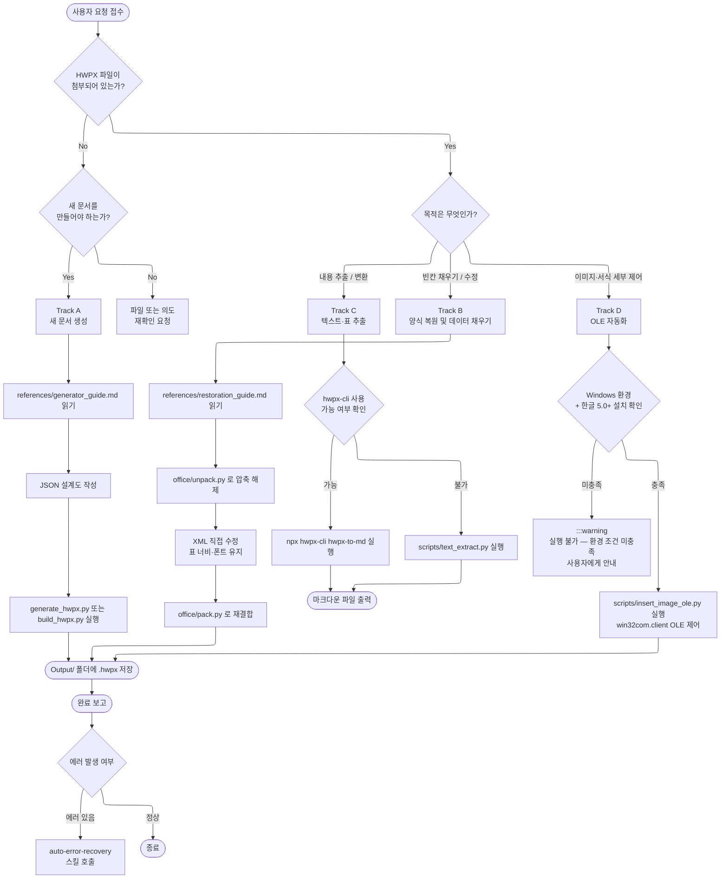

# HWPX_Master — 실행 흐름 Navigator

HWPX(아래아한글) 문서와 관련된 모든 작업의 진입점. 사용자 요청을 분석하여 4개 Track 중 하나를 자동 선택한 뒤 실행합니다.

---

## 전체 실행 흐름도



---

## Track 선택 기준 빠른 참조

| 상황 | Track | 핵심 스크립트 |
|:---|:---:|:---|
| 첨부 없이 "새 보고서 만들어줘" | A | `generate_hwpx.py` |
| 기존 양식에 표 빈칸 채워줘 | B | `build_hwpx.py` + `office/unpack.py` |
| HWPX에서 텍스트·표 뽑아줘 | C | `hwpx-cli` 또는 `text_extract.py` |
| 이미지 삽입, 세밀한 서식 제어 | D | `insert_image_ole.py` (Windows 전용) |

---

## 예시 시나리오

### 시나리오 1 — Track A: 성과보고서 새로 생성

> **상황**: 기획처 제출용 2026년 1학기 프로그램 성과보고서를 처음부터 만들어야 함. 첨부 파일 없음.

**사용자 입력**
```
2026년 1학기 공학교육혁신센터 성과보고서 hwpx로 만들어줘.
표지, 개요, 성과지표 표, 결론 순서로 구성해줘.
```

**AI 판단**: 첨부 없음 + 새 문서 → Track A

**실행 흐름**
1. `references/generator_guide.md` 읽어 양식 규칙 확인
2. JSON 설계도 초안 작성:
```json
{
  "template": "report_gov",
  "sections": ["표지", "개요", "성과지표", "결론"],
  "meta": { "year": "2026", "semester": "1", "dept": "공학교육혁신센터" }
}
```
3. `scripts/generate_hwpx.py` 실행
4. `Output/260401_기획처_성과보고서_Draft.hwpx` 생성

---

### 시나리오 2 — Track B: 기존 공문 빈칸 채우기

> **상황**: 매 학기 반복되는 위원회 회의록 양식(.hwpx)을 첨부. 날짜·참석자·안건 항목만 바꾸면 됨.

**사용자 입력**
```
이 회의록 양식에 날짜 2026-04-10, 참석자 김교수 외 4명, 안건 1. 교육과정 개편 2. 예산 심의 넣어줘.
```
(260310_위원회_회의록_양식.hwpx 첨부)

**AI 판단**: 첨부 있음 + 빈칸 채우기 → Track B

**실행 흐름**
1. `references/restoration_guide.md` 읽기
2. `office/unpack.py` 로 HWPX 압축 해제 → `Contents/section0.xml` 접근
3. XML에서 `{{날짜}}`, `{{참석자}}`, `{{안건}}` 플레이스홀더 탐색
4. 값 치환 후 원본 폰트·표 너비 유지 검증
5. `office/pack.py` 재결합
6. `Output/260410_위원회_회의록_완성.hwpx` 저장

---

### 시나리오 3 — Track C: 대량 HWPX에서 표 데이터 추출

> **상황**: 3개년치 평가 보고서(hwpx 30개)에서 성과지표 표만 뽑아 엑셀로 합쳐야 함.

**사용자 입력**
```
Input/ 폴더 안 hwpx 파일들에서 성과지표 표 내용만 추출해서 정리해줘.
```

**AI 판단**: 첨부(다수) + 내용 추출 → Track C

**실행 흐름**
```bash
# hwpx-cli 일괄 처리
for f in Input/*.hwpx; do
  npx @masteroflearning/hwpx-cli hwpx-to-md "$f" -o "Output/$(basename $f .hwpx).md"
done
```
- 추출된 .md 파일에서 `|` 구분 표 섹션만 파싱
- 통합 CSV → `Output/성과지표_통합.csv` 저장

---

### 시나리오 4 — Track D: 이미지 삽입 (OLE)

> **상황**: 보고서 내 그래프 이미지를 특정 셀 위치에 정확하게 삽입해야 함. XML로는 좌표 제어 불가.

**사용자 입력**
```
chart.png를 2페이지 3번 표의 오른쪽 셀에 넣어줘.
```

**AI 판단**: 이미지 삽입 + 좌표 제어 → Track D

**전제 조건 확인 (AER-001 적용)**
- Windows 로컬 환경인가? → 확인
- 한글 5.0+ 설치되어 있는가? → 확인 후 진행

```python
# scripts/insert_image_ole.py 핵심 흐름
import win32com.client
hwp = win32com.client.Dispatch("HWPFrame.HwpObject")
hwp.Open(target_path)
# 셀 위치 이동 → 이미지 삽입 → 저장
```

---

### 시나리오 5 — Track B + C 연계: 추출 후 다른 양식에 채우기

> **상황**: 구형 보고서(A.hwpx)에서 실적 수치를 추출하여 신형 양식(B.hwpx)에 자동 입력.

**실행 흐름**
1. Track C로 A.hwpx 텍스트 추출 → 수치 파싱
2. Track B로 B.hwpx 양식에 파싱된 수치 주입
3. 두 단계 모두 `auto-error-recovery` 감시 하에 실행

---

## 공통 주의사항

- 스크립트 실행 전 반드시 `references/` 가이드 문서 먼저 읽을 것 (AER-004 준수)
- 산출물은 반드시 `Output/` 또는 명시된 경로에 저장
- Track D는 Windows 로컬 전용 — 원격·WSL 환경에서 실행 금지
- 에러 발생 시 즉시 `auto-error-recovery` 스킬 호출
