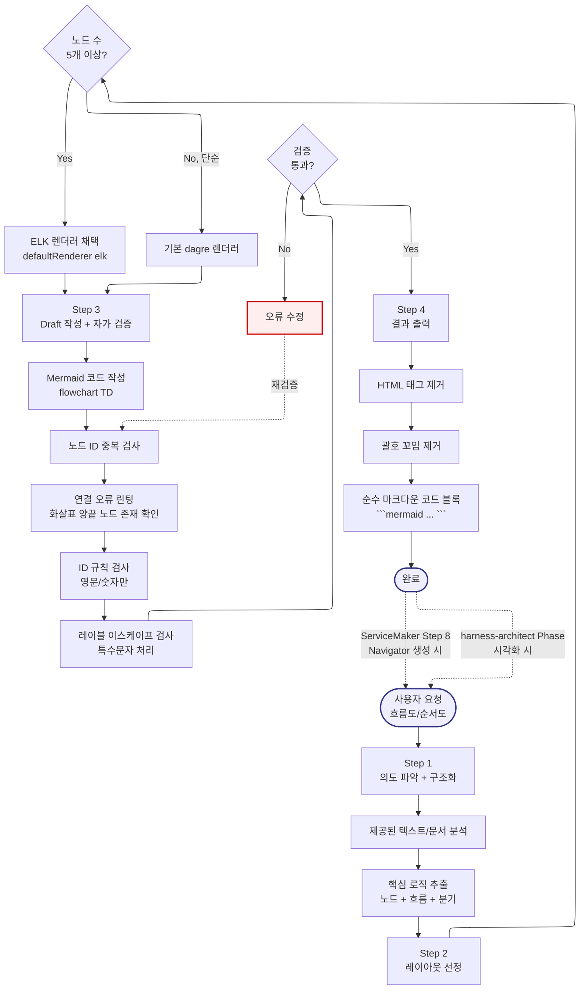
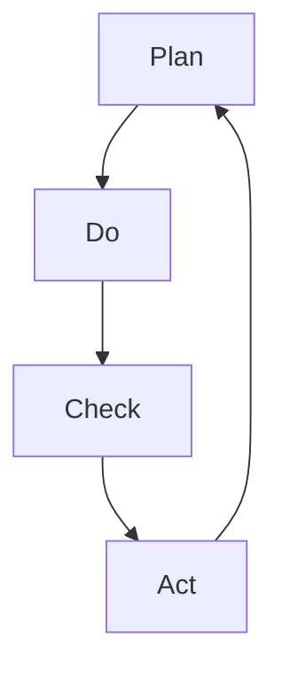

# Mermaid_FlowChart -- Navigator

> SYSTEM_NAVIGATOR 스타일 시각적 네비게이터
> 최종 갱신: 2026-04-11 (Tier-B Option A 세션 3 신규 생성)
> SKILL.md와 교차 참조 (이 파일은 SKILL.md의 시각화 계층)

---

## 0. 범례 + 사용법 {#범례--사용법}

### 상태 표시

| 표시 | 의미 |
|------|------|
| **[작동]** | 정상 작동 중 |
| **[부분]** | 일부만 작동 |
| **[미구현]** | 설계만 있고 구현 없음 |

### 다이어그램 규약

- ISO 5807:1985 표준 기호 준수
- Mermaid ELK 렌더러 + `securityLevel: loose`
- 점선 `-.->` = 피드백 루프 (재시도/복귀)
- `:::warning` = 에러/차단/실패 블럭
- `click NODE "#anchor"` = 블럭 상세 카드로 이동

### 스킬 메타

| 항목 | 값 |
|------|-----|
| 이름 | Mermaid_FlowChart |
| Tier | B |
| 커맨드 | 자동 트리거 (`흐름도`, `순서도`, `다이어그램`, `플로우차트`, `프로세스 그려줘`) |
| 프로세스 타입 | Linear Pipeline (4-Step 소형) |
| 설명 | ELK 렌더러 기반 무결점 Mermaid 다이어그램 코드 생성. 의도 파악 → 레이아웃 → Draft + 자가 검증 → 출력 |

---

## 1. 전체 워크플로우 체계도 {#전체-체계도}

<!-- AUTO:DIAGRAM_MAIN:START -->



<!-- AUTO:DIAGRAM_MAIN:END -->

<details><summary><strong>블럭 바로가기 (다이어그램 클릭 대안)</strong></summary>

[진입](#node-start) · [Step 1](#node-s1) · [텍스트 분석](#node-s1a) · [로직 추출](#node-s1b) · [Step 2](#node-s2) · [노드 수 체크](#node-s2a) · [ELK 채택](#node-s2b) · [dagre 채택](#node-s2c) · [Step 3](#node-s3) · [코드 작성](#node-s3a) · [ID 중복](#node-s3b) · [연결 오류](#node-s3c) · [ID 규칙](#node-s3d) · [레이블 이스케이프](#node-s3e) · [검증 체크](#node-s3f) · [오류 수정](#node-s3-fix) · [Step 4](#node-s4) · [HTML 제거](#node-s4a) · [괄호 정리](#node-s4b) · [코드 블록 출력](#node-s4c) · [완료](#node-end)
· [**전체 블럭 카탈로그**](#block-catalog)

</details>

[맨 위로](#범례--사용법)

---

## 2. 블럭 상세 카탈로그 {#block-catalog}

<details><summary>블럭 카드 펼치기 (20개)</summary>

### 사용자 요청 진입 {#node-start}

| 항목 | 내용 |
|------|------|
| 소속 | 진입점 |
| 동기 | 흐름도/순서도/다이어그램은 텍스트 설명보다 100배 효율적. 즉시 무결점 Mermaid 코드 생성 필요 |
| 내용 | 5가지 트리거 키워드 중 하나로 활성화 |
| 동작 방식 | 자동 트리거 키워드 매칭 |
| 상태 | [작동] |
| 관련 파일 | `.agents/skills/Mermaid_FlowChart/SKILL.md` |

[다이어그램으로 복귀](#전체-체계도)

### Step 1: 의도 파악 + 구조화 {#node-s1}

| 항목 | 내용 |
|------|------|
| 소속 | Step 1 (Analysis) |
| 동기 | 사용자가 제공한 텍스트/문서에서 핵심 로직만 추출해야 명확한 다이어그램 가능 |
| 내용 | 텍스트 분석 + 핵심 로직 추출 |
| 동작 방식 | LLM 기반 구조화 |
| 상태 | [작동] |
| 관련 파일 | SKILL.md |

[다이어그램으로 복귀](#전체-체계도)

### S1A: 텍스트/문서 분석 {#node-s1a}

| 항목 | 내용 |
|------|------|
| 소속 | Step 1 Stage A |
| 동기 | 입력 자료의 핵심을 파악해야 다이어그램 구조 결정 가능 |
| 내용 | 사용자 요청 + 첨부 텍스트 전체 읽기 |
| 동작 방식 | LLM 컨텍스트 분석 |
| 상태 | [작동] |
| 관련 파일 | 없음 |

[다이어그램으로 복귀](#전체-체계도)

### S1B: 핵심 로직 추출 {#node-s1b}

| 항목 | 내용 |
|------|------|
| 소속 | Step 1 Stage B |
| 동기 | 노드(작업) + 흐름(연결) + 분기(결정) 3 요소로 구조화해야 Mermaid 변환 가능 |
| 내용 | 노드 목록 + 흐름 + 분기 조건 추출 |
| 동작 방식 | 명사(노드) + 동사(흐름) + 의문사(분기) 매칭 |
| 상태 | [작동] |
| 관련 파일 | 없음 |

[다이어그램으로 복귀](#전체-체계도)

### Step 2: 레이아웃 선정 {#node-s2}

| 항목 | 내용 |
|------|------|
| 소속 | Step 2 (Layout Decision) |
| 동기 | 노드 수에 따라 적절한 렌더러 선택해야 가독성 보장 |
| 내용 | 노드 수 체크 → ELK 또는 dagre 선택 |
| 동작 방식 | 임계값 기반 분기 |
| 상태 | [작동] |
| 관련 파일 | SKILL.md |

[다이어그램으로 복귀](#전체-체계도)

### S2A: 노드 수 5개 이상 분기 {#node-s2a}

| 항목 | 내용 |
|------|------|
| 소속 | 결정 블럭 (Decision) |
| 동기 | 5개 이상 노드는 dagre 기본 렌더러로는 레이아웃 품질 저하 |
| 내용 | 노드 수 ≥ 5 → ELK, < 5 → dagre |
| 동작 방식 | 노드 카운트 |
| 상태 | [작동] |
| 관련 파일 | 없음 |

[다이어그램으로 복귀](#전체-체계도)

### S2B: ELK 렌더러 채택 {#node-s2b}

| 항목 | 내용 |
|------|------|
| 소속 | Step 2 분기 A (대규모) |
| 동기 | ELK는 복잡한 다이어그램에서 노드 배치/레이어링 품질 우수 |
| 내용 | `%%{init: {"flowchart": {"defaultRenderer": "elk"}} }%%` 헤더 추가 |
| 동작 방식 | Mermaid init 디렉티브 |
| 상태 | [작동] |
| 관련 파일 | SKILL.md |

[다이어그램으로 복귀](#전체-체계도)

### S2C: dagre 기본 렌더러 {#node-s2c}

| 항목 | 내용 |
|------|------|
| 소속 | Step 2 분기 B (소규모) |
| 동기 | 5개 미만 노드는 dagre로도 충분. 헤더 생략으로 코드 단순화 |
| 내용 | init 디렉티브 없이 `flowchart TD` 직접 시작 |
| 동작 방식 | 기본 렌더러 사용 |
| 상태 | [작동] |
| 관련 파일 | 없음 |

[다이어그램으로 복귀](#전체-체계도)

### Step 3: Draft 작성 + 자가 검증 {#node-s3}

| 항목 | 내용 |
|------|------|
| 소속 | Step 3 (Draft + Validate) |
| 동기 | 작성 직후 자가 검증으로 무결점 보장. 사용자에게 깨진 다이어그램 제공 금지 |
| 내용 | Mermaid 코드 작성 → 4가지 검증 (ID 중복, 연결 오류, ID 규칙, 레이블 이스케이프) |
| 동작 방식 | 작성 + 정규식 린팅 |
| 상태 | [작동] |
| 관련 파일 | SKILL.md |

[다이어그램으로 복귀](#전체-체계도)

### S3A: Mermaid 코드 작성 {#node-s3a}

| 항목 | 내용 |
|------|------|
| 소속 | Step 3 Stage A |
| 동기 | Step 1-2 결과를 실제 Mermaid 문법으로 변환 |
| 내용 | `flowchart TD` + 노드 + 화살표 + 분기 |
| 동작 방식 | Mermaid v10+ 문법 |
| 상태 | [작동] |
| 관련 파일 | 없음 |

[다이어그램으로 복귀](#전체-체계도)

### S3B: 노드 ID 중복 검사 {#node-s3b}

| 항목 | 내용 |
|------|------|
| 소속 | Step 3 Stage B (린팅 1) |
| 동기 | 동일 ID 두 개의 노드가 있으면 Mermaid 렌더링 실패 |
| 내용 | 모든 노드 ID 추출 후 중복 체크 |
| 동작 방식 | Set 비교 |
| 상태 | [작동] |
| 관련 파일 | 없음 |

[다이어그램으로 복귀](#전체-체계도)

### S3C: 연결 오류 린팅 {#node-s3c}

| 항목 | 내용 |
|------|------|
| 소속 | Step 3 Stage C (린팅 2) |
| 동기 | `A --> B` 형태에서 A 또는 B가 존재하지 않으면 깨짐 |
| 내용 | 모든 화살표의 양끝 노드가 노드 목록에 존재하는지 확인 |
| 동작 방식 | 정규식 + 노드 존재 체크 |
| 상태 | [작동] |
| 관련 파일 | 없음 |

[다이어그램으로 복귀](#전체-체계도)

### S3D: ID 규칙 검사 {#node-s3d}

| 항목 | 내용 |
|------|------|
| 소속 | Step 3 Stage D (린팅 3) |
| 동기 | 노드 ID에 한글 사용 시 일부 렌더러에서 깨짐. 영문/숫자만 허용 |
| 내용 | ID가 `[a-zA-Z][a-zA-Z0-9_]*` 패턴인지 확인 |
| 동작 방식 | 정규식 매칭 |
| 상태 | [작동] |
| 관련 파일 | SKILL.md |

[다이어그램으로 복귀](#전체-체계도)

### S3E: 레이블 이스케이프 검사 {#node-s3e}

| 항목 | 내용 |
|------|------|
| 소속 | Step 3 Stage E (린팅 4) |
| 동기 | 레이블 안에 `[]{}()` 등 특수문자가 있으면 파싱 오류. 한글은 허용 |
| 내용 | 레이블 내 특수문자 이스케이프 또는 따옴표 감싸기 |
| 동작 방식 | 정규식 + 자동 치환 |
| 상태 | [작동] |
| 관련 파일 | SKILL.md |

[다이어그램으로 복귀](#전체-체계도)

### S3F: 검증 통과 분기 {#node-s3f}

| 항목 | 내용 |
|------|------|
| 소속 | 결정 블럭 (Decision, 품질 게이트) |
| 동기 | 4가지 검증 모두 통과해야 Step 4 진입 |
| 내용 | 모든 검증 OK → Step 4, 1개라도 실패 → S3Fix |
| 동작 방식 | AND 조건 |
| 상태 | [작동] |
| 관련 파일 | 없음 |

[다이어그램으로 복귀](#전체-체계도)

### S3Fix: 오류 수정 (피드백 루프) {#node-s3-fix}

| 항목 | 내용 |
|------|------|
| 소속 | 피드백 루프 (S3 재검증) |
| 동기 | 오류 발견 시 수정 후 재검증해야 무결점 |
| 내용 | 검증 실패 항목 자동 수정 (ID 변경, 이스케이프 추가 등) |
| 동작 방식 | `-.->` 피드백 루프로 S3B 재진입 |
| 상태 | [작동] |
| 관련 파일 | 없음 |

[다이어그램으로 복귀](#전체-체계도)

### Step 4: 결과 출력 {#node-s4}

| 항목 | 내용 |
|------|------|
| 소속 | Step 4 (Final Output) |
| 동기 | 검증 통과한 코드를 사용자가 바로 사용 가능한 깨끗한 형태로 출력 |
| 내용 | HTML 제거 → 괄호 정리 → 마크다운 코드 블록 |
| 동작 방식 | 후처리 3 stage |
| 상태 | [작동] |
| 관련 파일 | SKILL.md |

[다이어그램으로 복귀](#전체-체계도)

### S4A: HTML 태그 제거 {#node-s4a}

| 항목 | 내용 |
|------|------|
| 소속 | Step 4 Stage A |
| 동기 | LLM이 생성한 코드에 HTML 태그가 섞이면 일부 렌더러에서 오류 |
| 내용 | `<br>`, `<div>` 등 HTML 태그 제거 (Mermaid 내장 `<br/>`은 예외) |
| 동작 방식 | 정규식 치환 |
| 상태 | [작동] |
| 관련 파일 | 없음 |

[다이어그램으로 복귀](#전체-체계도)

### S4B: 괄호 꼬임 제거 {#node-s4b}

| 항목 | 내용 |
|------|------|
| 소속 | Step 4 Stage B |
| 동기 | 노드 정의에서 `[(text]`처럼 괄호 짝이 안 맞으면 파싱 실패 |
| 내용 | 괄호 짝 맞춤 검사 + 자동 보정 |
| 동작 방식 | 스택 기반 매칭 |
| 상태 | [작동] |
| 관련 파일 | 없음 |

[다이어그램으로 복귀](#전체-체계도)

### S4C: 마크다운 코드 블록 출력 {#node-s4c}

| 항목 | 내용 |
|------|------|
| 소속 | Step 4 Stage C (최종) |
| 동기 | 사용자가 copy-paste 가능한 깨끗한 코드 블록 형태 |
| 내용 | ` ```mermaid ... ``` ` 형식 |
| 동작 방식 | Markdown 코드 블록 래핑 |
| 상태 | [작동] |
| 관련 파일 | 없음 |

[다이어그램으로 복귀](#전체-체계도)

### 완료 {#node-end}

| 항목 | 내용 |
|------|------|
| 소속 | 파이프라인 종료점 |
| 동기 | 무결점 Mermaid 코드 사용자에게 전달 |
| 내용 | 검증된 Mermaid 코드 블록 |
| 동작 방식 | 콘솔 출력 |
| 상태 | [작동] |
| 관련 파일 | 없음 |

[다이어그램으로 복귀](#전체-체계도)

</details>

[맨 위로](#범례--사용법)

---

## 3. 4-Step 요약

| Step | 이름 | 주요 작업 | 출력 |
|:---:|------|----------|------|
| 1 | 의도 파악 + 구조화 | 텍스트 분석 + 핵심 로직 추출 | 노드/흐름/분기 목록 |
| 2 | 레이아웃 선정 | 노드 수 체크 + 렌더러 선택 | ELK 또는 dagre |
| 3 | Draft + 자가 검증 | 코드 작성 + 4가지 린팅 | 검증 통과 코드 |
| 4 | 결과 출력 | HTML 제거 + 괄호 정리 | 마크다운 코드 블록 |

---

## 4. 사용 규칙

### 노드 ID

- 영문/숫자만 (한글 ID 금지)
- 첫 글자는 영문 (`A1`, `Start`, `node_1`)

### 레이블

- 한글 허용
- 특수문자 (`[]{}()` 등) 내부에서는 이스케이프 처리

### 화살표

- 기본: `-->`
- 조건부: `-->|조건|`
- 피드백 루프: `-.->` (점선)

### Warning 노드

- 오류/주의 분기: `:::warning` 클래스 사용
- `classDef warning fill:#fee,stroke:#c00`

---

## 5. 사용 시나리오

### 시나리오 1 -- 단순 PDCA 사이클

> **상황**: "PDCA 사이클 순서도 만들어줘"

**흐름**: S1(P-D-C-A 4 노드 추출) → S2A(4 노드, < 5) → S2C(dagre) → S3 → S4

**출력**:


---

### 시나리오 2 -- 복잡한 에러 복구 다이어그램

> **상황**: "auto-error-recovery 4-Phase + 재귀 루프 다이어그램"

**흐름**: S1(8+ 노드 추출) → S2A(≥ 5) → S2B(ELK) → S3(검증) → S4

**출력**: ELK 렌더러 + 재귀 루프 + post_mortem 분기 포함 다이어그램.

---

### 시나리오 3 -- 검증 실패 후 자동 수정

> **상황**: 노드 ID에 한글이 들어가서 S3D 실패

**흐름**: S3D(실패) → S3F(No) → S3Fix(한글 ID를 영문으로 자동 치환) → `-.->` S3B 재검증 → S3F(Yes) → S4

---

### 시나리오 4 -- ServiceMaker Step 8 연계

> **상황**: ServiceMaker가 신규 스킬 Navigator 생성을 위해 호출

**흐름**: 외부 호출 → Start → Step 1-4 → End → ServiceMaker로 결과 반환

---

### 시나리오 5 -- harness-architect Phase 시각화

> **상황**: harness-architect 7-Phase 흐름도 생성

**흐름**: Start → S1(7 Phase 추출) → S2A(≥ 5) → S2B(ELK) → S3 → S4

ELK 레이아웃으로 7 Phase + Decision Gate 분기를 깔끔하게 표현.

---

[맨 위로](#범례--사용법)

---

## 6. 제약사항 및 공통 주의사항

### 다이어그램 규칙

- **노드 ID**: 영문/숫자만 (한글 금지)
- **레이블 한글**: 허용 (특수문자만 이스케이프)
- **5+ 노드**: ELK 렌더러 의무
- **Warning 노드**: `:::warning` 클래스 사용

### 검증 (Step 3 자가 검증 4종)

1. 노드 ID 중복 검사
2. 연결 오류 (화살표 양끝 노드 존재)
3. ID 규칙 (영문/숫자)
4. 레이블 이스케이프 (특수문자 처리)

### 후처리 (Step 4)

- HTML 태그 제거 (`<br/>` 제외)
- 괄호 꼬임 제거
- 순수 마크다운 코드 블록 출력

### 공통 금지 사항

- 이모티콘 사용 금지 (PostToolUse 훅 차단)
- 노드 ID에 한글 사용 금지
- 절대경로 하드코딩 금지

### 각인 참조

- **IMP-013**: JS 정규식 이스케이프 슬래시 (린팅 로직 작성 시)
- **IMP-014**: Meta 문서 자동 갱신 (Navigator 생성 시 atomicWriteWithBackup 재사용 가능)

### 연계 스킬

| 스킬 | 연계 방식 |
|:---|:---|
| ServiceMaker | Step 8에서 Navigator.md 생성 호출 |
| harness-architect | Phase 다이어그램 시각화 |
| llm-wiki | concept/source 페이지에 다이어그램 삽입 시 |

[맨 위로](#범례--사용법)

---

## 7. 갱신 이력

| 날짜 | 변경 | 트리거 |
|------|------|--------|
| 2026-04-11 | Tier-B Navigator 신규 생성 (SYSTEM_NAVIGATOR 스타일) | Option A 세션 3 |

[맨 위로](#범례--사용법)
