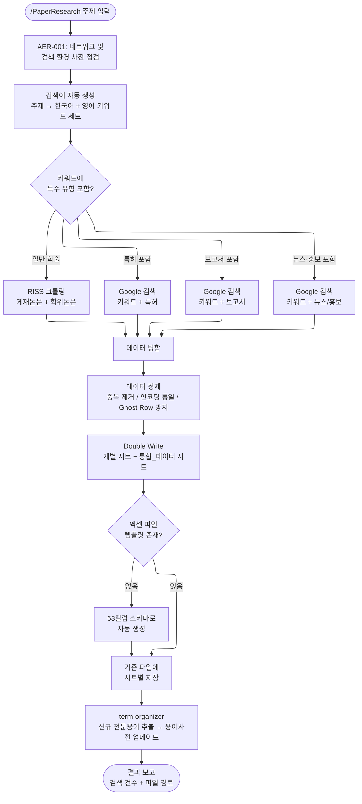

# PaperResearch — 실행 흐름 Navigator

연구 주제를 입력하면 RISS·Google Scholar·특허·보고서 DB를 자동 크롤링하여 엑셀로 정리합니다. 검색어 생성부터 데이터 정제·저장까지 전 과정을 자동화합니다.

---

## 전체 실행 흐름도



---

## 검색 유형별 대상 DB

| 키워드 패턴 | 검색 대상 | 출력 시트 |
|:---|:---|:---|
| 일반 주제 | RISS 게재논문, 학위논문 | `게재논문`, `학위논문` |
| 주제 + "특허" | Google 특허 검색 | `특허` |
| 주제 + "보고서" | Google 보고서 검색 | `보고서` |
| 주제 + "뉴스" 또는 "홍보" | Google 뉴스 검색 | `홍보자료` |
| 복합 | 위 전체 조합 | `통합_데이터` |

---

## 엑셀 출력 구조

```
Curriculum_QM_Curated.xlsx
├── 게재논문      (Row 1: 헤더 / Row 2~: 데이터)
├── 학위논문
├── 특허
├── 보고서
├── 홍보자료
└── 통합_데이터   (위 5개 시트 합산)
```

- 헤더 누락 시 자동 주입 (Row 1)
- cp949 파일은 UTF-8로 자동 변환 후 저장

---

## 예시 시나리오

### 시나리오 1 — 기본 학술 논문 검색

> **상황**: AI 기반 교육 효과 연구를 시작하기 전 선행 연구를 파악해야 함.

**사용자 입력**
```
/PaperResearch AI 교육 효과
```

**AI 실행 흐름**

1. 네트워크 사전 점검 (AER-001)
2. 검색어 생성:
   - 한국어: `AI 교육`, `인공지능 교육 효과`, `AI 활용 학습`
   - 영어: `AI in education`, `artificial intelligence learning effectiveness`
3. RISS 크롤링 → 게재논문 47건, 학위논문 23건 수집
4. 중복 제거 후 엑셀 저장
5. term-organizer 트리거 → "교육 효과성", "AI 기반 학습" 등 신규 용어 용어사전에 추가
6. 결과 보고:
```
검색 완료: 총 70건
- 게재논문: 47건
- 학위논문: 23건
저장 위치: Projects/260401_AI교육연구/Output/Curriculum_QM_Curated.xlsx
```

---

### 시나리오 2 — 특허 + 학술 복합 검색

> **상황**: 에너지 저장 기술 연구 과제 제안서 작성을 위해 논문과 특허를 동시에 조사해야 함.

**사용자 입력**
```
/PaperResearch 중력식 에너지 저장 시스템 특허
```

**AI 실행 흐름**

1. 키워드 분석 → "특허" 포함 감지
2. 검색 범위: RISS 학술 + Google 특허 동시 실행
3. 수집 데이터:
   - 게재논문: 12건 (RISS)
   - 학위논문: 5건 (RISS)
   - 특허: 31건 (Google 특허)
4. 엑셀 4개 시트 + 통합_데이터 저장
5. 결과 보고:
```
검색 완료: 총 48건
- 게재논문: 12건 / 학위논문: 5건 / 특허: 31건
저장 위치: Projects/260401_에너지저장연구/Output/Curriculum_QM_Curated.xlsx
```

---

### 시나리오 3 — 정책 보고서 + 뉴스 검색

> **상황**: 탄소중립 정책 동향을 파악하기 위해 정부 보고서와 최신 뉴스가 필요함.

**사용자 입력**
```
/PaperResearch 탄소중립 대학 정책 보고서 뉴스
```

**AI 실행 흐름**

1. 키워드 분석 → "보고서" + "뉴스" 둘 다 감지
2. 검색 범위: RISS 학술 + Google 보고서 + Google 뉴스 3채널 동시 실행
3. 수집:
   - 학술 논문: 18건
   - 정부/기관 보고서: 9건
   - 뉴스/홍보: 24건
4. 엑셀 5개 시트 저장
5. term-organizer → "탄소중립 로드맵", "NDC(국가 온실가스 감축목표)" 용어사전 추가

---

### 시나리오 4 — 검색 결과를 FileNameMaking과 연계

> **상황**: 수집된 논문 PDF를 다운로드 후 파일명이 제각각. 주제 관련성 기준으로 랭킹 매겨 정리하고 싶음.

**사용자 입력**
```
/PaperResearch AI 교육
```
검색 완료 후:
```
이 논문들 다운받은 PDF 파일명 관련성 높은 순으로 정리해줘.
```

**연계 흐름**

1. PaperResearch로 논문 목록 엑셀 수집 완료
2. FileNameMaking 스킬 자동 트리거
3. 평가 주제: "AI 기반 교육 효과성 및 학습 결과 향상"
4. 각 PDF 딥리딩 → 0~100점 스코어링
5. 파일명 변경: `[점수]_[연도]_[제목].pdf`

---

### 시나리오 5 — 검색 실패 및 복구 (AER 연계)

> **상황**: RISS 서버 응답 없음. 네트워크 오류 발생.

**AI 판단 흐름**

1. AER-001: 사전 점검 단계에서 RISS 응답 타임아웃 감지
2. `auto-error-recovery` 트리거
3. 대안 제시:
   - 대안 1: 10분 후 재시도 (RISS 일시 장애 가능성)
   - 대안 2: Google Scholar로 전환하여 영어 논문만 우선 수집
   - 대안 3: 오프라인 캐시 데이터 사용 (있는 경우)
4. 사용자 선택 후 해당 대안 실행
5. 복구 결과를 SKILL.md 버그 이력 로그에 기록

---

## 실행 전 사전 점검 목록 (AER-001)

```
[ ] 인터넷 연결 상태 정상
[ ] RISS (riss.kr) 접근 가능
[ ] Google 검색 차단 여부 확인
[ ] 활성 프로젝트 경로 존재 (Projects/YYMMDD_이름/)
[ ] Output/ 폴더 쓰기 권한 있음
```

미충족 항목 있으면 즉시 사용자에게 보고 후 대안 제시.

---

## term-organizer 자동 연계

PaperResearch 완료 후 신규 전문용어 발견 시 `term-organizer` 스킬을 자동으로 연계합니다.

```
발견된 신규 용어 예시:
- "NDC" → 국가 온실가스 감축목표 (Nationally Determined Contribution)
- "PISA" → 국제학업성취도평가
- "OER" → 공개 교육 자료 (Open Educational Resources)

용어사전에 추가할까요? [Y/N]
```
