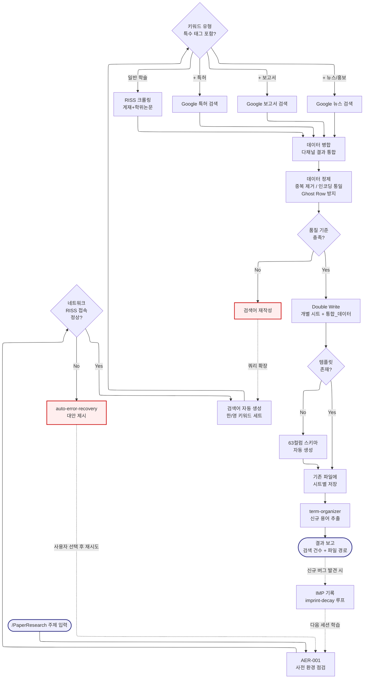

# PaperResearch -- Navigator

> SYSTEM_NAVIGATOR 스타일 시각적 네비게이터
> 최종 갱신: 2026-04-10 (Phase 3 확장)
> SKILL.md와 교차 참조 (이 파일은 SKILL.md의 시각화 계층)

---

## 0. 범례 + 사용법 {#범례--사용법}

### 상태 표시

| 표시 | 의미 |
|------|------|
| **[작동]** | 정상 작동 중 |
| **[부분]** | 일부만 작동 |
| **[미구현]** | 설계만 있고 구현 없음 |

### 다이어그램 규약

- ISO 5807:1985 표준 기호 준수
- Mermaid ELK 렌더러 + `securityLevel: loose`
- 점선 `-.->` = 피드백 루프 (재시도/복귀)
- `:::warning` = 에러/차단/실패 블럭
- `click NODE "#anchor"` = 블럭 상세 카드로 이동

### 스킬 메타

| 항목 | 값 |
|------|-----|
| 이름 | PaperResearch |
| Tier | A |
| 커맨드 | `/PaperResearch [주제]` |
| 프로세스 타입 | linear (Pipeline) |
| 설명 | 학술 논문 및 연구 자료 자동 검색 스킬. RISS(한국), Google Scholar 등 다국가 DB에서 자동으로 검색어를 생성하고 결과를 엑셀로 정리합니다. 키워드: '논문', '학술', 'RISS', '학술 검색', 'PaperResearch' |

---

## 1. 전체 워크플로우 체계도 {#전체-체계도}

<!-- AUTO:DIAGRAM_MAIN:START -->



<!-- AUTO:DIAGRAM_MAIN:END -->

<details><summary><strong>블럭 바로가기 (다이어그램 클릭 대안)</strong></summary>

[입력](#node-start) · [사전 점검](#node-pre-check) · [네트워크 OK?](#node-network-ok) · [복구 분기](#node-recovery) · [검색어 생성](#node-keyword-gen) · [유형 분기](#node-type-branch) · [RISS 크롤링](#node-riss) · [특허 검색](#node-patent) · [보고서 검색](#node-report) · [뉴스 검색](#node-news) · [병합](#node-merge) · [정제](#node-clean) · [품질 게이트](#node-quality-gate) · [검색어 재작성](#node-kw-rewrite) · [Double Write](#node-write) · [템플릿 분기](#node-template-check) · [템플릿 생성](#node-create-template) · [저장](#node-save) · [term-organizer](#node-term-organizer) · [결과 보고](#node-report-out) · [각인 기록](#node-imprint)
· [**전체 블럭 카탈로그**](#block-catalog)

</details>

[맨 위로](#범례--사용법)

---

## 2. 블럭 상세 카탈로그 {#block-catalog}

<details><summary>블럭 카드 펼치기 (22개)</summary>

### 입력: /PaperResearch 호출 {#node-start}

| 항목 | 내용 |
|------|------|
| 소속 | 파이프라인 입력 |
| 동기 | 연구 시작 시 RISS 등 학술 DB를 수동 검색하면 시간 과다, 검색어 누락, 포맷 불일치 등 결함 발생. 자동 파이프라인으로 Zero-Defect 보장 |
| 내용 | 사용자가 연구 주제 텍스트를 입력하면 파이프라인이 시작됨 |
| 동작 방식 | 자동 트리거 키워드 ('논문', '학술', 'RISS', 'PaperResearch') 감지 시 SKILL.md에 따라 실행 |
| 상태 | [작동] |
| 관련 파일 | `.agents/skills/PaperResearch/SKILL.md` |

[다이어그램으로 복귀](#전체-체계도)

### AER-001: 사전 환경 점검 {#node-pre-check}

| 항목 | 내용 |
|------|------|
| 소속 | 전처리 단계 |
| 동기 | 과거 RISS 타임아웃/Google 차단으로 중간에 크롤링이 실패해 부분 데이터가 남아 Zero-Defect 위반 발생 |
| 내용 | 인터넷 연결, RISS 접근, Google 차단 여부, 활성 프로젝트 경로, Output/ 쓰기 권한 등 5종 사전 점검 |
| 동작 방식 | 각 항목 순차 체크 → 미충족 시 즉시 사용자에게 보고 후 대안 제시 (auto-error-recovery 트리거) |
| 상태 | [작동] |
| 관련 파일 | SKILL.md, `.harness/imprints.json` |

[다이어그램으로 복귀](#전체-체계도)

### 네트워크 OK? 분기 {#node-network-ok}

| 항목 | 내용 |
|------|------|
| 소속 | 결정 블럭 (Decision) |
| 동기 | 사전 점검 결과를 분기 조건으로 만들어 파이프라인 진입 여부를 명확히 통제 |
| 내용 | 네트워크/DB 접속 정상 = Yes → 검색어 생성, 이상 = No → 복구 분기 |
| 동작 방식 | 5종 점검 중 1개라도 실패 시 No 경로, 전부 정상 시 Yes 경로 |
| 상태 | [작동] |
| 관련 파일 | SKILL.md |

[다이어그램으로 복귀](#전체-체계도)

### auto-error-recovery 복구 분기 {#node-recovery}

| 항목 | 내용 |
|------|------|
| 소속 | 에러 처리 (ISO 5807 Error Handling 패턴) |
| 동기 | RISS 일시 장애 등에 대비해 재시도, 대체 DB, 캐시 사용 등 복구 루트가 필요 |
| 내용 | 3가지 대안 제시: 10분 후 재시도, Google Scholar 전환, 오프라인 캐시 사용 |
| 동작 방식 | 사용자 선택 후 해당 대안 실행 → 성공 시 파이프라인 재진입, 실패 시 SKILL.md 버그 이력 로그 기록 |
| 상태 | [작동] |
| 관련 파일 | SKILL.md, `auto-error-recovery` 스킬 |

[다이어그램으로 복귀](#전체-체계도)

### 검색어 자동 생성 {#node-keyword-gen}

| 항목 | 내용 |
|------|------|
| 소속 | Pipeline Stage 1 |
| 동기 | 사용자가 입력한 주제 1개만으로는 검색 결과 편향이 큼. 한/영 다국어 키워드 세트로 확장 필요 |
| 내용 | 주제 텍스트를 한국어 3~5개 + 영어 3~5개 키워드 세트로 자동 확장 |
| 동작 방식 | LLM 기반 동의어/유사어 생성 + 도메인 키워드 결합. 예: "AI 교육" → "인공지능 교육 효과", "AI 활용 학습", "AI in education" 등 |
| 상태 | [작동] |
| 관련 파일 | SKILL.md, `paper_research_agent_curriculum.py` |

[다이어그램으로 복귀](#전체-체계도)

### 키워드 유형 분기 {#node-type-branch}

| 항목 | 내용 |
|------|------|
| 소속 | 결정 블럭 (Decision) |
| 동기 | 주제에 "특허"/"보고서"/"뉴스" 등 특수 태그가 포함되면 일반 학술 DB만으로는 부족 |
| 내용 | 키워드에 포함된 태그에 따라 RISS / Google 특허 / Google 보고서 / Google 뉴스 중 해당 채널 활성화 |
| 동작 방식 | 정규식으로 태그 감지 → 복수 태그 동시 활성화 가능 (4채널 동시 실행) |
| 상태 | [작동] |
| 관련 파일 | SKILL.md, 스크립트 라우팅 로직 |

[다이어그램으로 복귀](#전체-체계도)

### RISS 크롤링 {#node-riss}

| 항목 | 내용 |
|------|------|
| 소속 | Pipeline Stage 2a (학술) |
| 동기 | 한국 학술 DB 중 가장 포괄적. 게재논문 + 학위논문 동시 수집 가능 |
| 내용 | RISS 검색 API/웹 크롤링으로 게재논문, 학위논문 메타데이터 수집 |
| 동작 방식 | 검색어별 순차 크롤링 → 결과 DataFrame으로 축적 |
| 상태 | [작동] |
| 관련 파일 | `paper_research_agent_curriculum.py` (RISS 모듈) |

[다이어그램으로 복귀](#전체-체계도)

### Google 특허 검색 {#node-patent}

| 항목 | 내용 |
|------|------|
| 소속 | Pipeline Stage 2b (특허) |
| 동기 | 연구 과제 제안서 작성 시 선행 특허 조사 필수. 학술 DB와 병행 수집이 효율적 |
| 내용 | Google 검색 쿼리에 "특허" 키워드를 결합하여 특허 문서 수집 |
| 동작 방식 | 쿼리 빌드 → 결과 페이지 파싱 → 특허번호/제목/요약 추출 |
| 상태 | [작동] |
| 관련 파일 | `paper_research_agent_curriculum.py` (Google 특허 모듈) |

[다이어그램으로 복귀](#전체-체계도)

### Google 보고서 검색 {#node-report}

| 항목 | 내용 |
|------|------|
| 소속 | Pipeline Stage 2c (보고서) |
| 동기 | 정부/기관 정책 보고서는 학술 DB에 등록되지 않는 경우가 많아 별도 채널 필요 |
| 내용 | Google 검색 쿼리에 "보고서" 키워드를 결합하여 기관 보고서 수집 |
| 동작 방식 | 쿼리 빌드 → 결과 파싱 → 기관명/제목/발행일 추출 |
| 상태 | [작동] |
| 관련 파일 | `paper_research_agent_curriculum.py` (Google 보고서 모듈) |

[다이어그램으로 복귀](#전체-체계도)

### Google 뉴스 검색 {#node-news}

| 항목 | 내용 |
|------|------|
| 소속 | Pipeline Stage 2d (뉴스/홍보) |
| 동기 | 최신 동향은 학술 DB로는 6개월 이상 지연. 뉴스/홍보 채널로 실시간 보완 필요 |
| 내용 | Google 검색 쿼리에 "뉴스"/"홍보" 키워드 결합하여 최근 기사 수집 |
| 동작 방식 | 쿼리 빌드 → 결과 파싱 → 매체/제목/날짜 추출 |
| 상태 | [작동] |
| 관련 파일 | `paper_research_agent_curriculum.py` (Google 뉴스 모듈) |

[다이어그램으로 복귀](#전체-체계도)

### 데이터 병합 {#node-merge}

| 항목 | 내용 |
|------|------|
| 소속 | Pipeline Stage 3 |
| 동기 | 4개 채널의 결과를 하나의 구조로 통합해야 후속 정제/저장이 일관됨 |
| 내용 | RISS, 특허, 보고서, 뉴스 DataFrame을 63컬럼 통합 스키마로 병합 |
| 동작 방식 | pandas concat + 컬럼 정렬 + 누락 컬럼 기본값 채움 |
| 상태 | [작동] |
| 관련 파일 | `paper_research_agent_curriculum.py` (merge 단계) |

[다이어그램으로 복귀](#전체-체계도)

### 데이터 정제 {#node-clean}

| 항목 | 내용 |
|------|------|
| 소속 | Pipeline Stage 4 |
| 동기 | 중복 레코드, cp949 인코딩, Ghost Row(빈 Row 1) 등이 Zero-Defect 정책 위반 원인 |
| 내용 | 중복 제거 (제목+저자 기준), 인코딩 UTF-8 통일, Ghost Row 방지, 특수문자 이스케이프 |
| 동작 방식 | pandas drop_duplicates + 인코딩 자동 감지/변환 + Row 2부터 데이터 보장 |
| 상태 | [작동] |
| 관련 파일 | `paper_research_agent_curriculum.py` (clean 단계) |

[다이어그램으로 복귀](#전체-체계도)

### 품질 게이트 분기 {#node-quality-gate}

| 항목 | 내용 |
|------|------|
| 소속 | 결정 블럭 (Decision, 피드백 루프 진입점) |
| 동기 | 검색 결과가 10건 미만이거나 주제 적합도가 낮으면 재검색 필요. 그대로 저장하면 연구 품질 저하 |
| 내용 | 총 건수 ≥ 10건이고 주제 적합도 ≥ 0.6이면 Yes, 아니면 No 경로로 검색어 재작성 |
| 동작 방식 | 임계값 기반 자동 판단 → No 시 검색어 확장/재작성 루프로 복귀 |
| 상태 | [부분] (품질 점수 계산 고도화 여지 있음) |
| 관련 파일 | SKILL.md |

[다이어그램으로 복귀](#전체-체계도)

### 검색어 재작성 (피드백 루프) {#node-kw-rewrite}

| 항목 | 내용 |
|------|------|
| 소속 | 피드백 루프 (ISO 5807 Retry 패턴) |
| 동기 | 1차 검색어가 너무 좁거나 모호해 결과가 부족할 때 자동으로 쿼리를 확장할 필요 |
| 내용 | 원 주제를 더 넓은 동의어/상위어로 확장 후 검색어 생성 단계로 복귀 |
| 동작 방식 | LLM 재호출 → 확장 키워드 세트 반환 → `-.->` 피드백 루프로 KW 단계 재진입 |
| 상태 | [부분] (수동 개입 필요 케이스 다수) |
| 관련 파일 | SKILL.md |

[다이어그램으로 복귀](#전체-체계도)

### Double Write {#node-write}

| 항목 | 내용 |
|------|------|
| 소속 | Pipeline Stage 5 |
| 동기 | Excel 구버전 호환 + 통합 분석 편의 모두 확보하려면 개별 시트 + 통합 시트 동시 저장 필요 |
| 내용 | 각 DB별 시트(`게재논문`, `학위논문`, `특허`, `보고서`, `홍보자료`) + 전체 통합 시트(`통합_데이터`) |
| 동작 방식 | openpyxl로 시트별 append → 각 시트 Row 2부터 데이터 기록 → 마지막에 통합 시트 갱신 |
| 상태 | [작동] |
| 관련 파일 | `paper_research_agent_curriculum.py` (write 단계) |

[다이어그램으로 복귀](#전체-체계도)

### 템플릿 존재 분기 {#node-template-check}

| 항목 | 내용 |
|------|------|
| 소속 | 결정 블럭 (Decision) |
| 동기 | `Curriculum_QM_Curated.xlsx` 템플릿이 없는 프로젝트에서도 동작해야 함 |
| 내용 | 템플릿 파일 경로 확인 → 있음: 기존 파일 사용, 없음: 자동 생성 |
| 동작 방식 | os.path.exists → 분기 |
| 상태 | [작동] |
| 관련 파일 | `paper_research_agent_curriculum.py` |

[다이어그램으로 복귀](#전체-체계도)

### 63컬럼 템플릿 자동 생성 {#node-create-template}

| 항목 | 내용 |
|------|------|
| 소속 | Pipeline Stage 5a (복구 경로) |
| 동기 | 신규 프로젝트에서 수동으로 템플릿을 만드는 건 오류 유발 원인. 스키마 자동 주입 필요 |
| 내용 | 63컬럼 표준 스키마 (제목, 저자, 연도, DOI, 요약 등)로 빈 시트 6개 자동 생성 |
| 동작 방식 | 내장 스키마 상수 → openpyxl workbook 생성 → Row 1 헤더 주입 |
| 상태 | [작동] |
| 관련 파일 | `paper_research_agent_curriculum.py` (schema 상수) |

[다이어그램으로 복귀](#전체-체계도)

### 엑셀 저장 {#node-save}

| 항목 | 내용 |
|------|------|
| 소속 | Pipeline Stage 5b |
| 동기 | 병합/정제된 데이터를 최종 산출물 파일에 안전 저장 |
| 내용 | `Curriculum_QM_Curated.xlsx`의 각 시트에 Row 2부터 데이터 기록 후 저장 |
| 동작 방식 | openpyxl save → 저장 후 파일 경로 반환 |
| 상태 | [작동] |
| 관련 파일 | `Projects/YYMMDD_*/Output/Curriculum_QM_Curated.xlsx` |

[다이어그램으로 복귀](#전체-체계도)

### term-organizer 자동 연계 {#node-term-organizer}

| 항목 | 내용 |
|------|------|
| 소속 | Pipeline Stage 6 (후처리) |
| 동기 | 연구 중 발견되는 신규 전문용어를 용어사전에 축적해야 다음 세션에서 재활용 가능 |
| 내용 | 수집된 초록/제목에서 신규 전문용어 자동 추출 → 용어사전 업데이트 제안 |
| 동작 방식 | 빈도 기반 추출 + 기존 용어사전과 diff → 사용자 승인 후 `docs/LogManagement/용어사전.md` 업데이트 |
| 상태 | [작동] |
| 관련 파일 | `docs/LogManagement/용어사전.md`, `term-organizer` 스킬 |

[다이어그램으로 복귀](#전체-체계도)

### 결과 보고 {#node-report-out}

| 항목 | 내용 |
|------|------|
| 소속 | 파이프라인 출력 |
| 동기 | 파이프라인 완료를 사용자에게 확인시키고, 후속 작업(FileNameMaking 등)으로 이어갈 수 있도록 경로 제공 |
| 내용 | 검색 건수 (시트별 분리) + 저장 파일 절대 경로 (상대경로로 표시) |
| 동작 방식 | SKILL.md Zero-Defect 정책에 따라 각 시트 건수와 파일 경로를 Markdown 표로 출력 |
| 상태 | [작동] |
| 관련 파일 | SKILL.md |

[다이어그램으로 복귀](#전체-체계도)

### 각인 기록 (장기 학습 루프) {#node-imprint}

| 항목 | 내용 |
|------|------|
| 소속 | 피드백 루프 (ISO 5807 Feedback 패턴, 장기 학습) |
| 동기 | 세션마다 발견되는 버그/실패를 기록해야 다음 세션 AER-001 사전 점검이 학습됨 |
| 내용 | `/imprint record`로 신규 IMP 기록 → `.harness/imprints.json`에 저장 → 다음 세션 active-imprints.md에 자동 반영 |
| 동작 방식 | 파이프라인 완료 후 발견된 이슈가 있으면 사용자가 수동 기록 → imprint-decay 훅이 관리 |
| 상태 | [작동] |
| 관련 파일 | `.harness/imprints.json`, `.harness/active-imprints.md` |

[다이어그램으로 복귀](#전체-체계도)

</details>

[맨 위로](#범례--사용법)

---

## 3. 검색 유형별 대상 DB

| 키워드 패턴 | 검색 대상 | 출력 시트 |
|:---|:---|:---|
| 일반 주제 | RISS 게재논문, 학위논문 | `게재논문`, `학위논문` |
| 주제 + "특허" | Google 특허 검색 | `특허` |
| 주제 + "보고서" | Google 보고서 검색 | `보고서` |
| 주제 + "뉴스" 또는 "홍보" | Google 뉴스 검색 | `홍보자료` |
| 복합 | 위 전체 조합 | `통합_데이터` |

---

## 4. 엑셀 출력 구조

```
Curriculum_QM_Curated.xlsx
├── 게재논문      (Row 1: 헤더 / Row 2~: 데이터)
├── 학위논문
├── 특허
├── 보고서
├── 홍보자료
└── 통합_데이터   (위 5개 시트 합산)
```

- 헤더 누락 시 자동 주입 (Row 1)
- cp949 파일은 UTF-8로 자동 변환 후 저장

---

## 5. 사용 시나리오

### 시나리오 1 -- 기본 학술 논문 검색

> **상황**: AI 기반 교육 효과 연구를 시작하기 전 선행 연구를 파악해야 함.

**사용자 입력**
```
/PaperResearch AI 교육 효과
```

**AI 실행 흐름**

1. 네트워크 사전 점검 (AER-001)
2. 검색어 생성:
   - 한국어: `AI 교육`, `인공지능 교육 효과`, `AI 활용 학습`
   - 영어: `AI in education`, `artificial intelligence learning effectiveness`
3. RISS 크롤링 → 게재논문 47건, 학위논문 23건 수집
4. 중복 제거 후 엑셀 저장
5. term-organizer 트리거 → "교육 효과성", "AI 기반 학습" 등 신규 용어 용어사전에 추가
6. 결과 보고:
```
검색 완료: 총 70건
- 게재논문: 47건
- 학위논문: 23건
저장 위치: Projects/260401_AI교육연구/Output/Curriculum_QM_Curated.xlsx
```

---

### 시나리오 2 -- 특허 + 학술 복합 검색

> **상황**: 에너지 저장 기술 연구 과제 제안서 작성을 위해 논문과 특허를 동시에 조사해야 함.

**사용자 입력**
```
/PaperResearch 중력식 에너지 저장 시스템 특허
```

**AI 실행 흐름**

1. 키워드 분석 → "특허" 포함 감지
2. 검색 범위: RISS 학술 + Google 특허 동시 실행
3. 수집 데이터:
   - 게재논문: 12건 (RISS)
   - 학위논문: 5건 (RISS)
   - 특허: 31건 (Google 특허)
4. 엑셀 4개 시트 + 통합_데이터 저장
5. 결과 보고:
```
검색 완료: 총 48건
- 게재논문: 12건 / 학위논문: 5건 / 특허: 31건
저장 위치: Projects/260401_에너지저장연구/Output/Curriculum_QM_Curated.xlsx
```

---

### 시나리오 3 -- 정책 보고서 + 뉴스 검색

> **상황**: 탄소중립 정책 동향을 파악하기 위해 정부 보고서와 최신 뉴스가 필요함.

**사용자 입력**
```
/PaperResearch 탄소중립 대학 정책 보고서 뉴스
```

**AI 실행 흐름**

1. 키워드 분석 → "보고서" + "뉴스" 둘 다 감지
2. 검색 범위: RISS 학술 + Google 보고서 + Google 뉴스 3채널 동시 실행
3. 수집:
   - 학술 논문: 18건
   - 정부/기관 보고서: 9건
   - 뉴스/홍보: 24건
4. 엑셀 5개 시트 저장
5. term-organizer → "탄소중립 로드맵", "NDC(국가 온실가스 감축목표)" 용어사전 추가

---

### 시나리오 4 -- 검색 결과를 FileNameMaking과 연계

> **상황**: 수집된 논문 PDF를 다운로드 후 파일명이 제각각. 주제 관련성 기준으로 랭킹 매겨 정리하고 싶음.

**사용자 입력**
```
/PaperResearch AI 교육
```
검색 완료 후:
```
이 논문들 다운받은 PDF 파일명 관련성 높은 순으로 정리해줘.
```

**연계 흐름**

1. PaperResearch로 논문 목록 엑셀 수집 완료
2. FileNameMaking 스킬 자동 트리거
3. 평가 주제: "AI 기반 교육 효과성 및 학습 결과 향상"
4. 각 PDF 딥리딩 → 0~100점 스코어링
5. 파일명 변경: `[점수]_[연도]_[제목].pdf`

---

### 시나리오 5 -- 검색 실패 및 복구 (AER 연계)

> **상황**: RISS 서버 응답 없음. 네트워크 오류 발생.

**AI 판단 흐름**

1. AER-001: 사전 점검 단계에서 RISS 응답 타임아웃 감지
2. `auto-error-recovery` 트리거
3. 대안 제시:
   - 대안 1: 10분 후 재시도 (RISS 일시 장애 가능성)
   - 대안 2: Google Scholar로 전환하여 영어 논문만 우선 수집
   - 대안 3: 오프라인 캐시 데이터 사용 (있는 경우)
4. 사용자 선택 후 해당 대안 실행
5. 복구 결과를 SKILL.md 버그 이력 로그에 기록

---

[맨 위로](#범례--사용법)

---

## 6. 제약사항 및 공통 주의사항

### 실행 전 사전 점검 목록 (AER-001)

- [ ] 인터넷 연결 상태 정상
- [ ] RISS (riss.kr) 접근 가능
- [ ] Google 검색 차단 여부 확인
- [ ] 활성 프로젝트 경로 존재 (`Projects/YYMMDD_이름/`)
- [ ] Output/ 폴더 쓰기 권한 있음

미충족 항목 있으면 즉시 사용자에게 보고 후 대안 제시.

### Zero-Defect 데이터 정책

- **Double Write**: 개별 시트 + `통합_데이터` 시트에 동시 저장 (Excel 구버전 호환)
- **자동 복구**: 템플릿 파일 누락 시 63컬럼 스키마로 자동 생성
- **인코딩**: UTF-8 기본, cp949 파일 자동 변환
- **Ghost Row 방지**: 데이터는 항상 Row 2부터 시작, Row 1은 헤더 전용

### 공통 금지 사항

- 이모티콘 사용 금지 (PostToolUse 훅 차단)
- 절대경로 하드코딩 금지 (PROJECT_ROOT 상대경로 사용)
- API Key 하드코딩 금지 (`.env` 기반)
- 크롤링 속도 제한 준수 (RISS/Google 차단 방지)

### 각인 참조

- **AER-001**: 네트워크/DB 사전 점검 실패 대응
- **IMP-005**: llm-wiki 연계 시 WIKI_ROOT 상대경로 사용
- **IMP-016**: 대규모 검색 (500건+) 시 세션 분할 검토

[맨 위로](#범례--사용법)

---

## 7. term-organizer 자동 연계

PaperResearch 완료 후 신규 전문용어 발견 시 `term-organizer` 스킬을 자동으로 연계합니다.

```
발견된 신규 용어 예시:
- "NDC" → 국가 온실가스 감축목표 (Nationally Determined Contribution)
- "PISA" → 국제학업성취도평가
- "OER" → 공개 교육 자료 (Open Educational Resources)

용어사전에 추가할까요? [Y/N]
```

---

## 8. 갱신 이력

| 날짜 | 변경 | 트리거 |
|------|------|--------|
| 2026-04-10 | scaffold 자동 생성 + 시나리오 5개 보존 | generate-navigator-cli (Phase 3.1) |
| 2026-04-10 | SYSTEM_NAVIGATOR 스타일 확장: Mermaid (Linear Pipeline + 품질 게이트 루프 + AER 복구 분기) + 블럭 카드 22개 + 제약사항 강화 | 수동 Phase 3.1 |

[맨 위로](#범례--사용법)
