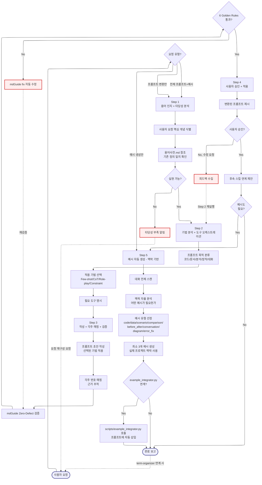

# PromptKit -- Navigator

> SYSTEM_NAVIGATOR 스타일 시각적 네비게이터
> 최종 갱신: 2026-04-11 (Tier-B Option A 세션 3 신규 생성)
> SKILL.md와 교차 참조 (이 파일은 SKILL.md의 시각화 계층)

---

## 0. 범례 + 사용법 {#범례--사용법}

### 상태 표시

| 표시 | 의미 |
|------|------|
| **[작동]** | 정상 작동 중 |
| **[부분]** | 일부만 작동 |
| **[미구현]** | 설계만 있고 구현 없음 |

### 다이어그램 규약

- ISO 5807:1985 표준 기호 준수
- Mermaid ELK 렌더러 + `securityLevel: loose`
- 점선 `-.->` = 피드백 루프 (재시도/복귀)
- `:::warning` = 에러/차단/실패 블럭
- `click NODE "#anchor"` = 블럭 상세 카드로 이동

### 스킬 메타

| 항목 | 값 |
|------|-----|
| 이름 | PromptKit |
| Tier | B |
| 커맨드 | 자동 트리거 (`프롬프트 만들어줘`, `프롬프트 변환`, `예시 만들어줘`, `예제 보여줘`, `ExampleChatGenerator`) |
| 프로세스 타입 | Linear Pipeline (5-Step) + Trigger 분기 (실행 범위 가변) |
| 설명 | 프롬프트 변환(Step 1-4) + 예시 자동 생성(Step 5) 통합 스킬. 요청 유형에 따라 전체 또는 일부만 실행 |

---

## 1. 전체 워크플로우 체계도 {#전체-체계도}

<!-- AUTO:DIAGRAM_MAIN:START -->

<!-- AUTO:DIAGRAM_MAIN:END -->

<strong>블럭 바로가기 (다이어그램 클릭 대안)</strong>

[진입](#node-start) · [요청 유형](#node-trigger) · [Step 1](#node-s1) · [개념 식별](#node-s1a) · [용어사전 참조](#node-s1b) · [타당성](#node-s1c) · [타당성 부족](#node-s1-reject) · [Step 2](#node-s2) · [목적 분류](#node-s2a) · [기법 선택](#node-s2b) · [도구 명시](#node-s2c) · [Step 3](#node-s3) · [초안 작성](#node-s3a) · [각주 매핑](#node-s3b) · [mdGuide 검증](#node-s3c) · [Rules 체크](#node-s3d) · [mdGuide fix](#node-s3-fix) · [Step 4](#node-s4) · [제시](#node-s4a) · [승인 체크](#node-s4b) · [피드백](#node-s4-back) · [후속 연계](#node-s4c) · [예시 필요?](#node-example-check) · [Step 5](#node-s5) · [대화 스캔](#node-s5a) · [맥락 분석](#node-s5b) · [유형 선정](#node-s5c) · [3개+ 생성](#node-s5d) · [integrator 연계](#node-s5e) · [스크립트 호출](#node-s5f) · [완료](#node-end)
· [**전체 블럭 카탈로그**](#block-catalog)

[맨 위로](#범례--사용법)

---

## 2. 블럭 상세 카탈로그 {#block-catalog}

블럭 카드 펼치기 (30개)

### 사용자 요청 진입 {#node-start}

| 항목 | 내용 |
|------|------|
| 소속 | 진입점 |
| 동기 | 모호한 자연어 요청을 구조화된 프롬프트로 변환하거나 맥락 기반 예시를 즉시 생성해야 할 때 |
| 내용 | 5가지 트리거 키워드 중 하나로 활성화 |
| 동작 방식 | 자동 트리거 키워드 매칭 |
| 상태 | [작동] |
| 관련 파일 | `.agents/skills/PromptKit/SKILL.md` |

[다이어그램으로 복귀](#전체-체계도)

### 요청 유형 분기 {#node-trigger}

| 항목 | 내용 |
|------|------|
| 소속 | 결정 블럭 (Decision, 실행 범위 결정) |
| 동기 | 3가지 요청 유형이 서로 다른 Step 조합으로 실행되어야 효율적 (불필요한 Step 실행 방지) |
| 내용 | 프롬프트 변환(Step 1-4) / 예시 생성(Step 5) / 전체(Step 1-5) |
| 동작 방식 | 트리거 키워드 매칭으로 실행 범위 결정 |
| 상태 | [작동] |
| 관련 파일 | SKILL.md |

[다이어그램으로 복귀](#전체-체계도)

### Step 1: 용어 인지 + 타당성 분석 {#node-s1}

| 항목 | 내용 |
|------|------|
| 소속 | Step 1 (Pre-processing) |
| 동기 | 모호한 요청을 바로 변환하면 잘못된 방향. 타당성 검증과 용어 일치 확인이 선행되어야 함 |
| 내용 | 핵심 개념 식별 → 용어사전 참조 → 실현 가능성 판단 |
| 동작 방식 | LLM 분석 + term-organizer 연계 |
| 상태 | [작동] |
| 관련 파일 | `docs/LogManagement/용어사전.md` |

[다이어그램으로 복귀](#전체-체계도)

### S1A: 핵심 개념 식별 {#node-s1a}

| 항목 | 내용 |
|------|------|
| 소속 | Step 1 Stage A |
| 동기 | 사용자 요청의 표면 단어가 아닌 실제 의도를 파악해야 정확한 변환 가능 |
| 내용 | 요청 텍스트에서 주요 명사/동사/목적어 추출 |
| 동작 방식 | 자연어 파싱 + 도메인 키워드 매칭 |
| 상태 | [작동] |
| 관련 파일 | SKILL.md |

[다이어그램으로 복귀](#전체-체계도)

### S1B: 용어사전 참조 {#node-s1b}

| 항목 | 내용 |
|------|------|
| 소속 | Step 1 Stage B |
| 동기 | 기존 등록 용어와 일치시켜야 프로젝트 일관성 유지. 신규 용어 발견 시 term-organizer 연계 트리거 |
| 내용 | `용어사전.md`를 읽어 식별된 개념과 매칭 |
| 동작 방식 | Read + 문자열 매칭 |
| 상태 | [작동] |
| 관련 파일 | `docs/LogManagement/용어사전.md` |

[다이어그램으로 복귀](#전체-체계도)

### S1C: 타당성 분기 {#node-s1c}

| 항목 | 내용 |
|------|------|
| 소속 | 결정 블럭 (Decision) |
| 동기 | 실현 불가능한 요청을 잘못 변환하면 사용자 시간 낭비 |
| 내용 | 실현 가능 → Step 2, 불가능 → Reject + 재구성 요청 |
| 동작 방식 | LLM 기반 가능성 판단 |
| 상태 | [작동] |
| 관련 파일 | 없음 |

[다이어그램으로 복귀](#전체-체계도)

### 타당성 부족 알림 (피드백 루프) {#node-s1-reject}

| 항목 | 내용 |
|------|------|
| 소속 | 피드백 루프 (Step 1 → Start) |
| 동기 | 조용한 종료 금지. 사용자에게 구체적인 요청 재구성 방향 제시 |
| 내용 | "요청이 너무 추상적입니다. 구체적 목표 + 예상 출력 형식 명시 필요" 등 가이드 |
| 동작 방식 | `-.->` 피드백 루프로 Start 재진입 |
| 상태 | [작동] |
| 관련 파일 | SKILL.md |

[다이어그램으로 복귀](#전체-체계도)

### Step 2: 기법 분석 + 도구 오케스트레이션 {#node-s2}

| 항목 | 내용 |
|------|------|
| 소속 | Step 2 (Design) |
| 동기 | 프롬프트 종류에 맞는 기법을 선택해야 성능 최적화 (Few-shot vs CoT vs Role-play 등) |
| 내용 | 목적 분류 → 기법 선택 → 도구 명시 |
| 동작 방식 | 분류 트리 기반 기법 매핑 |
| 상태 | [작동] |
| 관련 파일 | SKILL.md |

[다이어그램으로 복귀](#전체-체계도)

### S2A: 프롬프트 목적 분류 {#node-s2a}

| 항목 | 내용 |
|------|------|
| 소속 | Step 2 Stage A |
| 동기 | 5가지 목적(코드/문서/분석/창작/대화) 중 하나로 분류해야 기법 선택 가능 |
| 내용 | 요청 맥락에서 목적 도출 |
| 동작 방식 | 키워드 매칭 + 컨텍스트 분석 |
| 상태 | [작동] |
| 관련 파일 | 없음 |

[다이어그램으로 복귀](#전체-체계도)

### S2B: 기법 선택 {#node-s2b}

| 항목 | 내용 |
|------|------|
| 소속 | Step 2 Stage B (핵심) |
| 동기 | 각 목적에 적합한 프롬프트 기법을 선택해야 품질 보장 |
| 내용 | Few-shot / Chain-of-Thought / Role-play / Constraint 등에서 선택 |
| 동작 방식 | 목적 → 기법 매핑 테이블 참조 |
| 상태 | [작동] |
| 관련 파일 | SKILL.md |

[다이어그램으로 복귀](#전체-체계도)

### S2C: 필요 도구 명시 {#node-s2c}

| 항목 | 내용 |
|------|------|
| 소속 | Step 2 Stage C |
| 동기 | 프롬프트 내에 강제 사용 도구를 명시해야 LLM이 제대로 수행 가능 |
| 내용 | Read/Write/Bash/Grep/WebFetch 등 필요 도구 목록 작성 |
| 동작 방식 | 기법별 필수 도구 매핑 |
| 상태 | [작동] |
| 관련 파일 | 없음 |

[다이어그램으로 복귀](#전체-체계도)

### Step 3: 작성 + 각주 매핑 + 검증 {#node-s3}

| 항목 | 내용 |
|------|------|
| 소속 | Step 3 (Implementation) |
| 동기 | 프롬프트 초안을 작성하고 각 규칙의 근거를 각주로 매핑하여 추적 가능성 보장 |
| 내용 | 초안 작성 → 각주 매핑 → mdGuide 검증 |
| 동작 방식 | 순차 3 Stage + 재검증 루프 |
| 상태 | [작동] |
| 관련 파일 | `mdGuide` 스킬 |

[다이어그램으로 복귀](#전체-체계도)

### S3A: 프롬프트 초안 작성 {#node-s3a}

| 항목 | 내용 |
|------|------|
| 소속 | Step 3 Stage A |
| 동기 | Step 2에서 선택된 기법을 실제 프롬프트 텍스트로 구현 |
| 내용 | Few-shot 예시 삽입, Role 정의, Constraint 명시 등 |
| 동작 방식 | 템플릿 + 맥락 주입 |
| 상태 | [작동] |
| 관련 파일 | 없음 |

[다이어그램으로 복귀](#전체-체계도)

### S3B: 각주 매핑 {#node-s3b}

| 항목 | 내용 |
|------|------|
| 소속 | Step 3 Stage B |
| 동기 | 프롬프트의 각 규칙/지침이 왜 포함됐는지 추적 가능해야 수정/개선 가능 |
| 내용 | `[^1]`, `[^2]` 등 각주 번호로 근거 매핑 |
| 동작 방식 | Markdown 각주 문법 |
| 상태 | [작동] |
| 관련 파일 | SKILL.md |

[다이어그램으로 복귀](#전체-체계도)

### S3C: mdGuide Zero-Defect 검증 {#node-s3c}

| 항목 | 내용 |
|------|------|
| 소속 | Step 3 Stage C (품질 게이트) |
| 동기 | 프롬프트는 결국 Markdown 문서. 6 Golden Rules 통과해야 깨끗한 렌더링 |
| 내용 | mdGuide review 자동 실행 |
| 동작 방식 | mdGuide 스킬 호출 |
| 상태 | [작동] |
| 관련 파일 | `mdGuide` 스킬 |

[다이어그램으로 복귀](#전체-체계도)

### S3D: Rules 통과 분기 {#node-s3d}

| 항목 | 내용 |
|------|------|
| 소속 | 결정 블럭 (Decision) |
| 동기 | 검증 실패 시 자동 수정 후 재검증해야 Zero-Defect 보장 |
| 내용 | 오류 0 → Step 4, 오류 ≥ 1 → mdGuide fix 자동 수정 |
| 동작 방식 | mdGuide review 결과 확인 |
| 상태 | [작동] |
| 관련 파일 | 없음 |

[다이어그램으로 복귀](#전체-체계도)

### S3Fix: mdGuide 자동 수정 (피드백 루프) {#node-s3-fix}

| 항목 | 내용 |
|------|------|
| 소속 | 피드백 루프 (Step 3 재검증) |
| 동기 | 수동 수정보다 자동 수정이 빠름. 5개 Golden Rules는 자동 가능 |
| 내용 | mdGuide fix 호출 후 재검증 (S3C로 복귀) |
| 동작 방식 | `-.->` 피드백 루프 |
| 상태 | [작동] |
| 관련 파일 | `mdGuide` 스킬 |

[다이어그램으로 복귀](#전체-체계도)

### Step 4: 사용자 승인 + 적용 {#node-s4}

| 항목 | 내용 |
|------|------|
| 소속 | Step 4 (Approval Gate) |
| 동기 | 프롬프트 변경은 영향이 크므로 반드시 사용자 명시 승인 필요 |
| 내용 | 제시 → 승인 → 후속 연계 |
| 동작 방식 | 대화형 확인 |
| 상태 | [작동] |
| 관련 파일 | SKILL.md |

[다이어그램으로 복귀](#전체-체계도)

### S4A: 변환된 프롬프트 제시 {#node-s4a}

| 항목 | 내용 |
|------|------|
| 소속 | Step 4 Stage A |
| 동기 | 사용자가 전체 내용을 파악한 후 승인할 수 있도록 명확히 표시 |
| 내용 | Markdown 코드 블록 + 각주 포함 제시 |
| 동작 방식 | 포맷 출력 |
| 상태 | [작동] |
| 관련 파일 | 없음 |

[다이어그램으로 복귀](#전체-체계도)

### S4B: 승인 분기 {#node-s4b}

| 항목 | 내용 |
|------|------|
| 소속 | 결정 블럭 (Decision, 최종 승인) |
| 동기 | Yes → 후속 연계, No → Step 2로 복귀해서 재설계 |
| 내용 | 사용자 Yes/No 응답 파싱 |
| 동작 방식 | 키워드 매칭 |
| 상태 | [작동] |
| 관련 파일 | 없음 |

[다이어그램으로 복귀](#전체-체계도)

### S4Back: 피드백 수집 (재설계 루프) {#node-s4-back}

| 항목 | 내용 |
|------|------|
| 소속 | 피드백 루프 (Step 4 → Step 2) |
| 동기 | 거부 사유를 반영하여 Step 2부터 재실행. Step 1은 타당성이므로 재실행 불필요 |
| 내용 | 사용자 피드백 수집 → 기법 재선택 힌트 |
| 동작 방식 | `-.->` 피드백 루프로 S2 재진입 |
| 상태 | [작동] |
| 관련 파일 | 없음 |

[다이어그램으로 복귀](#전체-체계도)

### S4C: 후속 스킬 연계 제안 {#node-s4c}

| 항목 | 내용 |
|------|------|
| 소속 | Step 4 Stage C |
| 동기 | 변환된 프롬프트를 다른 스킬과 연계할 수 있도록 제안 |
| 내용 | "이 프롬프트를 llm-wiki ingest, PaperResearch 등과 연계 가능" 제안 |
| 동작 방식 | 스킬 카탈로그 기반 추천 |
| 상태 | [작동] |
| 관련 파일 | `docs/support/skill-catalog.md` |

[다이어그램으로 복귀](#전체-체계도)

### 예시 필요 여부 분기 {#node-example-check}

| 항목 | 내용 |
|------|------|
| 소속 | 결정 블럭 (Decision, Step 5 진입 분기) |
| 동기 | 프롬프트만 필요한 경우와 예시까지 필요한 경우 분리. 요청 유형이 "예시 생성만"이면 초기에 Trigger에서 바로 Step 5로 진입 |
| 내용 | 트리거 유형이 "전체" 또는 "예시 요청" → Step 5, "변환만" → End |
| 동작 방식 | 초기 Trigger 값 재확인 |
| 상태 | [작동] |
| 관련 파일 | 없음 |

[다이어그램으로 복귀](#전체-체계도)

### Step 5: 예시 자동 생성 (맥락 기반) {#node-s5}

| 항목 | 내용 |
|------|------|
| 소속 | Step 5 (Example Generation) |
| 동기 | 프롬프트만으로는 사용자가 사용법을 파악하기 어려움. 실제 예시가 있어야 즉시 활용 가능 |
| 내용 | 대화 스캔 → 맥락 분석 → 유형 선정 → 3개+ 생성 |
| 동작 방식 | 자율 분석 (사용자에게 묻지 않음) |
| 상태 | [작동] |
| 관련 파일 | `scripts/example_integrator.py` |

[다이어그램으로 복귀](#전체-체계도)

### S5A: 대화 전체 스캔 {#node-s5a}

| 항목 | 내용 |
|------|------|
| 소속 | Step 5 Stage A |
| 동기 | 현재 대화의 프로젝트/도메인 맥락을 파악해야 관련 예시 생성 가능 |
| 내용 | 세션 컨텍스트 전체 읽기 |
| 동작 방식 | 대화 메모리 접근 |
| 상태 | [작동] |
| 관련 파일 | 없음 |

[다이어그램으로 복귀](#전체-체계도)

### S5B: 맥락 자율 분석 {#node-s5b}

| 항목 | 내용 |
|------|------|
| 소속 | Step 5 Stage B (핵심 원칙) |
| 동기 | 사용자에게 "어떤 예시가 필요하세요?" 묻지 않음. AI가 맥락을 분석해서 자율 결정 |
| 내용 | 대화 내용에서 "이 사용자에게 가장 유용한 예시는?" 판단 |
| 동작 방식 | LLM 맥락 추론 |
| 상태 | [작동] |
| 관련 파일 | SKILL.md |

[다이어그램으로 복귀](#전체-체계도)

### S5C: 예시 유형 선정 {#node-s5c}

| 항목 | 내용 |
|------|------|
| 소속 | Step 5 Stage C |
| 동기 | 8가지 예시 유형 중 맥락에 맞는 것 선택 (code/data/scenario/comparison/before_after/conversation/diagram/error_fix) |
| 내용 | 복수 유형 선택 가능 (예: code + scenario) |
| 동작 방식 | 유형별 적합도 점수 계산 |
| 상태 | [작동] |
| 관련 파일 | SKILL.md |

[다이어그램으로 복귀](#전체-체계도)

### S5D: 최소 3개 예시 생성 {#node-s5d}

| 항목 | 내용 |
|------|------|
| 소속 | Step 5 Stage D (핵심 규칙) |
| 동기 | 예시 1개는 특수 케이스, 3개 이상이어야 일반화 패턴 파악 가능 |
| 내용 | 최소 3개 (맥락이 명확히 적은 수를 요구하면 예외) |
| 동작 방식 | 유형별 템플릿 + 실제 프로젝트 맥락 주입 |
| 상태 | [작동] |
| 관련 파일 | SKILL.md |

[다이어그램으로 복귀](#전체-체계도)

### S5E: example_integrator 연계 분기 {#node-s5e}

| 항목 | 내용 |
|------|------|
| 소속 | 결정 블럭 (Decision) |
| 동기 | 프롬프트에 예시를 삽입할지 별도 출력할지 선택 |
| 내용 | 프롬프트 변환 결과 존재 → integrator 연계, 없으면 별도 출력 |
| 동작 방식 | Step 1-4 결과 체크 |
| 상태 | [작동] |
| 관련 파일 | 없음 |

[다이어그램으로 복귀](#전체-체계도)

### S5F: example_integrator.py 호출 {#node-s5f}

| 항목 | 내용 |
|------|------|
| 소속 | Step 5 Stage F (선택적) |
| 동기 | 프롬프트에 예시를 자동 삽입하면 사용자가 copy-paste 없이 완성본 획득 |
| 내용 | `scripts/example_integrator.py --context [대화] --type [유형]` |
| 동작 방식 | Python subprocess (node 우선 확인, IMP-002) |
| 상태 | [작동] |
| 관련 파일 | `scripts/example_integrator.py` |

[다이어그램으로 복귀](#전체-체계도)

### 완료 보고 {#node-end}

| 항목 | 내용 |
|------|------|
| 소속 | 공통 종료점 |
| 동기 | 3가지 트리거 유형 모두 이 지점으로 수렴 |
| 내용 | 변환된 프롬프트 / 생성된 예시 / 둘 다 중 선택 출력 |
| 동작 방식 | Markdown 요약 |
| 상태 | [작동] |
| 관련 파일 | 없음 |

[다이어그램으로 복귀](#전체-체계도)

[맨 위로](#범례--사용법)

---

## 3. 5-Step + 트리거 분기 매트릭스

| 요청 유형 | Step 1 | Step 2 | Step 3 | Step 4 | Step 5 |
|:---|:---:|:---:|:---:|:---:|:---:|
| 프롬프트 변환만 | O | O | O | O | -- |
| 예시 생성만 | -- | -- | -- | -- | O |
| 전체 (프롬프트 + 예시) | O | O | O | O | O |

---

## 4. 예시 유형 8종

| 유형 | 설명 | 형식 |
|:---|:---|:---|
| `code` | 코드 스니펫 / 구현 예시 | 언어 지정 코드 블록 |
| `data` | 샘플 데이터 (JSON/CSV/표) | 표 또는 코드 블록 |
| `scenario` | 실제 사용 사례 서술 | 번호 매긴 단계 |
| `comparison` | 대안 비교 | 표 (장단점 포함) |
| `before_after` | 변환 전후 비교 | diff 또는 쌍 블록 |
| `conversation` | 대화/상호작용 예시 | 인용 대화 형식 |
| `diagram` | 시각적 구조 | Mermaid 또는 ASCII |
| `error_fix` | 문제 → 해결 쌍 | 문제 블록 + 해결 블록 |

---

## 5. 사용 시나리오

### 시나리오 1 -- 프롬프트 변환 + 예시 (전체)

> **상황**: "ESG 보고서 작성용 프롬프트 만들어줘" 요청

**흐름**: Trigger(전체) → S1(타당성 OK) → S2(문서 작성 + CoT) → S3(초안 + 각주 + mdGuide 통과) → S4(승인) → S5(code + scenario + before_after 3개 예시 자동) → End

---

### 시나리오 2 -- 프롬프트 변환만

> **상황**: "이 요청을 구조화된 프롬프트로 변환해줘" (예시 언급 없음)

**흐름**: Trigger(변환만) → S1 → S2 → S3 → S4 → ExampleCheck(No) → End. Step 5 스킵.

---

### 시나리오 3 -- 예시 생성만

> **상황**: "지금까지 대화한 내용에 예시 3개 만들어줘"

**흐름**: Trigger(예시만) → S5A → S5B → S5C → S5D → End. Step 1-4 스킵.

---

### 시나리오 4 -- 타당성 부족 거부

> **상황**: "AI로 미래 예측하는 프롬프트" (너무 모호)

**흐름**: S1A → S1B → S1C(No) → S1Reject → Start 재진입. 사용자에게 "구체적 목표 + 예상 출력 명시 필요" 가이드.

---

### 시나리오 5 -- mdGuide 자동 재검증

> **상황**: Step 3에서 프롬프트에 MD009(줄 끝 공백) 발견

**흐름**: S3C(mdGuide review) → S3D(오류 발견) → S3Fix(mdGuide fix) → `-.->` S3C 재검증 → S3D(통과) → S4. 사용자 개입 없이 자동 해결.

---

[맨 위로](#범례--사용법)

---

## 6. 제약사항 및 공통 주의사항

### 예시 생성 원칙

- **자율 결정**: 사용자에게 "어떤 예시가 필요하세요?" 묻지 않음 (SKILL.md 명시)
- **최소 3개**: 특수 예외만 허용
- **실제 맥락**: `foo/bar/baz` placeholder 금지
- **8가지 유형**: 이외 유형 생성 금지

### 프롬프트 변환 원칙

- **타당성 우선**: Step 1 실패 시 Step 2-5 진입 금지
- **mdGuide 필수**: Step 3에서 반드시 Zero-Defect 검증
- **사용자 승인 필수**: Step 4에서 명시 승인 없이 적용 금지

### 공통 금지 사항

- 이모티콘 사용 금지 (PostToolUse 훅 차단)
- 절대경로 하드코딩 금지
- Python subprocess: `errors="replace"` 필수 (IMP-002, AER-005)

### 각인 참조

- **IMP-002**: Python PATH 미보장 → example_integrator.py 호출 시 node 우선
- **IMP-007**: 완료 체크리스트에서 프롬프트 정제 단계가 이 스킬 활용

### 연계 스킬

| 스킬 | 연계 방식 |
|:---|:---|
| mdGuide | Step 3 Zero-Defect 검증 |
| term-organizer | Step 1 용어사전 참조 |
| 후속 제안 | Step 4 사용자 승인 후 연계 스킬 추천 |

[맨 위로](#범례--사용법)

---

## 7. 갱신 이력

| 날짜 | 변경 | 트리거 |
|------|------|--------|
| 2026-04-11 | Tier-B Navigator 신규 생성 (SYSTEM_NAVIGATOR 스타일) | Option A 세션 3 |

[맨 위로](#범례--사용법)
