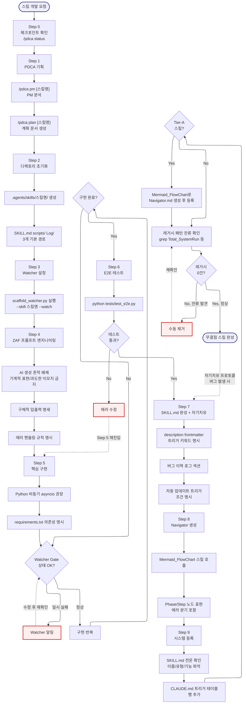

# ServiceMaker -- Navigator

> SYSTEM_NAVIGATOR 스타일 시각적 네비게이터
> 최종 갱신: 2026-04-11 (Tier-B Option A 세션 3 신규 생성)
> SKILL.md와 교차 참조 (이 파일은 SKILL.md의 시각화 계층)

---

## 0. 범례 + 사용법 {#범례--사용법}

### 상태 표시

| 표시 | 의미 |
|------|------|
| **[작동]** | 정상 작동 중 |
| **[부분]** | 일부만 작동 |
| **[미구현]** | 설계만 있고 구현 없음 |

### 다이어그램 규약

- ISO 5807:1985 표준 기호 준수
- Mermaid ELK 렌더러 + `securityLevel: loose`
- 점선 `-.->` = 피드백 루프 (재시도/복귀)
- `:::warning` = 에러/차단/실패 블럭
- `click NODE "#anchor"` = 블럭 상세 카드로 이동

### 스킬 메타

| 항목 | 값 |
|------|-----|
| 이름 | ServiceMaker |
| Tier | B |
| 커맨드 | 자동 트리거 (`스킬 만들어줘`, `ServiceMaker`, `새 기능 개발`) |
| 프로세스 타입 | Linear Pipeline (9-Step) + Watcher Gate (Step 5 중 반복) |
| 설명 | 무결점 스킬 빌더. 9단계 표준 시퀀스(Step 0-9) 강제로 새 스킬 개발. Step 순서 절대 준수, Watcher Gate로 Step 5 구현 상태 감시 |

---

## 1. 전체 워크플로우 체계도 {#전체-체계도}

<!-- AUTO:DIAGRAM_MAIN:START -->

<!-- AUTO:DIAGRAM_MAIN:END -->

<strong>블럭 바로가기 (다이어그램 클릭 대안)</strong>

[진입](#node-start) · [Step 0](#node-s0) · [Step 1](#node-s1) · [PM](#node-s1a) · [Plan](#node-s1b) · [Step 2](#node-s2) · [디렉토리](#node-s2a) · [기본 파일](#node-s2b) · [Step 3](#node-s3) · [Watcher 실행](#node-s3a) · [Step 4](#node-s4) · [ZAF 원칙](#node-s4a) · [입출력 명세](#node-s4b) · [에러 핸들링](#node-s4c) · [Step 5](#node-s5) · [asyncio](#node-s5a) · [requirements](#node-s5b) · [Watcher Gate](#node-watcher-gate) · [Watcher Alert](#node-watcher-alert) · [구현 반복](#node-s5c) · [완료 체크](#node-s5-done) · [Step 6](#node-s6) · [E2E 실행](#node-s6a) · [통과 체크](#node-s6b) · [에러 수정](#node-s6-fix) · [Step 7](#node-s7) · [frontmatter](#node-s7a) · [버그 이력](#node-s7b) · [자동 트리거](#node-s7c) · [Step 8](#node-s8) · [Mermaid 호출](#node-s8a) · [노드 표현](#node-s8b) · [Step 9](#node-s9) · [SKILL 확인](#node-s9a) · [테이블 추가](#node-s9b) · [Tier-A](#node-s9c) · [Navigator 생성](#node-s9d) · [레거시 확인](#node-s9e) · [0건 체크](#node-s9f) · [수동 제거](#node-s9-fix) · [완성](#node-end)
· [**전체 블럭 카탈로그**](#block-catalog)

[맨 위로](#범례--사용법)

---

## 2. 블럭 상세 카탈로그 {#block-catalog}

블럭 카드 펼치기 (40개)

### 스킬 개발 요청 진입 {#node-start}

| 항목 | 내용 |
|------|------|
| 소속 | 진입점 |
| 동기 | 무작위 스킬 개발은 결함 많음. 9단계 표준 시퀀스 강제로 무결점 품질 보장 |
| 내용 | 트리거 키워드 감지 또는 사용자 명시 호출 |
| 동작 방식 | 자동 트리거 키워드 매칭 |
| 상태 | [작동] |
| 관련 파일 | `.agents/skills/ServiceMaker/SKILL.md` |

[다이어그램으로 복귀](#전체-체계도)

### Step 0: 체크포인트 확인 {#node-s0}

| 항목 | 내용 |
|------|------|
| 소속 | Step 0 (Pre-flight) |
| 동기 | 현재 세션 상태를 스냅샷해야 개발 중단 시 복구 가능 |
| 내용 | `/pdca status` 실행하여 bkit PDCA 상태 확인 |
| 동작 방식 | pdca 스킬 호출 |
| 상태 | [작동] |
| 관련 파일 | `.agents/skills/pdca/` |

[다이어그램으로 복귀](#전체-체계도)

### Step 1: PDCA 기획 {#node-s1}

| 항목 | 내용 |
|------|------|
| 소속 | Step 1 (Plan) |
| 동기 | 구현 전 PM 분석 + 계획 문서 생성으로 요구사항 명확화 |
| 내용 | pm 분석 → plan 문서 생성 2 스테이지 |
| 동작 방식 | pdca 스킬 위임 |
| 상태 | [작동] |
| 관련 파일 | `docs/01-plan/` |

[다이어그램으로 복귀](#전체-체계도)

### S1A: PM 분석 {#node-s1a}

| 항목 | 내용 |
|------|------|
| 소속 | Step 1 Stage A |
| 동기 | Product Manager 관점에서 목표/범위/성공 기준 명확화 |
| 내용 | `/pdca pm [스킬명]` |
| 동작 방식 | pdca pm 커맨드 실행 |
| 상태 | [작동] |
| 관련 파일 | pdca 스킬 |

[다이어그램으로 복귀](#전체-체계도)

### S1B: 계획 문서 생성 {#node-s1b}

| 항목 | 내용 |
|------|------|
| 소속 | Step 1 Stage B |
| 동기 | 구현 전 계획이 문서화되어야 사용자 피드백 가능 |
| 내용 | `/pdca plan [스킬명]` → `docs/01-plan/` 문서 생성 |
| 동작 방식 | pdca plan 커맨드 실행 |
| 상태 | [작동] |
| 관련 파일 | `docs/01-plan/` |

[다이어그램으로 복귀](#전체-체계도)

### Step 2: 디렉토리 초기화 {#node-s2}

| 항목 | 내용 |
|------|------|
| 소속 | Step 2 (Scaffold) |
| 동기 | 표준 디렉토리 구조 없이 시작하면 각 스킬마다 불일치 |
| 내용 | `.agents/skills/[스킬명]/` + SKILL.md + scripts/ + Log/ |
| 동작 방식 | mkdir + touch |
| 상태 | [작동] |
| 관련 파일 | `.agents/skills/` |

[다이어그램으로 복귀](#전체-체계도)

### S2A: 디렉토리 생성 {#node-s2a}

| 항목 | 내용 |
|------|------|
| 소속 | Step 2 Stage A |
| 동기 | 스킬 루트 디렉토리 생성 |
| 내용 | `.agents/skills/[스킬명]/` |
| 동작 방식 | mkdir -p |
| 상태 | [작동] |
| 관련 파일 | 대상 디렉토리 |

[다이어그램으로 복귀](#전체-체계도)

### S2B: 기본 파일 구조 {#node-s2b}

| 항목 | 내용 |
|------|------|
| 소속 | Step 2 Stage B |
| 동기 | SKILL.md(필수) + scripts/(선택) + Log/(버그 이력) 3개 기본 경로 |
| 내용 | 빈 SKILL.md + scripts/ 디렉토리 + Log/ 디렉토리 |
| 동작 방식 | touch + mkdir |
| 상태 | [작동] |
| 관련 파일 | SKILL.md, scripts/, Log/ |

[다이어그램으로 복귀](#전체-체계도)

### Step 3: Watcher 설정 {#node-s3}

| 항목 | 내용 |
|------|------|
| 소속 | Step 3 (Observe) |
| 동기 | 구현 중 파일 변경을 실시간 감시해야 오류 즉시 발견 |
| 내용 | scaffold_watcher.py 실행 |
| 동작 방식 | Python 백그라운드 프로세스 |
| 상태 | [작동] |
| 관련 파일 | `scripts/scaffold_watcher.py` |

[다이어그램으로 복귀](#전체-체계도)

### S3A: Watcher 실행 {#node-s3a}

| 항목 | 내용 |
|------|------|
| 소속 | Step 3 Stage A |
| 동기 | --watch 모드로 지속 감시 |
| 내용 | `python scripts/scaffold_watcher.py --skill [스킬명] --watch` |
| 동작 방식 | 백그라운드 실행 |
| 상태 | [작동] |
| 관련 파일 | `scripts/scaffold_watcher.py` |

[다이어그램으로 복귀](#전체-체계도)

### Step 4: ZAF 프롬프트 엔지니어링 {#node-s4}

| 항목 | 내용 |
|------|------|
| 소속 | Step 4 (Design) |
| 동기 | Zero-AI Footprint 원칙으로 AI 생성 흔적 없는 자연스러운 프롬프트 설계 |
| 내용 | AI 흔적 배제 + 입출력 명세 + 에러 핸들링 3 stage |
| 동작 방식 | 프롬프트 작성 가이드라인 준수 |
| 상태 | [작동] |
| 관련 파일 | SKILL.md |

[다이어그램으로 복귀](#전체-체계도)

### S4A: AI 생성 흔적 배제 {#node-s4a}

| 항목 | 내용 |
|------|------|
| 소속 | Step 4 Stage A (핵심 원칙) |
| 동기 | 기계적 표현, 과도한 이모지 등은 AI 흔적이므로 제거해야 자연스러움 |
| 내용 | "확실히", "분명히" 등 기계적 강조 금지, 이모티콘 금지 |
| 동작 방식 | 프롬프트 리뷰 |
| 상태 | [작동] |
| 관련 파일 | SKILL.md |

[다이어그램으로 복귀](#전체-체계도)

### S4B: 입출력 명세 {#node-s4b}

| 항목 | 내용 |
|------|------|
| 소속 | Step 4 Stage B |
| 동기 | 입력 형식과 출력 형식이 명시되어야 AI가 일관된 동작 |
| 내용 | 예: 입력 = `[파일 경로]`, 출력 = `Markdown 보고서` |
| 동작 방식 | SKILL.md 명세 섹션 작성 |
| 상태 | [작동] |
| 관련 파일 | SKILL.md |

[다이어그램으로 복귀](#전체-체계도)

### S4C: 에러 핸들링 규칙 {#node-s4c}

| 항목 | 내용 |
|------|------|
| 소속 | Step 4 Stage C |
| 동기 | 실패 시나리오를 사전 명시해야 AER 연계 가능 |
| 내용 | "파일 없음 → 경로 재요청", "API 실패 → 3회 재시도" 등 |
| 동작 방식 | SKILL.md 에러 처리 섹션 |
| 상태 | [작동] |
| 관련 파일 | SKILL.md |

[다이어그램으로 복귀](#전체-체계도)

### Step 5: 핵심 구현 {#node-s5}

| 항목 | 내용 |
|------|------|
| 소속 | Step 5 (Implement, 가장 긴 단계) |
| 동기 | ZAF 설계를 실제 코드로 구현. Watcher가 실시간 검증 |
| 내용 | asyncio 비동기 패턴 + requirements.txt + Watcher Gate 반복 |
| 동작 방식 | Python 구현 + Watcher 통과 반복 |
| 상태 | [작동] |
| 관련 파일 | `scripts/` |

[다이어그램으로 복귀](#전체-체계도)

### S5A: asyncio 비동기 권장 {#node-s5a}

| 항목 | 내용 |
|------|------|
| 소속 | Step 5 Stage A |
| 동기 | I/O 바운드 작업은 asyncio로 처리해야 성능 최적 |
| 내용 | `async def` + `await` 패턴 사용 |
| 동작 방식 | Python asyncio 라이브러리 |
| 상태 | [작동] |
| 관련 파일 | 없음 |

[다이어그램으로 복귀](#전체-체계도)

### S5B: requirements.txt {#node-s5b}

| 항목 | 내용 |
|------|------|
| 소속 | Step 5 Stage B |
| 동기 | 의존성 명시 없으면 다른 환경에서 재현 불가 |
| 내용 | `scripts/requirements.txt`에 버전 고정 |
| 동작 방식 | pip freeze 또는 수동 작성 |
| 상태 | [작동] |
| 관련 파일 | `scripts/requirements.txt` |

[다이어그램으로 복귀](#전체-체계도)

### Watcher Gate (반복 확인) {#node-watcher-gate}

| 항목 | 내용 |
|------|------|
| 소속 | Step 5 반복 체크 (핵심 메커니즘) |
| 동기 | Step 5 중 수시로 Watcher 상태를 확인해야 오류 누적 방지 |
| 내용 | Watcher 프로세스 상태 + 최근 변경 이벤트 로그 확인 |
| 동작 방식 | Watcher 로그 tail |
| 상태 | [작동] |
| 관련 파일 | Watcher 로그 |

[다이어그램으로 복귀](#전체-체계도)

### Watcher Alert (경고) {#node-watcher-alert}

| 항목 | 내용 |
|------|------|
| 소속 | Watcher Gate 에러 경로 |
| 동기 | Watcher가 문제 감지 시 즉시 알림. 무시하고 계속 구현 금지 |
| 내용 | 알림 내용 확인 후 수정 |
| 동작 방식 | `-.->` 피드백 루프로 WatcherGate 재확인 |
| 상태 | [작동] |
| 관련 파일 | 없음 |

[다이어그램으로 복귀](#전체-체계도)

### S5C: 구현 반복 {#node-s5c}

| 항목 | 내용 |
|------|------|
| 소속 | Step 5 메인 루프 |
| 동기 | 구현은 한 번에 완료되지 않고 Watcher 통과를 반복하며 점진적 완성 |
| 내용 | 코드 작성 → Watcher 확인 → 수정 반복 |
| 동작 방식 | 반복 루프 |
| 상태 | [작동] |
| 관련 파일 | 없음 |

[다이어그램으로 복귀](#전체-체계도)

### S5 구현 완료 체크 {#node-s5-done}

| 항목 | 내용 |
|------|------|
| 소속 | 결정 블럭 (Decision) |
| 동기 | 모든 기능이 구현됐는지 확인 후 Step 6 진입 |
| 내용 | 기능 체크리스트 완료 → Step 6, 미완료 → WatcherGate로 복귀 |
| 동작 방식 | 수동 체크리스트 |
| 상태 | [작동] |
| 관련 파일 | 없음 |

[다이어그램으로 복귀](#전체-체계도)

### Step 6: E2E 테스트 {#node-s6}

| 항목 | 내용 |
|------|------|
| 소속 | Step 6 (Verify) |
| 동기 | 유닛 테스트가 아닌 E2E로 실제 사용 시나리오 검증 |
| 내용 | `python tests/test_e2e.py` 실행 |
| 동작 방식 | pytest 또는 직접 실행 |
| 상태 | [작동] |
| 관련 파일 | `tests/test_e2e.py` |

[다이어그램으로 복귀](#전체-체계도)

### S6A: E2E 실행 {#node-s6a}

| 항목 | 내용 |
|------|------|
| 소속 | Step 6 Stage A |
| 동기 | 전체 파이프라인 통합 검증 |
| 내용 | `python tests/test_e2e.py` |
| 동작 방식 | subprocess 실행 (IMP-002 node 우선) |
| 상태 | [작동] |
| 관련 파일 | `tests/test_e2e.py` |

[다이어그램으로 복귀](#전체-체계도)

### S6B: 통과 체크 {#node-s6b}

| 항목 | 내용 |
|------|------|
| 소속 | 결정 블럭 (Decision, 품질 게이트) |
| 동기 | E2E 실패 시 Step 5로 복귀해서 재구현 |
| 내용 | 모든 테스트 통과 → Step 7, 실패 → Step 5 복귀 |
| 동작 방식 | exit code 확인 |
| 상태 | [작동] |
| 관련 파일 | 없음 |

[다이어그램으로 복귀](#전체-체계도)

### S6Fix: 에러 수정 (피드백 루프) {#node-s6-fix}

| 항목 | 내용 |
|------|------|
| 소속 | 피드백 루프 (Step 6 → Step 5) |
| 동기 | E2E 실패 원인 수정 후 Step 5부터 재시작 (Step 0-4는 재실행 불필요) |
| 내용 | 에러 로그 분석 → 구현 수정 → Step 5 재진입 |
| 동작 방식 | `-.->` 피드백 루프 |
| 상태 | [작동] |
| 관련 파일 | 없음 |

[다이어그램으로 복귀](#전체-체계도)

### Step 7: SKILL.md 완성 + 자기치유 {#node-s7}

| 항목 | 내용 |
|------|------|
| 소속 | Step 7 (Finalize SKILL.md) |
| 동기 | SKILL.md가 완전해야 트리거 감지 + 사용자 이해 가능 |
| 내용 | frontmatter + 버그 이력 + 자동 트리거 3 요소 |
| 동작 방식 | SKILL.md 작성/보완 |
| 상태 | [작동] |
| 관련 파일 | SKILL.md |

[다이어그램으로 복귀](#전체-체계도)

### S7A: description frontmatter {#node-s7a}

| 항목 | 내용 |
|------|------|
| 소속 | Step 7 Stage A |
| 동기 | description의 트리거 키워드로 자동 활성화 |
| 내용 | `description: "... '키워드1', '키워드2' 시 트리거됩니다."` |
| 동작 방식 | YAML frontmatter 작성 |
| 상태 | [작동] |
| 관련 파일 | SKILL.md |

[다이어그램으로 복귀](#전체-체계도)

### S7B: 버그 이력 로그 섹션 {#node-s7b}

| 항목 | 내용 |
|------|------|
| 소속 | Step 7 Stage B |
| 동기 | 개발 중 발견한 버그를 즉시 기록해야 auto-error-recovery Phase 4 연계 가능 |
| 내용 | `## 버그 이력` 섹션 생성 |
| 동작 방식 | Markdown 섹션 추가 |
| 상태 | [작동] |
| 관련 파일 | SKILL.md |

[다이어그램으로 복귀](#전체-체계도)

### S7C: 자동 업데이트 트리거 {#node-s7c}

| 항목 | 내용 |
|------|------|
| 소속 | Step 7 Stage C |
| 동기 | 자동 트리거 조건 명시로 SessionStart 훅 등과 연계 |
| 내용 | `hooks:` frontmatter 또는 SKILL.md 조건 섹션 |
| 동작 방식 | YAML + 조건 서술 |
| 상태 | [작동] |
| 관련 파일 | SKILL.md |

[다이어그램으로 복귀](#전체-체계도)

### Step 8: Navigator 생성 {#node-s8}

| 항목 | 내용 |
|------|------|
| 소속 | Step 8 (Visualize) |
| 동기 | 복잡한 스킬은 시각화가 있어야 사용자 이해도 향상 |
| 내용 | Mermaid_FlowChart 스킬 호출 → Navigator.md 생성 |
| 동작 방식 | Mermaid_FlowChart 스킬 위임 |
| 상태 | [작동] |
| 관련 파일 | `Mermaid_FlowChart` 스킬 |

[다이어그램으로 복귀](#전체-체계도)

### S8A: Mermaid_FlowChart 호출 {#node-s8a}

| 항목 | 내용 |
|------|------|
| 소속 | Step 8 Stage A |
| 동기 | 무결점 Mermaid 다이어그램 생성 자동화 |
| 내용 | 스킬 호출 시 Phase/Step 정보 전달 |
| 동작 방식 | Skill 도구 호출 |
| 상태 | [작동] |
| 관련 파일 | `Mermaid_FlowChart` |

[다이어그램으로 복귀](#전체-체계도)

### S8B: 노드 표현 (에러 분기 포함) {#node-s8b}

| 항목 | 내용 |
|------|------|
| 소속 | Step 8 Stage B |
| 동기 | Happy path만 있으면 실제 디버깅 시 부족. 에러 분기 필수 |
| 내용 | 각 Phase/Step을 노드로, 에러 경로를 `:::warning` 분기로 |
| 동작 방식 | Mermaid_FlowChart 규칙 준수 |
| 상태 | [작동] |
| 관련 파일 | Navigator.md |

[다이어그램으로 복귀](#전체-체계도)

### Step 9: 시스템 등록 {#node-s9}

| 항목 | 내용 |
|------|------|
| 소속 | Step 9 (Register, 최종) |
| 동기 | CLAUDE.md에 등록되지 않으면 시스템이 스킬을 인식 못함 |
| 내용 | CLAUDE.md 트리거 테이블 직접 갱신 + 레거시 패턴 확인 |
| 동작 방식 | 수동 Edit + grep 검증 |
| 상태 | [작동] |
| 관련 파일 | `CLAUDE.md` |

[다이어그램으로 복귀](#전체-체계도)

### S9A: SKILL.md 전문 확인 {#node-s9a}

| 항목 | 내용 |
|------|------|
| 소속 | Step 9 Stage A |
| 동기 | 등록 전 SKILL.md의 이름/유형/기능 목록을 재확인하여 정보 정확성 보장 |
| 내용 | SKILL.md Read 후 핵심 정보 추출 |
| 동작 방식 | Read 도구 |
| 상태 | [작동] |
| 관련 파일 | SKILL.md |

[다이어그램으로 복귀](#전체-체계도)

### S9B: CLAUDE.md 트리거 테이블 추가 {#node-s9b}

| 항목 | 내용 |
|------|------|
| 소속 | Step 9 Stage B |
| 동기 | 트리거 테이블이 시스템의 스킬 라우팅 기반 |
| 내용 | `| 트리거 키워드 | 스킬명 | 설명 |` 행 추가 |
| 동작 방식 | CLAUDE.md Edit |
| 상태 | [작동] |
| 관련 파일 | `CLAUDE.md` |

[다이어그램으로 복귀](#전체-체계도)

### S9C: Tier-A 스킬 분기 {#node-s9c}

| 항목 | 내용 |
|------|------|
| 소속 | 결정 블럭 (Decision) |
| 동기 | Tier-A 스킬은 Navigator가 필수이므로 추가 생성 경로 |
| 내용 | Tier-A → Navigator 생성 후 등록, Tier-B/C → 바로 레거시 확인 |
| 동작 방식 | Tier 분류 체크 |
| 상태 | [작동] |
| 관련 파일 | `docs/support/skill-catalog.md` |

[다이어그램으로 복귀](#전체-체계도)

### S9D: Tier-A Navigator 생성 {#node-s9d}

| 항목 | 내용 |
|------|------|
| 소속 | Step 9 Tier-A 경로 |
| 동기 | Tier-A 스킬은 Navigator.md 필수 (SYSTEM_NAVIGATOR 스타일) |
| 내용 | Mermaid_FlowChart 스킬 재호출 또는 scaffold 도구 사용 |
| 동작 방식 | generate-navigator-cli.js 또는 수동 |
| 상태 | [작동] |
| 관련 파일 | `.claude/hooks/generate-navigator-cli.js` |

[다이어그램으로 복귀](#전체-체계도)

### S9E: 레거시 패턴 잔류 확인 {#node-s9e}

| 항목 | 내용 |
|------|------|
| 소속 | Step 9 Stage E (검증) |
| 동기 | 레거시 패턴(Total_SystemRun, @[/, 003_AI_Project 등)이 남아 있으면 시스템 오염 |
| 내용 | `grep -r "Total_SystemRun\|@\[/\|003_AI_Project" .agents/ --include="*.md"` |
| 동작 방식 | Grep 도구 |
| 상태 | [작동] |
| 관련 파일 | 전체 스킬 디렉토리 |

[다이어그램으로 복귀](#전체-체계도)

### S9F: 0건 체크 {#node-s9f}

| 항목 | 내용 |
|------|------|
| 소속 | 결정 블럭 (Decision, 최종 검증) |
| 동기 | 0건이어야 무결점 등록 완료 |
| 내용 | 레거시 패턴 매칭 수 = 0 → 완성, > 0 → 수동 제거 |
| 동작 방식 | grep 결과 카운트 |
| 상태 | [작동] |
| 관련 파일 | 없음 |

[다이어그램으로 복귀](#전체-체계도)

### S9Fix: 수동 제거 (피드백 루프) {#node-s9-fix}

| 항목 | 내용 |
|------|------|
| 소속 | 피드백 루프 (S9E 재확인) |
| 동기 | 레거시 잔류는 수동으로만 제거 가능 (자동화 위험) |
| 내용 | 잔류 파일 확인 → Edit으로 제거 → 재검증 |
| 동작 방식 | `-.->` 피드백 루프로 S9E 복귀 |
| 상태 | [작동] |
| 관련 파일 | 잔류 파일 |

[다이어그램으로 복귀](#전체-체계도)

### 무결점 스킬 완성 {#node-end}

| 항목 | 내용 |
|------|------|
| 소속 | 파이프라인 종료점 |
| 동기 | 9단계 완료 후 Zero-Defect 스킬 탄생 |
| 내용 | SKILL.md + scripts + Navigator + CLAUDE.md 등록 완료 |
| 동작 방식 | 최종 확인 보고 |
| 상태 | [작동] |
| 관련 파일 | 모든 생성 파일 |

[다이어그램으로 복귀](#전체-체계도)

[맨 위로](#범례--사용법)

---

## 3. 9-Step 요약 표

| Step | 이름 | 주요 작업 | 완료 조건 |
|:---:|------|----------|----------|
| 0 | 체크포인트 | `/pdca status` | 현재 상태 스냅샷 |
| 1 | PDCA 기획 | pm + plan 문서 | 계획 확정 |
| 2 | 디렉토리 초기화 | .agents/skills/[이름]/ | 3 기본 경로 생성 |
| 3 | Watcher 설정 | scaffold_watcher.py --watch | 백그라운드 감시 중 |
| 4 | ZAF 엔지니어링 | 흔적 배제 + 명세 + 에러 핸들링 | SKILL.md 초안 |
| 5 | 핵심 구현 | Python asyncio + Watcher 반복 | 모든 기능 완성 |
| 6 | E2E 테스트 | test_e2e.py 실행 | 전체 통과 |
| 7 | SKILL.md 완성 | frontmatter + 버그이력 + 트리거 | 자기치유 가능 |
| 8 | Navigator 생성 | Mermaid_FlowChart 호출 | 시각화 완료 |
| 9 | 시스템 등록 | CLAUDE.md + 레거시 0건 | 무결점 완성 |

---

## 4. 사용 시나리오

### 시나리오 1 -- 신규 Tier-B 스킬 개발

> **상황**: 새로운 파일 백업 스킬 `BackupMaster` 개발

**흐름**: Step 0 → 1(PDCA) → 2(디렉토리 생성) → 3(Watcher) → 4(ZAF 프롬프트) → 5(구현 + Watcher Gate 반복 5회) → 6(E2E 통과) → 7(SKILL.md 완성) → 8(Mermaid_FlowChart Navigator 생성 스킵, Tier-B는 선택) → 9(CLAUDE.md 등록 + 레거시 0건) → End

---

### 시나리오 2 -- Tier-A 스킬 개발 (Navigator 필수)

> **상황**: 새로운 대규모 분석 스킬 `DataAnalyzer` 개발 (Tier-A)

**Step 9 분기**: S9C(Tier-A Yes) → S9D(Navigator 생성) → S9E → S9F → End

Navigator.md가 SYSTEM_NAVIGATOR 스타일 (블럭 카드 ≥15, Mermaid ≥1)로 생성됨.

---

### 시나리오 3 -- Step 5 Watcher Alert 복구

> **상황**: Step 5 구현 중 파일이 레거시 패턴을 포함하여 Watcher가 경고

**흐름**: S5C → WatcherGate(일시 실패) → WatcherAlert → `-.->` WatcherGate 재확인. 사용자가 수정 후 통과.

---

### 시나리오 4 -- E2E 실패 후 재구현

> **상황**: Step 6 E2E에서 한글 인코딩 에러 발견

**흐름**: S6A → S6B(No) → S6Fix → `-.->` S5 복귀 → cp949 + errors=replace 추가 → 재구현 → S6 재시도 → 통과.

---

### 시나리오 5 -- 레거시 잔류 발견

> **상황**: Step 9E에서 `Total_SystemRun` 패턴 발견

**흐름**: S9E → S9F(No, 2건) → S9Fix(수동 제거) → `-.->` S9E 재확인 → S9F(Yes) → End.

---

[맨 위로](#범례--사용법)

---

## 5. 제약사항 및 공통 주의사항

### 순서 엄수

- **Step 순서 절대 준수**: 건너뛰기 금지 (핵심 원칙)
- **Step 5 Watcher Gate**: 수시로 확인 (일시 무시 금지)
- **자기치유 필수**: 개발 중 버그 즉시 SKILL.md 기록

### ZAF 원칙 (Step 4)

- AI 생성 흔적 배제 (기계적 표현 + 과도한 이모지 금지)
- 구체적 입출력 명세 필수
- 에러 핸들링 규칙 명시

### 등록 안전

- **CLAUDE.md 직접 Edit**: 자동화 스크립트 금지 (수동 제어)
- **레거시 0건 확인**: Step 9 마지막 검증 의무
- **Tier-A는 Navigator 필수**: SYSTEM_NAVIGATOR 스타일 준수

### 공통 금지 사항

- 이모티콘 사용 금지 (PostToolUse 훅 차단)
- 절대경로 하드코딩 금지
- 레거시 패턴 (`Total_SystemRun`, `@[/`, `003_AI_Project`) 금지

### 각인 참조

- **IMP-002**: Python PATH 미보장 (Step 6 E2E 실행 시)
- **IMP-007**: 완료 체크리스트 (Step 9 완료 후 필수)
- **IMP-012**: 다단계 파이프라인 Phase 순서 100% 준수 (Step 0-9 건너뛰기 금지)

### 연계 스킬

| 스킬 | 연계 방식 |
|:---|:---|
| pdca | Step 0-1 PM 분석 + 계획 문서 |
| Mermaid_FlowChart | Step 8 Navigator 생성 |
| mdGuide | Step 7 SKILL.md 검증 (선택적) |
| auto-error-recovery | Step 6 E2E 실패 시 자동 트리거 |

[맨 위로](#범례--사용법)

---

## 6. 갱신 이력

| 날짜 | 변경 | 트리거 |
|------|------|--------|
| 2026-04-11 | Tier-B Navigator 신규 생성 (SYSTEM_NAVIGATOR 스타일) | Option A 세션 3 |

[맨 위로](#범례--사용법)
