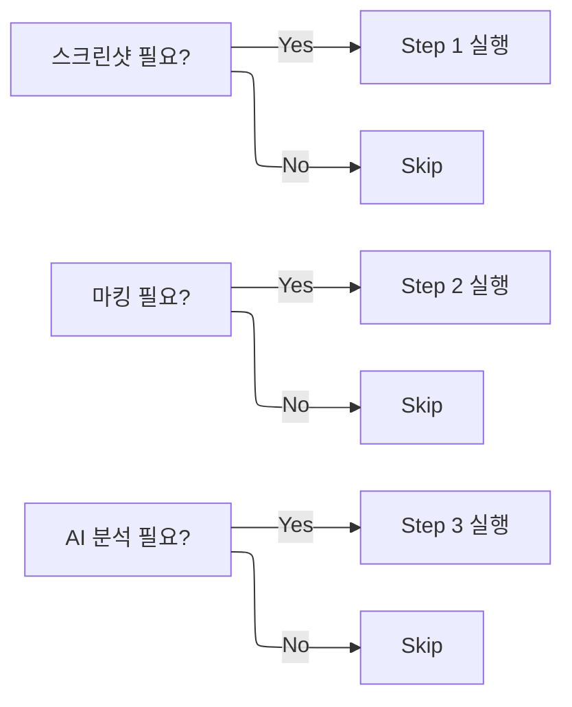

# VisualCapture — 실행 흐름 Navigator

에러 화면 캡처부터 이미지 주석, Claude Vision 분석 보고서 생성까지 3단계를 상황에 따라 선택적으로 실행합니다.

---

## 전체 실행 흐름도

```mermaid
%%{init: {"flowchart": {"defaultRenderer": "elk"}} }%%
flowchart TD
    START([사용자 요청 접수]) --> Q1{이미지 파일이\n이미 있는가?}

    Q1 -->|No — 화면 캡처 필요| STEP1[Step 1: capture.py]
    Q1 -->|Yes — 기존 이미지 사용| Q2{주석 마킹이\n필요한가?}

    STEP1 --> CAP_TYPE{캡처 범위}
    CAP_TYPE -->|전체 화면| CAP_FULL[전체 화면 캡처]
    CAP_TYPE -->|특정 영역| CAP_REGION[region 좌표 지정]
    CAP_TYPE -->|특정 창| CAP_WIN[window 이름 지정]
    CAP_FULL --> CAP_SAVE
    CAP_REGION --> CAP_SAVE
    CAP_WIN --> CAP_SAVE
    CAP_SAVE[Input/captures/ 저장\ncapture_YYMMDD_HHMMSS_이름.png] --> Q2

    Q2 -->|Yes| STEP2[Step 2: annotate.py]
    Q2 -->|No — 분석만 필요| Q3

    STEP2 --> ANN_TYPE{주석 유형}
    ANN_TYPE -->|오류 위치 표시| BOX[빨간 박스\n--box + --label]
    ANN_TYPE -->|중요 영역 강조| HI[노란 하이라이트\n--highlight]
    ANN_TYPE -->|흐름/방향 표시| ARR[파란 화살표\n--arrow + --label]
    ANN_TYPE -->|설명 텍스트| TXT[텍스트 삽입\n--text + --label]
    BOX --> ANN_SAVE
    HI --> ANN_SAVE
    ARR --> ANN_SAVE
    TXT --> ANN_SAVE
    ANN_SAVE[_annotated.png 저장] --> Q3

    Q3{Claude Vision\n분석이 필요한가?}
    Q3 -->|Yes| STEP3[Step 3: analyze.py]
    Q3 -->|No — 이미지만 사용| DONE

    STEP3 --> ENV_CHECK{ANTHROPIC_API_KEY\n.env 확인}
    ENV_CHECK -->|없음| :::warning ENV_ERR[API 키 없음\n.env 파일 생성 안내]:::warning
    ENV_CHECK -->|있음| SEND[Claude Vision API 호출\nclaude-opus-4-6]
    SEND --> REPORT[마크다운 보고서 생성\nOutput/draft/분석보고서.md]
    REPORT --> DONE([완료 보고])
```

---

## 단계별 실행 여부 판단 기준



---

## 예시 시나리오

### 시나리오 1 — 에러 화면 캡처 + 마킹 + 분석 (전체 3단계)

> **상황**: Python 스크립트 실행 중 터미널에 에러 메시지가 출력됨. 이 에러를 캡처하고 원인 분석을 요청하려 함.

**사용자 입력**
```
터미널 에러 화면 찍어서 분석해줘.
```

**실행 명령 순서**

```bash
# Step 1: 전체 화면 캡처
python ".agents/skills/VisualCapture/scripts/capture.py" \
  --out "Projects/260401_스크립트개발/Input/captures/" \
  --name "터미널에러"

# Step 2: 에러 메시지 박스 표시
python ".agents/skills/VisualCapture/scripts/annotate.py" \
  --input "Projects/260401_스크립트개발/Input/captures/capture_260401_143022_터미널에러.png" \
  --box 0,420,1280,520 --label "TypeError 발생 위치" \
  --out "Projects/260401_스크립트개발/Input/captures/capture_260401_143022_터미널에러_annotated.png"

# Step 3: Claude Vision 분석
python ".agents/skills/VisualCapture/scripts/analyze.py" \
  --input "Projects/260401_스크립트개발/Input/captures/capture_260401_143022_터미널에러_annotated.png" \
  --prompt "이 Python 에러의 원인을 분석하고 수정 방법을 알려줘." \
  --out "Projects/260401_스크립트개발/Output/draft/260401_에러분석.md"
```

**생성 결과**: `Output/draft/260401_에러분석.md` — 에러 원인 + 해결 방법 포함 마크다운 보고서

---

### 시나리오 2 — 기존 이미지에 주석만 추가 (Step 2만)

> **상황**: 담당자가 보낸 화면 캡처 이미지(PNG)를 받았음. 설명 자료로 쓰기 위해 오류 위치와 확인 순서를 표시해야 함. 새로 캡처할 필요 없음.

**사용자 입력**
```
이 이미지에 1번 버튼 위치 박스 치고 화살표로 순서 표시해줘.
```

```bash
# Step 2만 실행 (Step 1 생략)
python ".agents/skills/VisualCapture/scripts/annotate.py" \
  --input "Input/raw/담당자_전달화면.png" \
  --box 310,180,490,220 --label "1. 이 버튼 클릭" \
  --arrow 500,200,600,200 \
  --text 610,188 --label "2. 다음으로 이동" \
  --out "Output/draft/담당자_전달화면_설명.png"
```

---

### 시나리오 3 — 한글 프로그램 특정 창 캡처 (Track D 연계)

> **상황**: HWPX_Master Track D (OLE) 실행 중 한글 프로그램 창에서 서식 오류가 발생함. 한글 창만 정확히 캡처해서 오류 확인이 필요함.

```bash
# 한글 창만 선택적 캡처
python ".agents/skills/VisualCapture/scripts/capture.py" \
  --window "한글" \
  --out "Projects/260401_공문서수정/Input/captures/" \
  --name "한글서식오류"

# 오류 셀 위치 하이라이트
python ".agents/skills/VisualCapture/scripts/annotate.py" \
  --input "Projects/260401_공문서수정/Input/captures/capture_260401_한글서식오류.png" \
  --highlight 200,350,800,400 \
  --box 200,350,800,400 --label "표 3행 2열 — 폰트 깨짐" \
  --out "Projects/260401_공문서수정/Input/captures/capture_260401_한글서식오류_annotated.png"
```

---

### 시나리오 4 — 비교 분석: 수정 전·후 두 이미지 비교 (Step 3만)

> **상황**: 수정 전 HWPX와 수정 후 HWPX를 각각 캡처해 두었음. 두 이미지를 AI에게 비교 분석시키고 싶음.

```bash
# 기존 캡처 두 장을 함께 분석 (Step 1, 2 생략)
python ".agents/skills/VisualCapture/scripts/analyze.py" \
  --input \
    "Input/captures/before_보고서.png" \
    "Input/captures/after_보고서.png" \
  --prompt "수정 전후 두 문서를 비교하여 변경된 내용을 목록으로 정리해줘." \
  --out "Output/draft/260401_수정전후비교.md"
```

---

### 시나리오 5 — API 키 없을 때 처리 (Step 3 오류 복구)

> **상황**: `.env` 파일에 `ANTHROPIC_API_KEY`가 없어 analyze.py가 실패함.

**AI 판단 흐름**

1. `analyze.py` 실행 → `[ERROR] ANTHROPIC_API_KEY 없음` 출력
2. `auto-error-recovery` 트리거
3. 대안 제시:
   - 대안 1: 프로젝트 `.env` 파일 생성 후 재실행
   - 대안 2: Step 3 생략하고 주석 이미지만 사용자에게 직접 전달
   - 대안 3: Claude Code 채팅창에 이미지 첨부하여 직접 분석 요청 (analyze.py 우회)

```bash
# 대안 1: .env 파일 생성
echo "ANTHROPIC_API_KEY=sk-ant-..." > "Projects/YYMMDD_이름/.env"
# 이후 analyze.py 재실행
```

---

## 저장 경로 구조 (프로젝트 내)

```
Projects/YYMMDD_이름/
├── Input/
│   └── captures/
│       ├── capture_260401_143022_에러설명.png          ← Step 1 원본
│       └── capture_260401_143022_에러설명_annotated.png ← Step 2 주석본
└── Output/
    └── draft/
        └── 260401_에러분석.md                          ← Step 3 보고서
```
