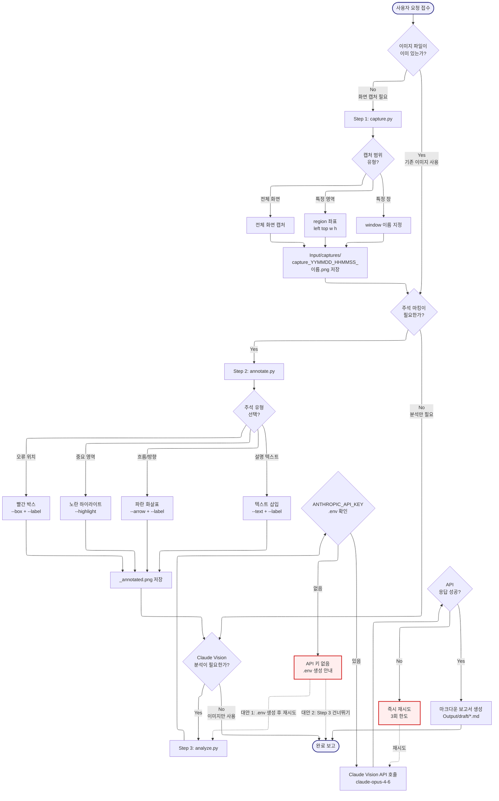
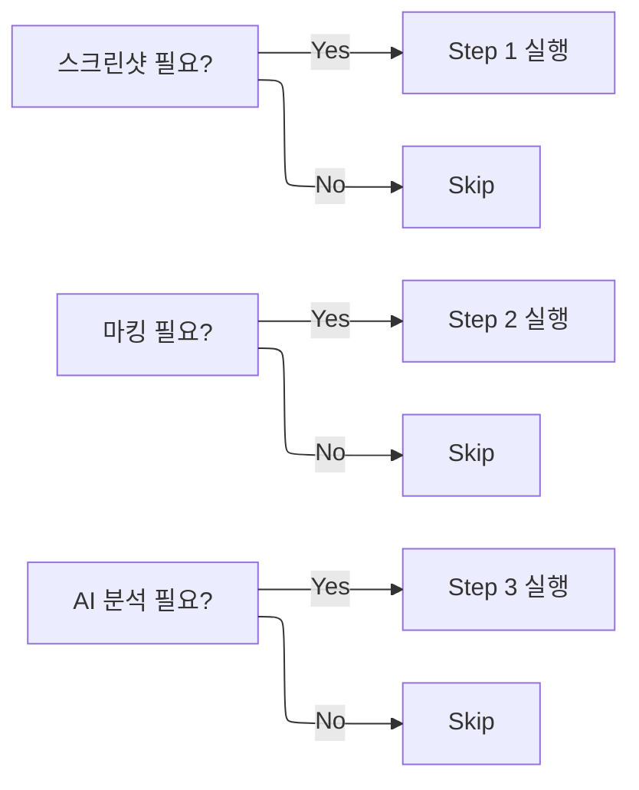

# VisualCapture -- Navigator

> SYSTEM_NAVIGATOR 스타일 시각적 네비게이터
> 최종 갱신: 2026-04-11 (Phase 3 확장)
> SKILL.md와 교차 참조 (이 파일은 SKILL.md의 시각화 계층)

---

## 0. 범례 + 사용법 {#범례--사용법}

### 상태 표시

| 표시 | 의미 |
|------|------|
| **[작동]** | 정상 작동 중 |
| **[부분]** | 일부만 작동 |
| **[미구현]** | 설계만 있고 구현 없음 |

### 다이어그램 규약

- ISO 5807:1985 표준 기호 준수
- Mermaid ELK 렌더러 + `securityLevel: loose`
- 점선 `-.->` = 피드백 루프 (재시도/복귀)
- `:::warning` = 에러/차단/실패 블럭
- `click NODE "#anchor"` = 블럭 상세 카드로 이동

### 스킬 메타

| 항목 | 값 |
|------|-----|
| 이름 | VisualCapture |
| Tier | A |
| 커맨드 | 자동 트리거 ('스크린샷', '화면 캡처', '에러 캡처', '이미지로 설명', '화면 찍어줘') |
| 프로세스 타입 | Conditional Step (3단계 선택적) |
| 설명 | 화면 캡처, 이미지 주석(박스·화살표·하이라이트), Claude Vision 분석 통합 스킬. 에러 화면을 캡처하거나 특정 상황을 이미지로 설명할 때 사용합니다. |

---

## 1. 전체 워크플로우 체계도 {#전체-체계도}

<!-- AUTO:DIAGRAM_MAIN:START -->



<!-- AUTO:DIAGRAM_MAIN:END -->

<details><summary><strong>블럭 바로가기 (다이어그램 클릭 대안)</strong></summary>

[요청 접수](#node-start) · [이미지 존재?](#node-q1) · [Step 1](#node-step1) · [캡처 범위](#node-cap-type) · [전체 화면](#node-cap-full) · [특정 영역](#node-cap-region) · [특정 창](#node-cap-win) · [캡처 저장](#node-cap-save) · [주석 필요?](#node-q2) · [Step 2](#node-step2) · [주석 유형](#node-ann-type) · [빨간 박스](#node-box) · [하이라이트](#node-hi) · [화살표](#node-arrow) · [텍스트](#node-txt) · [주석 저장](#node-ann-save) · [분석 필요?](#node-q3) · [Step 3](#node-step3) · [API 키 확인](#node-env-check) · [키 없음](#node-env-err) · [Vision 호출](#node-send) · [응답 성공?](#node-send-ok) · [재시도](#node-retry) · [보고서 생성](#node-report) · [완료](#node-done)
· [**전체 블럭 카탈로그**](#block-catalog)

</details>

[맨 위로](#범례--사용법)

---

## 2. 블럭 상세 카탈로그 {#block-catalog}

<details><summary>블럭 카드 펼치기 (25개)</summary>

### 사용자 요청 접수 {#node-start}

| 항목 | 내용 |
|------|------|
| 소속 | 파이프라인 진입점 |
| 동기 | 사용자가 시각적 자료를 요구하거나 에러 상황을 설명하고자 할 때 즉시 진입 |
| 내용 | 트리거 키워드 또는 대화 맥락에서 캡처/주석/분석 요구 감지 |
| 동작 방식 | 자동 트리거 키워드 매칭 + 대화 맥락 해석 |
| 상태 | [작동] |
| 관련 파일 | `.agents/skills/VisualCapture/SKILL.md` |

[다이어그램으로 복귀](#전체-체계도)

### 이미지 존재 여부 분기 {#node-q1}

| 항목 | 내용 |
|------|------|
| 소속 | 결정 블럭 (Decision, Step 1 진입 분기) |
| 동기 | 이미 있는 이미지에 추가 작업만 필요한 경우 Step 1을 불필요하게 실행하지 않도록 |
| 내용 | 대화 맥락에서 파일 경로가 언급되거나 첨부된 이미지가 있으면 Yes, 새로 캡처가 필요하면 No |
| 동작 방식 | 파일 경로 패턴 검출 + 사용자 의도 분석 |
| 상태 | [작동] |
| 관련 파일 | SKILL.md |

[다이어그램으로 복귀](#전체-체계도)

### Step 1: capture.py {#node-step1}

| 항목 | 내용 |
|------|------|
| 소속 | Conditional Step 1 (선택적) |
| 동기 | 에러 화면이나 특정 UI 상태는 글로 설명하기보다 이미지가 훨씬 효율적 |
| 내용 | 전체 화면/특정 영역/특정 창 중 하나의 캡처 모드로 PNG 파일 생성 |
| 동작 방식 | pyautogui 기반 캡처 → PIL로 저장 |
| 상태 | [작동] |
| 관련 파일 | `scripts/capture.py` |

[다이어그램으로 복귀](#전체-체계도)

### 캡처 범위 분기 {#node-cap-type}

| 항목 | 내용 |
|------|------|
| 소속 | 결정 블럭 (Decision, Step 1 내부) |
| 동기 | 필요 범위보다 넓게 캡처하면 개인정보/불필요 정보 노출 위험. 범위를 좁힐수록 안전 |
| 내용 | 전체 화면 / 특정 영역 좌표 / 특정 창 3가지 중 선택 |
| 동작 방식 | 사용자 요청 또는 기본 규칙에 따라 인자 결정 |
| 상태 | [작동] |
| 관련 파일 | SKILL.md |

[다이어그램으로 복귀](#전체-체계도)

### 전체 화면 캡처 {#node-cap-full}

| 항목 | 내용 |
|------|------|
| 소속 | Step 1 서브 경로 A |
| 동기 | 빠르게 전체 맥락을 잡아야 할 때 |
| 내용 | 모니터 전체 스크린을 한 장 PNG로 저장 |
| 동작 방식 | pyautogui.screenshot() |
| 상태 | [작동] |
| 관련 파일 | `scripts/capture.py` |

[다이어그램으로 복귀](#전체-체계도)

### 특정 영역 캡처 {#node-cap-region}

| 항목 | 내용 |
|------|------|
| 소속 | Step 1 서브 경로 B |
| 동기 | 전체 화면에서 민감 정보가 있는 경우 특정 영역만 캡처해야 유출 방지 |
| 내용 | `--region left top width height` 인자 기반 박스 캡처 |
| 동작 방식 | pyautogui.screenshot(region=(...)) |
| 상태 | [작동] |
| 관련 파일 | `scripts/capture.py` |

[다이어그램으로 복귀](#전체-체계도)

### 특정 창 캡처 {#node-cap-win}

| 항목 | 내용 |
|------|------|
| 소속 | Step 1 서브 경로 C |
| 동기 | 한글 프로그램 등 특정 애플리케이션 창만 캡처해야 HWPX Track D 연계 가능 |
| 내용 | `--window "창이름"` 인자 기반 해당 창의 활성 영역 캡처 |
| 동작 방식 | pygetwindow로 창 위치 확보 → 해당 영역 screenshot (Windows 전용) |
| 상태 | [부분] (Windows 한정) |
| 관련 파일 | `scripts/capture.py` |

[다이어그램으로 복귀](#전체-체계도)

### 캡처 저장 {#node-cap-save}

| 항목 | 내용 |
|------|------|
| 소속 | Step 1 출력 |
| 동기 | 파일명 규칙을 통일해야 이후 검색/추적 용이 |
| 내용 | `Input/captures/capture_YYMMDD_HHMMSS_이름.png` 포맷으로 저장 |
| 동작 방식 | datetime 기반 파일명 생성 → 프로젝트 상대경로 저장 |
| 상태 | [작동] |
| 관련 파일 | `Projects/YYMMDD_*/Input/captures/` |

[다이어그램으로 복귀](#전체-체계도)

### 주석 필요 여부 분기 {#node-q2}

| 항목 | 내용 |
|------|------|
| 소속 | 결정 블럭 (Decision, Step 2 진입 분기) |
| 동기 | 원본 이미지만으로 충분한 경우 Step 2를 생략해 처리 시간을 단축 |
| 내용 | 사용자가 "박스 쳐줘", "화살표 그려줘", "표시해줘" 등 마킹 요구 시 Yes, 원본 그대로 사용이면 No |
| 동작 방식 | 대화 키워드 매칭 + 의도 분석 |
| 상태 | [작동] |
| 관련 파일 | SKILL.md |

[다이어그램으로 복귀](#전체-체계도)

### Step 2: annotate.py {#node-step2}

| 항목 | 내용 |
|------|------|
| 소속 | Conditional Step 2 (선택적) |
| 동기 | 수신자가 이미지의 핵심 지점을 빠르게 이해할 수 있도록 시각적 마커 필요 |
| 내용 | 박스/하이라이트/화살표/텍스트 4가지 마커를 조합하여 주석본 생성 |
| 동작 방식 | PIL ImageDraw 기반 도형/텍스트 그리기 |
| 상태 | [작동] |
| 관련 파일 | `scripts/annotate.py` |

[다이어그램으로 복귀](#전체-체계도)

### 주석 유형 분기 {#node-ann-type}

| 항목 | 내용 |
|------|------|
| 소속 | 결정 블럭 (Decision, Step 2 내부) |
| 동기 | 마킹 의도(오류/강조/흐름/설명)에 따라 시각 언어가 달라야 함 |
| 내용 | 박스(오류), 하이라이트(강조), 화살표(흐름), 텍스트(설명) 중 복수 선택 가능 |
| 동작 방식 | 인자 조합 해석 → 각 마커 그리기 함수 순차 호출 |
| 상태 | [작동] |
| 관련 파일 | SKILL.md |

[다이어그램으로 복귀](#전체-체계도)

### 빨간 박스 (오류 표시) {#node-box}

| 항목 | 내용 |
|------|------|
| 소속 | Step 2 마커 A |
| 동기 | 오류 위치를 가장 명확하게 지정해야 수신자가 바로 파악 |
| 내용 | `--box x1,y1,x2,y2` + `--label` 로 빨간 박스와 설명 라벨 추가 |
| 동작 방식 | ImageDraw.rectangle + text |
| 상태 | [작동] |
| 관련 파일 | `scripts/annotate.py` |

[다이어그램으로 복귀](#전체-체계도)

### 노란 하이라이트 (강조) {#node-hi}

| 항목 | 내용 |
|------|------|
| 소속 | Step 2 마커 B |
| 동기 | 박스보다 부드러운 강조가 필요할 때 (전체가 틀린 게 아닌 주목 요소) |
| 내용 | `--highlight x1,y1,x2,y2` 로 노란 반투명 영역 적용 |
| 동작 방식 | ImageDraw alpha composite |
| 상태 | [작동] |
| 관련 파일 | `scripts/annotate.py` |

[다이어그램으로 복귀](#전체-체계도)

### 파란 화살표 (흐름) {#node-arrow}

| 항목 | 내용 |
|------|------|
| 소속 | Step 2 마커 C |
| 동기 | 단계 순서, 흐름 방향을 표현해야 설명 자료가 이해됨 |
| 내용 | `--arrow x1,y1,x2,y2` + `--label` 로 파란 화살표와 라벨 추가 |
| 동작 방식 | ImageDraw line + polygon (화살촉) |
| 상태 | [작동] |
| 관련 파일 | `scripts/annotate.py` |

[다이어그램으로 복귀](#전체-체계도)

### 설명 텍스트 {#node-txt}

| 항목 | 내용 |
|------|------|
| 소속 | Step 2 마커 D |
| 동기 | 박스/화살표만으로 부족할 때 추가 설명 텍스트 필요 |
| 내용 | `--text x,y --label "설명"` 로 임의 위치에 흰색 텍스트 삽입 |
| 동작 방식 | ImageDraw.text + 한글 폰트 지정 |
| 상태 | [작동] |
| 관련 파일 | `scripts/annotate.py` |

[다이어그램으로 복귀](#전체-체계도)

### 주석 저장 {#node-ann-save}

| 항목 | 내용 |
|------|------|
| 소속 | Step 2 출력 |
| 동기 | 원본과 주석본을 분리 저장해야 원본 손상 방지 |
| 내용 | `*_annotated.png` 접미사로 별도 파일 저장 |
| 동작 방식 | 원본 파일명 기반 접미사 부여 후 쓰기 |
| 상태 | [작동] |
| 관련 파일 | `Projects/YYMMDD_*/Input/captures/` |

[다이어그램으로 복귀](#전체-체계도)

### 분석 필요 여부 분기 {#node-q3}

| 항목 | 내용 |
|------|------|
| 소속 | 결정 블럭 (Decision, Step 3 진입 분기) |
| 동기 | 사용자가 단순히 이미지만 필요하면 API 호출 비용 절감을 위해 Step 3 생략 |
| 내용 | 사용자가 "분석해줘", "원인 알려줘" 등 Vision 요구 시 Yes, 이미지만 필요하면 No |
| 동작 방식 | 대화 키워드 매칭 + 의도 분석 |
| 상태 | [작동] |
| 관련 파일 | SKILL.md |

[다이어그램으로 복귀](#전체-체계도)

### Step 3: analyze.py {#node-step3}

| 항목 | 내용 |
|------|------|
| 소속 | Conditional Step 3 (선택적) |
| 동기 | Claude Vision으로 이미지를 자동 해석해 마크다운 보고서를 생성하면 수동 분석 시간 대폭 단축 |
| 내용 | 이미지 + 프롬프트를 Claude API에 전송 후 응답을 .md 보고서로 저장 |
| 동작 방식 | Anthropic SDK 호출 → 응답 파싱 → 마크다운 쓰기 |
| 상태 | [작동] |
| 관련 파일 | `scripts/analyze.py` |

[다이어그램으로 복귀](#전체-체계도)

### API 키 체크 {#node-env-check}

| 항목 | 내용 |
|------|------|
| 소속 | 결정 블럭 (Decision, Step 3 전제 조건) |
| 동기 | `.env`에 `ANTHROPIC_API_KEY`가 없으면 API 호출 실패 → 복구 경로 분기 필요 |
| 내용 | 프로젝트 `.env`를 읽어 키 존재 여부 확인 |
| 동작 방식 | dotenv load + os.environ 체크 |
| 상태 | [작동] |
| 관련 파일 | `Projects/YYMMDD_*/.env` |

[다이어그램으로 복귀](#전체-체계도)

### API 키 없음 (에러 분기) {#node-env-err}

| 항목 | 내용 |
|------|------|
| 소속 | 에러 처리 (ISO 5807 Error Handling) |
| 동기 | 키 누락은 가장 흔한 실패 원인. 3가지 대안을 명확히 안내해야 사용자 이탈 방지 |
| 내용 | 대안 1: `.env` 생성 후 재시도, 대안 2: Step 3 생략, 대안 3: 채팅창에 이미지 직접 첨부 |
| 동작 방식 | 경고 메시지 출력 + `-.->` 복구/종료 루프 분기 |
| 상태 | [작동] |
| 관련 파일 | `auto-error-recovery`, SKILL.md |

[다이어그램으로 복귀](#전체-체계도)

### Claude Vision API 호출 {#node-send}

| 항목 | 내용 |
|------|------|
| 소속 | Step 3 실행 |
| 동기 | Claude Vision (claude-opus-4-6)이 가장 정확한 이미지 해석 품질 제공 |
| 내용 | 이미지 base64 인코딩 + 프롬프트 전송 후 응답 수신 |
| 동작 방식 | anthropic.messages.create → stream 또는 non-stream |
| 상태 | [작동] |
| 관련 파일 | `scripts/analyze.py` |

[다이어그램으로 복귀](#전체-체계도)

### API 응답 성공 체크 {#node-send-ok}

| 항목 | 내용 |
|------|------|
| 소속 | 결정 블럭 (Decision, 피드백 진입점) |
| 동기 | 네트워크/Rate Limit/모델 오류 등 일시 실패 시 재시도해야 성공률 상승 |
| 내용 | HTTP 200 + 응답 본문 정상 = Yes, 오류 = No (재시도) |
| 동작 방식 | 예외 캐치 + 상태 코드 확인 |
| 상태 | [작동] |
| 관련 파일 | SKILL.md |

[다이어그램으로 복귀](#전체-체계도)

### 즉시 재시도 (3회 한도) {#node-retry}

| 항목 | 내용 |
|------|------|
| 소속 | 피드백 루프 (ISO 5807 Retry 패턴) |
| 동기 | 일시적 API 실패는 자동 재시도로 대부분 해결됨. 단 무한 루프 방지 위해 3회 한도 |
| 내용 | exponential backoff (1s, 2s, 4s) 후 재호출 |
| 동작 방식 | time.sleep + retry counter → 초과 시 에러 로그 후 종료 |
| 상태 | [작동] |
| 관련 파일 | `scripts/analyze.py` |

[다이어그램으로 복귀](#전체-체계도)

### 마크다운 보고서 생성 {#node-report}

| 항목 | 내용 |
|------|------|
| 소속 | Step 3 출력 |
| 동기 | 분석 결과를 재사용 가능하도록 구조화된 파일로 남겨야 후속 의사결정에 활용 가능 |
| 내용 | 제목, 이미지 요약, 원인 분석, 해결 방법 등 섹션이 있는 .md 파일 생성 |
| 동작 방식 | 응답 본문을 섹션 헤더로 구조화 → `Output/draft/*.md` 저장 |
| 상태 | [작동] |
| 관련 파일 | `Projects/YYMMDD_*/Output/draft/*.md` |

[다이어그램으로 복귀](#전체-체계도)

### 완료 보고 {#node-done}

| 항목 | 내용 |
|------|------|
| 소속 | 파이프라인 출력 |
| 동기 | 사용자에게 생성된 산출물 경로를 명확히 전달해야 후속 활용 가능 |
| 내용 | 원본/주석본/보고서 경로 요약 |
| 동작 방식 | Markdown 표/리스트로 출력 |
| 상태 | [작동] |
| 관련 파일 | SKILL.md |

[다이어그램으로 복귀](#전체-체계도)

</details>

[맨 위로](#범례--사용법)

---

## 3. 단계 생략 규칙

| 상황 | 실행 단계 |
|:---|:---|
| 화면 캡처만 필요 | Step 1만 |
| 기존 이미지에 마킹만 필요 | Step 2만 |
| 이미지를 AI에게 설명시키기만 필요 | Step 3만 |
| 캡처 → 마킹 → 분석 전체 | Step 1 → 2 → 3 |

---

## 4. 단계별 실행 여부 판단 기준 (보조 다이어그램)



---

## 5. 사용 시나리오

### 시나리오 1 -- 에러 화면 캡처 + 마킹 + 분석 (전체 3단계)

> **상황**: Python 스크립트 실행 중 터미널에 에러 메시지가 출력됨. 이 에러를 캡처하고 원인 분석을 요청하려 함.

**사용자 입력**
```
터미널 에러 화면 찍어서 분석해줘.
```

**실행 명령 순서**

```bash
# Step 1: 전체 화면 캡처
python ".agents/skills/VisualCapture/scripts/capture.py" \
  --out "Projects/260401_스크립트개발/Input/captures/" \
  --name "터미널에러"

# Step 2: 에러 메시지 박스 표시
python ".agents/skills/VisualCapture/scripts/annotate.py" \
  --input "Projects/260401_스크립트개발/Input/captures/capture_260401_143022_터미널에러.png" \
  --box 0,420,1280,520 --label "TypeError 발생 위치" \
  --out "Projects/260401_스크립트개발/Input/captures/capture_260401_143022_터미널에러_annotated.png"

# Step 3: Claude Vision 분석
python ".agents/skills/VisualCapture/scripts/analyze.py" \
  --input "Projects/260401_스크립트개발/Input/captures/capture_260401_143022_터미널에러_annotated.png" \
  --prompt "이 Python 에러의 원인을 분석하고 수정 방법을 알려줘." \
  --out "Projects/260401_스크립트개발/Output/draft/260401_에러분석.md"
```

**생성 결과**: `Output/draft/260401_에러분석.md` -- 에러 원인 + 해결 방법 포함 마크다운 보고서

---

### 시나리오 2 -- 기존 이미지에 주석만 추가 (Step 2만)

> **상황**: 담당자가 보낸 화면 캡처 이미지(PNG)를 받았음. 설명 자료로 쓰기 위해 오류 위치와 확인 순서를 표시해야 함. 새로 캡처할 필요 없음.

**사용자 입력**
```
이 이미지에 1번 버튼 위치 박스 치고 화살표로 순서 표시해줘.
```

```bash
# Step 2만 실행 (Step 1 생략)
python ".agents/skills/VisualCapture/scripts/annotate.py" \
  --input "Input/raw/담당자_전달화면.png" \
  --box 310,180,490,220 --label "1. 이 버튼 클릭" \
  --arrow 500,200,600,200 \
  --text 610,188 --label "2. 다음으로 이동" \
  --out "Output/draft/담당자_전달화면_설명.png"
```

---

### 시나리오 3 -- 한글 프로그램 특정 창 캡처 (Track D 연계)

> **상황**: HWPX_Master Track D (OLE) 실행 중 한글 프로그램 창에서 서식 오류가 발생함. 한글 창만 정확히 캡처해서 오류 확인이 필요함.

```bash
# 한글 창만 선택적 캡처
python ".agents/skills/VisualCapture/scripts/capture.py" \
  --window "한글" \
  --out "Projects/260401_공문서수정/Input/captures/" \
  --name "한글서식오류"

# 오류 셀 위치 하이라이트
python ".agents/skills/VisualCapture/scripts/annotate.py" \
  --input "Projects/260401_공문서수정/Input/captures/capture_260401_한글서식오류.png" \
  --highlight 200,350,800,400 \
  --box 200,350,800,400 --label "표 3행 2열 -- 폰트 깨짐" \
  --out "Projects/260401_공문서수정/Input/captures/capture_260401_한글서식오류_annotated.png"
```

---

### 시나리오 4 -- 비교 분석: 수정 전·후 두 이미지 비교 (Step 3만)

> **상황**: 수정 전 HWPX와 수정 후 HWPX를 각각 캡처해 두었음. 두 이미지를 AI에게 비교 분석시키고 싶음.

```bash
# 기존 캡처 두 장을 함께 분석 (Step 1, 2 생략)
python ".agents/skills/VisualCapture/scripts/analyze.py" \
  --input \
    "Input/captures/before_보고서.png" \
    "Input/captures/after_보고서.png" \
  --prompt "수정 전후 두 문서를 비교하여 변경된 내용을 목록으로 정리해줘." \
  --out "Output/draft/260401_수정전후비교.md"
```

---

### 시나리오 5 -- API 키 없을 때 처리 (Step 3 오류 복구)

> **상황**: `.env` 파일에 `ANTHROPIC_API_KEY`가 없어 analyze.py가 실패함.

**AI 판단 흐름**

1. `analyze.py` 실행 → `[ERROR] ANTHROPIC_API_KEY 없음` 출력
2. `auto-error-recovery` 트리거
3. 대안 제시:
   - 대안 1: 프로젝트 `.env` 파일 생성 후 재실행
   - 대안 2: Step 3 생략하고 주석 이미지만 사용자에게 직접 전달
   - 대안 3: Claude Code 채팅창에 이미지 첨부하여 직접 분석 요청 (analyze.py 우회)

```bash
# 대안 1: .env 파일 생성
echo "ANTHROPIC_API_KEY=sk-ant-..." > "Projects/YYMMDD_이름/.env"
# 이후 analyze.py 재실행
```

---

[맨 위로](#범례--사용법)

---

## 6. 저장 경로 구조 (프로젝트 내)

```
Projects/YYMMDD_이름/
├── Input/
│   └── captures/
│       ├── capture_260401_143022_에러설명.png          ← Step 1 원본
│       └── capture_260401_143022_에러설명_annotated.png ← Step 2 주석본
└── Output/
    └── draft/
        └── 260401_에러분석.md                          ← Step 3 보고서
```

---

## 7. 제약사항 및 공통 주의사항

### 보안 / 프라이버시

- 전체 화면 캡처 시 개인정보/타 애플리케이션 창이 포함될 수 있으므로 가능한 특정 영역/창 캡처 우선
- API 키는 반드시 프로젝트 `.env`에 저장 (하드코딩 금지)
- 캡처 이미지는 프로젝트 `Input/captures/`에만 저장 (공유 폴더 금지)

### 의존성

```
pip install pyautogui Pillow pygetwindow anthropic
```

- `pygetwindow`: `--window` 옵션 사용 시만 필요 (Windows 전용)
- `anthropic`: Step 3 분석 시만 필요, API 키는 프로젝트 `.env`에 저장

### 공통 금지 사항

- 이모티콘 사용 금지 (PostToolUse 훅 차단)
- 절대경로 하드코딩 금지 (PROJECT_ROOT 상대경로)
- API Key 하드코딩 금지

### 각인 참조

- **AER-005**: subprocess 호출 시 `errors="replace"` 필수 (한글 인코딩 안전)
- **IMP-015**: API 키 템플릿 분리 (`.env.example` + gitignore)

[맨 위로](#범례--사용법)

---

## 8. 갱신 이력

| 날짜 | 변경 | 트리거 |
|------|------|--------|
| 2026-04-11 | scaffold 자동 생성 + 시나리오 5개 보존 | generate-navigator-cli (Phase 3.3) |
| 2026-04-11 | SYSTEM_NAVIGATOR 스타일 확장: Mermaid (Conditional Step + API 키 복구 분기 + Retry 루프) + 블럭 카드 25개 + 제약사항 강화 | 수동 Phase 3.3 |

[맨 위로](#범례--사용법)
