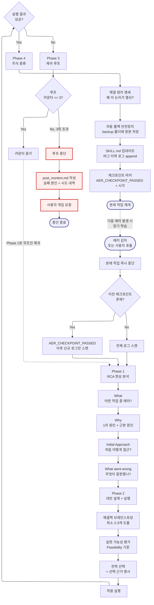

# auto-error-recovery -- Navigator

> SYSTEM_NAVIGATOR 스타일 시각적 네비게이터
> 최종 갱신: 2026-04-11 (Tier-B Option A 신규 생성)
> SKILL.md와 교차 참조 (이 파일은 SKILL.md의 시각화 계층)

---

## 0. 범례 + 사용법 {#범례--사용법}

### 상태 표시

| 표시 | 의미 |
|------|------|
| **[작동]** | 정상 작동 중 |
| **[부분]** | 일부만 작동 |
| **[미구현]** | 설계만 있고 구현 없음 |

### 다이어그램 규약

- ISO 5807:1985 표준 기호 준수
- Mermaid ELK 렌더러 + `securityLevel: loose`
- 점선 `-.->` = 피드백 루프 (재시도/복귀)
- `:::warning` = 에러/차단/실패 블럭
- `click NODE "#anchor"` = 블럭 상세 카드로 이동

### 스킬 메타

| 항목 | 값 |
|------|-----|
| 이름 | auto-error-recovery |
| Tier | B |
| 커맨드 | 자동 트리거 (`에러`, `오류`, `에러 분석`, `오류 복구`) |
| 프로세스 타입 | Phase (4-Phase) + Recursive Loop |
| 설명 | 자가 발전 에러 개선 루프. RCA → 대안 실행 → 재귀 복구 (최대 3회) → 지식 증류 → SKILL.md 업데이트 |

---

## 1. 전체 워크플로우 체계도 {#전체-체계도}

<!-- AUTO:DIAGRAM_MAIN:START -->



<!-- AUTO:DIAGRAM_MAIN:END -->

<details><summary><strong>블럭 바로가기 (다이어그램 클릭 대안)</strong></summary>

[진입](#node-start) · [작업 중단](#node-suspend) · [체크포인트 체크](#node-scan) · [델타 스캔](#node-scan-delta) · [전체 스캔](#node-scan-full) · [Phase 1 RCA](#node-p1) · [What](#node-p1-what) · [Why](#node-p1-why) · [Initial Approach](#node-p1-init) · [What went wrong](#node-p1-wrong) · [Phase 2 대안](#node-p2) · [브레인스토밍](#node-p2-brain) · [Feasibility](#node-p2-feasible) · [선택](#node-p2-select) · [실행](#node-p2-exec) · [결과 검증](#node-verify) · [Phase 3 루프](#node-p3) · [카운터](#node-counter) · [복귀](#node-p3-back) · [중단](#node-abort) · [post_mortem](#node-postmortem) · [사용자 개입](#node-escalate) · [중단 종료](#node-end) · [Phase 4 증류](#node-p4) · [원리 명세](#node-p4-principle) · [백업](#node-p4-backup) · [SKILL 업데이트](#node-p4-skill-update) · [체크포인트](#node-p4-checkpoint) · [재개](#node-resume)
· [**전체 블럭 카탈로그**](#block-catalog)

</details>

[맨 위로](#범례--사용법)

---

## 2. 블럭 상세 카탈로그 {#block-catalog}

<details><summary>블럭 카드 펼치기 (28개)</summary>

### 에러 감지/호출 진입 {#node-start}

| 항목 | 내용 |
|------|------|
| 소속 | 진입점 |
| 동기 | 에러가 반복되거나 사용자가 명시적으로 분석을 요청할 때 자동으로 RCA 시작. 수동 디버깅 시간 절감 |
| 내용 | 시스템 에러 패턴 감지 또는 트리거 키워드 매칭 |
| 동작 방식 | PreToolUse/PostToolUse 훅 또는 사용자 키워드 |
| 상태 | [작동] |
| 관련 파일 | `.agents/skills/auto-error-recovery/SKILL.md` |

[다이어그램으로 복귀](#전체-체계도)

### 본래 작업 중단 {#node-suspend}

| 항목 | 내용 |
|------|------|
| 소속 | 진입 직후 |
| 동기 | 에러가 감지된 상태에서 계속 진행하면 오염 확대. 즉시 중단하여 클린 상태에서 RCA |
| 내용 | 현재 실행 중인 Phase/Step을 중지하고 에러 분석 모드로 전환 |
| 동작 방식 | 컨텍스트 저장 후 Phase 1로 진입 |
| 상태 | [작동] |
| 관련 파일 | SKILL.md |

[다이어그램으로 복귀](#전체-체계도)

### 체크포인트 존재 체크 {#node-scan}

| 항목 | 내용 |
|------|------|
| 소속 | 결정 블럭 (Decision, 스캔 범위 최적화) |
| 동기 | 이전 AER 실행이 있으면 그 이후 로그만 스캔해야 컨텍스트 낭비 없음 |
| 내용 | `[AER_CHECKPOINT_PASSED]` 마커 존재 여부 확인 |
| 동작 방식 | Grep으로 세션 로그 끝에서 마커 검색 |
| 상태 | [작동] |
| 관련 파일 | Projects/*/Log/*.md |

[다이어그램으로 복귀](#전체-체계도)

### 델타 스캔 {#node-scan-delta}

| 항목 | 내용 |
|------|------|
| 소속 | 스캔 경로 A (최적화) |
| 동기 | 이미 처리된 에러를 재분석하지 않아 컨텍스트 절약 |
| 내용 | 마커 이후 로그만 RCA 대상에 포함 |
| 동작 방식 | 마커 라인 인덱스 기준 slice |
| 상태 | [작동] |
| 관련 파일 | 세션 로그 |

[다이어그램으로 복귀](#전체-체계도)

### 전체 스캔 {#node-scan-full}

| 항목 | 내용 |
|------|------|
| 소속 | 스캔 경로 B (초기 실행) |
| 동기 | 첫 AER 실행 또는 마커가 누락된 경우 전체 컨텍스트 분석 필요 |
| 내용 | 세션 시작부터 현재까지 전체 로그 스캔 |
| 동작 방식 | 전체 파일 Read |
| 상태 | [작동] |
| 관련 파일 | 세션 로그 |

[다이어그램으로 복귀](#전체-체계도)

### Phase 1: RCA 현상 분석 {#node-p1}

| 항목 | 내용 |
|------|------|
| 소속 | Phase 1 (원인 규명) |
| 동기 | 표면 증상이 아닌 근본 원인을 파악해야 재발 방지 가능 |
| 내용 | 4가지 질문 (What/Why/Initial/Wrong)에 스스로 답하고 기록 |
| 동작 방식 | 순차적 자문자답 + 중간 기록 |
| 상태 | [작동] |
| 관련 파일 | SKILL.md |

[다이어그램으로 복귀](#전체-체계도)

### What: 현상 파악 {#node-p1-what}

| 항목 | 내용 |
|------|------|
| 소속 | Phase 1 Q1 |
| 동기 | 에러의 관찰 가능한 증상을 명확히 기록해야 이후 대안 설계 가능 |
| 내용 | "어떤 작업을 하다가 에러가 났는가?" 질문에 답 |
| 동작 방식 | 직전 실행 맥락 요약 |
| 상태 | [작동] |
| 관련 파일 | 세션 로그 |

[다이어그램으로 복귀](#전체-체계도)

### Why: 원인 규명 {#node-p1-why}

| 항목 | 내용 |
|------|------|
| 소속 | Phase 1 Q2 |
| 동기 | 1차 원인(직접 트리거)과 근본 원인(구조적 결함)을 구분해야 재발 방지 가능 |
| 내용 | "1차 원인 + 근본 원인(Root Cause)은 무엇인가?" |
| 동작 방식 | 5 Whys 기법 (5회 Why 질문) |
| 상태 | [작동] |
| 관련 파일 | SKILL.md |

[다이어그램으로 복귀](#전체-체계도)

### Initial Approach {#node-p1-init}

| 항목 | 내용 |
|------|------|
| 소속 | Phase 1 Q3 |
| 동기 | 최초 접근 방식을 기록해야 무엇이 잘못됐는지 비판 가능 |
| 내용 | "처음에 어떻게 접근했는가?" |
| 동작 방식 | 직전 선택한 전략/도구/알고리즘 요약 |
| 상태 | [작동] |
| 관련 파일 | 세션 로그 |

[다이어그램으로 복귀](#전체-체계도)

### What went wrong: 오류 비판 {#node-p1-wrong}

| 항목 | 내용 |
|------|------|
| 소속 | Phase 1 Q4 |
| 동기 | 접근 방식의 결함을 명확히 지적해야 대안이 정당화됨 |
| 내용 | "그 접근 방식의 어떤 부분이 잘못됐는가?" |
| 동작 방식 | Initial Approach와 실제 필요사항의 gap 분석 |
| 상태 | [작동] |
| 관련 파일 | 없음 |

[다이어그램으로 복귀](#전체-체계도)

### Phase 2: 대안 설계 + 실행 {#node-p2}

| 항목 | 내용 |
|------|------|
| 소속 | Phase 2 (복구 실행) |
| 동기 | 단일 대안에 의존하면 실패 시 재시도 여지가 없음. 복수 대안에서 가장 실현 가능한 것을 선택 |
| 내용 | 브레인스토밍 → 실현 가능성 평가 → 선택 → 실행 |
| 동작 방식 | 순차 4단계 |
| 상태 | [작동] |
| 관련 파일 | SKILL.md |

[다이어그램으로 복귀](#전체-체계도)

### 브레인스토밍 (최소 2-3개) {#node-p2-brain}

| 항목 | 내용 |
|------|------|
| 소속 | Phase 2 Stage 1 |
| 동기 | 최소 2-3개 대안을 확보해야 선택의 여지가 생김. 1개만 생각하면 맹목적 실행 |
| 내용 | 가용한 해결책 및 우회 방법 도출 |
| 동작 방식 | LLM 발산 → 후보 목록 |
| 상태 | [작동] |
| 관련 파일 | 없음 |

[다이어그램으로 복귀](#전체-체계도)

### Feasibility 평가 {#node-p2-feasible}

| 항목 | 내용 |
|------|------|
| 소속 | Phase 2 Stage 2 |
| 동기 | 이론적으로 좋은 해결책이 실행 환경에서 불가능할 수 있음. 현실성 필터 필요 |
| 내용 | 각 대안의 실현 가능성(시간/도구/권한) 평가 |
| 동작 방식 | 가중치 기반 순위 |
| 상태 | [작동] |
| 관련 파일 | 없음 |

[다이어그램으로 복귀](#전체-체계도)

### 전략 선택 + 근거 명시 {#node-p2-select}

| 항목 | 내용 |
|------|------|
| 소속 | Phase 2 Stage 3 |
| 동기 | 왜 이 전략을 선택했는지 기록해야 실패 시 학습 가능 + 다른 전략 시도 가능 |
| 내용 | 최상위 후보 선택 + 선택 근거 한 문장 명시 |
| 동작 방식 | 명시적 이유 기록 |
| 상태 | [작동] |
| 관련 파일 | 없음 |

[다이어그램으로 복귀](#전체-체계도)

### 적용 실행 {#node-p2-exec}

| 항목 | 내용 |
|------|------|
| 소속 | Phase 2 Stage 4 |
| 동기 | 선택된 전략을 실제로 적용 |
| 내용 | 전략에 따른 도구 호출 / 명령 실행 |
| 동작 방식 | 필요한 도구(Read/Write/Edit/Bash 등) 호출 |
| 상태 | [작동] |
| 관련 파일 | 대상 파일 |

[다이어그램으로 복귀](#전체-체계도)

### 실행 결과 검증 {#node-verify}

| 항목 | 내용 |
|------|------|
| 소속 | 결정 블럭 (Decision, 성공/실패 분기) |
| 동기 | 적용 후 에러가 실제로 해결됐는지 확인해야 루프 종료 가능 |
| 내용 | 성공 → Phase 4 / 실패 → Phase 3 |
| 동작 방식 | 재실행 + 에러 재현 시도 |
| 상태 | [작동] |
| 관련 파일 | 없음 |

[다이어그램으로 복귀](#전체-체계도)

### Phase 3: 재귀 루프 {#node-p3}

| 항목 | 내용 |
|------|------|
| 소속 | Phase 3 (재시도 제어) |
| 동기 | 한 번 실패해도 다른 대안으로 재시도 가능. 무한 루프 방지를 위해 카운터 필요 |
| 내용 | 카운터 체크 → Phase 1 복귀 또는 중단 |
| 동작 방식 | 세션 스코프 카운터 |
| 상태 | [작동] |
| 관련 파일 | 없음 |

[다이어그램으로 복귀](#전체-체계도)

### 루프 카운터 분기 {#node-counter}

| 항목 | 내용 |
|------|------|
| 소속 | 결정 블럭 (Decision) |
| 동기 | 무한 루프 방지 + 사용자 개입 트리거 시점 결정 |
| 내용 | 카운터 ≤ 3 → Phase 1로 복귀 / > 3 → 중단 |
| 동작 방식 | 정수 비교 |
| 상태 | [작동] |
| 관련 파일 | 없음 |

[다이어그램으로 복귀](#전체-체계도)

### Phase 1 무조건 복귀 {#node-p3-back}

| 항목 | 내용 |
|------|------|
| 소속 | 피드백 루프 (ISO 5807 Retry 패턴) |
| 동기 | 재실패는 RCA가 부정확했음을 의미. 처음부터 다시 분석 필요 (Phase 2만 반복하면 같은 실수) |
| 내용 | 카운터 증가 + Phase 1로 이동 (`-.->` 점선 피드백) |
| 동작 방식 | 명시적 state 리셋 + 재진입 |
| 상태 | [작동] |
| 관련 파일 | 없음 |

[다이어그램으로 복귀](#전체-체계도)

### 루프 중단 (3회 초과) {#node-abort}

| 항목 | 내용 |
|------|------|
| 소속 | 에러 처리 (ISO 5807 Error Handling) |
| 동기 | 3회 반복 실패는 스킬의 한계. 시스템이 해결 불가능한 문제를 사용자에게 넘겨야 함 |
| 내용 | 즉시 중단 + 에스컬레이션 프로토콜 진입 |
| 동작 방식 | 루프 break |
| 상태 | [작동] |
| 관련 파일 | 없음 |

[다이어그램으로 복귀](#전체-체계도)

### post_mortem.md 작성 {#node-postmortem}

| 항목 | 내용 |
|------|------|
| 소속 | 중단 후 기록 |
| 동기 | 실패 경험도 지식. 다음 세션 또는 사용자가 재시도할 때 시행착오 회피 |
| 내용 | 실패 원인 + 시도한 3개 대안 + 각 대안의 실패 이유 |
| 동작 방식 | Write로 `post_mortem.md` 생성 |
| 상태 | [작동] |
| 관련 파일 | `Projects/*/Log/post_mortem.md` |

[다이어그램으로 복귀](#전체-체계도)

### 사용자 개입 요청 {#node-escalate}

| 항목 | 내용 |
|------|------|
| 소속 | 에스컬레이션 |
| 동기 | 자동화 한계를 인정하고 사용자가 개입할 수 있도록 명시적 요청 |
| 내용 | "3회 시도 후 해결 실패. post_mortem.md 확인 후 수동 개입 요청" |
| 동작 방식 | 메시지 출력 + post_mortem 경로 링크 |
| 상태 | [작동] |
| 관련 파일 | `post_mortem.md` |

[다이어그램으로 복귀](#전체-체계도)

### 중단 종료 {#node-end}

| 항목 | 내용 |
|------|------|
| 소속 | 실패 경로 종료점 |
| 동기 | 스킬 종료 지점 명시 + 본래 작업 복원 불가 상태 표기 |
| 내용 | 본래 작업이 중단된 상태로 세션 제어권 반환 |
| 동작 방식 | 종료 시그널 |
| 상태 | [작동] |
| 관련 파일 | 없음 |

[다이어그램으로 복귀](#전체-체계도)

### Phase 4: 지식 증류 {#node-p4}

| 항목 | 내용 |
|------|------|
| 소속 | Phase 4 (성공 후 학습) |
| 동기 | 해결 경험을 즉시 시스템에 반영해야 다음에 같은 에러 재발 시 빠르게 대응 가능 |
| 내용 | 원리 명세 → 백업 → SKILL 업데이트 → 체크포인트 |
| 동작 방식 | 순차 4단계 |
| 상태 | [작동] |
| 관련 파일 | 대상 SKILL.md + .backup |

[다이어그램으로 복귀](#전체-체계도)

### 해결 원리 명세 {#node-p4-principle}

| 항목 | 내용 |
|------|------|
| 소속 | Phase 4 Stage 1 |
| 동기 | 단순히 "동작함"이 아니라 "왜 동작하는가"를 기록해야 재사용 가능 |
| 내용 | "왜 그 논리가 문제 해결의 열쇠가 됐는가?" 기술 |
| 동작 방식 | 한 문단 요약 |
| 상태 | [작동] |
| 관련 파일 | 없음 |

[다이어그램으로 복귀](#전체-체계도)

### 자동 롤백 안전장치 {#node-p4-backup}

| 항목 | 내용 |
|------|------|
| 소속 | Phase 4 Stage 2 |
| 동기 | 스킬 파일 수정이 잘못됐을 경우 복구 가능해야 함 |
| 내용 | 수정 전 원본을 `.backup/` 폴더에 버전 태그와 함께 저장 |
| 동작 방식 | `cp file file.backup.YYMMDD_HHMM` 또는 .bak |
| 상태 | [작동] |
| 관련 파일 | `.backup/` |

[다이어그램으로 복귀](#전체-체계도)

### SKILL.md 업데이트 {#node-p4-skill-update}

| 항목 | 내용 |
|------|------|
| 소속 | Phase 4 Stage 3 |
| 동기 | 해당 스킬의 버그 이력 로그에 경험을 append하여 집단 지식화 |
| 내용 | 대상 스킬 SKILL.md의 "버그 이력" 섹션에 케이스 추가 |
| 동작 방식 | Edit으로 섹션 append |
| 상태 | [부분] (모든 스킬에 버그 이력 섹션이 있지 않음) |
| 관련 파일 | 대상 스킬 SKILL.md |

[다이어그램으로 복귀](#전체-체계도)

### 체크포인트 마커 {#node-p4-checkpoint}

| 항목 | 내용 |
|------|------|
| 소속 | Phase 4 Stage 4 (최종) |
| 동기 | 다음 AER 실행 시 이 지점부터 델타 스캔 가능하도록 마커 삽입 |
| 내용 | 세션 로그 최하단에 `[AER_CHECKPOINT_PASSED]` + 타임스탬프 |
| 동작 방식 | append |
| 상태 | [작동] |
| 관련 파일 | 세션 로그 |

[다이어그램으로 복귀](#전체-체계도)

### 본래 작업 재개 {#node-resume}

| 항목 | 내용 |
|------|------|
| 소속 | 성공 경로 종료점 |
| 동기 | 에러 해결 후 원래 작업으로 자연스럽게 복귀 |
| 내용 | 중단 시점 컨텍스트 복원 + 후속 Phase/Step 재개 |
| 동작 방식 | 저장된 상태 로드 |
| 상태 | [작동] |
| 관련 파일 | 없음 |

[다이어그램으로 복귀](#전체-체계도)

</details>

[맨 위로](#범례--사용법)

---

## 3. Phase 요약 표

| Phase | 이름 | 주요 작업 | 성공 조건 |
|:---:|------|----------|----------|
| 1 | RCA | What/Why/Initial/Wrong 4 질문 | 4가지 답변 완성 |
| 2 | 대안 설계 + 실행 | 브레인스토밍 → Feasibility → 선택 → 실행 | 전략 적용 완료 |
| 3 | 재귀 루프 | 카운터 체크 → Phase 1 복귀 또는 중단 | 성공 또는 3회 도달 |
| 4 | 지식 증류 | 원리 → 백업 → SKILL 업데이트 → 체크포인트 | 시스템에 반영 완료 |

---

## 4. 사용 시나리오

### 시나리오 1 -- PDF Chunking OOM 에러 (SKILL.md 예시)

> **상황**: 1000페이지 PDF 로드 중 메모리 에러. LLM 컨텍스트 윈도우 한계 미고려

**Phase 1 (RCA)**:
- What: PDF 전체를 한 번에 Read하려다 OOM
- Why: 1차 = 메모리 초과. 근본 = 컨텍스트 윈도우 한계를 고려하지 않은 설계
- Initial Approach: 전체 파일 한 번에 Read
- Wrong: Chunking 없이 단일 호출

**Phase 2 (대안)**:
- 브레인스토밍: (1) 페이지 단위 분할 (2) Chunking + Overlap (3) 외부 벡터 DB 활용
- Feasibility: (2)가 컨텍스트 유실 방지 측면에서 우수
- 선택 근거: "Chunking은 구조 유지, Overlap은 경계 맥락 보존"
- 실행: pdf 스킬에 Chunking 파이프라인 추가

**Phase 3**: 1회차 성공 → Phase 4 진입

**Phase 4**:
- 원리: "컨텍스트 제한 = 1회 처리량 제한. Chunking은 시간-공간 트레이드"
- 백업: `pdf/SKILL.md.backup.260411_0800`
- 업데이트: pdf/SKILL.md 버그 이력에 "대규모 PDF 처리 시 Chunking 파이프라인 의무화"
- 마커: `[AER_CHECKPOINT_PASSED] 2026-04-11T08:00`

---

### 시나리오 2 -- 3회 초과 실패 (에스컬레이션)

> **상황**: 네트워크 API 호출 에러가 3번 재시도 후에도 해결 안 됨

**Phase 1-3 루프**:
- 1회차: 재시도 → 실패 (같은 에러)
- 2회차: 헤더 수정 → 실패 (인증 문제)
- 3회차: API 키 재발급 → 실패 (API 키가 기대 형식이 아님)
- 카운터 4 → 중단

**post_mortem.md 작성**:
```
# Post-mortem: API 인증 에러 (2026-04-11)

## 시도 내역
1. 재시도 (같은 에러)
2. 헤더 수정 (인증 문제 드러남)
3. API 키 재발급 (형식 불일치)

## 근본 원인 (미해결)
API 키 형식이 문서와 실제 서버가 다름 → 사용자가 API 제공자에게 문의 필요

## 사용자 조치 요청
- API 제공자 지원팀 문의
- API 키 문서 재확인
```

---

### 시나리오 3 -- 체크포인트 기반 델타 스캔

> **상황**: 같은 세션 내에서 두 번째 에러 발생

**AER 2회차 실행**:
1. 체크포인트 체크 → `[AER_CHECKPOINT_PASSED] 2026-04-11T08:00` 발견
2. 델타 스캔 → 08:00 이후 로그만 대상
3. Phase 1-4 수행 (첫 번째 에러 컨텍스트 무시, 최근 에러만 분석)
4. 컨텍스트 절약 효과 (전체 재스캔 대비 70-90% 감소)

---

### 시나리오 4 -- harness-architect 호출 중 Phase 3 실패

> **상황**: harness-architect가 Phase 3 실행 중 스킬 충돌 에러

**AER 자동 트리거**:
- Phase 1 RCA: 스킬 A와 스킬 B가 같은 파일을 수정하려 함
- Phase 2: 실행 순서 조정 (A 먼저, B 후)
- Phase 3: 1회차 성공
- Phase 4: harness-architect/SKILL.md에 "스킬 충돌 감지 시 순차 실행 원칙" 추가
- 복귀: harness-architect Phase 4로 진입 (중단 시점)

---

### 시나리오 5 -- 5 Whys 기법 적용 (Phase 1 심화)

> **상황**: 한글 폰트 깨짐 에러

**Why 1**: 폰트 파일이 없음
**Why 2**: 왜 없는가 → 설치되지 않음
**Why 3**: 왜 설치 안 됐나 → 의존성 미포함
**Why 4**: 왜 의존성 미포함 → 환경 설정 문서 누락
**Why 5**: 왜 문서 누락 → 스킬 ServiceMaker 체크리스트에 의존성 항목 없음

**근본 원인**: ServiceMaker 템플릿 결함 (단일 파일 문제가 아님)

**Phase 4 업데이트 대상**: ServiceMaker/SKILL.md (의존성 체크리스트 추가)

---

[맨 위로](#범례--사용법)

---

## 5. 제약사항 및 공통 주의사항

### 루프 제약

- **최대 3회**: 절대 초과 금지 (무한 루프 방지)
- **Phase 1 무조건 복귀**: Phase 2만 반복 금지 (같은 RCA로는 같은 실수)
- **카운터 세션 스코프**: 새 세션 시작 시 카운터 리셋

### 지식 증류 제약

- **원본 보존 필수**: SKILL.md 수정 전 `.backup/` 폴더에 저장
- **체크포인트 마커 필수**: Phase 4 완료 시 `[AER_CHECKPOINT_PASSED]` 기록
- **버그 이력 섹션**: 대상 SKILL.md에 해당 섹션이 없으면 생성

### 에스컬레이션 제약

- **post_mortem.md 의무화**: 3회 실패 시 반드시 작성 (스킵 금지)
- **사용자 개입 명시**: 조용한 종료 금지. 반드시 에러 이유 + post_mortem 경로 출력

### 공통 금지 사항

- 이모티콘 사용 금지 (PostToolUse 훅 차단)
- 절대경로 하드코딩 금지
- `post_mortem.md`에 민감 정보(API 키 등) 포함 금지

### 각인 참조

- **IMP-002**: Windows python PATH 미보장 → AER 자주 트리거되는 에러 유형
- **IMP-003**: bash + node -e 이스케이프 → Phase 2 대안 설계 시 참고
- **AER-001~005**: 이 스킬에서 축적된 에러 패턴 각인

[맨 위로](#범례--사용법)

---

## 6. 갱신 이력

| 날짜 | 변경 | 트리거 |
|------|------|--------|
| 2026-04-11 | Tier-B Navigator 신규 생성 (SYSTEM_NAVIGATOR 스타일) | Option A 세션 1 |

[맨 위로](#범례--사용법)
