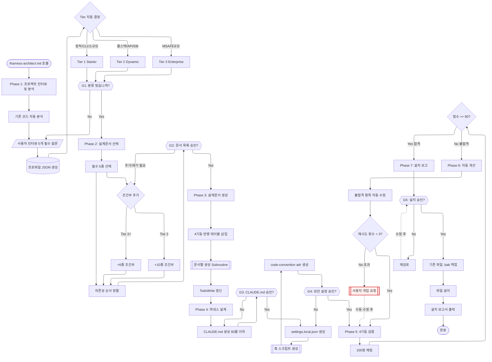
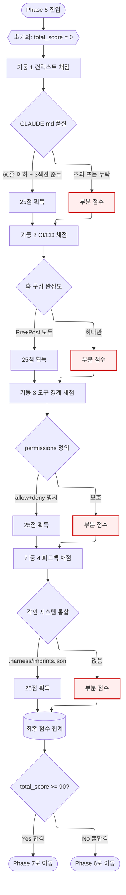
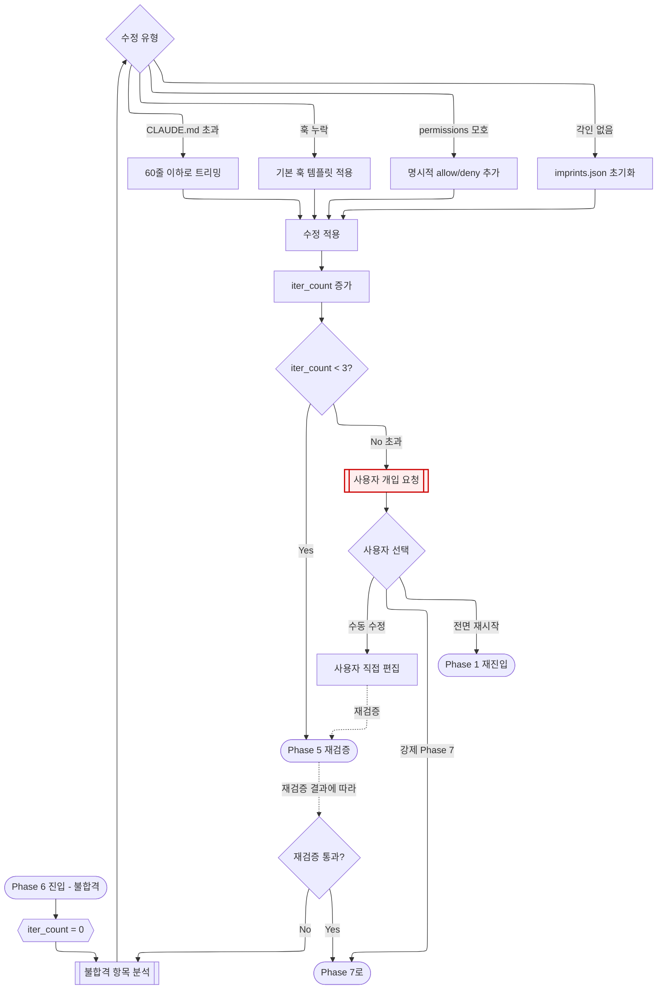

# harness-architect -- Navigator

> SYSTEM_NAVIGATOR 스타일 시각적 네비게이터
> 최종 갱신: 2026-04-10
> SKILL.md와 교차 참조 (이 파일은 SKILL.md의 시각화 계층)

---

## 0. 범례 + 사용법 {#범례--사용법}

### 상태 표시

| 표시 | 의미 |
|------|------|
| **[작동]** | 정상 작동 중 (현재 스킬 실행 가능) |
| **[부분]** | 일부만 작동 (수동 보완 필요) |
| **[미구현]** | 설계만 있고 구현 없음 |

### 다이어그램 규약

- ISO 5807:1985 표준 기호 준수
- Mermaid ELK 렌더러 + `securityLevel: loose`
- 점선 `-.->` = 피드백 루프 (재시도/복귀/학습)
- `:::warning` 클래스 = 에러/차단/실패 블럭
- `click NODE "#anchor"` = 블럭 상세 카드로 이동

### 이 Navigator의 역할

- SKILL.md는 텍스트 워크플로우 명세서
- 이 Navigator.md는 시각적 이해 + 블럭별 상세 설명
- 두 문서는 상호 보완적이며 내용 충돌 시 SKILL.md가 진실 공급원

---

## 1. 전체 워크플로우 체계도 {#전체-체계도}



<details><summary><strong>블럭 바로가기 (다이어그램 클릭 대안)</strong></summary>

[시작](#node-start) · [Phase 1](#node-phase-1) · [코드 분석](#node-p1-analyze) · [사용자 인터뷰](#node-p1-interview) · [프로파일 JSON](#node-p1-profile) · [Tier 결정](#node-p1-tier) · [G1 승인](#node-gate-g1) · [Phase 2](#node-phase-2) · [필수 5종](#node-p2-core) · [조건부 추가](#node-p2-conditional) · [의존성 정렬](#node-p2-order) · [G2 승인](#node-gate-g2) · [Phase 3](#node-phase-3) · [4기둥 반영](#node-p3-4pillar) · [문서 생성](#node-p3-docs) · [Phase 4](#node-phase-4) · [CLAUDE.md](#node-p4-claude-md) · [G3 승인](#node-gate-g3) · [settings.json](#node-p4-settings) · [훅 스크립트](#node-p4-hooks) · [지원 문서](#node-p4-support-docs) · [G4 승인](#node-gate-g4) · [Phase 5](#node-phase-5) · [100점 채점](#node-p5-score) · [Phase 6](#node-phase-6) · [자동 수정](#node-p6-fix) · [사용자 개입](#node-p6-user) · [Phase 7](#node-phase-7) · [G5 승인](#node-gate-g5) · [백업](#node-p7-backup) · [설치](#node-p7-install) · [종료](#node-end) · [**전체 블럭 카탈로그**](#block-catalog)

</details>

**동기**: harness-architect의 7 Phase 파이프라인을 한눈에 이해하고, 각 Decision Gate의 재진입 루프와 Phase 6 자동 개선 루프를 시각화. 이 다이어그램이 SKILL.md의 텍스트 설명을 완전히 시각적으로 대체한다.

[맨 위로](#범례--사용법)

---

## 2. Phase 5: 4기둥 검증 상세 흐름도 {#phase-5-상세}



**동기**: 4기둥 검증은 합격/불합격을 결정하는 가장 중요한 게이트. 각 기둥의 채점 기준과 부분 점수 경로를 명확히 시각화. 합격 시 Phase 7로, 불합격 시 Phase 6으로 분기.

[맨 위로](#범례--사용법)

---

## 3. Phase 6: 자동 개선 루프 흐름도 {#phase-6-상세}



**동기**: 자동 개선은 무한 루프를 방지하면서도 최대한 자동화해야 한다. 3회 한계 + 사용자 개입 3가지 선택지(수동/강제/재시작)로 안전한 에스컬레이션 경로를 명시.

[맨 위로](#범례--사용법)

---

## 4. 블럭 상세 카탈로그 {#block-catalog}

<details><summary>전체 21개 블럭 카드 펼치기</summary>

### 시작 {#node-start}

<!-- AUTO:block-start:START -->
| 항목 | 내용 |
|------|------|
| 소속 | 전체 체계도 진입점 |
| 동기 | 사용자가 새 프로젝트에 하네스를 적용할 때 시작하는 유일한 진입점 |
| 내용 | `/harness-architect init [프로젝트명]` 커맨드 수신 |
| 동작 방식 | 스킬 트리거 감지 후 SKILL.md + knowledge/harness-engineering-guide.md 로드 |
| 상태 | [작동] |
| 관련 파일 | `.agents/skills/harness-architect/SKILL.md`, `knowledge/harness-engineering-guide.md` |
<!-- AUTO:block-start:END -->

[다이어그램으로 복귀](#전체-체계도)

### Phase 1: 프로젝트 인터뷰 및 분석 {#node-phase-1}

| 항목 | 내용 |
|------|------|
| 소속 | Phase 1 (진입) |
| 동기 | 프로젝트 유형/규모/기술스택 파악 없이는 Tier 결정 불가. 잘못된 Tier는 과도/부족한 문서 생성으로 이어짐 |
| 내용 | 기존 코드 자동 분석 + 사용자 인터뷰 5개 필수 질문 + 프로파일 JSON 생성 + Tier 자동 결정 |
| 동작 방식 | Glob으로 package.json/requirements.txt 등 탐색 → AskUserQuestion으로 인터뷰 → 프로파일 객체 생성 → 로직 분기로 Tier 결정 |
| 상태 | [작동] |
| 관련 파일 | `.agents/skills/harness-architect/agents/project-analyzer.md` |

[다이어그램으로 복귀](#전체-체계도)

### 기존 코드 자동 분석 {#node-p1-analyze}

| 항목 | 내용 |
|------|------|
| 소속 | Phase 1 내부 |
| 동기 | 기존 코드가 있으면 수동 질문을 줄일 수 있음. 이미 CLAUDE.md가 있으면 덮어쓰기 경고 필요 |
| 내용 | package.json/requirements.txt/go.mod/Cargo.toml 탐색, .env 패턴 확인, .claude/ 구조 확인 |
| 동작 방식 | Glob + Read로 파일 존재 확인 → 언어/프레임워크 추출 → existing_claude_md 플래그 |
| 상태 | [작동] |
| 관련 파일 | Glob 도구 사용 |

[다이어그램으로 복귀](#전체-체계도)

### 사용자 인터뷰 (필수) {#node-p1-interview}

| 항목 | 내용 |
|------|------|
| 소속 | Phase 1 내부 |
| 동기 | 자동 분석만으로는 프로젝트 의도/규모를 알 수 없음. 5개 질문은 스킵 불가 |
| 내용 | 필수 5개 질문 + 선택 3개 질문 (팀 규모/MSA/예상 기간) |
| 동작 방식 | AskUserQuestion 도구로 순차 질문. 답변을 프로파일 필드에 매핑 |
| 상태 | [작동] |
| 관련 파일 | AskUserQuestion 도구 |

[다이어그램으로 복귀](#전체-체계도)

### 프로파일 JSON 생성 {#node-p1-profile}

| 항목 | 내용 |
|------|------|
| 소속 | Phase 1 내부 |
| 동기 | 프로젝트 정보를 구조화하여 후속 Phase에서 참조 가능하게 만듦 |
| 내용 | project_name, description, type, scale, tier, tech_stack, team_size, has_existing_code, has_existing_claude_md 필드 |
| 동작 방식 | 인터뷰 답변 + 자동 분석 결과를 JSON 객체로 조립. 메모리 유지 (다음 Phase에서 읽음) |
| 상태 | [작동] |
| 관련 파일 | 메모리 상 객체 (파일 저장 안 함) |

[다이어그램으로 복귀](#전체-체계도)

### Tier 자동 결정 {#node-p1-tier}

| 항목 | 내용 |
|------|------|
| 소속 | Phase 1 마지막 단계 |
| 동기 | Tier는 Phase 2의 문서 선택에 직결. 자동 결정으로 사용자 부담 감소 |
| 내용 | Tier 1 (Starter) / Tier 2 (Dynamic) / Tier 3 (Enterprise) 3단계 |
| 동작 방식 | `type`, `database`, `api_type`, `team_size` 조합 로직. 예: 정적+CLI=T1, 풀스택+DB=T2, MSA=T3 |
| 상태 | [작동] |
| 관련 파일 | - |

[다이어그램으로 복귀](#전체-체계도)

### Decision Gate G1 {#node-gate-g1}

| 항목 | 내용 |
|------|------|
| 소속 | Phase 1 완료 게이트 |
| 동기 | 잘못된 분류로 Phase 2~7 전체가 오염되는 것 방지 |
| 내용 | "프로젝트 분석 결과: type/scale/tech_stack. 이 분류가 맞습니까?" |
| 동작 방식 | AskUserQuestion으로 승인 요청. No 시 Phase 1 재진입 (인터뷰 재실행) |
| 상태 | [작동] |
| 관련 파일 | `.agents/skills/harness-architect/hooks/decision-gate.js` |

[다이어그램으로 복귀](#전체-체계도)

### Phase 2: 설계문서 선택 {#node-phase-2}

| 항목 | 내용 |
|------|------|
| 소속 | Phase 2 (진입) |
| 동기 | 28종 전수 생성은 낭비. 필요한 문서만 선별해야 함 (IMP-004) |
| 내용 | 필수 5종 + Tier 2 조건부 6종 + Tier 3 조건부 10종. 의존성 순서 정렬 |
| 동작 방식 | 프로파일 기반 로직 분기. 각 조건부 문서의 선택 조건 평가 |
| 상태 | [작동] |
| 관련 파일 | `.agents/skills/harness-architect/agents/document-selector.md`, `docs/support/design-documents.md` |

[다이어그램으로 복귀](#전체-체계도)

### 필수 5종 선택 {#node-p2-core}

| 항목 | 내용 |
|------|------|
| 소속 | Phase 2 내부 |
| 동기 | 모든 프로젝트에 공통 필요한 최소 문서 세트 |
| 내용 | 1.사업기획서, 2.요구사항정의서, 3.아키텍처설계서, 4.개발표준정의서, 5.도메인+용어사전 |
| 동작 방식 | Tier와 무관하게 항상 선택 |
| 상태 | [작동] |
| 관련 파일 | `docs/support/design-documents.md` |

[다이어그램으로 복귀](#전체-체계도)

### 조건부 추가 선택 {#node-p2-conditional}

| 항목 | 내용 |
|------|------|
| 소속 | Phase 2 내부 |
| 동기 | Tier와 기술스택에 따라 필요 문서가 달라짐. 불필요한 문서는 생성 부담만 증가 |
| 내용 | Tier 2: SRS/상세설계서/ERD/API명세/순서도/인터페이스. Tier 3: 통합설계서/시스템아키텍처/DB설계/테이블정의 등 10종 |
| 동작 방식 | 프로파일 필드 조건 평가. 예: `database != null` 이면 ERD 추가 |
| 상태 | [작동] |
| 관련 파일 | SKILL.md Phase 2 테이블 |

[다이어그램으로 복귀](#전체-체계도)

### 의존성 순서 정렬 {#node-p2-order}

| 항목 | 내용 |
|------|------|
| 소속 | Phase 2 마무리 |
| 동기 | 용어사전이 없으면 다른 문서에서 용어 일관성 보장 불가. 의존성 역순은 재작업 유발 |
| 내용 | 고정 순서: 1.도메인+용어사전 → 2.사업기획서 → 3.요구사항정의서 → 4.아키텍처설계서 → 5.개발표준정의서 → 나머지 |
| 동작 방식 | 선택된 문서 목록을 의존성 그래프에 따라 topological sort |
| 상태 | [작동] |
| 관련 파일 | - |

[다이어그램으로 복귀](#전체-체계도)

### Decision Gate G2 {#node-gate-g2}

| 항목 | 내용 |
|------|------|
| 소속 | Phase 2 완료 게이트 |
| 동기 | 사용자가 특정 문서를 추가/제거하고 싶을 수 있음 |
| 내용 | "이 프로젝트에 필요한 문서 N종: [목록+근거]. 추가/제거할 문서가 있습니까?" |
| 동작 방식 | AskUserQuestion + 응답에 따라 목록 수정 후 Phase 3 진입 |
| 상태 | [작동] |
| 관련 파일 | `hooks/decision-gate.js` |

[다이어그램으로 복귀](#전체-체계도)

### Phase 3: 설계문서 생성 {#node-phase-3}

| 항목 | 내용 |
|------|------|
| 소속 | Phase 3 (진입) |
| 동기 | 문서 내용이 하네스 4기둥을 반영하지 않으면 Phase 4~7의 구조적 강제가 근거 없는 규칙이 됨 |
| 내용 | 각 선택 문서 생성 + 4기둥 반영 테이블 삽입 + TodoWrite 갱신 |
| 동작 방식 | 의존성 순서대로 순차 생성. 각 문서 상단에 4기둥 테이블. 문서별 템플릿 사용 |
| 상태 | [작동] |
| 관련 파일 | `.agents/skills/harness-architect/agents/document-generator.md`, `templates/` |

[다이어그램으로 복귀](#전체-체계도)

### 4기둥 반영 테이블 {#node-p3-4pillar}

| 항목 | 내용 |
|------|------|
| 소속 | Phase 3 공통 |
| 동기 | 각 설계문서가 실제로 하네스와 연결되는 지점을 명시. 문서-코드 괴리 방지 |
| 내용 | 모든 문서 상단에 "기둥1/2/3/4별 이 문서에서의 역할" 테이블 삽입 |
| 동작 방식 | 문서 유형별 기본 4기둥 매핑 템플릿 + 프로젝트 특화 조정 |
| 상태 | [작동] |
| 관련 파일 | `templates/claude-md.template.md` |

[다이어그램으로 복귀](#전체-체계도)

### 문서별 생성 Subroutine {#node-p3-docs}

| 항목 | 내용 |
|------|------|
| 소속 | Phase 3 코어 |
| 동기 | 각 문서는 고유 구조와 핵심 섹션이 있음. 하드코딩된 템플릿 + 프로젝트 특화 채움 |
| 내용 | 사업기획서(개요/목표/범위/리스크), 요구사항정의서(FR/NFR+검증방법), 아키텍처(계층/의존성/보안), 개발표준(네이밍/린터/금지패턴), 도메인+용어사전(개념/한영/약어) |
| 동작 방식 | 문서별 `document-generator.md` 에이전트 호출. 프로파일 JSON을 컨텍스트로 전달 |
| 상태 | [작동] |
| 관련 파일 | `.agents/skills/harness-architect/agents/document-generator.md` |

[다이어그램으로 복귀](#전체-체계도)

### Phase 4: 하네스 설계 {#node-phase-4}

| 항목 | 내용 |
|------|------|
| 소속 | Phase 4 (진입) |
| 동기 | Phase 3에서 만든 문서의 규칙을 실행 가능한 하네스(CLAUDE.md + hooks + permissions)로 변환 |
| 내용 | CLAUDE.md 생성 + settings.local.json + 훅 스크립트 + code-convention.md + adr.md |
| 동작 방식 | 문서에서 규칙 추출 → 4개 파일로 분배 → 60줄/템플릿 제약 준수 |
| 상태 | [작동] |
| 관련 파일 | `.agents/skills/harness-architect/agents/harness-designer.md`, `templates/` |

[다이어그램으로 복귀](#전체-체계도)

### CLAUDE.md 생성 (60줄 이하) {#node-p4-claude-md}

| 항목 | 내용 |
|------|------|
| 소속 | Phase 4 핵심 |
| 동기 | 60줄 초과 시 컨텍스트 비용 증가 + 핵심 규칙 희석 (기둥1 원칙) |
| 내용 | 3섹션 구조: 핵심 규칙 / 절대 금지 / 참조 문서. 세부 규칙은 code-convention.md 등으로 분리 |
| 동작 방식 | 요구사항정의서 → 핵심규칙 추출, 아키텍처 → 절대금지 추출, 개발표준 → code-convention.md로 분리 |
| 상태 | [작동] |
| 관련 파일 | `templates/claude-md.template.md` |

[다이어그램으로 복귀](#전체-체계도)

### Decision Gate G3: CLAUDE.md 승인 {#node-gate-g3}

| 항목 | 내용 |
|------|------|
| 소속 | Phase 4 중간 게이트 |
| 동기 | CLAUDE.md는 모든 세션에 영향. 사용자가 내용을 정확히 알아야 함 |
| 내용 | 생성된 CLAUDE.md 내용을 전체 표시 후 승인 요청 |
| 동작 방식 | Read 후 콘솔 출력 + AskUserQuestion. No 시 재작성 |
| 상태 | [작동] |
| 관련 파일 | `hooks/decision-gate.js` |

[다이어그램으로 복귀](#전체-체계도)

### settings.local.json 생성 {#node-p4-settings}

| 항목 | 내용 |
|------|------|
| 소속 | Phase 4 |
| 동기 | 기둥 3 (도구 경계) 구현체. 허용/거부 명령어 명시 필수 |
| 내용 | permissions.allow + permissions.deny + hooks (Pre/PostToolUse) |
| 동작 방식 | 템플릿 기반 + 프로젝트 특화 deny 패턴 추가 |
| 상태 | [작동] |
| 관련 파일 | `templates/settings.template.json` |

[다이어그램으로 복귀](#전체-체계도)

### 훅 스크립트 생성 {#node-p4-hooks}

| 항목 | 내용 |
|------|------|
| 소속 | Phase 4 |
| 동기 | 기둥 2 (CI/CD 게이트) 구현체. 런타임 검증 |
| 내용 | pre-tool-guard.js (허용 경로만 쓰기), post-tool-validate.js (금지 패턴 감지) |
| 동작 방식 | 템플릿 복사 + 프로젝트 특화 경로/패턴 주입. 참고: IMP-013 (정규식 파싱은 문자 단위 스캔) |
| 상태 | [작동] |
| 관련 파일 | `templates/hooks-pre-tool-guard.template.sh`, `templates/hooks-post-tool-validate.template.sh` |

[다이어그램으로 복귀](#전체-체계도)

### 지원 문서 생성 {#node-p4-support-docs}

| 항목 | 내용 |
|------|------|
| 소속 | Phase 4 |
| 동기 | CLAUDE.md 60줄 제약 보완. 코딩 규칙/아키텍처 결정 기록 분리 |
| 내용 | code-convention.md (코딩 상세), adr.md (Architecture Decision Records) |
| 동작 방식 | 개발표준정의서 → code-convention.md 변환. 아키텍처설계서 → adr.md 초기 ADR 생성 |
| 상태 | [작동] |
| 관련 파일 | Phase 3 산출물 참조 |

[다이어그램으로 복귀](#전체-체계도)

### Decision Gate G4: 보안 설정 승인 {#node-gate-g4}

| 항목 | 내용 |
|------|------|
| 소속 | Phase 4 종료 게이트 |
| 동기 | deny 패턴이 잘못되면 정상 작업이 차단됨. 사용자 확인 필수 |
| 내용 | settings.local.json의 deny 목록과 훅 동작을 사용자에게 설명 후 승인 |
| 동작 방식 | AskUserQuestion + 수정 요청 시 P4_Settings로 돌아감 |
| 상태 | [작동] |
| 관련 파일 | `hooks/decision-gate.js` |

[다이어그램으로 복귀](#전체-체계도)

### Phase 5: 4기둥 검증 (100점) {#node-phase-5}

| 항목 | 내용 |
|------|------|
| 소속 | Phase 5 전체 |
| 동기 | 설치 전 품질 게이트. 90점 미만 설치는 시스템 결함 위험 |
| 내용 | 기둥1(25) + 기둥2(25) + 기둥3(25) + 기둥4(25) = 100점 |
| 동작 방식 | pillar-checker.js 훅이 각 기둥의 구현체를 정적 분석 후 점수 산출 |
| 상태 | [작동] |
| 관련 파일 | `hooks/pillar-checker.js`, `agents/harness-reviewer.md` |

[다이어그램으로 복귀](#phase-5-상세)

### 100점 채점 {#node-p5-score}

| 항목 | 내용 |
|------|------|
| 소속 | Phase 5 핵심 |
| 동기 | 정량적 합격/불합격 기준 필요 |
| 내용 | 각 기둥별 세부 항목 채점 → 합산 → 총점 |
| 동작 방식 | JSON 점수 객체 반환. {pillar1: 25, pillar2: 20, pillar3: 25, pillar4: 15, total: 85} |
| 상태 | [작동] |
| 관련 파일 | `hooks/pillar-checker.js` |

[다이어그램으로 복귀](#phase-5-상세)

### 4 Pillar 개별 카드 {#node-pillar-1}

| 항목 | 내용 |
|------|------|
| 소속 | Phase 5 서브 블럭 |
| 동기 | 각 기둥의 책임 영역을 명확히 분리 |
| 내용 | **기둥1 컨텍스트**(CLAUDE.md), **기둥2 CI/CD**(훅), **기둥3 도구경계**(permissions), **기둥4 피드백**(각인) |
| 동작 방식 | 각 기둥별 독립 채점 로직. 기둥 간 의존성 없음 (병렬 평가 가능) |
| 상태 | [작동] |
| 관련 파일 | `knowledge/harness-engineering-guide.md` |

[다이어그램으로 복귀](#phase-5-상세)

### Phase 6: 자동 개선 {#node-phase-6}

| 항목 | 내용 |
|------|------|
| 소속 | Phase 6 전체 |
| 동기 | 불합격을 즉시 실패로 처리하지 않고 3회까지 자동 수정 시도 |
| 내용 | 불합격 항목 분석 → 유형별 자동 수정 → Phase 5 재검증 |
| 동작 방식 | 최대 3회 반복 후 여전히 불합격이면 사용자 개입 요청 |
| 상태 | [작동] |
| 관련 파일 | `agents/harness-reviewer.md` |

[다이어그램으로 복귀](#phase-6-상세)

### 자동 수정 적용 {#node-p6-fix}

| 항목 | 내용 |
|------|------|
| 소속 | Phase 6 내부 |
| 동기 | 일반적 실수는 자동 수정 가능 (60줄 초과, 훅 누락 등) |
| 내용 | CLAUDE.md 트리밍, 훅 템플릿 적용, permissions 명시화, 각인 초기화 |
| 동작 방식 | 유형별 수정 함수 호출 → 파일 재작성 → iter_count 증가 |
| 상태 | [부분] -- 일부 수정 유형은 LLM 판단 필요 |

[다이어그램으로 복귀](#phase-6-상세)

### 사용자 개입 요청 {#node-p6-user}

| 항목 | 내용 |
|------|------|
| 소속 | Phase 6 한계 초과 |
| 동기 | 3회 자동 수정 실패는 구조적 문제. 사용자 판단 필수 |
| 내용 | 현재 점수/불합격 항목/시도 내역 표시 + 3가지 선택지 (수동/강제/재시작) |
| 동작 방식 | AskUserQuestion으로 선택지 제공 |
| 상태 | [작동] |

[다이어그램으로 복귀](#phase-6-상세)

### Phase 7: 설치 + 보고 {#node-phase-7}

| 항목 | 내용 |
|------|------|
| 소속 | Phase 7 전체 |
| 동기 | 최종 단계. 실제 파일 시스템에 하네스 배치 |
| 내용 | G5 승인 → .bak 백업 → 파일 설치 → 설치 보고서 |
| 동작 방식 | 설치 대상 파일 확인 → 기존 파일 .bak 백업 → Write로 설치 → TodoWrite 완료 |
| 상태 | [작동] |
| 관련 파일 | 설치 대상: CLAUDE.md, .claude/settings.local.json, .claude/hooks/*, code-convention.md, adr.md, docs/* |

[다이어그램으로 복귀](#전체-체계도)

### Decision Gate G5: 설치 승인 {#node-gate-g5}

| 항목 | 내용 |
|------|------|
| 소속 | Phase 7 진입 게이트 |
| 동기 | 실제 파일 시스템 변경 전 마지막 확인. 되돌리기 어려움 |
| 내용 | 설치 대상 파일 목록 + 각 파일 크기/라인 수 + 기존 파일 덮어쓰기 여부 표시 |
| 동작 방식 | AskUserQuestion + 설치 명세 출력 |
| 상태 | [작동] |
| 관련 파일 | `hooks/decision-gate.js` |

[다이어그램으로 복귀](#전체-체계도)

### 기존 파일 백업 {#node-p7-backup}

| 항목 | 내용 |
|------|------|
| 소속 | Phase 7 내부 |
| 동기 | 설치 후 문제 발견 시 복구 필요 |
| 내용 | 설치 대상 중 이미 존재하는 파일을 `<filename>.bak`로 복사 |
| 동작 방식 | Bash `cp` 또는 fs.copyFileSync로 백업 후 Write 진행 |
| 상태 | [작동] |
| 관련 파일 | - |

[다이어그램으로 복귀](#전체-체계도)

### 파일 설치 {#node-p7-install}

| 항목 | 내용 |
|------|------|
| 소속 | Phase 7 핵심 |
| 동기 | 검증 완료된 하네스 파일을 프로젝트에 실제 배치 |
| 내용 | CLAUDE.md, settings.local.json, hooks/*.js, code-convention.md, adr.md, docs/* 일괄 Write |
| 동작 방식 | 설치 순서: 문서 먼저 → 설정 → 훅 → CLAUDE.md 마지막 (훅이 먼저 있어야 CLAUDE.md Write가 검증됨) |
| 상태 | [작동] |
| 관련 파일 | - |

[다이어그램으로 복귀](#전체-체계도)

### 종료 {#node-end}

| 항목 | 내용 |
|------|------|
| 소속 | 전체 체계도 종료점 |
| 동기 | 완료 신호 + 다음 단계 가이드 |
| 내용 | 설치 완료 메시지 + 100점 중 획득 점수 + 설치된 파일 목록 + 권장 다음 단계 |
| 동작 방식 | TodoWrite로 모든 Phase 완료 표시 + 콘솔 요약 출력 |
| 상태 | [작동] |

[다이어그램으로 복귀](#전체-체계도)

</details>

[맨 위로](#범례--사용법)

---

## 5. 사용 시나리오

### 시나리오 1: Tier 1 Starter 프로젝트 (정적 웹사이트)

```
사용자: /harness-architect init my-portfolio
Phase 1: 기존 코드 없음 감지 → 인터뷰 5개 질문
  - "정적 포트폴리오 웹사이트입니다"
  - "HTML/CSS/JavaScript, Vite"
  - "DB 없음"
  - "API 없음"
  - "웹 UI"
  → Tier 1 Starter 결정
G1: 승인 → Phase 2
Phase 2: 필수 5종 선택 (조건부 0종)
G2: 승인 → Phase 3
Phase 3: 5개 문서 생성 (각각 4기둥 테이블 포함)
Phase 4: CLAUDE.md 40줄 + 기본 훅 + 최소 permissions
G3/G4: 모두 승인 → Phase 5
Phase 5: 검증 결과 95점 (합격)
G5: 승인 → Phase 7
Phase 7: 설치 완료 (8개 파일, 0개 백업)
```

### 시나리오 2: Tier 2 Dynamic 프로젝트 (Next.js 풀스택 + PostgreSQL)

```
사용자: /harness-architect init ecommerce-app
Phase 1: package.json 감지 (Next.js, Prisma, PostgreSQL)
  - 인터뷰: "이커머스 플랫폼, Next.js + Prisma + Postgres, REST API + 웹 UI"
  → Tier 2 Dynamic 결정
G1: 승인 → Phase 2
Phase 2: 필수 5종 + 조건부 5종 (SRS, 상세설계서, ERD, API명세, 인터페이스설계)
G2: "순서도는 빼고 진행해주세요" → 재확정 → 승인 → Phase 3
Phase 3: 10개 문서 생성
Phase 4: CLAUDE.md 55줄 + Pre/Post 훅 + DB 접근 제한 + 기존 CLAUDE.md 덮어쓰기 경고
G3/G4: 승인 → Phase 5
Phase 5: 92점 (합격)
G5: 승인 → Phase 7
Phase 7: 기존 CLAUDE.md .bak 백업 후 설치
```

### 시나리오 3: 자동 개선 루프 활성화 (Phase 6)

```
Phase 5: 검증 결과 78점 (불합격)
  - 기둥 1: 10/25 (CLAUDE.md 87줄, 초과)
  - 기둥 2: 23/25 (훅 정상)
  - 기둥 3: 25/25 (permissions 완벽)
  - 기둥 4: 20/25 (각인 시스템 초기화 누락)
Phase 6 진입 (iter_count = 0)
  - 기둥 1 수정: CLAUDE.md 트리밍 (87줄 → 58줄)
  - 기둥 4 수정: .harness/imprints.json 초기화
iter_count = 1 → Phase 5 재검증
Phase 5: 재검증 결과 93점 (합격)
Phase 7로 진행
```

[맨 위로](#범례--사용법)

---

## 6. 제약사항 및 주의점

### 하네스 엔지니어링 원칙

- **기둥 1 컨텍스트**: CLAUDE.md 60줄 이하 엄수
- **기둥 2 CI/CD**: 모든 규칙은 훅으로 구조적 강제
- **기둥 3 도구경계**: 최소 권한 원칙 (allow + deny 명시)
- **기둥 4 피드백**: 각인 시스템으로 학습 누적

### 각인 참조

- **IMP-004**: 계획 수립 시 28종 설계문서에서 조건 기반 선별 (Phase 2)
- **IMP-012**: 다단계 파이프라인 Phase 순서 100% 준수 (건너뛰기 금지)
- **IMP-013**: 훅 스크립트 정규식은 문자 단위 스캔 (Phase 4)
- **IMP-014**: 메타 문서 자동 갱신은 AUTO 마커 + 원자적 쓰기
- **IMP-016**: 3시간+ 작업은 세션별 분할

### 절대 금지

- Phase 순서 건너뛰기 (G1~G5 Decision Gate 강제)
- CLAUDE.md 60줄 초과
- Phase 6 자동 수정 무한 루프 (3회 한계)
- 기존 파일 덮어쓰기 전 .bak 미생성
- 이모티콘 사용 (post-tool-validate 차단)
- 절대경로 하드코딩

[맨 위로](#범례--사용법)

---

## 7. 갱신 이력

| 날짜 | 변경 | 트리거 |
|------|------|--------|
| 2026-04-10 | 초기 생성 (SYSTEM_NAVIGATOR 스타일 파일럿 Phase A) | 수동 |

[맨 위로](#범례--사용법)
