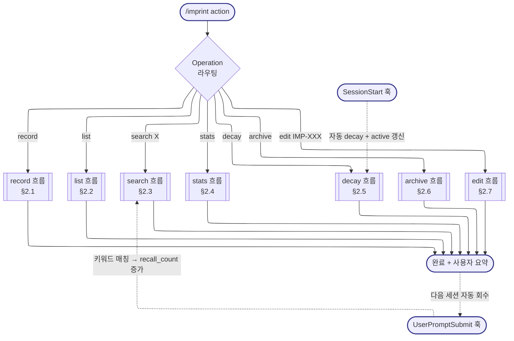
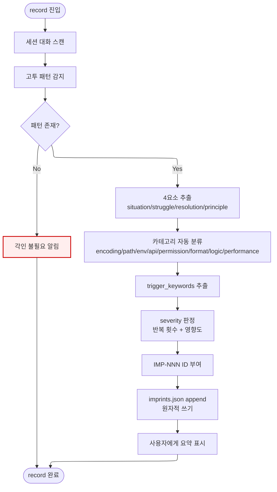
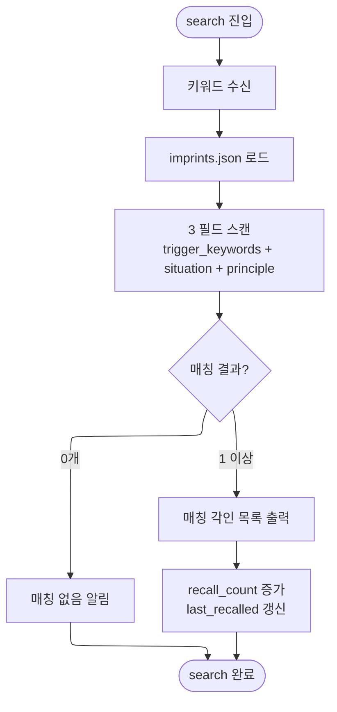
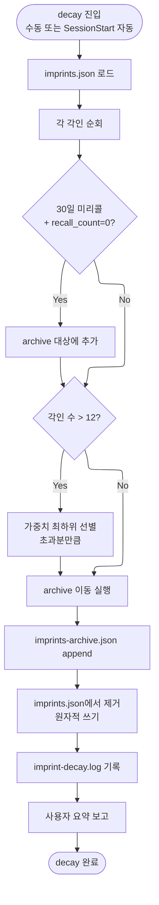
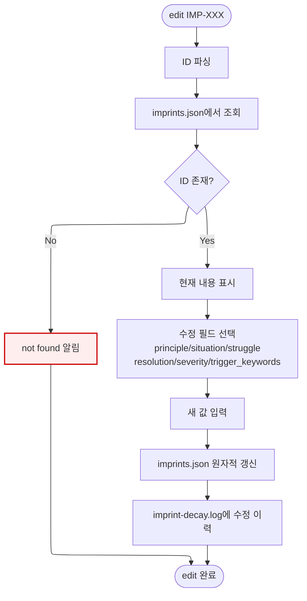

# harness-imprint -- Navigator

> SYSTEM_NAVIGATOR 스타일 시각적 네비게이터
> 최종 갱신: 2026-04-11 (Tier-B Option A 신규 생성)
> SKILL.md와 교차 참조 (이 파일은 SKILL.md의 시각화 계층)

---

## 0. 범례 + 사용법 {#범례--사용법}

### 상태 표시

| 표시 | 의미 |
|------|------|
| **[작동]** | 정상 작동 중 |
| **[부분]** | 일부만 작동 |
| **[미구현]** | 설계만 있고 구현 없음 |

### 다이어그램 규약

- ISO 5807:1985 표준 기호 준수
- Mermaid ELK 렌더러 + `securityLevel: loose`
- 점선 `-.->` = 피드백 루프 (재시도/복귀)
- `:::warning` = 에러/차단/실패 블럭
- `click NODE "#anchor"` = 블럭 상세 카드로 이동

### 스킬 메타

| 항목 | 값 |
|------|-----|
| 이름 | harness-imprint |
| Tier | B |
| 커맨드 | `/imprint [record\|list\|search\|stats\|decay\|archive\|edit]` |
| 프로세스 타입 | Operation Dispatcher (7 operations + 2 자동 훅) |
| 설명 | 진화하는 각인 시스템. 실수를 기록이 아닌 각인으로 저장 → 키워드 매칭 자동 회수 → 회수될수록 가중치 강화 |

### 핵심 철학

> **기록은 찾아봐야 하고, 각인은 자동으로 떠오른다.**

---

## 1. Dispatcher 체계도 {#전체-체계도}

<!-- AUTO:DIAGRAM_MAIN:START -->



<!-- AUTO:DIAGRAM_MAIN:END -->

<details><summary><strong>블럭 바로가기 (다이어그램 클릭 대안)</strong></summary>

[진입](#node-start) · [Dispatcher](#node-dispatch) · [record](#record-상세) · [list](#node-op-list) · [search](#search-상세) · [stats](#node-op-stats) · [decay](#decay-상세) · [archive](#node-op-archive) · [edit](#edit-상세) · [SessionStart 훅](#node-session-start-hook) · [UserPromptSubmit 훅](#node-user-prompt-hook) · [완료](#node-done)
· [**전체 블럭 카탈로그**](#block-catalog)

</details>

[맨 위로](#범례--사용법)

---

## 2. Operation 상세 흐름도

### 2.1 record 상세 {#record-상세}



**감지 패턴**:
- 에러 메시지 반복
- 같은 파일 3회 이상 수정
- 접근 방식 전환
- "안 돼", "다시", "왜 안 되지" 발화

### 2.2 list 흐름

가중치 = `severity 점수 * (1 + recall_count)` 기준 정렬 후 출력.

### 2.3 search 상세 {#search-상세}



### 2.4 stats 흐름

- 총 각인 수, 총 recall 수
- 카테고리별 분포
- 가장 많이 회수된 각인 TOP 3
- 가장 최근 각인

### 2.5 decay 상세 {#decay-상세}



### 2.6 archive 흐름

`imprints-archive.json` 읽기 전용 조회. 복구 필요 시 `/imprint edit` 또는 수동 편집.

### 2.7 edit 상세 {#edit-상세}



[맨 위로](#범례--사용법)

---

## 3. 블럭 상세 카탈로그 {#block-catalog}

<details><summary>블럭 카드 펼치기 (30개)</summary>

### /imprint 진입 {#node-start}

| 항목 | 내용 |
|------|------|
| 소속 | 진입점 |
| 동기 | 사용자 커맨드 또는 자동 훅에서 각인 시스템 접근. 기록은 찾아봐야 하고 각인은 자동으로 떠올라야 함 |
| 내용 | 7가지 operation 중 하나로 라우팅 |
| 동작 방식 | 커맨드 파싱 → Dispatcher 진입 |
| 상태 | [작동] |
| 관련 파일 | `.claude/commands/imprint.md`, SKILL.md |

[다이어그램으로 복귀](#전체-체계도)

### Dispatcher 라우팅 {#node-dispatch}

| 항목 | 내용 |
|------|------|
| 소속 | 중앙 라우터 |
| 동기 | 7가지 operation이 서로 다른 파이프라인을 가지므로 명확한 분기 필요 |
| 내용 | record/list/search/stats/decay/archive/edit 중 선택 |
| 동작 방식 | 첫 번째 인자 기반 switch |
| 상태 | [작동] |
| 관련 파일 | SKILL.md |

[다이어그램으로 복귀](#전체-체계도)

### R1: 세션 대화 스캔 {#node-r1}

| 항목 | 내용 |
|------|------|
| 소속 | record Stage 1 |
| 동기 | 사용자가 "기록해" 말하지 않아도 AI가 스스로 고투를 감지해야 진짜 학습 시스템 |
| 내용 | 현재 세션의 전체 대화를 스캔 |
| 동작 방식 | 컨텍스트 전체 read |
| 상태 | [작동] |
| 관련 파일 | 없음 |

[다이어그램으로 복귀](#record-상세)

### R2: 고투 패턴 감지 {#node-r2}

| 항목 | 내용 |
|------|------|
| 소속 | record Stage 2 |
| 동기 | 4가지 패턴(에러 반복/3회 수정/접근 전환/좌절 발화)은 학습 가치가 있는 순간 |
| 내용 | 각 패턴 매칭 → 감지된 고투 목록 생성 |
| 동작 방식 | LLM 판단 + 휴리스틱 매칭 |
| 상태 | [작동] |
| 관련 파일 | SKILL.md |

[다이어그램으로 복귀](#record-상세)

### R2A: 패턴 존재 분기 {#node-r2a}

| 항목 | 내용 |
|------|------|
| 소속 | 결정 블럭 |
| 동기 | 고투 없는 세션에 억지로 각인 기록하면 품질 저하 |
| 내용 | 감지된 패턴 수 ≥ 1 → 기록 진행, 0 → Skip |
| 동작 방식 | 카운트 체크 |
| 상태 | [작동] |
| 관련 파일 | 없음 |

[다이어그램으로 복귀](#record-상세)

### R Skip {#node-r-skip}

| 항목 | 내용 |
|------|------|
| 소속 | record 조기 종료 |
| 동기 | 불필요한 각인 생성 방지 (12개 한도 보호) |
| 내용 | "이번 세션에서 각인할 고투 없음" 알림 |
| 동작 방식 | 조용한 종료 |
| 상태 | [작동] |
| 관련 파일 | 없음 |

[다이어그램으로 복귀](#record-상세)

### R3: 4요소 추출 {#node-r3}

| 항목 | 내용 |
|------|------|
| 소속 | record Stage 3 |
| 동기 | 각인의 표준 구조화. 4요소가 완비되어야 재사용 가능 |
| 내용 | situation/struggle/resolution/principle 4개 필드 도출 |
| 동작 방식 | LLM 요약 + 구조화 |
| 상태 | [작동] |
| 관련 파일 | 없음 |

[다이어그램으로 복귀](#record-상세)

### R4: 카테고리 자동 분류 {#node-r4}

| 항목 | 내용 |
|------|------|
| 소속 | record Stage 4 |
| 동기 | 카테고리별 통계와 유사 각인 클러스터링 기반 |
| 내용 | 8개 카테고리 중 매칭 (encoding/path-handling/environment/api-failure/permission/format/logic/performance) |
| 동작 방식 | 키워드 기반 휴리스틱 |
| 상태 | [작동] |
| 관련 파일 | 없음 |

[다이어그램으로 복귀](#record-상세)

### R5: trigger_keywords 추출 {#node-r5}

| 항목 | 내용 |
|------|------|
| 소속 | record Stage 5 |
| 동기 | UserPromptSubmit 훅에서 이 키워드로 자동 매칭 → 다음 세션 자동 회수 |
| 내용 | 에러 메시지 핵심 단어 + 관련 기술명 + 한국어 키워드 추출 |
| 동작 방식 | LLM 기반 핵심어 추출 + 수동 검토 |
| 상태 | [작동] |
| 관련 파일 | `prompt-refiner.js` |

[다이어그램으로 복귀](#record-상세)

### R6: severity 판정 {#node-r6}

| 항목 | 내용 |
|------|------|
| 소속 | record Stage 6 |
| 동기 | 가중치 계산의 기반. critical 각인은 절대 놓치면 안 됨 |
| 내용 | critical/high/medium/low 4단계. 반복 횟수 + 영향도 기준 |
| 동작 방식 | 규칙 기반 (반복 ≥ 3 → critical, 반복 ≥ 2 → high) |
| 상태 | [작동] |
| 관련 파일 | 없음 |

[다이어그램으로 복귀](#record-상세)

### R7: IMP-NNN ID 부여 {#node-r7}

| 항목 | 내용 |
|------|------|
| 소속 | record Stage 7 |
| 동기 | 고유 ID로 참조 가능해야 edit/search 가능 |
| 내용 | `IMP-{3자리 순번}` (IMP-001, IMP-002, ...) |
| 동작 방식 | 기존 최대 ID + 1 |
| 상태 | [작동] |
| 관련 파일 | `.harness/imprints.json` |

[다이어그램으로 복귀](#record-상세)

### R8: imprints.json append (원자적) {#node-r8}

| 항목 | 내용 |
|------|------|
| 소속 | record Stage 8 |
| 동기 | 쓰기 중 중단 시 JSON 손상 방지 필수 |
| 내용 | 새 각인 객체를 imprints 배열에 추가 + total_imprints 갱신 |
| 동작 방식 | `.tmp.{timestamp}` 경유 rename |
| 상태 | [작동] |
| 관련 파일 | `.harness/imprints.json` |

[다이어그램으로 복귀](#record-상세)

### R9: 사용자 요약 {#node-r9}

| 항목 | 내용 |
|------|------|
| 소속 | record 종료 |
| 동기 | 사용자가 무엇이 각인됐는지 명확히 인지 |
| 내용 | 신규 각인의 ID + principle 한 줄 표시 |
| 동작 방식 | 문자열 포맷팅 |
| 상태 | [작동] |
| 관련 파일 | 없음 |

[다이어그램으로 복귀](#record-상세)

### list 흐름 {#node-op-list}

| 항목 | 내용 |
|------|------|
| 소속 | list operation |
| 동기 | 전체 각인을 가중치순으로 훑어보고 중요도 파악 |
| 내용 | 가중치 = severity 점수 * (1 + recall_count). 내림차순 정렬 |
| 동작 방식 | JSON 로드 → sort → 포맷 출력 |
| 상태 | [작동] |
| 관련 파일 | `.harness/imprints.json` |

[다이어그램으로 복귀](#전체-체계도)

### S1: 키워드 수신 {#node-s1}

| 항목 | 내용 |
|------|------|
| 소속 | search Stage 1 |
| 동기 | 사용자가 특정 주제로 관련 각인 조회 |
| 내용 | 인자로 전달된 키워드 수신 |
| 동작 방식 | argv 파싱 |
| 상태 | [작동] |
| 관련 파일 | 없음 |

[다이어그램으로 복귀](#search-상세)

### S2: imprints.json 로드 {#node-s2}

| 항목 | 내용 |
|------|------|
| 소속 | search Stage 2 |
| 동기 | 전체 각인 목록 메모리 로드 |
| 내용 | 파일 read + JSON parse |
| 동작 방식 | 단일 read |
| 상태 | [작동] |
| 관련 파일 | `.harness/imprints.json` |

[다이어그램으로 복귀](#search-상세)

### S3: 3 필드 스캔 {#node-s3}

| 항목 | 내용 |
|------|------|
| 소속 | search Stage 3 |
| 동기 | 키워드가 trigger_keywords뿐 아니라 situation/principle 본문에도 있을 수 있음 |
| 내용 | 3 필드에서 키워드 case-insensitive 검색 |
| 동작 방식 | 정규식 또는 `includes()` |
| 상태 | [작동] |
| 관련 파일 | 없음 |

[다이어그램으로 복귀](#search-상세)

### S4: 매칭 결과 분기 {#node-s4}

| 항목 | 내용 |
|------|------|
| 소속 | 결정 블럭 |
| 동기 | 0개와 1+개는 UX가 달라야 함 |
| 내용 | 매칭 수 = 0 → not found, ≥ 1 → 목록 |
| 동작 방식 | 카운트 체크 |
| 상태 | [작동] |
| 관련 파일 | 없음 |

[다이어그램으로 복귀](#search-상세)

### S5: 매칭 각인 목록 {#node-s5}

| 항목 | 내용 |
|------|------|
| 소속 | search Stage 5 |
| 동기 | 여러 매칭 시 모두 보여줘야 사용자가 선택 가능 |
| 내용 | [IMP-XXX] principle + situation 한 줄 요약 |
| 동작 방식 | 포맷 문자열 |
| 상태 | [작동] |
| 관련 파일 | 없음 |

[다이어그램으로 복귀](#search-상세)

### S6: recall_count 증가 {#node-s6}

| 항목 | 내용 |
|------|------|
| 소속 | search Stage 6 (가중치 업데이트) |
| 동기 | 회수될수록 가중치 증가 → 더 자주 떠오르게 (진화 핵심 메커니즘) |
| 내용 | 매칭된 각인의 recall_count += 1, last_recalled = 현재 시각 |
| 동작 방식 | imprints.json 부분 업데이트 (원자적) |
| 상태 | [작동] |
| 관련 파일 | `.harness/imprints.json` |

[다이어그램으로 복귀](#search-상세)

### stats 흐름 {#node-op-stats}

| 항목 | 내용 |
|------|------|
| 소속 | stats operation |
| 동기 | 시스템 건강도 파악 (각인 증가 추세, 카테고리 편중, top 회수 등) |
| 내용 | 총 수 + 총 회수 + 카테고리별 + TOP 3 + 최근 |
| 동작 방식 | JSON 집계 |
| 상태 | [작동] |
| 관련 파일 | `.harness/imprints.json` |

[다이어그램으로 복귀](#전체-체계도)

### D1-D11: decay 상세 블럭 {#node-d1}

| 항목 | 내용 |
|------|------|
| 소속 | decay Stage 1-11 (라이프사이클 관리) |
| 동기 | 사용되지 않는 각인은 archive로 이동하여 active 목록 품질 유지 (12개 한도) |
| 내용 | 30일 미리콜 각인 + 12개 초과 시 가중치 최하위 제거 |
| 동작 방식 | 조건 체크 → archive 이동 → imprints.json 정리 |
| 상태 | [작동] |
| 관련 파일 | `.harness/imprints.json`, `imprints-archive.json`, `imprint-decay.log` |

[다이어그램으로 복귀](#decay-상세)

### D3: 30일 미리콜 체크 {#node-d3}

| 항목 | 내용 |
|------|------|
| 소속 | decay Stage 3 |
| 동기 | 사용되지 않는 각인이 active 목록을 오염시키지 않도록 |
| 내용 | `last_recalled` 기준 30일 + `recall_count === 0` 조건 동시 만족 |
| 동작 방식 | 날짜 연산 + 숫자 비교 |
| 상태 | [작동] |
| 관련 파일 | 없음 |

[다이어그램으로 복귀](#decay-상세)

### D5: 12개 한도 체크 {#node-d5}

| 항목 | 내용 |
|------|------|
| 소속 | decay Stage 5 |
| 동기 | active-imprints.md가 상위 10개만 로드하므로 imprints.json은 12개 내외 유지 |
| 내용 | 각인 수 > 12 → 가중치 하위 순으로 archive 이동 |
| 동작 방식 | sort + slice |
| 상태 | [작동] |
| 관련 파일 | 없음 |

[다이어그램으로 복귀](#decay-상세)

### archive 흐름 {#node-op-archive}

| 항목 | 내용 |
|------|------|
| 소속 | archive operation |
| 동기 | decay된 각인도 열람 가능해야 과거 교훈 회상 가능 |
| 내용 | `imprints-archive.json` 읽기 전용 조회 |
| 동작 방식 | 파일 read + 포맷 출력 |
| 상태 | [작동] |
| 관련 파일 | `.harness/imprints-archive.json` |

[다이어그램으로 복귀](#전체-체계도)

### E1-E8: edit 상세 블럭 {#node-e1}

| 항목 | 내용 |
|------|------|
| 소속 | edit Stage 1-8 (각인 개정) |
| 동기 | 각인이 부정확하거나 더 나은 해결책 발견 시 개정 필요 |
| 내용 | ID 파싱 → 조회 → 필드 선택 → 새 값 → 원자적 갱신 → 이력 기록 |
| 동작 방식 | 대화형 입력 + 원자적 쓰기 |
| 상태 | [작동] |
| 관련 파일 | `.harness/imprints.json`, `imprint-decay.log` |

[다이어그램으로 복귀](#edit-상세)

### SessionStart 훅 (자동 decay + active 갱신) {#node-session-start-hook}

| 항목 | 내용 |
|------|------|
| 소속 | 자동 메커니즘 1 |
| 동기 | 수동으로 /imprint decay 호출 안 해도 매 세션 자동 관리. CLAUDE.md가 active-imprints.md 참조하므로 자동 갱신 필수 |
| 내용 | decay 체크 + active-imprints.md 재생성 + imprints-archive.json 동기화 |
| 동작 방식 | `imprint-session-start.js` 실행 |
| 상태 | [작동] |
| 관련 파일 | `.claude/hooks/imprint-session-start.js`, `.harness/active-imprints.md` |

[다이어그램으로 복귀](#전체-체계도)

### UserPromptSubmit 훅 (키워드 매칭 + recall 증가) {#node-user-prompt-hook}

| 항목 | 내용 |
|------|------|
| 소속 | 자동 메커니즘 2 (핵심) |
| 동기 | 사용자가 무의식적으로 입력한 키워드에서 관련 각인이 자동으로 떠올라야 진정한 "각인". 수동 search는 "기록"과 같음 |
| 내용 | 매 입력마다 trigger_keywords 매칭 → 매칭 각인을 stderr로 알림 → recall_count 자동 증가 |
| 동작 방식 | `prompt-refiner.js`에서 정규식 매칭 |
| 상태 | [작동] |
| 관련 파일 | `.claude/hooks/prompt-refiner.js` |

[다이어그램으로 복귀](#전체-체계도)

### 완료 {#node-done}

| 항목 | 내용 |
|------|------|
| 소속 | 공통 종료점 |
| 동기 | 모든 operation이 이 지점에서 종료되어 사용자 요약 반환 |
| 내용 | 결과 포맷팅 + 출력 |
| 동작 방식 | 콘솔 출력 |
| 상태 | [작동] |
| 관련 파일 | 없음 |

[다이어그램으로 복귀](#전체-체계도)

### NotFound (edit 전용) {#node-e-notfound}

| 항목 | 내용 |
|------|------|
| 소속 | edit 에러 처리 |
| 동기 | 잘못된 ID 입력 시 조용한 실패보다 명시적 알림 |
| 내용 | "IMP-XXX not found. /imprint list로 전체 목록 확인" 메시지 |
| 동작 방식 | 표준 에러 출력 |
| 상태 | [작동] |
| 관련 파일 | 없음 |

[다이어그램으로 복귀](#edit-상세)

</details>

[맨 위로](#범례--사용법)

---

## 4. 각인 데이터 구조

```json
{
  "id": "IMP-004",
  "created": "2026-04-07T22:00:00Z",
  "category": "path-handling",
  "trigger_keywords": ["OneDrive", "공백", "경로", "space"],
  "situation": "OneDrive 경로에 한글+공백이 포함된 파일을 처리할 때",
  "struggle": "subprocess에서 경로가 잘려서 파일을 찾지 못함. 2회 실패",
  "resolution": "경로 전체를 따옴표로 감싸고 raw string 사용",
  "principle": "공백 포함 경로는 반드시 따옴표 + raw string",
  "severity": "high",
  "recall_count": 0,
  "last_recalled": null
}
```

### 필드 의미

| 필드 | 설명 | 예시 |
|:---|:---|:---|
| id | 고유 ID `IMP-NNN` | IMP-004 |
| created | 생성 시각 (ISO 8601) | 2026-04-07T22:00:00Z |
| category | 8개 카테고리 중 하나 | path-handling |
| trigger_keywords | UserPrompt 훅 매칭 키워드 | ["경로", "공백"] |
| situation | 무엇을 하려 했는가 | OneDrive 경로 처리 |
| struggle | 무엇이 안 됐는가 | subprocess 경로 잘림 |
| resolution | 어떻게 해결했는가 | 따옴표 + raw string |
| principle | 1문장 일반화 원칙 | 공백 포함 경로는 따옴표 필수 |
| severity | critical/high/medium/low | high |
| recall_count | 회수 횟수 (진화 지표) | 0 |
| last_recalled | 마지막 회수 시각 | null |

---

## 5. 가중치 계산

```
가중치 = severity_score * (1 + recall_count)

severity_score:
  critical = 4
  high     = 3
  medium   = 2
  low      = 1
```

**예시**:
- IMP-002 (critical, recall 15) = 4 * 16 = **64**
- IMP-001 (high, recall 3) = 3 * 4 = **12**
- IMP-015 (medium, recall 0) = 2 * 1 = **2**

가중치가 클수록 active-imprints.md 상위에 표시.

---

## 6. 사용 시나리오

### 시나리오 1 -- 자동 기록

> **상황**: 작업 중 에러 3회 재시도 후 해결

```
사용자: "안 돼, 다시 해봐"
AI: (에러 재발 감지)
    ...해결 후...
사용자: /imprint record

AI: R1 → R2 감지: "에러 메시지 반복 + 좌절 발화" 패턴
    R3: 4요소 추출
    R4-7: path-handling / ["cp949", "인코딩"] / high / IMP-021
    R8: imprints.json append
    R9: "IMP-021 [high] 원칙: '한글 레거시는 cp949 + errors=replace'"
```

---

### 시나리오 2 -- 자동 회수 (핵심)

> **상황**: 다음 세션에서 사용자가 "인코딩 문제"라고 입력

**UserPromptSubmit 훅 자동 실행**:
1. prompt-refiner.js가 "인코딩" 키워드 감지
2. imprints.json에서 trigger_keywords 매칭: IMP-001, IMP-021
3. stderr로 출력:
```
[각인 IMP-001] 원칙: 한글 레거시 파일은 cp949 + errors='replace'
[각인 IMP-021] 원칙: 한글 레거시는 cp949 + errors=replace
```
4. recall_count 자동 증가: IMP-001 (3 → 4), IMP-021 (0 → 1)
5. AI는 이를 보고 자동으로 해결책 적용

---

### 시나리오 3 -- 수동 검색

> **상황**: 유사 상황에 대응할 과거 경험 조회

```
/imprint search 경로

→ [IMP-004] 공백 포함 경로는 따옴표 + raw string
  상황: OneDrive 경로에 한글+공백 파일 처리
  해결: 경로 전체 따옴표 + raw string
  (recall_count: 2 → 3)
```

---

### 시나리오 4 -- 자동 decay (SessionStart 훅)

> **상황**: 새 세션 시작, 이전에 IMP-015가 30일 미리콜 상태

**SessionStart 훅 자동 실행**:
1. imprints.json 로드 (13개 각인)
2. decay 조건 체크 → IMP-015 해당
3. 12개 초과 → IMP-015를 imprints-archive.json으로 이동
4. imprint-decay.log 기록: `2026-04-11 decay IMP-015 "테스트 각인"`
5. active-imprints.md 재생성 (상위 10개 로드)
6. CLAUDE.md가 이를 참조하므로 에이전트가 자동으로 최신 각인 인지

---

### 시나리오 5 -- 각인 개정 (edit)

> **상황**: IMP-005의 원칙이 부정확해서 수정

```
/imprint edit IMP-005

AI: 현재 각인:
    principle: "위키 경로는 WIKI_ROOT 기준 상대경로"
    severity: high

    수정할 필드는? (principle/situation/struggle/resolution/severity/trigger_keywords)

사용자: principle

AI: 새 값?

사용자: "위키 경로는 항상 WIKI_ROOT(../001_Wiki_AI) 기준 상대경로. 절대경로 금지. guard 허용 목록에 등록 필수"

AI: imprints.json 갱신 + imprint-decay.log에 수정 이력 기록
    "IMP-005 principle 개정 완료"
```

---

[맨 위로](#범례--사용법)

---

## 7. 제약사항 및 공통 주의사항

### 각인 생성 제약

- **12개 한도**: imprints.json에 12개 초과 시 가중치 최하위 자동 archive
- **30일 미리콜**: recall_count=0 상태로 30일 경과 시 자동 archive
- **4요소 필수**: situation/struggle/resolution/principle 누락 금지
- **trigger_keywords 필수**: 최소 2개 이상 (자동 회수 보장)

### 쓰기 안전성

- **원자적 쓰기 필수**: 모든 imprints.json 변경은 `.tmp.{timestamp}` 경유 rename
- **수동 편집 주의**: imprints.json 직접 수정 시 JSON 형식 유지 필수
- **수정 이력**: edit 작업은 반드시 imprint-decay.log에 기록

### 훅 연동

- **SessionStart 훅**: active-imprints.md 자동 갱신 (CLAUDE.md 참조 대상)
- **UserPromptSubmit 훅**: 매칭된 각인 stderr 출력 (에이전트 즉시 인지)
- **훅 비활성화 시**: 수동 `/imprint list`로 대체 가능하지만 "자동으로 떠오름" 철학 훼손

### 공통 금지 사항

- 이모티콘 사용 금지
- 절대경로 하드코딩 금지
- `.harness/imprints.json` 직접 삭제 금지 (archive 경유)
- archive 각인 복구 시 반드시 `/imprint edit` 또는 수동 + 이력 기록

### 각인 참조

- **IMP-014**: Meta 문서 자동 갱신 4종 세트 (marker + atomic + backup + size)
- **IMP-018**: 세션 종료 시 next-session.md 필수 갱신 (llm-wiki Mode 2/3 사용)
- **IMP-019**: scaffold 도구 섹션명 변형 대응
- **IMP-020**: scaffold 후 Write 덮어쓰기 패턴

[맨 위로](#범례--사용법)

---

## 8. 위키 vs 각인 (철학 비교)

| | 위키 (llm-wiki) | 각인 (harness-imprint) |
|---|---|---|
| 저장 위치 | 분산 (000-990 도메인별) | 중앙 (imprints.json 단일) |
| 회수 방식 | 수동 (Read/Grep) | 자동 (UserPromptSubmit 키워드 매칭) |
| 강화 메커니즘 | 없음 (정적) | 회수될수록 recall_count 증가 → 가중치 상승 |
| 진화 | 정적 (한 번 작성) | 동적 (시간이 지날수록 정밀해짐) |
| 폐기 | 수동 삭제 | 자동 decay (30일 + recall=0) |
| 목적 | 지식 축적 + 재사용 | 실수 재발 방지 |

**핵심**: 위키는 "찾아봐야 하는 지식", 각인은 "자동으로 떠오르는 교훈".

---

## 9. 갱신 이력

| 날짜 | 변경 | 트리거 |
|------|------|--------|
| 2026-04-11 | Tier-B Navigator 신규 생성 (SYSTEM_NAVIGATOR 스타일). 4 Mermaid(Dispatcher + record/search/decay/edit 상세) + 30 블럭 카드 | Option A 세션 1 |

[맨 위로](#범례--사용법)
