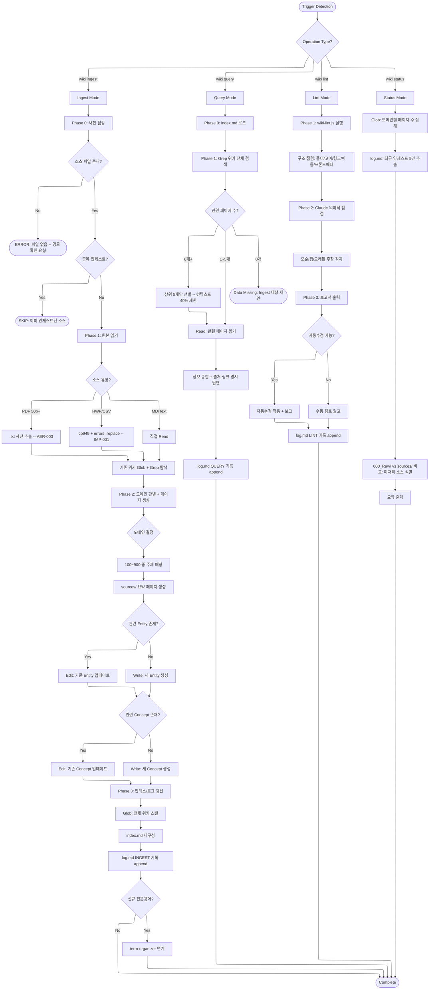

# llm-wiki -- Execution Flow Navigator

LLM-Wiki: Karpathy 3-layer(Raw/Wiki/Schema) + 3-operation(Ingest/Query/Lint) 패턴 기반 지식 관리 스킬.
Claude Code가 위키 에이전트로서 001_Wiki_AI의 마크다운 위키를 점진적으로 구축/유지한다.

---

## Full Execution Flow



---

## Usage Scenarios

### Scenario 1 -- 학술 논문 인제스트

**상황**: 사용자가 Transformer 관련 논문 PDF를 위키에 추가하고 싶다.

```
User: "이 논문 위키에 추가해줘" + Attention Is All You Need.pdf

Flow:
1. 000_Raw/papers/에 PDF 확인 (이미 저장됨)
2. AER-003: 50p+ PDF이므로 .txt 사전 추출
3. Grep: 기존 위키에서 "Transformer", "Attention" 검색
   -> 100_AI_ML/entities/에 관련 페이지 없음 (첫 인제스트)
4. 도메인 판별: 100_AI_ML
5. 생성:
   - 100_AI_ML/sources/260408_Attention_Is_All_You_Need_V001.md (소스 요약)
   - 100_AI_ML/entities/Transformer.md (엔티티)
   - 100_AI_ML/entities/Google_Brain.md (엔티티)
   - 100_AI_ML/concepts/Self_Attention.md (개념)
   - 100_AI_ML/concepts/Multi_Head_Attention.md (개념)
6. index.md 재구성: AI_ML 도메인 5페이지 추가
7. log.md: INGEST 기록

Output: "5개 페이지 생성 완료 (entities 2, concepts 2, sources 1). index.md 갱신됨."
```

### Scenario 2 -- 위키 기반 질의응답

**상황**: 이전에 인제스트한 내용을 바탕으로 개념 비교를 요청한다.

```
User: "Transformer와 RNN의 차이점이 뭐야?"

Flow:
1. index.md 로드 -> "Transformer", "RNN" 매칭
2. Grep: 100_AI_ML/ 전체 검색
   -> Transformer.md, Self_Attention.md 발견
   -> RNN 관련 페이지 없음 (미인제스트)
3. 있는 페이지만 Read: Transformer.md, Self_Attention.md
4. 답변: "위키에 Transformer 관련 정보는 있으나, RNN 관련 페이지가 아직 없습니다.
   Transformer의 핵심 특징은 [Self-Attention](100_AI_ML/concepts/Self_Attention.md)
   메커니즘으로... Data Missing: RNN 관련 자료를 000_Raw/에 추가 후
   wiki ingest를 실행하면 비교 분석이 가능합니다."
5. log.md: QUERY 기록
```

### Scenario 3 -- 린트 후 자동수정

**상황**: 여러 번 인제스트 후 위키 건강 상태를 점검한다.

```
User: "위키 린트 해줘"

Flow:
1. wiki-lint.js 실행:
   - ORPHAN: 100_AI_ML/concepts/Batch_Normalization.md (index.md 미등록)
   - BROKEN_LINK: 100_AI_ML/entities/Transformer.md -> ../200_Research_Methods/concepts/Ablation_Study.md (파일 없음)
   - NAMING: 100_AI_ML/entities/260408_GPT.md (entities/에 날짜 접두사 있음)
   - FRONTMATTER: 300_Engineering/concepts/Docker.md (updated 필드 누락)
2. Claude 의미적 점검:
   - GAP: "Attention 메커니즘"이 3개 페이지에서 참조되지만 별도 개념 페이지 없음
   - STALE: 500_Energy_Systems/entities/Solar_Panel.md 120일 미갱신
3. 보고서:
   | CRITICAL | 0 | WARNING | 2 | INFO | 3 |
   자동수정: Batch_Normalization.md를 index.md에 등록, updated 필드 추가
   수동 필요: 깨진 링크(Ablation_Study.md 생성 또는 링크 제거), 파일명 변경(260408_GPT.md -> GPT.md)
```

### Scenario 4 -- 교차 도메인 인제스트

**상황**: AI 기반 에너지 최적화 논문 -- AI와 에너지 두 도메인에 걸친다.

```
User: "이 AI 에너지 최적화 논문 인제스트해줘"

Flow:
1. 원본 읽기: AI를 활용한 태양광 발전량 예측 논문
2. 도메인 판별: 주제가 에너지 -> 500_Energy_Systems (주 도메인)
   AI는 도구로 사용됨 -> 100_AI_ML (부 도메인, 교차 참조만)
3. 생성:
   - 500_Energy_Systems/sources/260408_AI_Solar_Forecast_V001.md (소스 요약)
   - 500_Energy_Systems/entities/Solar_Forecasting.md (에너지 엔티티)
   - 500_Energy_Systems/concepts/PV_Output_Prediction.md (에너지 개념)
4. 기존 페이지 업데이트:
   - 100_AI_ML/entities/LSTM.md에 교차 참조 추가:
     "Related: [Solar_Forecasting](../500_Energy_Systems/entities/Solar_Forecasting.md)"
5. index.md: 500 도메인 +3, 100 도메인 업데이트 반영
6. term-organizer: "PV 출력 예측" 용어 등록

Output: "3개 페이지 생성 (500_Energy_Systems), 1개 페이지 업데이트 (100_AI_ML/entities/LSTM.md)"
```

### Scenario 5 -- 미처리 소스 확인 (Status)

**상황**: 000_Raw/에 여러 파일을 넣어뒀는데 아직 인제스트하지 않은 것이 있는지 확인한다.

```
User: "위키 상태 알려줘"

Flow:
1. 도메인별 집계:
   | 100_AI_ML | 12 pages | 200_Research | 3 pages | 300_Engineering | 7 pages |
2. 최근 인제스트 5건:
   | 260408 14:30 | AI_Solar_Forecast | 500_Energy |
   | 260408 10:15 | Attention_Is_All_You_Need | 100_AI_ML |
   | ...
3. 미처리 소스:
   - 000_Raw/papers/BERT_paper.pdf (sources/에 대응 페이지 없음)
   - 000_Raw/transcripts/lecture_ML_basics.md (미인제스트)
4. 마지막 lint: 260408 16:45 (2시간 전)

Output:
"총 22개 위키 페이지 (6개 도메인).
미처리 소스 2건 발견: BERT_paper.pdf, lecture_ML_basics.md.
인제스트를 권장합니다."
```

---

## Constraints

- WIKI_ROOT = ../001_Wiki_AI (IMP-005, 상대경로 필수)
- 000_Raw/ 수정 절대 금지 (불변 소스)
- Query 시 최대 5 페이지 Read (컨텍스트 40% 제한)
- 이모티콘 금지
- 표준 마크다운 링크만 사용 (`[[wikilink]]` 금지)
- 스크립트는 Node.js로 작성 (IMP-002)
- 편집 전 Read 먼저 (AER-004)
