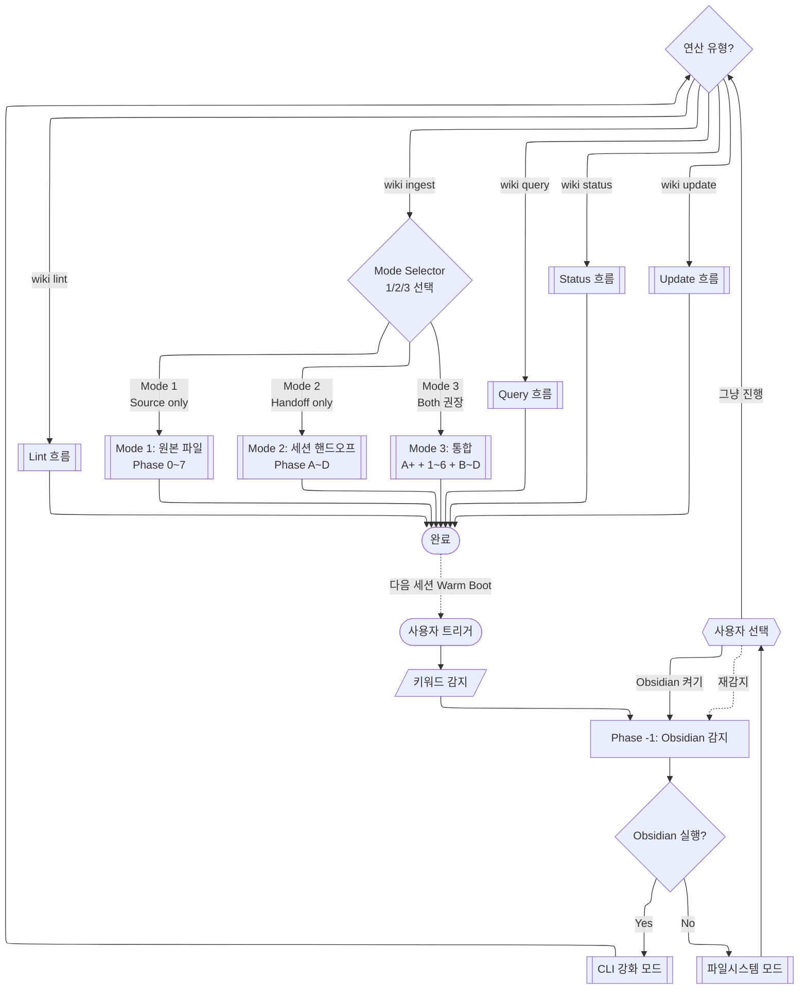
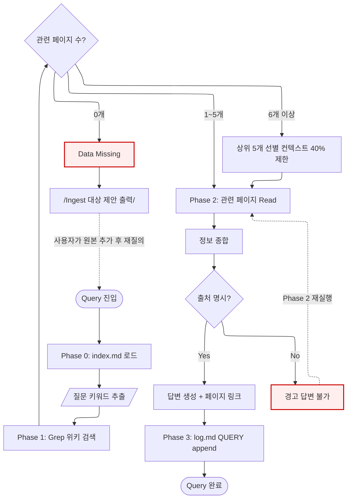

# llm-wiki -- Navigator

> SYSTEM_NAVIGATOR 스타일 시각적 네비게이터
> 최종 갱신: 2026-04-11 (session-handoff 통합 + Mode Selector)
> Karpathy 3-layer + 세션 핸드오프 통합 지식 관리 스킬

---

## 0. 범례 + 사용법 {#범례--사용법}

### 상태 표시

| 표시 | 의미 |
|------|------|
| **[작동]** | 정상 작동 중 |
| **[부분]** | 일부만 작동 (수동 보완 필요) |
| **[미구현]** | 설계만 있고 구현 없음 |

### 다이어그램 규약

- ISO 5807:1985 표준 기호 준수
- Mermaid ELK 렌더러 + `securityLevel: loose`
- 점선 `-.->` = 피드백 루프 (재시도/복귀)
- `:::warning` = 에러/차단/실패 블럭
- `click NODE "#anchor"` = 블럭 상세 카드로 이동

### 5-Operation 요약 + Ingest 3-Mode

| 연산 | 목적 | 주요 Phase | 대표 트리거 |
|------|------|-----------|-------------|
| **Ingest** | 원본 → 위키 + 세션 핸드오프 (Mode Selector) | Mode 1: 0~7 / Mode 2: A~D / Mode 3: 복합 | "위키에 추가", "저장해줘", "핸드오프", "지식화" |
| **Update** | 정본 수정 + 바로가기 동기화 | 0~2 | "위키 수정" |
| **Query** | 위키 기반 질의응답 | 0~3 (인덱스, 검색, 종합, 로그) | "위키에서 검색" |
| **Lint** | 위키 건강 검사 | 1~3 (구조, 의미, 보고) | "위키 린트" |
| **Status** | 위키 현황 요약 | 단일 Phase | "위키 상태" |

**Ingest Mode Selector** (인자 없이 호출 시 번호 선택):

| Mode | 이름 | 동작 | 권장 상황 |
|:----:|------|------|----------|
| **1** | Source only | 기존 원본 파일 → 위키 페이지 변환 (Phase 0~7) | Raw 파일이나 PDF를 위키에 추가 |
| **2** | Session handoff only | 대화 증류 → 로그 + 1st_Log + next-session (Phase A~D) | 위키 지식화 없이 세션만 저장 |
| **3** | Both (권장) | 대화 → 위키 concepts + source + 세션 핸드오프 | 세션 종료 시 3중 백업 |

---

## 1. 3-Operation 디스패처 체계도 {#전체-체계도}



<details><summary><strong>블럭 바로가기 (다이어그램 클릭 대안)</strong></summary>

[사용자 트리거](#node-start) · [Phase -1 Obsidian 감지](#node-phase-neg1) · [모드 확인](#node-mode-check) · [CLI 모드](#node-cli-mode) · [파일시스템 모드](#node-fs-mode) · [연산 유형](#node-op-type) · [Ingest 흐름](#ingest-상세) · [Query 흐름](#query-상세) · [Lint 흐름](#node-lint-flow) · [Status 흐름](#node-status-flow) · [Update 흐름](#node-update-flow) · [**전체 블럭 카탈로그**](#block-catalog)

</details>

**동기**: 5개 연산(Ingest/Query/Lint/Status/Update)의 진입점을 한눈에 구분. Phase -1 Obsidian 감지가 모든 연산에 선행함을 시각화 (IMP-006).

[맨 위로](#범례--사용법)

---

## 2. Mode 1: Source Only 상세 흐름도 (Phase 0~7) {#ingest-상세}

```mermaid
%%{init: {"flowchart": {"defaultRenderer": "elk"}, "securityLevel": "loose"} }%%
flowchart TD
    I_Start([Ingest 진입]) --> I0[Phase 0: 사전 점검]
    I0 --> I0A{소스 파일 존재?}
    I0A -->|No| I0_Err[파일 없음 에러]:::warning
    I0_Err -.->|사용자 경로 확인 요청| I_Start
    I0A -->|Yes| I0B{중복 인제스트?}
    I0B -->|Yes| I0_Dup[SKIP 알림]:::warning
    I0_Dup -.->|사용자 확인 후 재인제스트| I1
    I0B -->|No| I1[Phase 1: 원본 읽기]

    I1 --> I1A{소스 유형?}
    I1A -->|PDF 50p+| I1B[.txt 사전 추출 AER-003]
    I1A -->|HWP/CSV| I1C[cp949 errors=replace IMP-001]
    I1A -->|MD/Text| I1D[직접 Read]
    I1B --> I1E[기존 위키 Glob Grep 탐색]
    I1C --> I1E
    I1D --> I1E

    I1E --> I2[Phase 2: 3축 분류 판정]
    I2 --> I2A[축 1 주제 KDC 매칭]
    I2A --> I2B[축 2 신뢰도 010~070 판정]
    I2B --> I2C[축 3 맥락 프론트매터 context]
    I2C --> I3[Phase 3: 정본 위치 결정]

    I3 --> I3A{자료 정체성}
    I3A -->|논문| I3B[010_Verified]
    I3A -->|정부보고서| I3C[020_Official]
    I3A -->|프로젝트 결과| I3D[050_Projects]
    I3A -->|영상| I3E[060_Media]
    I3A -->|주제| I3F[KDC 해당 폴더]
    I3B --> I3G[("sources/ 요약 페이지 생성")]
    I3C --> I3G
    I3D --> I3G
    I3E --> I3G
    I3F --> I3G

    I3G --> I3H{관련 Entity 존재?}
    I3H -->|Yes| I3I[Edit 기존 Entity 업데이트]
    I3H -->|No| I3J[Write 새 Entity 생성]
    I3I --> I4[Phase 4: 바로가기 생성]
    I3J --> I4

    I4 --> I4A[관련 분류 2~3곳 식별]
    I4A --> I4B{바로가기 필요?}
    I4B -->|Yes| I4C[SHORTCUT.md 자동 생성]
    I4C --> I4D[[정본 shortcuts 배열 갱신 IMP-010]]
    I4D --> I5
    I4B -->|No| I5[Phase 5: Raw archive 이동 IMP-017]

    I5 --> I5A{원본 000_Raw 또는 Clippings?}
    I5A -->|Yes| I5B[("990_Meta/archive/ 이동")]
    I5B --> I5C[파생 위키에 raw_source 프론트매터 추가]
    I5C --> I5D["Raw Source Archive 섹션 본문 추가"]
    I5D --> I6
    I5A -->|No| I6[Phase 6: 인덱스 로그 갱신]

    I6 --> I6A[Glob 전체 위키 스캔]
    I6A --> I6B[index.md 재구성]
    I6B --> I6C[log.md INGEST append]
    I6C --> I7[Phase 7: 연계 스킬]

    I7 --> I7A{신규 전문용어?}
    I7A -->|Yes| I7B[[term-organizer 연계]]
    I7A -->|No| I_Done
    I7B --> I_Done([Ingest 완료])

    click I_Start "#node-ingest-start"
    click I0 "#node-i0"
    click I0A "#node-i0a"
    click I0B "#node-i0b"
    click I1 "#node-i1"
    click I1A "#node-i1-type"
    click I1B "#node-i1-pdf"
    click I1C "#node-i1-hwp"
    click I1E "#node-i1-explore"
    click I2 "#node-i2"
    click I2A "#node-i2-axis1"
    click I2B "#node-i2-axis2"
    click I2C "#node-i2-axis3"
    click I3 "#node-i3"
    click I3G "#node-i3-source"
    click I4 "#node-i4"
    click I4C "#node-i4-shortcut"
    click I4D "#node-i4-sync"
    click I5 "#node-i5"
    click I5B "#node-i5-move"
    click I5C "#node-i5-raw-source"
    click I6 "#node-i6"
    click I6B "#node-i6-index"
    click I6C "#node-i6-log"
    click I7 "#node-i7"
    click I7B "#node-i7-term"
    click I_Done "#node-ingest-done"

    classDef warning fill:#fee,stroke:#c00,stroke-width:2px
```



**동기**: Ingest는 가장 복잡한 연산 (8개 Phase). 피드백 루프 2개(파일 없음 → 경로 재요청, 중복 → 재확인)와 IMP-017 Phase 5 (Raw archive 이동) 신규 반영.

[맨 위로](#범례--사용법)

---

## 3. Query 상세 흐름도 (Phase 0~3) {#query-상세}



**동기**: Query는 컨텍스트 40% 제한(최대 5 페이지)이 핵심 제약. Data Missing 피드백 루프로 사용자에게 추가 인제스트 제안.

[맨 위로](#범례--사용법)

---

## 4. 블럭 상세 카탈로그 {#block-catalog}

<details><summary>전체 22개 블럭 카드 펼치기</summary>

### 사용자 트리거 {#node-start}

<!-- AUTO:block-llm-wiki-start:START -->
| 항목 | 내용 |
|------|------|
| 소속 | 전체 디스패처 진입점 |
| 동기 | llm-wiki 스킬은 자동 트리거 + 수동 커맨드 모두 지원 |
| 내용 | 키워드 감지 (위키, wiki, 인제스트, 지식베이스 등) 또는 명시적 커맨드 |
| 동작 방식 | 트리거 키워드 매칭 → Phase -1 Obsidian 감지로 진입 |
| 상태 | [작동] |
| 관련 파일 | `SKILL.md` (triggers 섹션), `prompt-refiner.js` (각인 리콜) |
<!-- AUTO:block-llm-wiki-start:END -->

[다이어그램으로 복귀](#전체-체계도)

### Phase -1: Obsidian 감지 {#node-phase-neg1}

| 항목 | 내용 |
|------|------|
| 소속 | 전체 디스패처 - 모든 연산 선행 |
| 동기 | IMP-006: Obsidian CLI는 Hybrid 모드 + 폴백 보장. 미실행 시 사용자 선택 필수 |
| 내용 | `obsidian-detect.js` 실행 → `mode: "cli"` 또는 `mode: "filesystem"` 반환 |
| 동작 방식 | Bash로 스크립트 호출 → JSON 파싱 → mode 필드에 따라 분기 |
| 상태 | [작동] |
| 관련 파일 | `.agents/skills/llm-wiki/scripts/obsidian-detect.js` |

[다이어그램으로 복귀](#전체-체계도)

### 모드 확인 {#node-mode-check}

| 항목 | 내용 |
|------|------|
| 소속 | Phase -1 내부 |
| 동기 | CLI 모드는 더 강력한 기능(backlinks, orphans 등) 제공하지만 Obsidian 실행 필요 |
| 내용 | CLI 가능 시 강화 모드, 불가 시 사용자에게 "켜고 재시작 vs 그냥 진행" 질문 |
| 동작 방식 | obsidian-detect.js의 `mode` 필드 검사 |
| 상태 | [작동] |

[다이어그램으로 복귀](#전체-체계도)

### CLI 강화 모드 {#node-cli-mode}

| 항목 | 내용 |
|------|------|
| 소속 | Phase -1 결과 A |
| 동기 | Obsidian CLI는 파일시스템 모드보다 풍부한 기능 제공 |
| 내용 | `obsidian search`, `obsidian backlinks`, `obsidian orphans` 등 15종 명령 사용 가능 |
| 동작 방식 | 모든 CLI 명령에 `vault="001_Wiki_AI"` 파라미터 추가 |
| 상태 | [작동] |
| 관련 파일 | SKILL.md "CLI 강화 명령 매핑" 테이블 |

[다이어그램으로 복귀](#전체-체계도)

### 파일시스템 모드 {#node-fs-mode}

| 항목 | 내용 |
|------|------|
| 소속 | Phase -1 결과 B |
| 동기 | Obsidian 미실행 시에도 위키 연산 가능해야 함 (폴백 보장) |
| 내용 | Glob/Grep/Read/Write/Edit 기본 도구만 사용 |
| 동작 방식 | 백링크, orphan 감지 등은 wiki-lint.js가 수행 |
| 상태 | [작동] |

[다이어그램으로 복귀](#전체-체계도)

### 연산 유형 분기 {#node-op-type}

| 항목 | 내용 |
|------|------|
| 소속 | 디스패처 핵심 |
| 동기 | 5개 연산(Ingest/Query/Lint/Status/Update)은 완전히 다른 흐름 |
| 내용 | 사용자 요청 키워드 + 커맨드로 연산 유형 결정 |
| 동작 방식 | "인제스트/추가/ingest" → Ingest, "검색/찾아줘/뭐야" → Query, "린트/검사" → Lint 등 |
| 상태 | [작동] |

[다이어그램으로 복귀](#전체-체계도)

### Ingest 진입 {#node-ingest-start}

| 항목 | 내용 |
|------|------|
| 소속 | Ingest 흐름 시작 |
| 동기 | 가장 복잡한 연산(8 Phase). 원본 → 위키 변환의 핵심 |
| 내용 | source-path 인자 확인 + Phase 0으로 진입 |
| 동작 방식 | 커맨드: `wiki ingest <source-path>` |
| 상태 | [작동] |

[다이어그램으로 복귀](#ingest-상세)

### Phase 0: 사전 점검 {#node-i0}

| 항목 | 내용 |
|------|------|
| 소속 | Ingest Phase 0 |
| 동기 | 파일 부재 또는 중복 인제스트 조기 감지로 낭비 방지 |
| 내용 | 소스 파일 존재 확인 + log.md에서 중복 여부 검사 |
| 동작 방식 | Read + Grep `log.md` `INGEST.*<source-path>` |
| 상태 | [작동] |

[다이어그램으로 복귀](#ingest-상세)

### Phase 1: 원본 읽기 {#node-i1}

| 항목 | 내용 |
|------|------|
| 소속 | Ingest Phase 1 |
| 동기 | 소스 유형별 적절한 방식으로 읽어야 내용 손실 방지 |
| 내용 | PDF 50p+ → .txt 추출, HWP/CSV → cp949, MD/Text → 직접 Read, 기존 위키 Glob+Grep 탐색 |
| 동작 방식 | 유형 감지 후 분기. AER-003 (PDF) + IMP-001 (cp949) 준수 |
| 상태 | [작동] |
| 관련 파일 | DocKit 스킬 (PDF 변환 시 연계 가능) |

[다이어그램으로 복귀](#ingest-상세)

### Phase 2: 3축 분류 판정 {#node-i2}

| 항목 | 내용 |
|------|------|
| 소속 | Ingest Phase 2 (v3 신규) |
| 동기 | 단일 KDC 분류만으로는 자료의 정체성 파악 부족. 3축으로 입체적 분류 |
| 내용 | 축 1 주제(KDC 001~900), 축 2 신뢰도(010~070), 축 3 맥락(프론트매터 context) |
| 동작 방식 | 각 축별 판정 로직 → 프론트매터 필드로 기록 |
| 상태 | [작동] |
| 관련 파일 | 위키 `CLAUDE.md` (3축 분류 정의) |

[다이어그램으로 복귀](#ingest-상세)

### Phase 3: 정본 위치 결정 {#node-i3}

| 항목 | 내용 |
|------|------|
| 소속 | Ingest Phase 3 |
| 동기 | "이 자료의 정체성은 무엇인가?" 기준으로 정본 1곳 결정 |
| 내용 | 논문 → 010_Verified, 정부보고서 → 020_Official, 프로젝트 → 050_Projects, 영상 → 060_Media, 주제 → KDC 폴더 |
| 동작 방식 | 자료 유형 판정 로직 → 정본 폴더 경로 결정 → `sources/YYMMDD_Subject_V001.md` 생성 |
| 상태 | [작동] |

[다이어그램으로 복귀](#ingest-상세)

### Phase 4: 바로가기 생성 {#node-i4}

| 항목 | 내용 |
|------|------|
| 소속 | Ingest Phase 4 (v3 신규) |
| 동기 | 정본은 1곳이지만 관련 분류에서도 참조 가능해야 함. IMP-010: 정본 수정 시 shortcuts 동기화 필수 |
| 내용 | 관련 분류 2~3곳 식별 → SHORTCUT.md 자동 생성 → 정본 shortcuts[] 갱신 |
| 동작 방식 | `원본파일명_SHORTCUT.md` 생성 (type=shortcut, canonical=정본경로) |
| 상태 | [작동] |
| 관련 파일 | 위키 `CLAUDE.md` (Shortcut 문서 형식) |

[다이어그램으로 복귀](#ingest-상세)

### Phase 5: Raw archive 이동 (IMP-017 신규) {#node-i5}

| 항목 | 내용 |
|------|------|
| 소속 | Ingest Phase 5 (2026-04-10 신규) |
| 동기 | IMP-017: 000_Raw/Clippings는 미처리 입력 큐. 지식화 완료 원본은 990_Meta/archive/로 중앙 보관. Living System Mirror 원칙 |
| 내용 | 원본 파일을 `990_Meta/archive/`로 이동 + 파생 위키에 `raw_source` 프론트매터 추가 + 본문 하단에 "## Raw Source Archive" 섹션 생성 |
| 동작 방식 | Bash mv → 파생 위키 Edit (프론트매터 + 섹션) → 한 원본에서 여러 위키 파생 시 모든 파생 위키에 동일 raw_source 설정 |
| 상태 | [작동] -- 2026-04-10 IMP-017로 도입 |
| 관련 파일 | 위키 `CLAUDE.md` (v3.1 template) |

[다이어그램으로 복귀](#ingest-상세)

### Phase 6: 인덱스/로그 갱신 {#node-i6}

| 항목 | 내용 |
|------|------|
| 소속 | Ingest Phase 6 |
| 동기 | 새 페이지를 추적 가능하게 만들고 이력 보존 |
| 내용 | Glob으로 전체 위키 스캔 → index.md 재구성 ([C] 정본, [S] 바로가기 구분) → log.md INGEST append |
| 동작 방식 | Edit으로 index.md 부분 갱신 또는 Write로 전체 재생성 |
| 상태 | [작동] |

[다이어그램으로 복귀](#ingest-상세)

### Phase 7: 연계 스킬 {#node-i7}

| 항목 | 내용 |
|------|------|
| 소속 | Mode 1 Phase 7 (마지막) |
| 동기 | 신규 전문용어 발견 시 term-organizer로 자동 용어사전 등록. 지식 증류 누락 방지 |
| 내용 | 신규 용어 감지 → term-organizer 스킬 호출. 세션 종료 시 Mode 2/3으로 승격 권장 |
| 동작 방식 | Skill 도구로 term-organizer 호출. 세션 핸드오프는 내장됨 (Mode 2/3) |
| 상태 | [작동] |
| 관련 파일 | `term-organizer` 스킬 |

[다이어그램으로 복귀](#ingest-상세)

---

## 2.5. Mode 2: Session Handoff Only 상세 흐름도 (Phase A~D) {#handoff-상세}

```mermaid
%%{init: {"flowchart": {"defaultRenderer": "elk"}, "securityLevel": "loose"} }%%
flowchart TD
    H_Start([Mode 2 진입<br/>Session Handoff]):::io --> PA[Phase A<br/>Context Analysis]
    PA --> PA1[대화 전체 스캔<br/>프로젝트 귀속 특정]
    PA1 --> Multi{2개 이상<br/>프로젝트?}
    Multi -->|No| Single[단일 프로젝트<br/>4요소 증류]
    Multi -->|Yes| MultiProj[프로젝트별 Q&A 분리<br/>임시파일 N개]
    Single --> QATemp[QA 임시파일 생성<br/>.tmp/qa_YYMMDD_*.md]
    MultiProj --> QATemp

    QATemp --> PB[Phase B<br/>handoff.py 호출]
    PB --> Exec{node 우선<br/>시도?}
    Exec -->|node OK| Run[python handoff.py<br/>via subprocess]
    Exec -->|PATH 없음 IMP-002| Manual[AI 직접 Write<br/>Node 로직 수동 수행]:::warning
    Run --> Log1[개별 로그 생성<br/>Projects/YYMMDD_*/Log/<br/>session_YYMMDD_HHMM.md]
    Manual --> Log1
    Log1 --> Log2[1st_Log.md<br/>대시보드 append]
    Log2 --> Size{500줄<br/>초과?}
    Size -->|Yes| Archive[docs/archive/<br/>자동 분할]
    Size -->|No| PC
    Archive --> PC[Phase C<br/>next-session.md 갱신<br/>IMP-018]

    PC --> NSContent[이전 세션 정보<br/>성과 / 상태<br/>다음 작업 선택지<br/>Warm Boot 체크리스트]
    NSContent --> NSWrite[atomicWriteWithBackup<br/>.bak 자동 생성]
    NSWrite --> PD[Phase D<br/>완료 보고]

    PD --> Cleanup[임시파일 정리<br/>.tmp/qa_*.md 삭제]
    Cleanup --> Report[생성 파일 경로 요약<br/>+ 각인 후보 출력]
    Report --> H_Done([Mode 2 완료]):::io

    H_Done -.->|다음 세션 Warm Boot| Start([첫 Read:<br/>next-session.md])

    classDef warning fill:#fee,stroke:#c00,stroke-width:2px
    classDef io fill:#eef,stroke:#338,stroke-width:2px

    click H_Start "#node-h-start"
    click PA "#node-pa"
    click PA1 "#node-pa-scan"
    click Multi "#node-h-multi"
    click QATemp "#node-qa-temp"
    click PB "#node-pb"
    click Exec "#node-exec-check"
    click Run "#node-run"
    click Manual "#node-manual-fallback"
    click Log1 "#node-log1"
    click Log2 "#node-log2"
    click Size "#node-size"
    click Archive "#node-archive"
    click PC "#node-pc"
    click NSContent "#node-ns-content"
    click NSWrite "#node-ns-write"
    click PD "#node-pd"
    click Cleanup "#node-cleanup"
    click Report "#node-report"
```



**동기**: 세션 종료 시점에 위키 지식화 없이도 시간순 로그 + 진입점을 원자적으로 갱신해야 할 때 사용. Mode 3의 서브셋이며, 빠른 저장에 적합.

[맨 위로](#범례--사용법)

---

## 2.6. Mode 3: Both (통합 세션 종료) 상세 흐름도 {#both-상세}

```mermaid
%%{init: {"flowchart": {"defaultRenderer": "elk"}, "securityLevel": "loose"} }%%
flowchart TD
    B_Start([Mode 3 진입<br/>Both 통합]):::io --> BPA[Phase A<br/>Context Analysis<br/>Mode 2와 동일]
    BPA --> BAPlus[Phase A+<br/>재사용 개념 후보 식별]
    BAPlus --> Extract[3-5개 concept 선정<br/>설계 패턴/워크플로우/표준]

    Extract --> Wiki[Mode 1 Phase 1~6<br/>재사용]
    Wiki --> W1[Phase 1: 기존 위키 탐색<br/>중복 방지]
    W1 --> W2[Phase 2: 3축 분류<br/>KDC + 신뢰도 + 맥락]
    W2 --> W3[Phase 3: concept 페이지 N개<br/>+ source 페이지 1개]
    W3 --> W4[Phase 4: 바로가기 필요 여부]
    W4 --> W5[Phase 5 SKIP<br/>대화는 원본 파일 없음]:::info
    W5 --> W6[Phase 6: index.md + log.md<br/>갱신]

    W6 --> BPB[Phase B<br/>handoff.py 호출<br/>Mode 2와 동일]
    BPB --> BPC[Phase C<br/>next-session.md<br/>Mode 2와 동일]
    BPC --> BPD[Phase D<br/>3중 백업 결과 요약]

    BPD --> Triple[위키 concepts/sources<br/>+ 세션 로그<br/>+ next-session.md]
    Triple --> B_Done([Mode 3 완료<br/>3중 백업 완성]):::io

    B_Done -.->|다음 세션 Warm Boot<br/>3단 복원| Start([1. next-session.md<br/>2. 1st_Log.md<br/>3. 001_Wiki_AI])

    classDef info fill:#eef,stroke:#66a,stroke-width:1px
    classDef io fill:#eef,stroke:#338,stroke-width:2px

    click B_Start "#node-b-start"
    click BPA "#node-pa"
    click BAPlus "#node-a-plus"
    click Extract "#node-extract"
    click Wiki "#node-wiki-reuse"
    click W3 "#node-w3"
    click W5 "#node-w5-skip"
    click W6 "#node-w6"
    click BPB "#node-pb"
    click BPC "#node-pc"
    click BPD "#node-bpd"
    click Triple "#node-triple"
    click B_Done "#node-b-done"
```



**동기**: 세션 종료 시 한 번의 호출로 3중 백업(재사용 지식 + 시간순 로그 + 다음 세션 진입점) 완성. 사용자가 매번 session-handoff, next-session, llm-wiki를 따로 부를 필요를 제거.

[맨 위로](#범례--사용법)

### Query 진입 {#node-query-start}

| 항목 | 내용 |
|------|------|
| 소속 | Query 흐름 시작 |
| 동기 | 사용자 질문에 위키 기반 답변 제공. LLM 환각 방지 (출처 명시) |
| 내용 | 질문 텍스트 수신 → Phase 0 진입 |
| 동작 방식 | 커맨드: `wiki query <question>` 또는 자연어 질문 |
| 상태 | [작동] |

[다이어그램으로 복귀](#query-상세)

### Phase 0: index.md 로드 {#node-q0}

| 항목 | 내용 |
|------|------|
| 소속 | Query Phase 0 |
| 동기 | 전체 위키 스캔 전 인덱스 먼저 확인 (빠른 라우팅) |
| 내용 | index.md Read + 질문 키워드 매칭 |
| 동작 방식 | Read + 정규식/부분 문자열 매칭 |
| 상태 | [작동] |

[다이어그램으로 복귀](#query-상세)

### Phase 1: Grep 위키 검색 {#node-q1}

| 항목 | 내용 |
|------|------|
| 소속 | Query Phase 1 |
| 동기 | 전체 위키에서 관련 페이지 탐색. 5개 초과 시 상위 5개로 제한 (컨텍스트 40% 제한) |
| 내용 | Grep WIKI_ROOT 전체 + 매칭 페이지 카운트 + 5개 초과 시 선별 |
| 동작 방식 | Grep → 결과 count → count 기반 분기 |
| 상태 | [작동] |

[다이어그램으로 복귀](#query-상세)

### Data Missing (피드백 루프) {#node-q-miss}

| 항목 | 내용 |
|------|------|
| 소속 | Query Phase 1 실패 경로 |
| 동기 | 관련 페이지 0개 시 LLM이 환각 답변하지 않도록 명시적 거부 |
| 내용 | "Data Missing -- 000_Raw/에 관련 자료 추가 후 wiki ingest 권장" |
| 동작 방식 | 답변 대신 안내 메시지 출력 → 사용자가 원본 추가 후 재질의 |
| 상태 | [작동] |

[다이어그램으로 복귀](#query-상세)

### Phase 2: 관련 페이지 종합 {#node-q2}

| 항목 | 내용 |
|------|------|
| 소속 | Query Phase 2 |
| 동기 | 여러 페이지 정보를 종합하되 각 주장에 출처 링크 명시 (환각 방지) |
| 내용 | 선별 페이지 Read → 정보 종합 → 답변 생성 |
| 동작 방식 | 각 주장에 `[페이지명](relative/path.md)` 링크 삽입 |
| 상태 | [작동] |

[다이어그램으로 복귀](#query-상세)

### Phase 3: log.md QUERY append {#node-q3}

| 항목 | 내용 |
|------|------|
| 소속 | Query Phase 3 (마지막) |
| 동기 | 질의 이력 보존 (감사 추적, 학습 데이터) |
| 내용 | log.md에 `\| timestamp \| QUERY \| query_text \| summary \|` append |
| 동작 방식 | Edit으로 log.md 테이블 행 추가 |
| 상태 | [작동] |

[다이어그램으로 복귀](#query-상세)

### Lint 흐름 {#node-lint-flow}

| 항목 | 내용 |
|------|------|
| 소속 | 디스패처 분기 - Lint |
| 동기 | 위키 구조/의미 건강 검사 |
| 내용 | Phase 1 wiki-lint.js (구조) + Phase 2 Claude (의미) + Phase 3 보고서 |
| 동작 방식 | Bash로 `node wiki-lint.js "../001_Wiki_AI"` 실행 → Claude 추론 점검 |
| 상태 | [작동] |
| 관련 파일 | `.agents/skills/llm-wiki/scripts/wiki-lint.js` (000_Raw/Clippings/archive 제외) |

[다이어그램으로 복귀](#전체-체계도)

### Status 흐름 {#node-status-flow}

| 항목 | 내용 |
|------|------|
| 소속 | 디스패처 분기 - Status |
| 동기 | 위키 현황 한눈에 파악 (도메인별 페이지 수, 최근 인제스트, 미처리 소스) |
| 내용 | Glob 도메인별 집계 + log.md 최근 5건 + 000_Raw vs sources 비교 |
| 동작 방식 | 읽기 전용 연산 (위키 수정 없음) |
| 상태 | [작동] |

[다이어그램으로 복귀](#전체-체계도)

### Update 흐름 (정본 수정) {#node-update-flow}

| 항목 | 내용 |
|------|------|
| 소속 | 디스패처 분기 - Update (IMP-010) |
| 동기 | 정본 수정 시 shortcuts[] 동기화 필수 (IMP-010) |
| 내용 | Phase 0 정본 확인 (type != shortcut) → Phase 1 정본 Edit → Phase 2 shortcuts 동기화 |
| 동작 방식 | 정본의 title/경로 변경 시 모든 SHORTCUT.md 연쇄 수정 |
| 상태 | [작동] |

[다이어그램으로 복귀](#전체-체계도)

### 완료 {#node-done}

| 항목 | 내용 |
|------|------|
| 소속 | 디스패처 종료점 |
| 동기 | 공통 종료 지점 + 사용자 요약 보고 |
| 내용 | 실행 연산 요약 + 변경 파일 목록 + 다음 권장 단계 |
| 동작 방식 | 콘솔 출력 + log.md 최종 기록 확인 |
| 상태 | [작동] |

[다이어그램으로 복귀](#전체-체계도)

### Mode Selector 분기 {#node-mode-sel}

| 항목 | 내용 |
|------|------|
| 소속 | Ingest 진입 직전 결정 블럭 |
| 동기 | 기존 `wiki ingest`가 원본 파일 인제스트만 지원했으나, 사용자가 매 세션 세 개의 지식 보존 호출(wiki + session-handoff + next-session)을 개별적으로 해야 하는 비용 발생 → 하나의 진입점으로 통합 |
| 내용 | 번호 1/2/3 선택 UI 또는 `--mode=source\|handoff\|both` 인자 기반 분기 |
| 동작 방식 | 인자 없으면 AskUserQuestion으로 대화형, 있으면 직접 라우팅 |
| 상태 | [작동] -- 2026-04-11 도입 |
| 관련 파일 | `.agents/skills/llm-wiki/SKILL.md` (Operations 섹션) |

[다이어그램으로 복귀](#전체-체계도)

### Mode 2 진입: Session Handoff Only {#node-h-start}

| 항목 | 내용 |
|------|------|
| 소속 | Mode 2 진입점 |
| 동기 | 위키 지식화 없이 단순히 세션 로그 + 1st_Log + next-session만 갱신하고 싶을 때 (빠른 저장) |
| 내용 | 기존 session-handoff 스킬의 모든 기능이 이 Mode로 내장됨 |
| 동작 방식 | Phase A → B → C → D 순차 실행 |
| 상태 | [작동] -- 2026-04-11 통합 |
| 관련 파일 | `.agents/skills/llm-wiki/scripts/handoff.py` (이동) |

[다이어그램으로 복귀](#handoff-상세)

### Phase A: Context Analysis (대화 증류) {#node-pa}

| 항목 | 내용 |
|------|------|
| 소속 | Mode 2/3 공통 Phase A |
| 동기 | 시행착오를 제거하고 Goal/Actions/Result/Next Steps 4요소만 추출해야 다음 세션에서 재활용 가능 |
| 내용 | 대화 전체 스캔 → 프로젝트 귀속 특정 → 4요소 도출 → QA 임시파일 생성 |
| 동작 방식 | LLM 기반 대화 분석 + 다중 프로젝트 자동 분리 |
| 상태 | [작동] |
| 관련 파일 | `.tmp/qa_*.md` (임시) |

[다이어그램으로 복귀](#handoff-상세)

### Phase B: handoff.py 호출 (node 우선) {#node-pb}

| 항목 | 내용 |
|------|------|
| 소속 | Mode 2/3 Phase B |
| 동기 | AI가 1st_Log.md를 직접 편집하면 충돌/포맷 오류 가능성. 검증된 스크립트 경유. Python PATH 미보장(IMP-002) 환경에서도 동작해야 함 |
| 내용 | handoff.py에 4요소 + QA 임시파일 경로 전달 → 개별 로그 + 1st_Log + 500줄 archive 원자적 수행 |
| 동작 방식 | node 우선 시도 → python 대체 → 실패 시 AI 직접 Write |
| 상태 | [부분] -- Python 의존성으로 인해 Node 포팅 필요 (IMP-021 후보) |
| 관련 파일 | `.agents/skills/llm-wiki/scripts/handoff.py` |

[다이어그램으로 복귀](#handoff-상세)

### IMP-002 폴백: AI 직접 수동 수행 {#node-manual-fallback}

| 항목 | 내용 |
|------|------|
| 소속 | Phase B 복구 경로 (ISO 5807 Error Handling) |
| 동기 | Windows에서 `python` PATH 미보장 시 handoff.py 실행 실패. 사용자 작업 중단 방지 필요 |
| 내용 | AI가 Read → Write 순서로 handoff.py의 로직을 직접 재현 (session_*.md 생성 + 1st_Log append + 500줄 체크) |
| 동작 방식 | Node Write 도구 기반 원자적 쓰기. atomicWriteWithBackup 재사용 가능 |
| 상태 | [작동] -- 2026-04-11 세션에서 실측 |
| 관련 파일 | `handoff.py` 참조 구현 + `navigator-updater-helpers.js` |

[다이어그램으로 복귀](#handoff-상세)

### Phase C: next-session.md 갱신 (IMP-018) {#node-pc}

| 항목 | 내용 |
|------|------|
| 소속 | Mode 2/3 Phase C |
| 동기 | 다음 세션 Warm Boot 시 첫 Read가 이 파일이어야 맥락 즉시 복원 가능. IMP-018 구조적 강제 |
| 내용 | 템플릿: 이전 세션 정보 / 성과 / 현재 상태 / 다음 작업 선택지 / Warm Boot 체크리스트 / 각인 후보 |
| 동작 방식 | `atomicWriteWithBackup` 사용 → .bak 자동 생성 |
| 상태 | [작동] |
| 관련 파일 | `.harness/next-session.md`, `.claude/hooks/navigator-updater-helpers.js` |

[다이어그램으로 복귀](#handoff-상세)

### Phase D: 완료 보고 + 임시파일 정리 {#node-pd}

| 항목 | 내용 |
|------|------|
| 소속 | Mode 2/3 Phase D (마지막) |
| 동기 | 사용자에게 3중 백업 결과를 명확히 보여주고 임시파일 누적 방지 |
| 내용 | session_*.md + 1st_Log 엔트리 + next-session.md 경로 요약 + `.tmp/qa_*.md` 삭제 |
| 동작 방식 | Markdown 요약 출력 + Bash rm |
| 상태 | [작동] |
| 관련 파일 | 없음 |

[다이어그램으로 복귀](#handoff-상세)

### Mode 3 진입: Both (통합 세션 종료) {#node-b-start}

| 항목 | 내용 |
|------|------|
| 소속 | Mode 3 진입점 (권장 기본) |
| 동기 | 사용자가 매 세션 종료 시 위키 지식화 + 로그 + 진입점 세 가지를 모두 원하지만 한 번의 호출로 처리하고 싶어함 |
| 내용 | Phase A → A+ (개념 식별) → Mode 1 Phase 1~6 (위키 ingest) → Phase B → C → D 복합 실행 |
| 동작 방식 | Mode 2 + Mode 1 재사용 파이프라인 |
| 상태 | [작동] -- 2026-04-11 통합 |
| 관련 파일 | `.agents/skills/llm-wiki/SKILL.md`, `handoff.py` |

[다이어그램으로 복귀](#both-상세)

### Phase A+: 재사용 개념 후보 식별 {#node-a-plus}

| 항목 | 내용 |
|------|------|
| 소속 | Mode 3 전용 Phase A+ |
| 동기 | 대화의 모든 내용이 위키에 가치 있지 않음. 프로젝트 특수 내용과 재사용 가능한 보편 개념을 분리해야 위키 노이즈 방지 |
| 내용 | 설계 패턴, 워크플로우, 표준 매핑, 방법론 등 3-5개 concept 후보 선정 |
| 동작 방식 | LLM 판단 + 기존 위키 Glob/Grep으로 중복 방지 |
| 상태 | [작동] |
| 관련 파일 | 기존 위키 전체 |

[다이어그램으로 복귀](#both-상세)

### Mode 3 Phase 5 SKIP: 대화는 Raw 원본 없음 {#node-w5-skip}

| 항목 | 내용 |
|------|------|
| 소속 | Mode 3 내 Mode 1 Phase 5 변형 |
| 동기 | Mode 1은 물리 파일 원본을 archive로 이동하지만, Mode 3 (대화 기반)은 원본이 없음 |
| 내용 | Raw archive 이동 스킵. `raw_source` 필드는 `Projects/YYMMDD_*/Log/session_*.md`를 가리킴 |
| 동작 방식 | Phase 5 건너뜀 + raw_source 경로 변경 |
| 상태 | [작동] |
| 관련 파일 | 세션 로그 파일 |

[다이어그램으로 복귀](#both-상세)

### Mode 3 완료: 3중 백업 {#node-b-done}

| 항목 | 내용 |
|------|------|
| 소속 | Mode 3 종료점 |
| 동기 | 하나의 호출로 지식 보존의 3가지 계층 모두 갱신 완료 확인 |
| 내용 | (1) 위키 concepts N개 + source 1개, (2) 개별 세션 로그 + 1st_Log, (3) next-session.md |
| 동작 방식 | 3중 백업 결과를 Markdown 표로 출력 |
| 상태 | [작동] |
| 관련 파일 | 전체 |

[다이어그램으로 복귀](#both-상세)

</details>

[맨 위로](#범례--사용법)

---

## 5. 사용 시나리오

### 시나리오 1: 학술 논문 인제스트

**상황**: 사용자가 Transformer 관련 논문 PDF를 위키에 추가하고 싶다.

```
User: "이 논문 위키에 추가해줘" + Attention Is All You Need.pdf

Flow:
1. Phase -1: Obsidian 감지 -> CLI 모드
2. Phase 0: 000_Raw/papers/에 PDF 확인 (이미 저장됨), 중복 없음
3. Phase 1: AER-003 50p+ PDF이므로 .txt 사전 추출 + Grep 기존 위키 탐색
4. Phase 2: 3축 분류
   - 축 1: 500_Technology (AI/ML)
   - 축 2: 010_Verified (정식 논문)
   - 축 3: 005_AI_Project 맥락
5. Phase 3: 정본 위치 = 500_Technology/sources/260410_Attention_Is_All_You_Need_V001.md
   + 500_Technology/entities/Transformer.md 생성
6. Phase 4: 바로가기 생성 생략 (관련 분류 없음)
7. Phase 5: Raw archive 이동 (IMP-017)
   - 000_Raw/papers/Attention_Is_All_You_Need.pdf -> 990_Meta/archive/
   - sources 페이지에 raw_source 프론트매터 + Raw Source Archive 섹션 추가
8. Phase 6: index.md + log.md 갱신
9. Phase 7: "Transformer", "Self-Attention" 용어 term-organizer 연계

Output: "3개 페이지 생성, 원본 archive 이동 완료. index.md 갱신"
```

### 시나리오 2: 위키 기반 질의응답

**상황**: 이전에 인제스트한 내용을 바탕으로 개념 비교를 요청한다.

```
User: "Transformer와 RNN의 차이점이 뭐야?"

Flow:
1. Phase 0: index.md 로드 -> "Transformer", "RNN" 매칭
2. Phase 1: Grep 500_Technology/ 전체 검색
   -> Transformer.md, Self_Attention.md 발견
   -> RNN 관련 페이지 없음 (미인제스트)
3. Phase 2: 있는 페이지만 Read + 답변 생성
   "위키에 Transformer 관련 정보는 있으나 RNN 관련 페이지가 아직 없습니다.
    Transformer의 핵심 특징은 [Self-Attention](500_Technology/concepts/Self_Attention.md)
    메커니즘으로... Data Missing: RNN 관련 자료를 000_Raw/에 추가 후
    wiki ingest를 실행하면 비교 분석이 가능합니다."
4. Phase 3: log.md QUERY 기록

Output: 부분 답변 + Data Missing 안내
```

### 시나리오 3: 린트 후 자동수정

**상황**: 여러 번 인제스트 후 위키 건강 상태를 점검한다.

```
User: "위키 린트 해줘"

Flow:
1. Phase -1: Obsidian CLI 감지
2. Phase 1: wiki-lint.js 실행 (000_Raw/Clippings/archive 제외)
   - ORPHAN: 500_Technology/concepts/Batch_Normalization.md (index.md 미등록)
   - BROKEN_LINK: Transformer.md -> ../200_Research/concepts/Ablation_Study.md (파일 없음)
   - NAMING: entities/260408_GPT.md (날짜 접두사 금지)
   - FRONTMATTER: Docker.md (updated 누락)
3. Phase 2: Claude 의미적 점검
   - GAP: "Attention 메커니즘" 3페이지 참조되나 독립 개념 없음
   - STALE: Solar_Panel.md 120일 미갱신
4. Phase 3: 보고서
   CRITICAL 0 | WARNING 2 | INFO 3
   자동수정: Batch_Normalization.md 등록, updated 필드 추가
   수동 필요: 깨진 링크, 파일명 변경

Output: 상세 린트 보고서
```

### 시나리오 4: 교차 도메인 인제스트

**상황**: AI 기반 에너지 최적화 논문 -- AI와 에너지 두 도메인에 걸친다.

```
User: "이 AI 에너지 최적화 논문 인제스트해줘"

Flow:
1. Phase 1: 원본 읽기 (PV 태양광 발전량 예측)
2. Phase 2: 3축 분류
   - 축 1: 500_Technology (AI + Energy 겹침)
   - 축 2: 010_Verified (논문)
   - 축 3: 연구 맥락
3. Phase 3: 정본 = 500_Technology/sources/260408_AI_Solar_Forecast_V001.md
   + entities/Solar_Forecasting.md (에너지 중심)
4. Phase 4: 바로가기 생성
   - 500_Technology/entities/LSTM.md에 교차 참조 추가
     "Related: [Solar_Forecasting](Solar_Forecasting.md)"
5. Phase 5: Raw archive 이동
6. Phase 6: index.md 갱신
7. Phase 7: "PV 출력 예측" term-organizer 연계

Output: "3개 페이지 생성, 1개 교차 참조 추가, 원본 archive 완료"
```

### 시나리오 5: 미처리 소스 확인 (Status)

**상황**: 000_Raw/에 여러 파일을 넣어뒀는데 미인제스트 확인.

```
User: "위키 상태 알려줘"

Flow:
1. Phase -1: Obsidian 감지
2. 도메인별 집계: 500_Technology 11 pages, 990_Meta 1 archive
3. 최근 INGEST 5건 (log.md)
4. 미처리 소스 감지:
   - 000_Raw/papers/BERT_paper.pdf
   - 000_Raw/transcripts/lecture_ML_basics.md
   (Note: IMP-017 이후 지식화된 원본은 990_Meta/archive/에 있으므로 000_Raw에는 미처리만)
5. 마지막 lint: 2026-04-10 (오늘)

Output:
"총 11개 위키 페이지 (500_Technology).
미처리 소스 2건 발견. 인제스트 권장.
archive 보관: 2개 원본 (SYSTEM_NAVIGATOR, ISO-5807)"
```

[맨 위로](#범례--사용법)

---

## 6. 제약사항

### 경로 규칙

- **WIKI_ROOT** = `../001_Wiki_AI` (IMP-005, 상대경로 필수)
- **000_Raw/Clippings** = 미처리 입력 큐 (수정 금지, 이동만 가능 Phase 5에서)
- **990_Meta/archive/** = 원본 보관소 (수정/삭제 금지, 읽기 전용)
- 절대경로 금지

### 컨텍스트 제약

- **Query 시 최대 5 페이지 Read** (컨텍스트 40% 제한)
- 6개 이상 매칭 시 상위 5개만 선별

### 각인 참조

- **IMP-001**: 한글 레거시 파일은 cp949 + errors='replace'
- **IMP-002**: Windows 스크립트 런타임은 node 우선
- **IMP-005**: 위키 경로는 WIKI_ROOT 기준 상대경로
- **IMP-006**: Obsidian CLI는 Hybrid + 폴백 보장
- **IMP-010**: 위키 정본 수정 시 shortcuts[] 동기화
- **IMP-017** (신규 2026-04-10): Raw layer는 미처리 입력 큐, 지식화 완료 원본은 990_Meta/archive로 이동 + 파생 위키에 raw_source 프론트매터 필수

### 포맷 규칙

- 표준 마크다운 링크만 사용 (`[text](path.md)`)
- `[[wikilink]]` 금지
- 이모티콘 금지
- 스크립트는 Node.js로 작성 (IMP-002)
- 편집 전 Read 먼저 (AER-004)

[맨 위로](#범례--사용법)

---

## 7. 갱신 이력

| 날짜 | 변경 | 트리거 |
|------|------|--------|
| 2026-04-08 | 초기 생성 (기본 Navigator) | 수동 |
| 2026-04-10 | SYSTEM_NAVIGATOR 스타일 업그레이드 (Phase B 파일럿) | 수동 |
|  | ISO 5807 기호 준수, 22 블럭 카드, click 네비게이션, AUTO 마커 | |
|  | IMP-017 Phase 5 Raw archive 이동 신규 반영 | |
|  | 피드백 루프 3개 추가 (Phase 0 재진입, Data Missing, 답변 불가) | |
| 2026-04-11 | **session-handoff 스킬 통합** | 사용자 요청 |
|  | Ingest에 Mode Selector 3모드 추가 (Source/Handoff/Both) | |
|  | handoff.py 이동 (`session-handoff/scripts/` → `llm-wiki/scripts/`) | |
|  | Mode 2/3 상세 흐름도 2개 Mermaid 추가 + 블럭 카드 11개 신규 | |
|  | Warm Boot 피드백 루프 (다음 세션 진입점) 추가 | |

[맨 위로](#범례--사용법)
