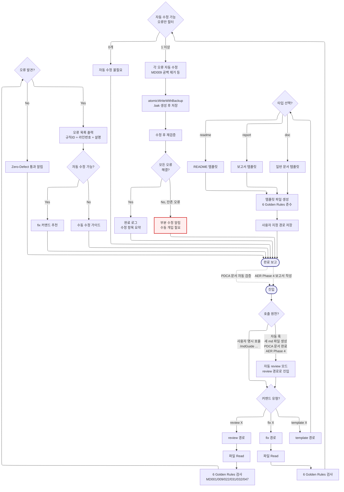

# mdGuide -- Navigator

> SYSTEM_NAVIGATOR 스타일 시각적 네비게이터
> 최종 갱신: 2026-04-11 (Tier-B Option A 세션 2 신규 생성)
> SKILL.md와 교차 참조 (이 파일은 SKILL.md의 시각화 계층)

---

## 0. 범례 + 사용법 {#범례--사용법}

### 상태 표시

| 표시 | 의미 |
|------|------|
| **[작동]** | 정상 작동 중 |
| **[부분]** | 일부만 작동 |
| **[미구현]** | 설계만 있고 구현 없음 |

### 다이어그램 규약

- ISO 5807:1985 표준 기호 준수
- Mermaid ELK 렌더러 + `securityLevel: loose`
- 점선 `-.->` = 피드백 루프 (재시도/복귀)
- `:::warning` = 에러/차단/실패 블럭
- `click NODE "#anchor"` = 블럭 상세 카드로 이동

### 스킬 메타

| 항목 | 값 |
|------|-----|
| 이름 | mdGuide |
| Tier | B |
| 커맨드 | `/mdGuide [review\|fix\|template] [파일경로 또는 타입]` |
| 프로세스 타입 | Branching + Linear (3 커맨드 분기 + 자동 적용 훅) |
| 설명 | Zero-Defect 마크다운 검증 스킬. 6가지 Golden Rules(MD001/009/022/031/032/047) 기반 오류 검출/자동 수정/템플릿 생성 |

---

## 1. 전체 워크플로우 체계도 {#전체-체계도}

<!-- AUTO:DIAGRAM_MAIN:START -->



<!-- AUTO:DIAGRAM_MAIN:END -->

<details><summary><strong>블럭 바로가기 (다이어그램 클릭 대안)</strong></summary>

[진입](#node-start) · [호출 원천](#node-src) · [자동 review](#node-auto-review) · [커맨드 유형](#node-cmd-type) · [review](#node-review) · [R1 Read](#node-r1) · [R2 검사](#node-r2) · [R3 오류 체크](#node-r3) · [R Ok](#node-r-ok) · [R4 목록](#node-r4) · [R5 자동 가능 체크](#node-r5) · [fix 추천](#node-r5-hint) · [수동 가이드](#node-r5-manual) · [fix](#node-fix) · [F1 Read](#node-f1) · [F2 검사](#node-f2) · [F3 필터](#node-f3) · [F None](#node-f-none) · [F4 수정](#node-f4) · [F5 atomic](#node-f5) · [F6 재검증](#node-f6) · [F7 해결 체크](#node-f7) · [F Ok](#node-f-ok) · [부분 수정](#node-f-partial) · [template](#node-template) · [T1 타입](#node-t1) · [readme](#node-t-readme) · [report](#node-t-report) · [doc](#node-t-doc) · [T2 생성](#node-t2) · [T3 저장](#node-t3) · [완료](#node-end)
· [**전체 블럭 카탈로그**](#block-catalog)

</details>

[맨 위로](#범례--사용법)

---

## 2. 블럭 상세 카탈로그 {#block-catalog}

<details><summary>블럭 카드 펼치기 (32개)</summary>

### 진입 {#node-start}

| 항목 | 내용 |
|------|------|
| 소속 | 진입점 |
| 동기 | 마크다운 파일 품질 보장. 잘못된 문법은 렌더링 오류/가독성 저하/협업 마찰 유발 |
| 내용 | 명시 호출 또는 자동 훅으로 진입 |
| 동작 방식 | 커맨드 파싱 또는 훅 트리거 |
| 상태 | [작동] |
| 관련 파일 | `.agents/skills/mdGuide/SKILL.md` |

[다이어그램으로 복귀](#전체-체계도)

### 호출 원천 분기 {#node-src}

| 항목 | 내용 |
|------|------|
| 소속 | 결정 블럭 (Decision) |
| 동기 | 사용자 명시 호출과 자동 훅은 동일 경로로 처리하되, 자동 훅은 기본 review 모드로 고정 |
| 내용 | 명시 호출 → CmdType 직행, 자동 훅 → AutoReview 경유 후 CmdType |
| 동작 방식 | 호출 origin 플래그 체크 |
| 상태 | [작동] |
| 관련 파일 | SKILL.md |

[다이어그램으로 복귀](#전체-체계도)

### 자동 review 모드 {#node-auto-review}

| 항목 | 내용 |
|------|------|
| 소속 | 자동 훅 진입 |
| 동기 | 새 마크다운 파일 생성, PDCA 문서 완료, AER Phase 4 보고서 작성 시 자동 품질 검증 |
| 내용 | review 커맨드 자동 실행 + 오류 발견 시 사용자 알림 |
| 동작 방식 | 훅 컨텍스트에서 review 경로로 강제 진입 |
| 상태 | [작동] |
| 관련 파일 | SKILL.md (자동 적용 조건 섹션) |

[다이어그램으로 복귀](#전체-체계도)

### 커맨드 유형 분기 {#node-cmd-type}

| 항목 | 내용 |
|------|------|
| 소속 | 결정 블럭 (Decision, 3 커맨드 라우팅) |
| 동기 | review/fix/template 3가지 기능이 서로 다른 파이프라인 |
| 내용 | review(검사만) / fix(자동 수정) / template(템플릿 생성) |
| 동작 방식 | 첫 번째 인자 매칭 |
| 상태 | [작동] |
| 관련 파일 | SKILL.md |

[다이어그램으로 복귀](#전체-체계도)

### review 경로 {#node-review}

| 항목 | 내용 |
|------|------|
| 소속 | 커맨드 A (검사 전용, 읽기 전용) |
| 동기 | 파일을 수정하지 않고 오류만 보고. 안전한 탐색 모드 |
| 내용 | Read → 검사 → 오류 목록 → fix 추천 또는 수동 가이드 |
| 동작 방식 | 순차 파이프라인, 파일 쓰기 없음 |
| 상태 | [작동] |
| 관련 파일 | SKILL.md |

[다이어그램으로 복귀](#전체-체계도)

### R1: 파일 Read {#node-r1}

| 항목 | 내용 |
|------|------|
| 소속 | review Stage 1 |
| 동기 | 검사 대상 파일을 메모리로 로드 |
| 내용 | 사용자 지정 파일 경로 Read |
| 동작 방식 | Read 도구 호출 |
| 상태 | [작동] |
| 관련 파일 | 사용자 지정 md 파일 |

[다이어그램으로 복귀](#전체-체계도)

### R2: 6 Golden Rules 검사 {#node-r2}

| 항목 | 내용 |
|------|------|
| 소속 | review Stage 2 (핵심) |
| 동기 | 6가지 규칙으로 마크다운 Zero-Defect 달성 (SKILL.md 명시) |
| 내용 | MD001 제목 레벨 순차 / MD009 줄 끝 공백 / MD022 제목 앞뒤 빈 줄 / MD031 코드블록 앞뒤 빈 줄 / MD032 리스트 앞뒤 빈 줄 / MD047 파일 끝 개행 |
| 동작 방식 | 정규식 또는 markdownlint 기반 검사 |
| 상태 | [작동] |
| 관련 파일 | SKILL.md |

[다이어그램으로 복귀](#전체-체계도)

### R3: 오류 발견 분기 {#node-r3}

| 항목 | 내용 |
|------|------|
| 소속 | 결정 블럭 (Decision) |
| 동기 | 오류 없으면 즉시 통과 알림, 있으면 상세 목록 출력 |
| 내용 | 발견 오류 수 == 0 → ROk, ≥ 1 → R4 |
| 동작 방식 | 카운트 체크 |
| 상태 | [작동] |
| 관련 파일 | 없음 |

[다이어그램으로 복귀](#전체-체계도)

### R Ok: Zero-Defect 통과 {#node-r-ok}

| 항목 | 내용 |
|------|------|
| 소속 | review 정상 종료 |
| 동기 | 오류 없는 파일은 빠르게 통과 알림 (사용자 안심) |
| 내용 | "6 Golden Rules 모두 통과. Zero-Defect 달성" |
| 동작 방식 | 문자열 출력 |
| 상태 | [작동] |
| 관련 파일 | 없음 |

[다이어그램으로 복귀](#전체-체계도)

### R4: 오류 목록 출력 {#node-r4}

| 항목 | 내용 |
|------|------|
| 소속 | review Stage 3 |
| 동기 | 각 오류의 규칙 ID + 라인번호 + 설명을 명확히 제공해야 수정 가능 |
| 내용 | `[MD009] line 42: 줄 끝 공백` 형식 목록 |
| 동작 방식 | Markdown 리스트 출력 |
| 상태 | [작동] |
| 관련 파일 | 없음 |

[다이어그램으로 복귀](#전체-체계도)

### R5: 자동 수정 가능 체크 {#node-r5}

| 항목 | 내용 |
|------|------|
| 소속 | 결정 블럭 (Decision) |
| 동기 | MD009(공백), MD047(개행) 등은 자동 수정 가능, MD001(레벨)은 수동만 |
| 내용 | 발견 오류 중 자동 수정 가능한 것이 있으면 fix 추천 |
| 동작 방식 | 각 규칙 ID별 자동 수정 매핑 테이블 참조 |
| 상태 | [작동] |
| 관련 파일 | SKILL.md |

[다이어그램으로 복귀](#전체-체계도)

### fix 커맨드 추천 {#node-r5-hint}

| 항목 | 내용 |
|------|------|
| 소속 | review 종료 (추천 경로) |
| 동기 | 자동 수정 가능한 오류가 많으면 사용자에게 fix 사용 유도 |
| 내용 | "자동 수정 가능 N개. `/mdGuide fix <파일>` 실행 권장" |
| 동작 방식 | 힌트 메시지 출력 |
| 상태 | [작동] |
| 관련 파일 | 없음 |

[다이어그램으로 복귀](#전체-체계도)

### 수동 수정 가이드 {#node-r5-manual}

| 항목 | 내용 |
|------|------|
| 소속 | review 종료 (수동 경로) |
| 동기 | MD001(레벨 순차)처럼 자동 수정 불가능한 오류는 사용자가 직접 수정해야 함 |
| 내용 | 각 오류별 구체적 수정 방법 가이드 (예: "H1 → H3 대신 H2 추가") |
| 동작 방식 | 규칙별 가이드 템플릿 |
| 상태 | [작동] |
| 관련 파일 | SKILL.md |

[다이어그램으로 복귀](#전체-체계도)

### fix 경로 {#node-fix}

| 항목 | 내용 |
|------|------|
| 소속 | 커맨드 B (자동 수정, 읽기 + 쓰기) |
| 동기 | 수동 수정 시간을 단축. 자동 수정 가능한 오류를 일괄 처리 |
| 내용 | Read → 검사 → 필터 → 수정 → atomic 쓰기 → 재검증 |
| 동작 방식 | review 로직 재사용 + 자동 수정 로직 추가 |
| 상태 | [작동] |
| 관련 파일 | SKILL.md |

[다이어그램으로 복귀](#전체-체계도)

### F1: 파일 Read {#node-f1}

| 항목 | 내용 |
|------|------|
| 소속 | fix Stage 1 |
| 동기 | 수정 전 현재 상태 메모리 로드 |
| 내용 | 사용자 지정 파일 Read |
| 동작 방식 | Read 도구 호출 |
| 상태 | [작동] |
| 관련 파일 | 없음 |

[다이어그램으로 복귀](#전체-체계도)

### F2: 6 Golden Rules 검사 {#node-f2}

| 항목 | 내용 |
|------|------|
| 소속 | fix Stage 2 |
| 동기 | review R2와 동일. 오류 발견 후 자동 수정 대상 선별 |
| 내용 | 6 규칙 검사 결과 수집 |
| 동작 방식 | review R2 로직 재사용 |
| 상태 | [작동] |
| 관련 파일 | SKILL.md |

[다이어그램으로 복귀](#전체-체계도)

### F3: 자동 수정 가능 오류 필터 {#node-f3}

| 항목 | 내용 |
|------|------|
| 소속 | 결정 블럭 (Decision) |
| 동기 | 모든 오류가 아닌 자동 수정 가능한 오류만 처리. 수동 대상은 review에서 처리 |
| 내용 | 자동 가능 오류 수 == 0 → FNone, ≥ 1 → F4 |
| 동작 방식 | 규칙 ID별 자동 수정 플래그 체크 |
| 상태 | [작동] |
| 관련 파일 | 없음 |

[다이어그램으로 복귀](#전체-체계도)

### F None: 자동 수정 불필요 {#node-f-none}

| 항목 | 내용 |
|------|------|
| 소속 | fix 조기 종료 |
| 동기 | 자동 수정 대상 없으면 파일 수정 금지 (원자성) |
| 내용 | "자동 수정 가능 오류 없음. review로 수동 가이드 확인" |
| 동작 방식 | 조용한 종료 |
| 상태 | [작동] |
| 관련 파일 | 없음 |

[다이어그램으로 복귀](#전체-체계도)

### F4: 각 오류 자동 수정 {#node-f4}

| 항목 | 내용 |
|------|------|
| 소속 | fix Stage 3 (핵심) |
| 동기 | 6 규칙 중 자동 수정 가능한 것을 각 규칙별 로직으로 처리 |
| 내용 | MD009 후행 공백 제거 / MD022 제목 앞뒤 빈 줄 삽입 / MD031 코드블록 빈 줄 / MD032 리스트 빈 줄 / MD047 파일 끝 개행 |
| 동작 방식 | 규칙별 정규식 치환 |
| 상태 | [작동] |
| 관련 파일 | SKILL.md |

[다이어그램으로 복귀](#전체-체계도)

### F5: atomicWriteWithBackup 저장 {#node-f5}

| 항목 | 내용 |
|------|------|
| 소속 | fix Stage 4 |
| 동기 | 쓰기 중 중단 시 파일 손상 방지. 롤백 가능성 확보 |
| 내용 | `.tmp.{timestamp}` 경유 rename + 원본 `.bak` 백업 |
| 동작 방식 | 원자적 쓰기 (navigator-updater-helpers.js 재사용 가능) |
| 상태 | [작동] |
| 관련 파일 | `.claude/hooks/navigator-updater-helpers.js` (선택) |

[다이어그램으로 복귀](#전체-체계도)

### F6: 수정 후 재검증 {#node-f6}

| 항목 | 내용 |
|------|------|
| 소속 | fix Stage 5 |
| 동기 | 수정이 실제로 오류를 해결했는지 확인. 부작용 감지 |
| 내용 | 수정된 파일에 R2(6 Golden Rules 검사) 재실행 |
| 동작 방식 | F2 로직 재사용 |
| 상태 | [작동] |
| 관련 파일 | 없음 |

[다이어그램으로 복귀](#전체-체계도)

### F7: 모든 오류 해결 체크 {#node-f7}

| 항목 | 내용 |
|------|------|
| 소속 | 결정 블럭 (Decision) |
| 동기 | 자동 수정이 완벽하지 않을 수 있음. 잔존 오류 감지 필요 |
| 내용 | 재검증 후 오류 수 == 0 → FOk, > 0 → FPartial |
| 동작 방식 | 카운트 체크 |
| 상태 | [작동] |
| 관련 파일 | 없음 |

[다이어그램으로 복귀](#전체-체계도)

### F Ok: 완료 로그 {#node-f-ok}

| 항목 | 내용 |
|------|------|
| 소속 | fix 정상 종료 |
| 동기 | 자동 수정이 모두 성공했음을 명확히 알림 |
| 내용 | "N개 오류 자동 수정 완료. 파일 Zero-Defect 달성" |
| 동작 방식 | 수정 항목 요약 출력 |
| 상태 | [작동] |
| 관련 파일 | 없음 |

[다이어그램으로 복귀](#전체-체계도)

### F Partial: 부분 수정 알림 {#node-f-partial}

| 항목 | 내용 |
|------|------|
| 소속 | fix 복구 경로 |
| 동기 | 자동 수정 후에도 남은 오류가 있으면 사용자 개입 필요 |
| 내용 | "N개 자동 수정, M개 잔존. 수동 개입 필요" + 잔존 오류 목록 |
| 동작 방식 | 목록 출력 + 수동 가이드 |
| 상태 | [작동] |
| 관련 파일 | 없음 |

[다이어그램으로 복귀](#전체-체계도)

### template 경로 {#node-template}

| 항목 | 내용 |
|------|------|
| 소속 | 커맨드 C (생성 전용) |
| 동기 | 신규 마크다운 파일 작성 시 6 Golden Rules 준수 템플릿 제공. 처음부터 Zero-Defect |
| 내용 | readme / report / doc 3가지 타입 중 선택 → 템플릿 생성 |
| 동작 방식 | 타입별 템플릿 상수 + 사용자 경로 저장 |
| 상태 | [작동] |
| 관련 파일 | SKILL.md |

[다이어그램으로 복귀](#전체-체계도)

### T1: 타입 선택 분기 {#node-t1}

| 항목 | 내용 |
|------|------|
| 소속 | 결정 블럭 (Decision) |
| 동기 | 3 템플릿이 서로 다른 구조 (README는 프로젝트 설명, report는 PDCA, doc은 일반) |
| 내용 | readme / report / doc 중 선택 |
| 동작 방식 | 인자 매칭 |
| 상태 | [작동] |
| 관련 파일 | 없음 |

[다이어그램으로 복귀](#전체-체계도)

### T readme: README 템플릿 {#node-t-readme}

| 항목 | 내용 |
|------|------|
| 소속 | template 서브 경로 A |
| 동기 | 프로젝트 루트의 README.md는 가장 많이 작성되는 문서 |
| 내용 | 프로젝트 제목 + 설명 + 설치 + 사용법 + 라이선스 섹션 |
| 동작 방식 | 상수 템플릿 반환 |
| 상태 | [작동] |
| 관련 파일 | SKILL.md |

[다이어그램으로 복귀](#전체-체계도)

### T report: 보고서 템플릿 {#node-t-report}

| 항목 | 내용 |
|------|------|
| 소속 | template 서브 경로 B |
| 동기 | PDCA Report 단계에서 표준 보고서 구조 제공 |
| 내용 | 제목 + 요약 + 목적 + 방법 + 결과 + 결론 섹션 |
| 동작 방식 | 상수 템플릿 반환 |
| 상태 | [작동] |
| 관련 파일 | SKILL.md |

[다이어그램으로 복귀](#전체-체계도)

### T doc: 일반 문서 템플릿 {#node-t-doc}

| 항목 | 내용 |
|------|------|
| 소속 | template 서브 경로 C |
| 동기 | README/보고서가 아닌 일반 문서 (가이드, 메모 등) |
| 내용 | 제목 + 목차 + 본문 + 참고 섹션 |
| 동작 방식 | 상수 템플릿 반환 |
| 상태 | [작동] |
| 관련 파일 | SKILL.md |

[다이어그램으로 복귀](#전체-체계도)

### T2: 템플릿 파일 생성 {#node-t2}

| 항목 | 내용 |
|------|------|
| 소속 | template Stage 2 |
| 동기 | 6 Golden Rules 준수된 초기 파일 제공 |
| 내용 | 선택된 템플릿 문자열을 6 규칙 적용하여 정제 |
| 동작 방식 | 템플릿 + Rules 통과 검증 |
| 상태 | [작동] |
| 관련 파일 | 없음 |

[다이어그램으로 복귀](#전체-체계도)

### T3: 사용자 지정 경로 저장 {#node-t3}

| 항목 | 내용 |
|------|------|
| 소속 | template Stage 3 |
| 동기 | 사용자가 지정한 위치에 템플릿 파일 저장 |
| 내용 | Write 도구로 md 파일 생성 |
| 동작 방식 | atomicWriteWithBackup 선택적 적용 |
| 상태 | [작동] |
| 관련 파일 | 사용자 지정 경로 |

[다이어그램으로 복귀](#전체-체계도)

### 완료 보고 {#node-end}

| 항목 | 내용 |
|------|------|
| 소속 | 공통 종료점 |
| 동기 | 3 커맨드 모두 이 지점에서 종료 + 자동 훅 피드백 루프 진입점 |
| 내용 | 결과 요약 (review 결과 / 수정 항목 / 생성된 템플릿 경로) |
| 동작 방식 | Markdown 출력 |
| 상태 | [작동] |
| 관련 파일 | 없음 |

[다이어그램으로 복귀](#전체-체계도)

</details>

[맨 위로](#범례--사용법)

---

## 3. 6 Golden Rules

| 규칙 ID | 내용 | 예시 | 자동 수정 |
|:---:|:---|:---|:---:|
| **MD001** | 제목 레벨 순차 증가 (H1→H2→H3) | H1 다음 바로 H3 금지 | 불가 |
| **MD009** | 줄 끝 후행 공백 제거 | `text ` → `text` | 가능 |
| **MD022** | 제목 앞뒤 빈 줄 1개 필수 | `\n## 제목\n` | 가능 |
| **MD031** | 코드 블록 앞뒤 빈 줄 | ` ```\n코드\n``` ` | 가능 |
| **MD032** | 리스트 앞뒤 빈 줄 | -- | 가능 |
| **MD047** | 파일 끝 개행 1개 | 마지막 `\n` | 가능 |

**자동 수정 가능**: 5개 (MD009/022/031/032/047)
**수동 수정 필요**: 1개 (MD001 - 문서 구조 재설계 필요)

---

## 4. 자동 적용 조건

mdGuide는 다음 상황에서 자동으로 review 모드로 트리거:

1. **새 마크다운 파일 생성 시**: Write 도구로 `.md` 파일 생성 직후
2. **PDCA 문서 완료 시**: plan/design/report 문서 생성 후
3. **auto-error-recovery Phase 4**: 에러 복구 후 버그 이력 로그 작성 시

자동 모드에서는 review만 실행 (fix/template은 사용자 명시 호출 필요).

---

## 5. 사용 시나리오

### 시나리오 1 -- 수동 review

> **상황**: 작성 완료된 Navigator.md를 검증하고 싶음

```
/mdGuide review .agents/skills/DocKit/DocKit_Navigator.md
```

**AI 응답**:
```
검사 완료. 오류 3개 발견:
- [MD009] line 127: 줄 끝 공백
- [MD022] line 256: ## 제목 앞 빈 줄 누락
- [MD047] line 589: 파일 끝 개행 누락

자동 수정 가능 3개. `/mdGuide fix <파일>` 실행 권장.
```

**흐름**: Start → CmdType(review) → R1 → R2 → R3(Yes) → R4 → R5(자동 가능) → R5Hint → End

---

### 시나리오 2 -- 자동 수정 (fix)

> **상황**: review에서 발견된 오류를 자동 수정

```
/mdGuide fix .agents/skills/DocKit/DocKit_Navigator.md
```

**AI 실행**:
1. F1 Read → F2 검사 → F3(자동 가능 3개) → F4(수정) → F5(.bak 생성) → F6(재검증) → F7(모두 해결) → FOk

**결과**:
```
자동 수정 완료:
- [MD009] 12개 라인 공백 제거
- [MD022] 제목 앞뒤 빈 줄 5개 삽입
- [MD047] 파일 끝 개행 추가

재검증: Zero-Defect 달성.
백업: DocKit_Navigator.md.bak
```

---

### 시나리오 3 -- 템플릿 생성

> **상황**: 신규 보고서 작성

```
/mdGuide template report
```

**AI 응답**: 표준 보고서 템플릿 생성

```markdown
# [보고서 제목]

## 요약

## 목적

## 방법

## 결과

## 결론
```

사용자 지정 경로에 저장.

---

### 시나리오 4 -- 자동 훅 트리거

> **상황**: PDCA Plan 문서 생성 완료 시

1. 사용자: `/plan-plus 신규 기능 설계` 실행
2. plan-plus 완료 → `docs/01-plan/260411_NewFeature_PLAN.md` 생성
3. **자동 훅 트리거**: mdGuide가 자동으로 review 모드 진입
4. 검사 결과 오류 발견 → 즉시 알림
5. 사용자가 `/mdGuide fix` 실행 또는 수동 수정

**흐름**: (외부) → Start → Src(자동 훅) → AutoReview → CmdType(review) → R1~R5 → End

---

### 시나리오 5 -- 수동 수정 가이드 (MD001)

> **상황**: 제목 레벨이 H1 → H3으로 건너뛴 경우

**review 결과**:
```
- [MD001] line 15: 제목 레벨 건너뛰기 (H1 → H3)
  수정 가이드: H1 다음에 H2 추가 또는 H3을 H2로 변경
```

**흐름**: R5(자동 불가) → R5Manual → End. fix 커맨드 추천하지 않음.

---

[맨 위로](#범례--사용법)

---

## 6. 제약사항 및 공통 주의사항

### 검사 제약

- **6 Golden Rules만**: 확장 규칙 사용 금지 (일관성 유지)
- **마크다운 파일만**: `.md`, `.markdown` 확장자만 대상
- **자동 수정 대상 5개만**: MD001은 수동 (문서 구조 재설계 필요)

### 쓰기 안전

- **fix 커맨드**: 반드시 atomicWriteWithBackup 또는 .bak 백업 후 저장
- **review 커맨드**: 파일 쓰기 절대 금지 (읽기 전용)
- **template 커맨드**: 기존 파일 덮어쓰기 시 사용자 확인

### 자동 훅 제약

- **AutoReview 기본**: 자동 훅은 review만 실행, fix/template 금지
- **사용자 알림**: 오류 발견 시 반드시 사용자에게 알림
- **무한 루프 방지**: fix 후 자동 재검증은 1회만 (수정 실패 시 중단)

### 공통 금지 사항

- 이모티콘 사용 금지 (PostToolUse 훅 차단, 이 스킬이 직접 검사)
- 절대경로 하드코딩 금지

### 각인 참조

- **IMP-014**: Meta 문서 자동 갱신 4종 세트 (atomicWriteWithBackup 재사용)
- **IMP-020**: Write 덮어쓰기 패턴 (fix 커맨드에서 재사용)

### 연계 스킬

| 스킬 | 연계 방식 |
|:---|:---|
| pdca | plan/design/report 문서 생성 후 자동 review |
| auto-error-recovery | Phase 4 버그 이력 작성 시 자동 적용 |
| ServiceMaker | 신규 SKILL.md 생성 시 템플릿 참조 |
| llm-wiki | concept/source 페이지 작성 시 review |

[맨 위로](#범례--사용법)

---

## 7. 갱신 이력

| 날짜 | 변경 | 트리거 |
|------|------|--------|
| 2026-04-11 | Tier-B Navigator 신규 생성 (SYSTEM_NAVIGATOR 스타일) | Option A 세션 2 |

[맨 위로](#범례--사용법)
