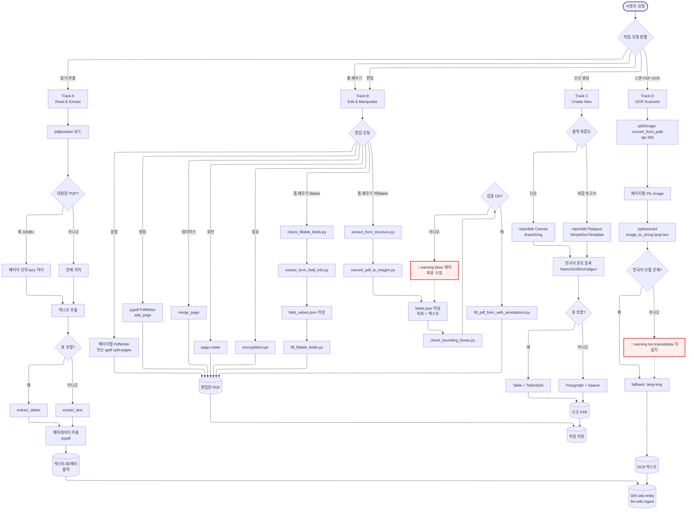

# pdf -- Navigator

> SYSTEM_NAVIGATOR 스타일 시각적 네비게이터
> 최종 갱신: 2026-04-11 (Tier-A 신규 vendor 도입)
> SKILL.md와 교차 참조 (이 파일은 SKILL.md의 시각화 계층)

---

## 0. 범례 + 사용법 {#범례--사용법}

### 상태 표시

| 표시 | 의미 |
|------|------|
| **[작동]** | 정상 작동 (의존성 설치 후) |
| **[부분]** | 환경 의존 (CLI 도구 미설치 시 대체 가능) |
| **[미구현]** | 설계만 있고 구현 없음 |

### 다이어그램 규약

- ISO 5807:1985 표준 기호 준수
- Mermaid ELK 렌더러 + `securityLevel: loose`
- 점선 `-.->` = fallback / 폴백 처리
- `:::warning` = 에러/실패 분기
- `click NODE "#anchor"` = 블럭 상세 카드로 이동

### 스킬 메타

| 항목 | 값 |
|------|-----|
| 이름 | pdf |
| Tier | A |
| 커맨드 | 자동 트리거 (.pdf 파일 언급 시) |
| 프로세스 타입 | Track (4-Track: 읽기 / 편집 / 생성 / OCR) |
| 설명 | PDF 모든 작업 (읽기/편집/병합/분할/생성/폼/OCR). Anthropic 공식 vendor (Proprietary) + 한국화 |

---

## 1. 전체 워크플로우 체계도 {#전체-체계도}

<!-- AUTO:DIAGRAM_MAIN:START -->



> **패턴**: Track -- 4 독립 트랙(읽기 / 편집 / 생성 / OCR)이 작업 유형에 따라 분기. 각 Track은 독립적으로 동작하며 폼 채우기는 Track B 안의 sub-pipeline (8 vendor scripts 활용). 005 통합: 출력은 wiki entity 또는 파일.

<!-- AUTO:DIAGRAM_MAIN:END -->

<details><summary><strong>블럭 바로가기 (다이어그램 클릭 대안)</strong></summary>

[사용자 호출](#node-user-call) · [작업 분기](#node-detect) · [Track A 읽기](#node-track-a) · [Track B 편집](#node-track-b) · [Track C 생성](#node-track-c) · [Track D OCR](#node-track-d) · [pdfplumber 로드](#node-a1-load) · [대용량 분기](#node-a2-large) · [lazy 처리](#node-a3-lazy) · [텍스트/표 추출](#node-a5-extract) · [extract_tables](#node-a7-tables) · [extract_text](#node-a8-text) · [메타데이터](#node-a9-meta) · [추출 출력](#node-a-out) · [병합](#node-b2-merge) · [분할](#node-b3-split) · [회전](#node-b4-rotate) · [워터마크](#node-b5-watermark) · [암호](#node-b6-encrypt) · [check_fillable](#node-b7-check-fillable) · [extract_field_info](#node-b7a-extract-info) · [field_values 작성](#node-b7b-values) · [fill_fillable](#node-b7c-fill) · [extract_structure](#node-b8-structure) · [PDF→이미지](#node-b8a-images) · [fields.json 작성](#node-b8b-fields) · [check_bounding_boxes](#node-b8c-check-bbox) · [bbox 검증](#node-b8d-validate) · [bbox 에러](#node-b-err) · [annotate 채우기](#node-b8e-annotate) · [편집 출력](#node-b-out) · [Canvas 단순](#node-c2-canvas) · [Platypus 보고서](#node-c3-platypus) · [한국어 폰트](#node-c4-font) · [Table 표](#node-c6-table) · [Paragraph 문단](#node-c7-paragraph) · [생성 출력](#node-c-out) · [pdf2image](#node-d1-images) · [PIL Image](#node-d2-pil) · [pytesseract OCR](#node-d3-ocr) · [한국어 모델 체크](#node-d4-kor-check) · [한국어 모델 에러](#node-d-err) · [OCR 결과](#node-d5-result) · [OCR 출력](#node-d-out) · [wiki ingest](#node-wiki-sink) · [파일 저장](#node-file-sink)
 · [**전체 블럭 카탈로그**](#block-catalog)

</details>

[맨 위로](#범례--사용법)

---

## 2. 블럭 상세 카탈로그 {#block-catalog}

<details><summary>블럭 카드 펼치기 (45개)</summary>

### 사용자 호출 {#node-user-call}

| 항목 | 내용 |
|------|------|
| 소속 | Track 진입점 |
| 동기 | PDF 작업 자동 트리거 (.pdf 파일 언급 시) |
| 내용 | "이 PDF 텍스트 추출해줘" / "PDF 병합해줘" / "스캔 PDF OCR해줘" 등 |
| 동작 방식 | 자동 트리거 (.pdf 키워드 매칭) 또는 사용자 명시 호출 |
| 상태 | [작동] |
| 관련 파일 | `.agents/skills/pdf/SKILL.md` |

[다이어그램으로 복귀](#전체-체계도)

### 작업 유형 판별 {#node-detect}

| 항목 | 내용 |
|------|------|
| 소속 | Track 진입 분기 |
| 동기 | 4 Track 중 어떤 작업인지 결정 |
| 내용 | 읽기/추출 / 편집 / 신규 생성 / OCR / 폼 채우기 (편집의 sub) |
| 동작 방식 | LLM이 사용자 의도를 분석하여 Track 선택 |
| 상태 | [작동] |
| 관련 파일 | `.agents/skills/pdf/SKILL.md` |

[다이어그램으로 복귀](#전체-체계도)

### Track A: Read & Extract {#node-track-a}

| 항목 | 내용 |
|------|------|
| 소속 | Track 1/4 (가장 흔한 작업) |
| 동기 | PDF에서 텍스트/표/메타데이터/이미지 추출 |
| 내용 | pdfplumber + pypdf 사용. 한국어 PDF 지원 |
| 동작 방식 | 5 단계: 로드 → 대용량 분기 → 텍스트/표 추출 → 메타 → 출력 |
| 상태 | [작동] |
| 관련 파일 | `.agents/skills/pdf/SKILL.md`, pdfplumber, pypdf |

[다이어그램으로 복귀](#전체-체계도)

### Track B: Edit & Manipulate {#node-track-b}

| 항목 | 내용 |
|------|------|
| 소속 | Track 2/4 (편집 작업 통합) |
| 동기 | 병합/분할/회전/워터마크/암호 + 폼 채우기 |
| 내용 | pypdf 기본 + 8 vendor scripts (폼 전용) |
| 동작 방식 | 7 sub 분기 (병합/분할/회전/워터마크/암호/폼-fillable/폼-비fillable) |
| 상태 | [작동] |
| 관련 파일 | pypdf, qpdf, scripts/* |

[다이어그램으로 복귀](#전체-체계도)

### Track C: Create New {#node-track-c}

| 항목 | 내용 |
|------|------|
| 소속 | Track 3/4 (신규 PDF 생성) |
| 동기 | 보고서/송장/명세서 등 신규 PDF 자동 생성 |
| 내용 | reportlab Canvas (단순) 또는 Platypus (복잡 보고서) |
| 동작 방식 | 한국어 폰트 등록 → Canvas 또는 Platypus → 표/문단 → 저장 |
| 상태 | [작동] (한국어 폰트 등록 필수) |
| 관련 파일 | reportlab |

[다이어그램으로 복귀](#전체-체계도)

### Track D: OCR Scanned {#node-track-d}

| 항목 | 내용 |
|------|------|
| 소속 | Track 4/4 (스캔 PDF) |
| 동기 | 텍스트 추출 불가능한 스캔/이미지 PDF 처리 |
| 내용 | pdf2image + pytesseract 조합. 한국어 OCR 모델 |
| 동작 방식 | PDF → 이미지 (300 dpi) → pytesseract OCR (lang=kor) |
| 상태 | [부분] (tesseract-ocr + kor.traineddata 설치 필요) |
| 관련 파일 | pdf2image, pytesseract |

[다이어그램으로 복귀](#전체-체계도)

### pdfplumber 로드 {#node-a1-load}

| 항목 | 내용 |
|------|------|
| 소속 | Track A 1/5 |
| 동기 | PDF 파일을 메모리에 로드 |
| 내용 | `pdfplumber.open(path)` |
| 동작 방식 | context manager 사용. 자동 close |
| 상태 | [작동] |
| 관련 파일 | pdfplumber |

[다이어그램으로 복귀](#전체-체계도)

### 대용량 PDF 분기 {#node-a2-large}

| 항목 | 내용 |
|------|------|
| 소속 | Track A 2/5 분기 |
| 동기 | 32 MB+ 또는 100+ 페이지 PDF는 메모리 폭발 위험 |
| 내용 | 파일 크기 + 페이지 수 확인 |
| 동작 방식 | os.path.getsize() + len(pdf.pages) |
| 상태 | [작동] |
| 관련 파일 | pdfplumber |

[다이어그램으로 복귀](#전체-체계도)

### 페이지 단위 lazy 처리 {#node-a3-lazy}

| 항목 | 내용 |
|------|------|
| 소속 | Track A → 대용량 분기 |
| 동기 | 메모리 절약 + 실패 시 일부만 처리 |
| 내용 | for page in pdf.pages: ... (lazy iterator) |
| 동작 방식 | pdfplumber는 기본 lazy. 명시 처리만 추가 |
| 상태 | [작동] |
| 관련 파일 | pdfplumber |

[다이어그램으로 복귀](#전체-체계도)

### 텍스트/표 추출 {#node-a5-extract}

| 항목 | 내용 |
|------|------|
| 소속 | Track A 3/5 |
| 동기 | PDF 내용을 구조화된 형태로 추출 |
| 내용 | extract_text + extract_tables 분기 |
| 동작 방식 | 각 페이지에서 텍스트 + 표 동시 추출 |
| 상태 | [작동] |
| 관련 파일 | pdfplumber |

[다이어그램으로 복귀](#전체-체계도)

### extract_tables {#node-a7-tables}

| 항목 | 내용 |
|------|------|
| 소속 | Track A 표 추출 |
| 동기 | 한국 정부 보고서/논문의 복잡한 표 추출 |
| 내용 | page.extract_tables() + custom settings (vertical_strategy="lines") |
| 동작 방식 | pandas DataFrame 변환 + Excel 출력 가능 |
| 상태 | [작동] |
| 관련 파일 | pdfplumber, pandas, openpyxl |

[다이어그램으로 복귀](#전체-체계도)

### extract_text {#node-a8-text}

| 항목 | 내용 |
|------|------|
| 소속 | Track A 텍스트 추출 |
| 동기 | 일반 텍스트 추출 (한국어 PDF 지원) |
| 내용 | page.extract_text() (UTF-8) |
| 동작 방식 | 페이지별로 호출. 빈 페이지는 None 반환 |
| 상태 | [작동] |
| 관련 파일 | pdfplumber |

[다이어그램으로 복귀](#전체-체계도)

### 메타데이터 추출 {#node-a9-meta}

| 항목 | 내용 |
|------|------|
| 소속 | Track A 4/5 |
| 동기 | 제목/저자/생성 도구 등 메타 정보 |
| 내용 | reader.metadata.title / .author / .subject / .creator |
| 동작 방식 | pypdf PdfReader (pdfplumber보다 빠름) |
| 상태 | [작동] |
| 관련 파일 | pypdf |

[다이어그램으로 복귀](#전체-체계도)

### 추출 출력 {#node-a-out}

| 항목 | 내용 |
|------|------|
| 소속 | Track A 5/5 |
| 동기 | 추출 결과를 다음 단계로 전달 |
| 내용 | 텍스트/표/메타 → wiki entity 또는 파일 |
| 동작 방식 | 005의 llm-wiki Mode 3 ingest 또는 .md 파일 저장 |
| 상태 | [작동] |
| 관련 파일 | llm-wiki, 005 wiki |

[다이어그램으로 복귀](#전체-체계도)

### 병합 {#node-b2-merge}

| 항목 | 내용 |
|------|------|
| 소속 | Track B 편집 분기 |
| 동기 | 여러 PDF를 하나로 결합 |
| 내용 | pypdf PdfWriter + add_page 또는 qpdf --empty --pages |
| 동작 방식 | 모든 페이지를 새 writer에 추가 후 저장 |
| 상태 | [작동] |
| 관련 파일 | pypdf, qpdf |

[다이어그램으로 복귀](#전체-체계도)

### 분할 {#node-b3-split}

| 항목 | 내용 |
|------|------|
| 소속 | Track B 편집 분기 |
| 동기 | PDF를 페이지별 또는 그룹으로 분할 |
| 내용 | 페이지별 PdfWriter 또는 qpdf --split-pages=N |
| 동작 방식 | 페이지마다 새 PDF 파일 생성 |
| 상태 | [작동] |
| 관련 파일 | pypdf, qpdf |

[다이어그램으로 복귀](#전체-체계도)

### 회전 {#node-b4-rotate}

| 항목 | 내용 |
|------|------|
| 소속 | Track B 편집 분기 |
| 동기 | 잘못된 방향의 페이지 회전 |
| 내용 | page.rotate(90/180/270) 또는 qpdf --rotate=+90:1 |
| 동작 방식 | 단일 페이지 또는 전체 페이지 회전 |
| 상태 | [작동] |
| 관련 파일 | pypdf, qpdf |

[다이어그램으로 복귀](#전체-체계도)

### 워터마크 {#node-b5-watermark}

| 항목 | 내용 |
|------|------|
| 소속 | Track B 편집 분기 |
| 동기 | 모든 페이지에 워터마크 추가 (저작권/기밀 표시) |
| 내용 | watermark PDF를 모든 페이지에 merge_page |
| 동작 방식 | reader → for page → page.merge_page(wm) → writer |
| 상태 | [작동] |
| 관련 파일 | pypdf |

[다이어그램으로 복귀](#전체-체계도)

### 암호 {#node-b6-encrypt}

| 항목 | 내용 |
|------|------|
| 소속 | Track B 편집 분기 |
| 동기 | PDF 암호 보호 또는 해제 |
| 내용 | writer.encrypt(user_pw, owner_pw) 또는 qpdf --decrypt |
| 동작 방식 | 256-bit AES 권장 |
| 상태 | [작동] |
| 관련 파일 | pypdf, qpdf |

[다이어그램으로 복귀](#전체-체계도)

### check_fillable_fields.py {#node-b7-check-fillable}

| 항목 | 내용 |
|------|------|
| 소속 | Track B 폼 채우기 sub-pipeline 1단계 |
| 동기 | 폼 채우기 전 fillable 필드 존재 여부 확인 |
| 내용 | reader.get_fields() 결과 출력 |
| 동작 방식 | `python scripts/check_fillable_fields.py <pdf>` |
| 상태 | [작동] |
| 관련 파일 | `scripts/check_fillable_fields.py` (vendor) |

[다이어그램으로 복귀](#전체-체계도)

### extract_form_field_info.py {#node-b7a-extract-info}

| 항목 | 내용 |
|------|------|
| 소속 | Track B fillable 폼 2단계 |
| 동기 | 모든 fillable 필드의 메타데이터 JSON 추출 |
| 내용 | 5 필드 유형 (text/checkbox/radio_group/choice/unknown) + 좌표 |
| 동작 방식 | `python scripts/extract_form_field_info.py <pdf> <field_info.json>` |
| 상태 | [작동] |
| 관련 파일 | `scripts/extract_form_field_info.py` (vendor) |

[다이어그램으로 복귀](#전체-체계도)

### field_values.json 작성 {#node-b7b-values}

| 항목 | 내용 |
|------|------|
| 소속 | Track B fillable 폼 3단계 |
| 동기 | 사용자 입력값을 JSON 명시 |
| 내용 | 각 field_id에 대한 value (string / checkbox state / radio value / choice value) |
| 동작 방식 | 사용자 또는 LLM이 작성 |
| 상태 | [작동] |
| 관련 파일 | 사용자 작성 JSON |

[다이어그램으로 복귀](#전체-체계도)

### fill_fillable_fields.py {#node-b7c-fill}

| 항목 | 내용 |
|------|------|
| 소속 | Track B fillable 폼 4단계 |
| 동기 | 검증된 값을 PDF에 채워 넣기 |
| 내용 | field_values.json + input.pdf → output.pdf |
| 동작 방식 | `python scripts/fill_fillable_fields.py <input> <values> <output>`. 자동 검증 |
| 상태 | [작동] |
| 관련 파일 | `scripts/fill_fillable_fields.py` (vendor) |

[다이어그램으로 복귀](#전체-체계도)

### extract_form_structure.py {#node-b8-structure}

| 항목 | 내용 |
|------|------|
| 소속 | Track B 비fillable 폼 1단계 |
| 동기 | fillable 필드 없는 PDF의 구조 추출 (label/line/checkbox) |
| 내용 | pdfplumber로 텍스트 + 수평선 + 작은 사각형 분석 |
| 동작 방식 | `python scripts/extract_form_structure.py <pdf> <form_structure.json>` |
| 상태 | [작동] |
| 관련 파일 | `scripts/extract_form_structure.py` (vendor) |

[다이어그램으로 복귀](#전체-체계도)

### convert_pdf_to_images.py {#node-b8a-images}

| 항목 | 내용 |
|------|------|
| 소속 | Track B 비fillable 폼 2단계 |
| 동기 | 시각 분석을 위해 PDF를 PNG로 변환 |
| 내용 | pdf2image (200 dpi) + max_dim 1000 리사이즈 |
| 동작 방식 | `python scripts/convert_pdf_to_images.py <pdf> <out_dir>` |
| 상태 | [작동] (poppler-utils 의존) |
| 관련 파일 | `scripts/convert_pdf_to_images.py` (vendor) |

[다이어그램으로 복귀](#전체-체계도)

### fields.json 작성 {#node-b8b-fields}

| 항목 | 내용 |
|------|------|
| 소속 | Track B 비fillable 폼 3단계 |
| 동기 | 좌표 + 채울 텍스트를 JSON 명시 |
| 내용 | label_bbox + entry_bbox + entry_text. PDF 좌표 또는 이미지 좌표 |
| 동작 방식 | 사용자 또는 LLM이 작성. structure.json 기반 (Approach A) 또는 시각 추정 (Approach B) |
| 상태 | [작동] |
| 관련 파일 | 사용자 작성 JSON |

[다이어그램으로 복귀](#전체-체계도)

### check_bounding_boxes.py {#node-b8c-check-bbox}

| 항목 | 내용 |
|------|------|
| 소속 | Track B 비fillable 폼 4단계 (검증) |
| 동기 | bbox 교차/크기 검증 (텍스트 겹침 방지) |
| 내용 | 모든 bbox 쌍 비교 + 폰트 크기 vs entry box 높이 |
| 동작 방식 | `python scripts/check_bounding_boxes.py <fields.json>`. 에러 출력 시 수정 |
| 상태 | [작동] |
| 관련 파일 | `scripts/check_bounding_boxes.py` (vendor) |

[다이어그램으로 복귀](#전체-체계도)

### bbox 검증 분기 {#node-b8d-validate}

| 항목 | 내용 |
|------|------|
| 소속 | Track B 비fillable 폼 검증 분기 |
| 동기 | 검증 통과 시만 진행 |
| 내용 | check_bounding_boxes.py 출력 분석 |
| 동작 방식 | "SUCCESS" → 진행 / "FAILURE" → 수정 후 재검증 |
| 상태 | [작동] |
| 관련 파일 | -- |

[다이어그램으로 복귀](#전체-체계도)

### bbox 에러 (warning) {#node-b-err}

| 항목 | 내용 |
|------|------|
| 소속 | Track B 비fillable 폼 차단 분기 |
| 동기 | 잘못된 좌표로 채우기 차단 |
| 내용 | bbox 교차 / 폰트 크기 부족 등 에러 메시지 |
| 동작 방식 | fields.json 수정 후 재검증 (loop) |
| 상태 | [작동] |
| 관련 파일 | -- |

[다이어그램으로 복귀](#전체-체계도)

### fill_pdf_form_with_annotations.py {#node-b8e-annotate}

| 항목 | 내용 |
|------|------|
| 소속 | Track B 비fillable 폼 5단계 (실제 채움) |
| 동기 | 검증된 fields.json을 PDF에 텍스트 annotation으로 추가 |
| 내용 | FreeText annotation + 좌표 변환 (PDF/image 자동 감지) |
| 동작 방식 | `python scripts/fill_pdf_form_with_annotations.py <input> <fields> <output>` |
| 상태 | [작동] |
| 관련 파일 | `scripts/fill_pdf_form_with_annotations.py` (vendor) |

[다이어그램으로 복귀](#전체-체계도)

### 편집 출력 {#node-b-out}

| 항목 | 내용 |
|------|------|
| 소속 | Track B 출력 |
| 동기 | 편집된 PDF 파일 저장 |
| 내용 | output.pdf |
| 동작 방식 | writer.write(output_file) |
| 상태 | [작동] |
| 관련 파일 | output.pdf |

[다이어그램으로 복귀](#전체-체계도)

### Canvas 단순 생성 {#node-c2-canvas}

| 항목 | 내용 |
|------|------|
| 소속 | Track C 1/5 (단순 생성) |
| 동기 | 간단한 PDF (텍스트 + 선) 빠르게 생성 |
| 내용 | reportlab.pdfgen.canvas |
| 동작 방식 | c.drawString / c.line / c.save |
| 상태 | [작동] |
| 관련 파일 | reportlab |

[다이어그램으로 복귀](#전체-체계도)

### Platypus 보고서 {#node-c3-platypus}

| 항목 | 내용 |
|------|------|
| 소속 | Track C 1/5 (복잡 보고서) |
| 동기 | 다중 페이지 + 표 + 스타일 보고서 |
| 내용 | SimpleDocTemplate + Paragraph + Table + Spacer + PageBreak |
| 동작 방식 | story 리스트 → doc.build(story) |
| 상태 | [작동] |
| 관련 파일 | reportlab.platypus |

[다이어그램으로 복귀](#전체-체계도)

### 한국어 폰트 등록 {#node-c4-font}

| 항목 | 내용 |
|------|------|
| 소속 | Track C 2/5 (필수) |
| 동기 | 기본 폰트는 한국어 미지원. 등록 안 하면 검은 박스 |
| 내용 | NanumGothic / malgun.ttf 등 시스템 폰트 등록 |
| 동작 방식 | pdfmetrics.registerFont(TTFont('NanumGothic', '/path/to/font.ttf')) |
| 상태 | [작동] (폰트 파일 필수) |
| 관련 파일 | reportlab.pdfbase |

[다이어그램으로 복귀](#전체-체계도)

### Table 표 (TableStyle) {#node-c6-table}

| 항목 | 내용 |
|------|------|
| 소속 | Track C 4/5 (표 포함 보고서) |
| 동기 | CQI 보고서 등 행정 자료의 표 자동 생성 |
| 내용 | Table + TableStyle (BACKGROUND/GRID/FONTNAME/ALIGN) |
| 동작 방식 | data 2D list → Table → TableStyle 적용 → story append |
| 상태 | [작동] |
| 관련 파일 | reportlab.platypus |

[다이어그램으로 복귀](#전체-체계도)

### Paragraph 문단 {#node-c7-paragraph}

| 항목 | 내용 |
|------|------|
| 소속 | Track C 4/5 (텍스트 보고서) |
| 동기 | 본문 단락 + 제목 + Spacer 조합 |
| 내용 | Paragraph(text, style) |
| 동작 방식 | XML 마크업 사용 (`<sub>`/`<super>`/`<b>`/`<i>`). 유니코드 첨자 금지 |
| 상태 | [작동] |
| 관련 파일 | reportlab.platypus |

[다이어그램으로 복귀](#전체-체계도)

### 생성 출력 {#node-c-out}

| 항목 | 내용 |
|------|------|
| 소속 | Track C 5/5 |
| 동기 | 신규 PDF 파일 저장 |
| 내용 | output.pdf |
| 동작 방식 | doc.build(story) 또는 c.save() |
| 상태 | [작동] |
| 관련 파일 | output.pdf |

[다이어그램으로 복귀](#전체-체계도)

### pdf2image 변환 {#node-d1-images}

| 항목 | 내용 |
|------|------|
| 소속 | Track D 1/5 |
| 동기 | OCR을 위해 PDF 페이지를 이미지로 변환 |
| 내용 | convert_from_path(pdf, dpi=300) |
| 동작 방식 | poppler-utils 의존. 페이지마다 PIL Image 반환 |
| 상태 | [부분] (poppler 미설치 시 에러) |
| 관련 파일 | pdf2image, poppler-utils |

[다이어그램으로 복귀](#전체-체계도)

### PIL Image {#node-d2-pil}

| 항목 | 내용 |
|------|------|
| 소속 | Track D 2/5 |
| 동기 | OCR 입력용 이미지 객체 |
| 내용 | PIL.Image.Image (RGB) |
| 동작 방식 | 페이지별 객체. 메모리 lazy 처리 |
| 상태 | [작동] |
| 관련 파일 | Pillow (PIL) |

[다이어그램으로 복귀](#전체-체계도)

### pytesseract OCR {#node-d3-ocr}

| 항목 | 내용 |
|------|------|
| 소속 | Track D 3/5 (핵심) |
| 동기 | 이미지에서 텍스트 인식 |
| 내용 | pytesseract.image_to_string(image, lang='kor') |
| 동작 방식 | tesseract-ocr 엔진 호출. 한국어는 lang='kor' 명시 |
| 상태 | [부분] (tesseract + kor.traineddata 필수) |
| 관련 파일 | pytesseract, tesseract-ocr |

[다이어그램으로 복귀](#전체-체계도)

### 한국어 모델 체크 {#node-d4-kor-check}

| 항목 | 내용 |
|------|------|
| 소속 | Track D 4/5 분기 |
| 동기 | kor.traineddata 미설치 시 fallback |
| 내용 | tessdata 폴더에 kor.traineddata 존재 확인 |
| 동작 방식 | pytesseract.get_languages() 또는 try-catch |
| 상태 | [작동] |
| 관련 파일 | tessdata/kor.traineddata |

[다이어그램으로 복귀](#전체-체계도)

### 한국어 모델 에러 (warning) {#node-d-err}

| 항목 | 내용 |
|------|------|
| 소속 | Track D 차단 분기 |
| 동기 | 한국어 모델 없으면 영어로 fallback (한국어 텍스트 깨짐) |
| 내용 | "kor.traineddata 미설치. tessdata 폴더에 추가 필요" |
| 동작 방식 | error 출력 + lang='eng' fallback |
| 상태 | [작동] |
| 관련 파일 | tesseract-ocr |

[다이어그램으로 복귀](#전체-체계도)

### OCR 결과 {#node-d5-result}

| 항목 | 내용 |
|------|------|
| 소속 | Track D 5/5 |
| 동기 | OCR 텍스트 통합 |
| 내용 | 페이지별 텍스트 + 페이지 헤더 |
| 동작 방식 | 모든 페이지 텍스트를 하나의 문자열로 합침 |
| 상태 | [작동] |
| 관련 파일 | pytesseract |

[다이어그램으로 복귀](#전체-체계도)

### OCR 출력 {#node-d-out}

| 항목 | 내용 |
|------|------|
| 소속 | Track D 출력 |
| 동기 | OCR 결과를 wiki 또는 .txt로 |
| 내용 | UTF-8 텍스트 |
| 동작 방식 | wiki entity 또는 .txt 파일 저장 |
| 상태 | [작동] |
| 관련 파일 | wiki entity, .txt |

[다이어그램으로 복귀](#전체-체계도)

### wiki entity sink {#node-wiki-sink}

| 항목 | 내용 |
|------|------|
| 소속 | 005 통합 출력 |
| 동기 | PDF 발췌 결과를 wiki로 영구 보존 |
| 내용 | llm-wiki Mode 3 ingest |
| 동작 방식 | 발췌 결과를 entity 형식 markdown으로 변환 → 001_Wiki_AI/500_Technology/entities/ |
| 상태 | [작동] |
| 관련 파일 | `.agents/skills/llm-wiki/SKILL.md` |

[다이어그램으로 복귀](#전체-체계도)

### 파일 저장 sink {#node-file-sink}

| 항목 | 내용 |
|------|------|
| 소속 | 출력 sink |
| 동기 | 편집/생성 결과 PDF 파일 저장 |
| 내용 | output.pdf |
| 동작 방식 | open(path, 'wb') + writer.write |
| 상태 | [작동] |
| 관련 파일 | -- |

[다이어그램으로 복귀](#전체-체계도)

</details>

[맨 위로](#범례--사용법)

---

## 3. 사용 시나리오

### 시나리오 1: 200_사업 PDF 7개 일괄 텍스트 추출 (Track A)

```
사용자: "200_사업 폴더의 PDF 7개 모두 텍스트 추출해서 wiki entity로 정리해줘"
pdf 스킬:
  1. Track A 진입
  2. wiki-pdf-stage.js로 7 PDF를 005 임시 복사
  3. pdfplumber로 각 PDF 텍스트 + 메타데이터 추출
  4. llm-wiki Mode 3로 7 entity 또는 1 통합 entity 작성
  5. wiki-pdf-stage cleanup
```

### 시나리오 2: CQI 보고서 자동 생성 (Track C)

```
사용자: "전기자동화과 2025년 1학기 CQI 보고서 PDF 만들어줘"
pdf 스킬:
  1. Track C 진입
  2. 한국어 폰트 (NanumGothic) 등록
  3. Platypus SimpleDocTemplate 생성
  4. 제목 + 본문 Paragraph + Table 추가
  5. doc.build(story) → cqi_report_2025_1.pdf
```

### 시나리오 3: 출장 신청서 자동 채우기 (Track B 폼)

```
사용자: "출장 신청서 양식 PDF에 내 정보 채워줘"
pdf 스킬:
  1. Track B 진입 → 폼 채우기 sub-pipeline
  2. check_fillable_fields.py 실행
  3. fillable 있음 → extract_form_field_info.py
  4. field_values.json 작성 (사용자 정보)
  5. fill_fillable_fields.py 실행
  6. trip_request_filled.pdf
```

### 시나리오 4: 스캔된 한국어 보고서 OCR (Track D)

```
사용자: "이 스캔 PDF에서 텍스트 뽑아줘"
pdf 스킬:
  1. Track D 진입
  2. pdf2image로 300 dpi PNG 변환
  3. 한국어 모델 (kor.traineddata) 확인
  4. pytesseract로 페이지별 OCR (lang='kor')
  5. 텍스트 통합 → wiki entity 또는 .txt
```

### 시나리오 5: 5 PDF 병합 + 워터마크 (Track B)

```
사용자: "5개 PDF를 하나로 합치고 워터마크 추가해줘"
pdf 스킬:
  1. Track B → 병합 분기
  2. pypdf PdfWriter + 5 PDF 페이지 추가
  3. Track B → 워터마크 분기
  4. 모든 페이지에 watermark merge_page
  5. merged_with_watermark.pdf
```

[맨 위로](#범례--사용법)

---

## 4. 제약사항

- **이모티콘 금지** (IMP-021): Navigator/문서/생성 PDF의 표 마커는 ASCII만 사용. reportlab 출력에도 유니코드 첨자/위첨자 사용 금지 (`<sub>`/`<super>` XML 사용)
- **절대경로 금지**: 모든 경로는 005 루트 또는 위키 루트 기준 상대경로. 단, wiki-pdf-stage 호출 시 위키 PDF는 절대경로 필요
- **한국어 폰트 등록 필수**: reportlab으로 한국어 PDF 생성 시 NanumGothic 등 등록 안 하면 검은 박스
- **OCR 한국어 모델**: pytesseract는 `kor.traineddata` 필수
- **대용량 PDF**: 32 MB+ 또는 100+ 페이지는 페이지 단위 lazy 처리
- **암호화 PDF**: `reader.is_encrypted` 확인 후 `reader.decrypt(password)` 필요
- **Anthropic Proprietary 라이선스**: 외부 공개 금지 (005 내부 사용만). 자세한 내용은 [ATTRIBUTION.md](ATTRIBUTION.md)
- **scripts/ 수정 금지**: 8 vendor scripts는 영문 그대로. 한국화 wrapper만 추가 (SKILL.md / reference.md / forms.md)
- **PDF MCP 한계**: 기존 `mcp__plugin_pdf-viewer_pdf__*`는 사용자 시청 모드 전용. 자동 발췌는 본 스킬 사용
- **Anthropic API document block과의 차이**: API의 document block은 PDF "이해" (Q&A/요약). 본 스킬은 PDF "조작" (편집/병합/추출)

[맨 위로](#범례--사용법)

---

## 5. 갱신 이력

| 날짜 | 변경 | 트리거 |
|------|------|--------|
| 2026-04-11 | Tier-A 신규 생성 (vendor + 한국화 + Track 4-Track + 45 블럭 카드 + Mermaid 4 트랙 + bbox 검증 loop) | Wiki 진화 6차 (Anthropic skills 도입) |

[맨 위로](#범례--사용법)
