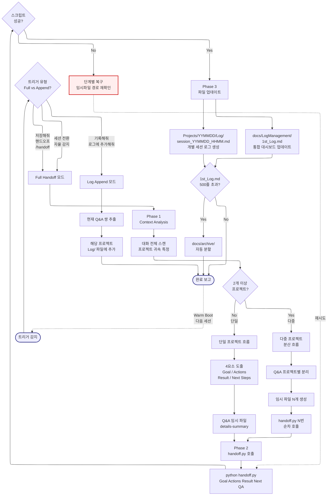

# session-handoff -- Navigator

> SYSTEM_NAVIGATOR 스타일 시각적 네비게이터
> 최종 갱신: 2026-04-10 (Phase 3 확장)
> SKILL.md와 교차 참조 (이 파일은 SKILL.md의 시각화 계층)

---

## 0. 범례 + 사용법 {#범례--사용법}

### 상태 표시

| 표시 | 의미 |
|------|------|
| **[작동]** | 정상 작동 중 |
| **[부분]** | 일부만 작동 |
| **[미구현]** | 설계만 있고 구현 없음 |

### 다이어그램 규약

- ISO 5807:1985 표준 기호 준수
- Mermaid ELK 렌더러 + `securityLevel: loose`
- 점선 `-.->` = 피드백 루프 (재시도/복귀)
- `:::warning` = 에러/차단/실패 블럭
- `click NODE "#anchor"` = 블럭 상세 카드로 이동

### 스킬 메타

| 항목 | 값 |
|------|-----|
| 이름 | session-handoff |
| Tier | A |
| 커맨드 | `/handoff`, `저장해줘`, `핸드오프` |
| 프로세스 타입 | Branching + Phase |
| 설명 | 대화 내역(Context)을 분석하여 지식을 증류하고, 개별 프로젝트 Log 폴더 및 통합 1st_Log 대시보드에 기록합니다. 세션 전환 시 문맥을 유지(Warm Boot)하게 합니다. |

---

## 1. 전체 워크플로우 체계도 {#전체-체계도}

<!-- AUTO:DIAGRAM_MAIN:START -->



<!-- AUTO:DIAGRAM_MAIN:END -->

<details><summary><strong>블럭 바로가기 (다이어그램 클릭 대안)</strong></summary>

[트리거](#node-start) · [트리거 유형](#node-ttype) · [Full 모드](#node-full) · [Append 모드](#node-append) · [Append 추출](#node-app1) · [Append 쓰기](#node-app2) · [완료 보고](#node-done) · [Phase 1](#node-phase1) · [대화 스캔](#node-scan) · [다중 체크](#node-multi-check) · [단일 프로젝트](#node-single) · [다중 프로젝트](#node-multi-flow) · [4요소 증류](#node-distill) · [QA 임시파일](#node-qa-temp) · [프로젝트 분리](#node-split) · [임시파일 N개](#node-multi-temp) · [순차 호출](#node-seq) · [Phase 2](#node-phase2) · [스크립트 실행](#node-script) · [스크립트 OK](#node-script-ok) · [복구 루프](#node-recover) · [Phase 3](#node-phase3) · [개별 로그](#node-log1) · [대시보드](#node-log2) · [500줄 체크](#node-size) · [아카이브](#node-archive)
· [**전체 블럭 카탈로그**](#block-catalog)

</details>

[맨 위로](#범례--사용법)

---

## 2. 블럭 상세 카탈로그 {#block-catalog}

<details><summary>블럭 카드 펼치기 (26개)</summary>

### 트리거 감지 {#node-start}

| 항목 | 내용 |
|------|------|
| 소속 | 진입점 |
| 동기 | 세션 종료/전환 시 지식이 휘발되는 것을 방지하기 위해 명시적/자율 트리거 모두 감지 필요 |
| 내용 | 사용자 키워드 또는 자율 감지에 의해 session-handoff 파이프라인이 시작됨 |
| 동작 방식 | 키워드 목록 매칭 + 작업 완료/세션 전환 자율 판단 |
| 상태 | [작동] |
| 관련 파일 | `.agents/skills/session-handoff/SKILL.md` |

[다이어그램으로 복귀](#전체-체계도)

### 트리거 유형 분기 {#node-ttype}

| 항목 | 내용 |
|------|------|
| 소속 | 결정 블럭 (Decision) |
| 동기 | 전체 핸드오프와 단순 로그 추가를 구분해야 불필요한 대시보드 업데이트 방지 |
| 내용 | Full / Append / 자율 감지 3개 유형으로 분기 |
| 동작 방식 | 키워드 정규식 매칭 → 해당 모드로 라우팅 |
| 상태 | [작동] |
| 관련 파일 | SKILL.md |

[다이어그램으로 복귀](#전체-체계도)

### Full Handoff 모드 {#node-full}

| 항목 | 내용 |
|------|------|
| 소속 | 모드 분기 (Full) |
| 동기 | 세션 종료 시점에 전체 지식 증류 + 로그 + 대시보드 업데이트 전체 수행 필요 |
| 내용 | Phase 1 → 2 → 3 전체 실행 경로 |
| 동작 방식 | Full 경로는 Phase 1 Context Analysis부터 시작 |
| 상태 | [작동] |
| 관련 파일 | SKILL.md |

[다이어그램으로 복귀](#전체-체계도)

### Log Append 모드 {#node-append}

| 항목 | 내용 |
|------|------|
| 소속 | 모드 분기 (Append) |
| 동기 | 작업 중간에 중요한 결정사항만 빠르게 기록하고 세션은 계속하고 싶을 때 |
| 내용 | 현재 Q&A 쌍만 추출 후 기존 로그 파일에 append |
| 동작 방식 | Full 모드와 달리 1st_Log.md는 건드리지 않음 |
| 상태 | [작동] |
| 관련 파일 | SKILL.md |

[다이어그램으로 복귀](#전체-체계도)

### Append: Q&A 쌍 추출 {#node-app1}

| 항목 | 내용 |
|------|------|
| 소속 | Append 경로 Step 1 |
| 동기 | 전체 대화가 아닌 가장 최근 Q&A 1쌍만 대상 |
| 내용 | 사용자 요청 시점 직전의 질문-응답 1쌍 추출 |
| 동작 방식 | 대화 컨텍스트 역순 스캔 → 첫 Q&A 쌍 확정 |
| 상태 | [작동] |
| 관련 파일 | SKILL.md |

[다이어그램으로 복귀](#전체-체계도)

### Append: 로그 파일 추가 {#node-app2}

| 항목 | 내용 |
|------|------|
| 소속 | Append 경로 Step 2 |
| 동기 | 기존 세션 로그 파일의 말미에 신규 Q&A 쌍만 덧붙여 기록 유지 |
| 내용 | 해당 프로젝트의 최신 `session_*.md` 파일 끝에 append |
| 동작 방식 | 파일 존재 여부 확인 후 append mode로 쓰기 |
| 상태 | [작동] |
| 관련 파일 | `Projects/YYMMDD_*/Log/session_*.md` |

[다이어그램으로 복귀](#전체-체계도)

### 완료 보고 {#node-done}

| 항목 | 내용 |
|------|------|
| 소속 | 파이프라인 출력 |
| 동기 | 사용자가 핸드오프 완료 여부를 즉시 확인할 수 있어야 함 |
| 내용 | 생성된 로그 경로 + 통합 대시보드 업데이트 여부 요약 |
| 동작 방식 | Markdown 표/문장으로 출력 |
| 상태 | [작동] |
| 관련 파일 | SKILL.md |

[다이어그램으로 복귀](#전체-체계도)

### Phase 1: Context Analysis {#node-phase1}

| 항목 | 내용 |
|------|------|
| 소속 | Full 경로 Phase 1 (지식 증류) |
| 동기 | 시행착오를 제거하고 핵심만 추출해야 다음 세션에서 재활용 가능 |
| 내용 | 대화 전체를 스캔하여 프로젝트 귀속, 4요소, Q&A 쌍을 도출 |
| 동작 방식 | LLM 기반 대화 분석 → 구조화된 중간 결과물 산출 |
| 상태 | [작동] |
| 관련 파일 | SKILL.md |

[다이어그램으로 복귀](#전체-체계도)

### 대화 전체 스캔 & 프로젝트 귀속 {#node-scan}

| 항목 | 내용 |
|------|------|
| 소속 | Phase 1 Step 1 |
| 동기 | 어느 프로젝트 Log 폴더에 기록해야 하는지 특정해야 분산 저장 가능 |
| 내용 | 대화 내용의 파일 경로/프로젝트명/주제를 스캔해 Projects/YYMMDD_* 중 1개 이상으로 매핑 |
| 동작 방식 | 키워드 + 파일 경로 해석 → 프로젝트 명단 확정 |
| 상태 | [작동] |
| 관련 파일 | SKILL.md |

[다이어그램으로 복귀](#전체-체계도)

### 다중 프로젝트 체크 {#node-multi-check}

| 항목 | 내용 |
|------|------|
| 소속 | 결정 블럭 (Decision) |
| 동기 | 2개 이상 프로젝트가 감지되면 단순 분기가 아니라 순차 분산 저장이 필요 |
| 내용 | 귀속된 프로젝트 수 == 1 → Single, >= 2 → MultiFlow |
| 동작 방식 | 프로젝트 명단 길이 기반 분기 |
| 상태 | [작동] |
| 관련 파일 | SKILL.md |

[다이어그램으로 복귀](#전체-체계도)

### 단일 프로젝트 흐름 {#node-single}

| 항목 | 내용 |
|------|------|
| 소속 | Phase 1 단일 경로 |
| 동기 | 가장 일반적인 케이스. 단순 경로로 빠른 증류/저장 |
| 내용 | 한 프로젝트에 귀속된 4요소 + Q&A 쌍 산출 |
| 동작 방식 | 단일 임시 파일 생성 → handoff.py 1회 호출 |
| 상태 | [작동] |
| 관련 파일 | SKILL.md |

[다이어그램으로 복귀](#전체-체계도)

### 다중 프로젝트 분산 흐름 {#node-multi-flow}

| 항목 | 내용 |
|------|------|
| 소속 | Phase 1 다중 경로 |
| 동기 | 한 세션에서 여러 프로젝트를 다룬 경우 병합하면 맥락이 손상됨 |
| 내용 | 각 프로젝트별로 Q&A 쌍을 분리하여 독립 로그 생성 |
| 동작 방식 | Q&A 쌍 → 프로젝트 매핑 → 프로젝트별 임시 파일 N개 생성 |
| 상태 | [작동] |
| 관련 파일 | SKILL.md |

[다이어그램으로 복귀](#전체-체계도)

### 4요소 증류 {#node-distill}

| 항목 | 내용 |
|------|------|
| 소속 | Phase 1 핵심 산출물 |
| 동기 | 시행착오를 제거하고 핵심만 남겨야 "살아있는 거울" 역할이 가능 |
| 내용 | Goal (목표), Actions (수행한 작업), Result (결과), Next Steps (다음 단계) 4개 요소 추출 |
| 동작 방식 | LLM 기반 요약 + 수동 확인 유도 |
| 상태 | [작동] |
| 관련 파일 | SKILL.md |

[다이어그램으로 복귀](#전체-체계도)

### Q&A 임시 파일 생성 {#node-qa-temp}

| 항목 | 내용 |
|------|------|
| 소속 | Phase 1 출력물 |
| 동기 | Q&A 쌍을 details-summary 형식으로 보존해야 Markdown 렌더링 시 접힘 처리 가능 |
| 내용 | `<details><summary>...</summary>...</details>` 블럭으로 감싼 임시 파일 생성 |
| 동작 방식 | 임시 경로에 파일 쓰기 → 경로를 handoff.py에 전달 (Windows 명령어 길이 제한 회피) |
| 상태 | [작동] |
| 관련 파일 | 임시 파일 (`.tmp/qa_*.md`) |

[다이어그램으로 복귀](#전체-체계도)

### 다중 프로젝트별 Q&A 분리 {#node-split}

| 항목 | 내용 |
|------|------|
| 소속 | 다중 경로 Step 1 |
| 동기 | Q&A 쌍이 어느 프로젝트에 속하는지 명확히 분류해야 병합 오류 방지 |
| 내용 | 각 Q&A 쌍을 프로젝트명/키워드 기준으로 분류하여 Map 생성 |
| 동작 방식 | Q&A 순회 → 프로젝트 매핑 테이블 구축 |
| 상태 | [작동] |
| 관련 파일 | SKILL.md |

[다이어그램으로 복귀](#전체-체계도)

### 다중 임시 파일 N개 생성 {#node-multi-temp}

| 항목 | 내용 |
|------|------|
| 소속 | 다중 경로 Step 2 |
| 동기 | 프로젝트마다 별도 임시 파일이 있어야 handoff.py를 N번 호출 가능 |
| 내용 | N개의 `.tmp/qa_project_N.md` 파일 생성 |
| 동작 방식 | 프로젝트 명단 순회 → 각각 임시 파일 쓰기 |
| 상태 | [작동] |
| 관련 파일 | 임시 파일들 |

[다이어그램으로 복귀](#전체-체계도)

### handoff.py 순차 호출 {#node-seq}

| 항목 | 내용 |
|------|------|
| 소속 | 다중 경로 Step 3 |
| 동기 | 병렬 호출 시 1st_Log.md 쓰기 경쟁 발생 → 반드시 순차 실행 |
| 내용 | 이전 호출 완료 확인 후 다음 프로젝트 호출 |
| 동작 방식 | for loop + 각 호출 exit code 확인 |
| 상태 | [작동] |
| 관련 파일 | `scripts/handoff.py` |

[다이어그램으로 복귀](#전체-체계도)

### Phase 2: handoff.py 호출 {#node-phase2}

| 항목 | 내용 |
|------|------|
| 소속 | Full 경로 Phase 2 (실행) |
| 동기 | AI가 1st_Log.md를 직접 편집하면 충돌/포맷 오류 가능성. 반드시 스크립트 경유 |
| 내용 | handoff.py 스크립트에 4요소 + 임시파일 경로 전달 |
| 동작 방식 | subprocess 호출 (errors="replace") |
| 상태 | [작동] |
| 관련 파일 | `scripts/handoff.py` |

[다이어그램으로 복귀](#전체-체계도)

### 스크립트 실행 {#node-script}

| 항목 | 내용 |
|------|------|
| 소속 | Phase 2 실행 |
| 동기 | 실제 파일 업데이트는 Python 스크립트가 담당해야 일관성 유지 |
| 내용 | handoff.py가 개별 로그 생성 + 1st_Log.md 업데이트 + 500줄 체크까지 원자적 수행 |
| 동작 방식 | Python subprocess, stdout/stderr UTF-8 capture |
| 상태 | [작동] |
| 관련 파일 | `scripts/handoff.py` |

[다이어그램으로 복귀](#전체-체계도)

### 스크립트 성공 체크 {#node-script-ok}

| 항목 | 내용 |
|------|------|
| 소속 | 결정 블럭 (Decision, 피드백 진입점) |
| 동기 | 스크립트 실패 시 바로 Phase 3으로 넘어가면 이력 유실 위험 |
| 내용 | exit code == 0 → Yes, != 0 → No (복구 루프) |
| 동작 방식 | stderr 캡처 + 반환 코드 확인 |
| 상태 | [작동] |
| 관련 파일 | SKILL.md |

[다이어그램으로 복귀](#전체-체계도)

### 단계별 복구 루프 {#node-recover}

| 항목 | 내용 |
|------|------|
| 소속 | 피드백 루프 (ISO 5807 Error Handling) |
| 동기 | 임시 파일 경로 문제, 인코딩 문제 등 반복적 실패 패턴이 존재 |
| 내용 | 임시파일 경로 재확인 → 인코딩 강제 UTF-8 → 재시도 |
| 동작 방식 | 오류 유형 분류 후 적절한 복구 루틴 → `-.->` 피드백 루프로 스크립트 재실행 |
| 상태 | [부분] (수동 개입 여지 있음) |
| 관련 파일 | SKILL.md, `scripts/handoff.py` |

[다이어그램으로 복귀](#전체-체계도)

### Phase 3: 파일 업데이트 {#node-phase3}

| 항목 | 내용 |
|------|------|
| 소속 | Full 경로 Phase 3 (저장) |
| 동기 | 개별 로그와 통합 대시보드를 동시에 일관되게 갱신해야 Warm Boot가 가능 |
| 내용 | 개별 로그 생성 + 대시보드 업데이트 + 500줄 초과 시 아카이브 분할 |
| 동작 방식 | handoff.py가 원자적으로 처리 |
| 상태 | [작동] |
| 관련 파일 | Log/, docs/LogManagement/ |

[다이어그램으로 복귀](#전체-체계도)

### 개별 세션 로그 생성 {#node-log1}

| 항목 | 내용 |
|------|------|
| 소속 | Phase 3 출력물 1 |
| 동기 | 프로젝트별 상세 로그가 있어야 과거 의사결정 추적 가능 |
| 내용 | `Projects/YYMMDD_*/Log/session_YYMMDD_HHMM.md` 생성 |
| 동작 방식 | 증류된 4요소 + Q&A 임시파일 내용 병합 후 쓰기 |
| 상태 | [작동] |
| 관련 파일 | `Projects/YYMMDD_*/Log/session_*.md` |

[다이어그램으로 복귀](#전체-체계도)

### 1st_Log.md 대시보드 업데이트 {#node-log2}

| 항목 | 내용 |
|------|------|
| 소속 | Phase 3 출력물 2 |
| 동기 | Warm Boot 시 최상위 대시보드 하나만 보면 바로 맥락 파악 가능해야 함 |
| 내용 | `docs/LogManagement/1st_Log.md`에 신규 엔트리 추가 (하이퍼링크 포함) |
| 동작 방식 | 기존 파일 append + 상단 요약 갱신 |
| 상태 | [작동] |
| 관련 파일 | `docs/LogManagement/1st_Log.md` |

[다이어그램으로 복귀](#전체-체계도)

### 500줄 초과 체크 {#node-size}

| 항목 | 내용 |
|------|------|
| 소속 | 결정 블럭 (Decision) |
| 동기 | 1st_Log.md가 무한정 커지면 Warm Boot 속도 저하 |
| 내용 | 줄 수 == 500 이상이면 자동 아카이브 |
| 동작 방식 | 파일 line count 확인 → 임계값 초과 시 Archive 경로 |
| 상태 | [작동] |
| 관련 파일 | `scripts/handoff.py` |

[다이어그램으로 복귀](#전체-체계도)

### 아카이브 자동 분할 {#node-archive}

| 항목 | 내용 |
|------|------|
| 소속 | Phase 3 복구 경로 |
| 동기 | 1st_Log.md 크기를 일정하게 유지해야 가독성과 성능 확보 |
| 내용 | 기존 내용을 `docs/archive/1st_Log_YYMMDD_YYMMDD.md`로 이동, 신규 엔트리만 유지, 상단에 아카이브 링크 기록 |
| 동작 방식 | 파일 이동 + 신규 파일 생성 + 링크 주입 |
| 상태 | [작동] |
| 관련 파일 | `docs/archive/` |

[다이어그램으로 복귀](#전체-체계도)

</details>

[맨 위로](#범례--사용법)

---

## 3. 트리거별 동작 차이

| 트리거 키워드 | 모드 | 수행 범위 |
|:---|:---:|:---|
| `저장해줘`, `세션 저장`, `핸드오프`, `/handoff` | Full | 지식 증류 + 개별 로그 + 대시보드 업데이트 |
| `기록해줘`, `로그에 추가해줘`, `이거 남겨줘` | Append | 현재 Q&A 쌍만 해당 로그에 추가 |
| 세션 전환 자율 감지 | Full | 위와 동일 |

---

## 4. 사용 시나리오

### 시나리오 1 -- 단일 프로젝트 정상 저장

> **상황**: HWPX_Master로 성과보고서를 완성한 후 세션을 끝내려 함.

**사용자 입력**
```
저장해줘.
```

**AI 실행 흐름**

1. 대화 전체 스캔 → `Projects/260401_성과보고서/` 귀속 확인
2. 4요소 도출:
   - Goal: 2026년 1학기 공학교육혁신센터 성과보고서 HWPX 생성
   - Actions: Track A → JSON 설계도 → generate_hwpx.py 실행
   - Result: 260401_기획처_성과보고서_Draft.hwpx 생성 완료
   - Next Steps: 내용 검토 후 표지 서명란 Track B로 최종 편집 필요
3. QA 임시 파일 생성
4. `handoff.py` 호출
5. `Projects/260401_성과보고서/Log/session_260401_1430.md` 생성
6. `docs/LogManagement/1st_Log.md` 업데이트

---

### 시나리오 2 -- 다중 프로젝트 분산 저장

> **상황**: 오늘 오전에 논문 검색(PaperResearch), 오후에 공문 HWPX 수정(HWPX_Master) 두 가지 작업을 한 세션에서 진행함.

**사용자 입력**
```
핸드오프.
```

**AI 실행 흐름**

1. 대화 스캔 → 2개 프로젝트 감지:
   - `Projects/260401_논문검색_AI교육/`
   - `Projects/260401_공문서_수정/`
2. Q&A 쌍을 프로젝트별로 분리
3. 임시 파일 2개 생성
4. `handoff.py` 1차 호출 (논문검색 프로젝트)
5. 완료 확인 후 `handoff.py` 2차 호출 (공문서 수정 프로젝트)
6. `1st_Log.md`에 두 프로젝트 엔트리 각각 추가

**금지**: 두 프로젝트 내용을 하나의 로그에 병합하는 것

---

### 시나리오 3 -- Log Append 모드 (중간 저장)

> **상황**: 작업 중간에 중요한 결정 사항을 잊어버리지 않도록 기록만 남기고 싶음. 세션은 계속함.

**사용자 입력**
```
방금 논의한 내용 기록해줘. 세션은 계속할 거야.
```

**AI 실행 흐름**

1. Append 모드 진입 (Full Handoff 아님)
2. 현재 대화의 마지막 Q&A 쌍만 추출
3. 해당 프로젝트 로그 파일 끝에 추가
4. `1st_Log.md`는 건드리지 않음
5. "기록 완료" 보고 후 세션 계속

---

### 시나리오 4 -- 1st_Log.md 500줄 초과 시 자동 아카이브

> **상황**: 3개월간 누적된 로그가 500줄을 넘어 자동 분할이 트리거됨.

**AI 실행 흐름**

1. `handoff.py` 내부에서 `1st_Log.md` 줄 수 체크
2. 500줄 초과 감지
3. 기존 내용 → `docs/archive/1st_Log_260101_260401.md` 로 이동
4. `1st_Log.md` 초기화 후 신규 엔트리만 유지
5. 아카이브 경로를 `1st_Log.md` 상단에 링크로 기록

---

### 시나리오 5 -- Warm Boot (다음 세션 시작 시)

> **상황**: 새 세션을 시작했는데 지난 작업 맥락을 이어받아야 함.

**의무 동작 (자동)**

1. 새 세션 시작 감지
2. `docs/LogManagement/1st_Log.md` 즉시 읽기
3. 가장 최근 프로젝트의 Next Steps 확인
4. 사용자에게 컨텍스트 요약 보고:

```
[Warm Boot 완료]

마지막 세션 (2026-04-01):
- 프로젝트: 공학교육혁신센터 성과보고서
- 완료: HWPX Draft 생성
- 남은 작업: 표지 서명란 Track B 편집, 기획처 제출 전 최종 검토

이어서 진행할까요?
```

---

[맨 위로](#범례--사용법)

---

## 5. 제약사항 및 공통 주의사항

### 파일 관리 제약

- `1st_Log.md` AI 직접 편집 금지 -- 반드시 `handoff.py` 경유
- 경로: 절대경로 하드코딩 금지, `${PROJECT_ROOT}` 기준 상대경로
- 파일 확장자: `.md` 통일
- 다중 프로젝트: 병합 금지, 순차 개별 호출 의무

### 지식 증류 규칙

- 시행착오 제거, 4요소 (Goal/Actions/Result/Next Steps)만 추출
- Q&A 쌍은 details-summary로 보존
- 사용자 입력 원문은 append 모드에서 최대한 보존

### 스크립트 실행 안전

- Python subprocess 호출 시 `errors="replace"` 필수 (AER-005)
- 임시 파일 경로는 Windows 명령어 길이 제한을 고려해 반드시 경유
- stderr 캡처 후 exit code 확인 → 실패 시 복구 루프

### 각인 참조

- **IMP-018**: 세션 종료 시 next-session.md 필수 갱신
- **AER-005**: subprocess errors="replace" 필수
- **IMP-016**: 대규모 세션 (2시간 초과) 분할 저장

[맨 위로](#범례--사용법)

---

## 6. 갱신 이력

| 날짜 | 변경 | 트리거 |
|------|------|--------|
| 2026-04-10 | scaffold 자동 생성 + 시나리오 5개 보존 | generate-navigator-cli (Phase 3.2) |
| 2026-04-10 | SYSTEM_NAVIGATOR 스타일 확장: Mermaid (Branching + Phase + 복구 루프 + Warm Boot 피드백) + 블럭 카드 26개 + 제약사항 강화 | 수동 Phase 3.2 |

[맨 위로](#범례--사용법)
