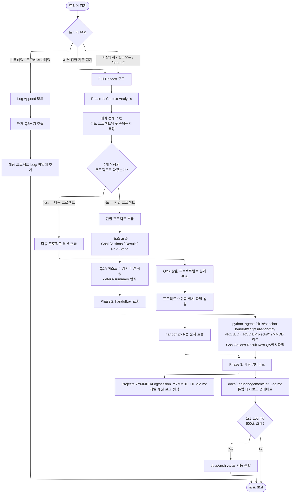

# session-handoff — 실행 흐름 Navigator

세션 종료 시 대화 내역을 지식으로 증류하고 프로젝트 로그와 통합 대시보드에 동기화하는 스킬. 다음 세션의 Warm Boot를 위한 컨텍스트를 보존합니다.

---

## 전체 실행 흐름도



---

## 트리거별 동작 차이

| 트리거 키워드 | 모드 | 수행 범위 |
|:---|:---:|:---|
| `저장해줘`, `세션 저장`, `핸드오프`, `/handoff` | Full | 지식 증류 + 개별 로그 + 대시보드 업데이트 |
| `기록해줘`, `로그에 추가해줘`, `이거 남겨줘` | Append | 현재 Q&A 쌍만 해당 로그에 추가 |
| 세션 전환 자율 감지 | Full | 위와 동일 |

---

## 예시 시나리오

### 시나리오 1 — 단일 프로젝트 정상 저장

> **상황**: HWPX_Master로 성과보고서를 완성한 후 세션을 끝내려 함.

**사용자 입력**
```
저장해줘.
```

**AI 실행 흐름**

1. 대화 전체 스캔 → `Projects/260401_성과보고서/` 귀속 확인
2. 4요소 도출:
   - Goal: 2026년 1학기 공학교육혁신센터 성과보고서 HWPX 생성
   - Actions: Track A → JSON 설계도 → generate_hwpx.py 실행
   - Result: 260401_기획처_성과보고서_Draft.hwpx 생성 완료
   - Next Steps: 내용 검토 후 표지 서명란 Track B로 최종 편집 필요
3. QA 임시 파일 생성
4. `handoff.py` 호출
5. `Projects/260401_성과보고서/Log/session_260401_1430.md` 생성
6. `docs/LogManagement/1st_Log.md` 업데이트

---

### 시나리오 2 — 다중 프로젝트 분산 저장

> **상황**: 오늘 오전에 논문 검색(PaperResearch), 오후에 공문 HWPX 수정(HWPX_Master) 두 가지 작업을 한 세션에서 진행함.

**사용자 입력**
```
핸드오프.
```

**AI 실행 흐름**

1. 대화 스캔 → 2개 프로젝트 감지:
   - `Projects/260401_논문검색_AI교육/`
   - `Projects/260401_공문서_수정/`
2. Q&A 쌍을 프로젝트별로 분리
3. 임시 파일 2개 생성
4. `handoff.py` 1차 호출 (논문검색 프로젝트)
5. 완료 확인 후 `handoff.py` 2차 호출 (공문서 수정 프로젝트)
6. `1st_Log.md`에 두 프로젝트 엔트리 각각 추가

**금지**: 두 프로젝트 내용을 하나의 로그에 병합하는 것

---

### 시나리오 3 — Log Append 모드 (중간 저장)

> **상황**: 작업 중간에 중요한 결정 사항을 잊어버리지 않도록 기록만 남기고 싶음. 세션은 계속함.

**사용자 입력**
```
방금 논의한 내용 기록해줘. 세션은 계속할 거야.
```

**AI 실행 흐름**

1. Append 모드 진입 (Full Handoff 아님)
2. 현재 대화의 마지막 Q&A 쌍만 추출
3. 해당 프로젝트 로그 파일 끝에 추가
4. `1st_Log.md`는 건드리지 않음
5. "기록 완료" 보고 후 세션 계속

---

### 시나리오 4 — 1st_Log.md 500줄 초과 시 자동 아카이브

> **상황**: 3개월간 누적된 로그가 500줄을 넘어 자동 분할이 트리거됨.

**AI 실행 흐름**

1. `handoff.py` 내부에서 `1st_Log.md` 줄 수 체크
2. 500줄 초과 감지
3. 기존 내용 → `docs/archive/1st_Log_260101_260401.md` 로 이동
4. `1st_Log.md` 초기화 후 신규 엔트리만 유지
5. 아카이브 경로를 `1st_Log.md` 상단에 링크로 기록

---

### 시나리오 5 — Warm Boot (다음 세션 시작 시)

> **상황**: 새 세션을 시작했는데 지난 작업 맥락을 이어받아야 함.

**의무 동작 (자동)**

1. 새 세션 시작 감지
2. `docs/LogManagement/1st_Log.md` 즉시 읽기
3. 가장 최근 프로젝트의 Next Steps 확인
4. 사용자에게 컨텍스트 요약 보고:

```
[Warm Boot 완료]

마지막 세션 (2026-04-01):
- 프로젝트: 공학교육혁신센터 성과보고서
- 완료: HWPX Draft 생성
- 남은 작업: 표지 서명란 Track B 편집, 기획처 제출 전 최종 검토

이어서 진행할까요?
```

---

## 제약 및 안전 규칙

- `1st_Log.md` AI 직접 편집 금지 — 반드시 `handoff.py` 경유
- 경로: 절대경로 하드코딩 금지, `${PROJECT_ROOT}` 기준 상대경로
- 파일 확장자: `.md` 통일
- 다중 프로젝트: 병합 금지, 순차 개별 호출 의무
