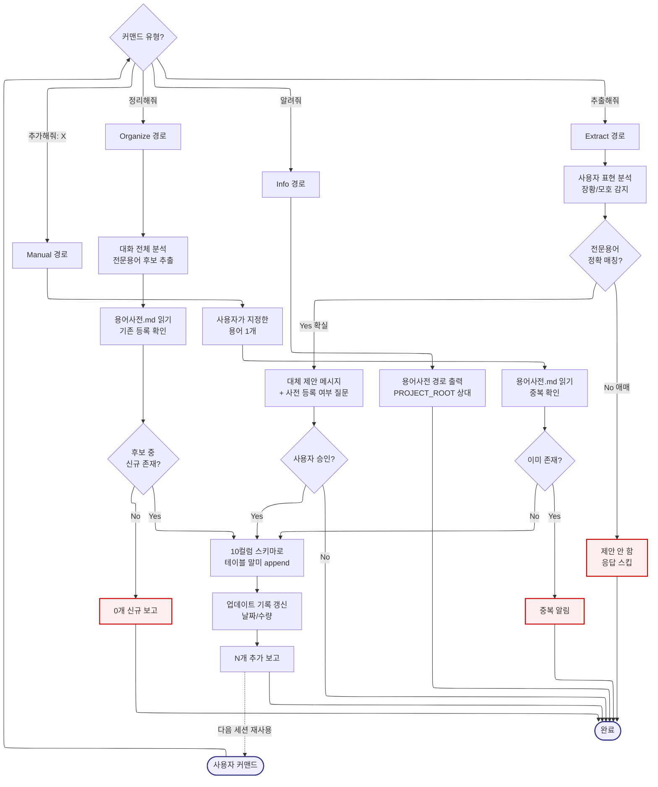

# term-organizer -- Navigator

> SYSTEM_NAVIGATOR 스타일 시각적 네비게이터
> 최종 갱신: 2026-04-11 (Tier-B Option A 신규 생성)
> SKILL.md와 교차 참조 (이 파일은 SKILL.md의 시각화 계층)

---

## 0. 범례 + 사용법 {#범례--사용법}

### 상태 표시

| 표시 | 의미 |
|------|------|
| **[작동]** | 정상 작동 중 |
| **[부분]** | 일부만 작동 |
| **[미구현]** | 설계만 있고 구현 없음 |

### 다이어그램 규약

- ISO 5807:1985 표준 기호 준수
- Mermaid ELK 렌더러 + `securityLevel: loose`
- 점선 `-.->` = 피드백 루프 (재시도/복귀)
- `:::warning` = 에러/차단/실패 블럭
- `click NODE "#anchor"` = 블럭 상세 카드로 이동

### 스킬 메타

| 항목 | 값 |
|------|-----|
| 이름 | term-organizer |
| Tier | B |
| 커맨드 | `전문용어 정리해줘` / `전문용어 추출해줘` / `전문용어 알려줘` / `전문용어 추가해줘: [용어]` |
| 프로세스 타입 | Branching + Linear Pipeline (커맨드 분기 후 각자 파이프라인) |
| 설명 | 대화에서 전문용어를 추출해 `docs/LogManagement/용어사전.md`에 누적 저장. 중복 검사 + 10컬럼 스키마 자동 생성 |

---

## 1. 전체 워크플로우 체계도 {#전체-체계도}

<!-- AUTO:DIAGRAM_MAIN:START -->



<!-- AUTO:DIAGRAM_MAIN:END -->

<details><summary><strong>블럭 바로가기 (다이어그램 클릭 대안)</strong></summary>

[사용자 커맨드](#node-start) · [커맨드 유형](#node-cmd-type) · [Organize](#node-organize) · [Extract](#node-extract) · [Info](#node-info) · [Manual](#node-manual) · [대화 분석](#node-o1) · [사전 읽기](#node-o2) · [신규 체크](#node-o3) · [테이블 append](#node-o4) · [기록 갱신](#node-o5) · [0개 보고](#node-o-rep) · [N개 보고](#node-o-rep2) · [표현 분석](#node-e1) · [매칭 체크](#node-e2) · [제안 스킵](#node-e-reject) · [대체 제안](#node-e3) · [승인 체크](#node-e4) · [경로 출력](#node-i1) · [수동 용어](#node-m1) · [중복 확인](#node-m2) · [중복 분기](#node-m3) · [중복 알림](#node-m-dup) · [완료](#node-end)
· [**전체 블럭 카탈로그**](#block-catalog)

</details>

[맨 위로](#범례--사용법)

---

## 2. 블럭 상세 카탈로그 {#block-catalog}

<details><summary>블럭 카드 펼치기 (23개)</summary>

### 사용자 커맨드 진입 {#node-start}

| 항목 | 내용 |
|------|------|
| 소속 | 진입점 |
| 동기 | 대화 중 발견된 전문용어를 휘발시키지 않고 축적해야 다음 세션에서 재사용 가능 |
| 내용 | 4가지 트리거 커맨드 중 하나로 스킬 활성화 |
| 동작 방식 | 키워드 정규식 매칭 → CmdType 분기 |
| 상태 | [작동] |
| 관련 파일 | `.agents/skills/term-organizer/SKILL.md` |

[다이어그램으로 복귀](#전체-체계도)

### 커맨드 유형 분기 {#node-cmd-type}

| 항목 | 내용 |
|------|------|
| 소속 | 결정 블럭 (Decision) |
| 동기 | 4가지 커맨드가 서로 다른 파이프라인을 가지므로 분기 필요 (자동 추출 vs 수동 대체 vs 조회 vs 단일 추가) |
| 내용 | `정리해줘`(Organize) / `추출해줘`(Extract) / `알려줘`(Info) / `추가해줘: X`(Manual) 중 라우팅 |
| 동작 방식 | 정규식 + 접미 패턴 매칭 |
| 상태 | [작동] |
| 관련 파일 | SKILL.md |

[다이어그램으로 복귀](#전체-체계도)

### Organize 경로 (자동 정리) {#node-organize}

| 항목 | 내용 |
|------|------|
| 소속 | 주 경로 (가장 많이 사용) |
| 동기 | 세션 내내 발견된 신규 용어들을 한 번의 커맨드로 일괄 등록 |
| 내용 | 대화 분석 → 기존 확인 → 신규만 append → 기록 갱신 → 보고 |
| 동작 방식 | LLM 기반 전문용어 후보 식별 + 파일 기반 중복 체크 |
| 상태 | [작동] |
| 관련 파일 | `docs/LogManagement/용어사전.md` |

[다이어그램으로 복귀](#전체-체계도)

### Extract 경로 (대체 제안) {#node-extract}

| 항목 | 내용 |
|------|------|
| 소속 | 보조 경로 |
| 동기 | 사용자가 3문장 이상으로 설명한 개념이 하나의 전문용어로 압축 가능한 경우 제안하여 표현 경제성 향상 |
| 내용 | 장황한 표현 감지 → 정확 매칭 시 대체 제안 → 승인 시 등록 |
| 동작 방식 | 사용자 표현 LLM 분석 + 확신도 필터 |
| 상태 | [작동] |
| 관련 파일 | SKILL.md |

[다이어그램으로 복귀](#전체-체계도)

### Info 경로 (조회) {#node-info}

| 항목 | 내용 |
|------|------|
| 소속 | 가벼운 조회 |
| 동기 | 사용자가 용어사전 파일 위치를 기억하지 못할 때 빠른 안내 |
| 내용 | `${PROJECT_ROOT}/docs/LogManagement/용어사전.md` 경로 출력 |
| 동작 방식 | 상대경로 문자열 반환 |
| 상태 | [작동] |
| 관련 파일 | 없음 |

[다이어그램으로 복귀](#전체-체계도)

### Manual 경로 (단일 추가) {#node-manual}

| 항목 | 내용 |
|------|------|
| 소속 | 직접 지정 경로 |
| 동기 | 대화 밖에서 발견한 용어를 즉시 추가하고 싶을 때 (정리해줘는 대화 분석이므로 별개) |
| 내용 | `추가해줘: [용어]` 형식 입력 → 중복 확인 → append |
| 동작 방식 | 접미 인자 파싱 |
| 상태 | [작동] |
| 관련 파일 | `docs/LogManagement/용어사전.md` |

[다이어그램으로 복귀](#전체-체계도)

### O1: 대화 전체 분석 {#node-o1}

| 항목 | 내용 |
|------|------|
| 소속 | Organize Stage 1 |
| 동기 | 사용자가 의식하지 못한 전문용어까지 포괄 수집. 단순 키워드 매칭이 아닌 맥락 기반 후보 추출 필요 |
| 내용 | 현재 대화 컨텍스트에서 도메인 전문용어 후보 식별 |
| 동작 방식 | LLM이 대화 전체 스캔 → 명사 기반 후보 목록 생성 |
| 상태 | [작동] |
| 관련 파일 | 없음 |

[다이어그램으로 복귀](#전체-체계도)

### O2: 용어사전 읽기 (중복 체크) {#node-o2}

| 항목 | 내용 |
|------|------|
| 소속 | Organize Stage 2 |
| 동기 | 동일 용어 중복 등록 방지. 기존 엔트리 보존 |
| 내용 | `docs/LogManagement/용어사전.md` 전체 읽기 후 용어 컬럼 set 추출 |
| 동작 방식 | Read → 파싱 → Set 구성 |
| 상태 | [작동] |
| 관련 파일 | `docs/LogManagement/용어사전.md` |

[다이어그램으로 복귀](#전체-체계도)

### O3: 신규 존재 분기 {#node-o3}

| 항목 | 내용 |
|------|------|
| 소속 | 결정 블럭 (Decision) |
| 동기 | 신규 후보가 0개면 파일 수정 불필요 (원자성 + I/O 최소화) |
| 내용 | 후보 목록 - 기존 Set = 신규 목록. 길이 체크 |
| 동작 방식 | Set 차집합 연산 |
| 상태 | [작동] |
| 관련 파일 | 없음 |

[다이어그램으로 복귀](#전체-체계도)

### O4: 10컬럼 스키마 append {#node-o4}

| 항목 | 내용 |
|------|------|
| 소속 | Organize/Manual 공통 스테이지 |
| 동기 | 일관된 스키마로 저장해야 후속 검색/필터링이 가능. 10컬럼(번호/용어/원어/태그/난이도/쉬운설명/전문설명/예시/비고/등록일) 표준화 |
| 내용 | 각 신규 용어에 대해 행 생성 → 테이블 말미 append |
| 동작 방식 | Edit으로 테이블 마지막 행 이후에 신규 행 삽입 |
| 상태 | [작동] |
| 관련 파일 | `docs/LogManagement/용어사전.md` |

[다이어그램으로 복귀](#전체-체계도)

### O5: 업데이트 기록 갱신 {#node-o5}

| 항목 | 내용 |
|------|------|
| 소속 | Organize Stage 5 |
| 동기 | 언제 얼마나 추가됐는지 추적 가능해야 진화 이력 파악 가능 |
| 내용 | 파일 상단 메타데이터 또는 하단 이력 테이블에 `YYYY-MM-DD: +N개` 기록 |
| 동작 방식 | Edit으로 이력 섹션 갱신 |
| 상태 | [부분] (이력 섹션이 파일에 없으면 스킵) |
| 관련 파일 | `docs/LogManagement/용어사전.md` |

[다이어그램으로 복귀](#전체-체계도)

### 0개 신규 보고 {#node-o-rep}

| 항목 | 내용 |
|------|------|
| 소속 | Organize 종료 (fast path) |
| 동기 | 이미 모두 등록된 경우 사용자에게 현 상태 명시 |
| 내용 | "이미 등록된 용어만 있습니다. 신규 0개." 메시지 |
| 동작 방식 | 문자열 반환 |
| 상태 | [작동] |
| 관련 파일 | 없음 |

[다이어그램으로 복귀](#전체-체계도)

### N개 추가 보고 {#node-o-rep2}

| 항목 | 내용 |
|------|------|
| 소속 | Organize 종료 (success path) |
| 동기 | 작업 결과를 정량적으로 확인 + 다음 세션 연계 힌트 |
| 내용 | "N개 용어를 추가했습니다. 총 M개." 형식 |
| 동작 방식 | 카운터 + 총합 계산 |
| 상태 | [작동] |
| 관련 파일 | 없음 |

[다이어그램으로 복귀](#전체-체계도)

### E1: 사용자 표현 분석 {#node-e1}

| 항목 | 내용 |
|------|------|
| 소속 | Extract Stage 1 |
| 동기 | 장황한 설명을 전문용어로 압축해야 표현 효율 향상. 단, 잘못 제안하면 오히려 혼란 야기 |
| 내용 | 사용자 표현의 문장 수 + 키워드 복잡도 측정 |
| 동작 방식 | LLM 판단 (3문장 이상 기준) |
| 상태 | [작동] |
| 관련 파일 | 없음 |

[다이어그램으로 복귀](#전체-체계도)

### E2: 전문용어 매칭 {#node-e2}

| 항목 | 내용 |
|------|------|
| 소속 | 결정 블럭 (Decision) |
| 동기 | 확실한 경우만 제안해야 신뢰도 유지. 애매한 제안은 금지 |
| 내용 | 용어사전 등록 용어 우선 검색 → 없으면 일반 전문용어 지식 활용 |
| 동작 방식 | 확신도 ≥ 0.8 기준 |
| 상태 | [작동] |
| 관련 파일 | `docs/LogManagement/용어사전.md` |

[다이어그램으로 복귀](#전체-체계도)

### E 제안 스킵 {#node-e-reject}

| 항목 | 내용 |
|------|------|
| 소속 | Extract 조기 종료 |
| 동기 | 애매한 제안보다 침묵이 낫다. 사용자 경험 보호 |
| 내용 | 응답 없이 종료 (사용자 원래 표현 존중) |
| 동작 방식 | 조용한 종료 |
| 상태 | [작동] |
| 관련 파일 | 없음 |

[다이어그램으로 복귀](#전체-체계도)

### E3: 대체 제안 메시지 {#node-e3}

| 항목 | 내용 |
|------|------|
| 소속 | Extract Stage 3 |
| 동기 | 사용자가 용어를 인지하고 선택적으로 수용할 수 있어야 함 |
| 내용 | "'[원표현]'은 '[전문용어]'로 대체 가능. 사전 등록할까요?" 메시지 |
| 동작 방식 | 템플릿 문자열 출력 |
| 상태 | [작동] |
| 관련 파일 | SKILL.md |

[다이어그램으로 복귀](#전체-체계도)

### E4: 사용자 승인 분기 {#node-e4}

| 항목 | 내용 |
|------|------|
| 소속 | 결정 블럭 |
| 동기 | 사용자 재량 보장. 원치 않는 등록 방지 |
| 내용 | Yes → O4로 이동 / No → 종료 |
| 동작 방식 | 사용자 Yes/No 응답 파싱 |
| 상태 | [작동] |
| 관련 파일 | 없음 |

[다이어그램으로 복귀](#전체-체계도)

### I1: 경로 출력 {#node-i1}

| 항목 | 내용 |
|------|------|
| 소속 | Info 단일 스테이지 |
| 동기 | 사용자가 직접 파일을 열어볼 수 있도록 명확한 경로 제공 |
| 내용 | `${PROJECT_ROOT}/docs/LogManagement/용어사전.md` |
| 동작 방식 | 고정 문자열 출력 |
| 상태 | [작동] |
| 관련 파일 | `docs/LogManagement/용어사전.md` |

[다이어그램으로 복귀](#전체-체계도)

### M1: 수동 지정 용어 {#node-m1}

| 항목 | 내용 |
|------|------|
| 소속 | Manual Stage 1 |
| 동기 | 대화 밖 맥락에서 발견한 용어를 별도 명령으로 즉시 추가 |
| 내용 | `추가해줘: [용어]` 접미 인자 파싱 |
| 동작 방식 | 정규식 `추가해줘:\s*(.+)$` 캡처 |
| 상태 | [작동] |
| 관련 파일 | SKILL.md |

[다이어그램으로 복귀](#전체-체계도)

### M2: 중복 확인 {#node-m2}

| 항목 | 내용 |
|------|------|
| 소속 | Manual Stage 2 |
| 동기 | O2와 동일 목적 (중복 방지). 경로 축약판 |
| 내용 | 용어사전 파일에서 지정 용어 존재 여부 확인 |
| 동작 방식 | Grep 또는 Set 검색 |
| 상태 | [작동] |
| 관련 파일 | `docs/LogManagement/용어사전.md` |

[다이어그램으로 복귀](#전체-체계도)

### M3: 중복 분기 {#node-m3}

| 항목 | 내용 |
|------|------|
| 소속 | 결정 블럭 |
| 동기 | 중복 시 사용자에게 알림. 없으면 O4로 진입 |
| 내용 | 존재 → MDup / 없음 → O4 |
| 동작 방식 | 불리언 분기 |
| 상태 | [작동] |
| 관련 파일 | 없음 |

[다이어그램으로 복귀](#전체-체계도)

### 중복 알림 {#node-m-dup}

| 항목 | 내용 |
|------|------|
| 소속 | Manual 종료 (early exit) |
| 동기 | 사용자가 상황을 인지하고 다른 조치를 취할 수 있도록 |
| 내용 | "'[용어]'는 이미 등록되어 있습니다. (번호: N)" |
| 동작 방식 | 기존 행 번호 반환 |
| 상태 | [작동] |
| 관련 파일 | 없음 |

[다이어그램으로 복귀](#전체-체계도)

### 완료 {#node-end}

| 항목 | 내용 |
|------|------|
| 소속 | 공통 종료점 |
| 동기 | 모든 경로가 이 지점에서 종료되어야 후속 스킬 연계 가능 |
| 내용 | 결과 메시지 반환 + 다음 세션 재활용 피드백 |
| 동작 방식 | 파이프라인 종료 |
| 상태 | [작동] |
| 관련 파일 | 없음 |

[다이어그램으로 복귀](#전체-체계도)

</details>

[맨 위로](#범례--사용법)

---

## 3. 10컬럼 스키마

용어사전.md의 각 행은 10개 컬럼으로 구성:

| 컬럼 | 작성 규칙 |
|:---|:---|
| 번호 | 기존 최대 번호 + 1 자동 부여 |
| 용어 | 한국어 공식 명칭 (없으면 원어 그대로) |
| 원어 | 영어 또는 원래 언어 표기 |
| 태그 | 1~3개 권장. `#AI` `#개발` `#통계` `#문서` `#데이터` 등 |
| 난이도 | 쉬움 / 보통 / 어려움 (일반인 기준) |
| 쉬운 설명 | 비전문가도 이해할 수 있게, 일상 비유 포함 |
| 전문 설명 | 기술적으로 정확한 정의 |
| 예시 | 실제 문장이나 코드 한 줄 |
| 비고 | 관련 용어, 주의사항 (선택) |
| 등록일 | `YYYY-MM-DD` 형식으로 자동 입력 |

---

## 4. 사용 시나리오

### 시나리오 1 -- 세션 중반 자동 정리

> **상황**: 1시간 작업 후 발견된 전문용어 10개를 한 번에 등록

```
전문용어 정리해줘
```

**실행 흐름**:
1. 대화 전체 스캔 → 후보 15개 추출
2. 용어사전.md 읽기 → 기존 54개 확인
3. 차집합 → 신규 10개 (5개는 이미 등록)
4. 10컬럼 스키마로 append
5. 이력 "2026-04-11: +10" 기록
6. 보고: "10개 용어를 추가했습니다. 총 64개."

---

### 시나리오 2 -- 장황한 설명 대체 제안

> **상황**: 사용자가 "데이터가 없을 때 기본값으로 채우는 방법"이라고 3문장으로 설명

```
전문용어 추출해줘
```

**AI 응답**:
```
'데이터가 없을 때 기본값으로 채우는 방법'으로 말씀하신 내용은
'Null Coalescing' 전문 용어로 대체할 수 있습니다.

해당 용어를 사전에 추가할까요?
```

사용자 "Yes" → O4로 진입 → 10컬럼 append.

---

### 시나리오 3 -- 파일 위치 조회

> **상황**: 사용자가 직접 용어사전을 열어보고 싶을 때

```
전문용어 알려줘
```

**AI 응답**:
```
용어사전 파일:
docs/LogManagement/용어사전.md
```

---

### 시나리오 4 -- 단일 용어 수동 추가

> **상황**: 외부 문서에서 발견한 용어 1개를 즉시 등록

```
전문용어 추가해줘: Transformer Attention
```

**실행 흐름**:
1. 접미 인자 파싱 → "Transformer Attention"
2. 중복 확인 → 없음
3. O4 경로 재사용 → 10컬럼 append
4. 보고: "'Transformer Attention' 추가 완료."

---

### 시나리오 5 -- 중복 방지

> **상황**: 이미 등록된 용어를 다시 추가 시도

```
전문용어 추가해줘: AER
```

**AI 응답**:
```
'AER'는 이미 등록되어 있습니다. (번호: 12)
```

수정 제안도 없이 조용히 종료. 사용자가 필요하면 직접 파일 수정.

---

[맨 위로](#범례--사용법)

---

## 5. 제약사항 및 공통 주의사항

### 파일 관리 제약

- **절대경로 금지**: `${PROJECT_ROOT}` 기준 상대경로만 사용
- **수동 편집 존중**: AI가 용어사전 전체를 재정렬하지 않음. append-only 원칙
- **10컬럼 고정**: 컬럼 수/순서 변경 금지 (기존 데이터 호환성)

### 제안 품질 기준

- Extract 경로는 **확신도 ≥ 0.8**만 제안
- 3문장 미만 설명에는 제안하지 않음 (이미 간결)
- 기존 등록 용어 우선 (용어사전 자체가 정본)

### 공통 금지 사항

- 이모티콘 사용 금지 (PostToolUse 훅 차단)
- 절대경로 하드코딩 금지

### 각인 참조

- **IMP-007**: 완료 체크리스트에서 "전문용어 등록" 단계가 이 스킬 호출
- **IMP-018**: 세션 종료 시 Mode 3로 llm-wiki가 이 스킬과 연계 가능

[맨 위로](#범례--사용법)

---

## 6. 갱신 이력

| 날짜 | 변경 | 트리거 |
|------|------|--------|
| 2026-04-11 | Tier-B Navigator 신규 생성 (SYSTEM_NAVIGATOR 스타일) | Option A 세션 1 |

[맨 위로](#범례--사용법)
