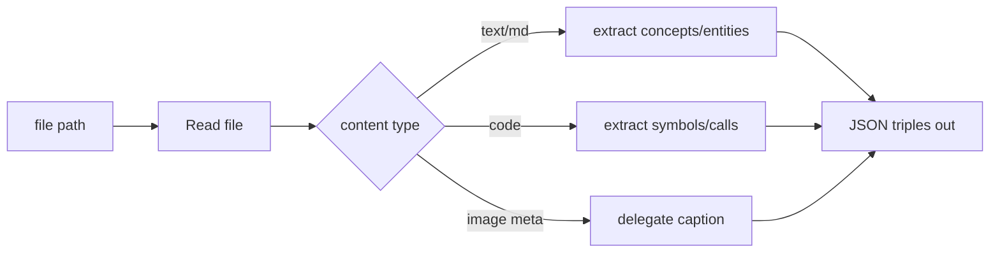

## Task



## Output Schema

```json
{
  "file": "path/to/file",
  "triples": [
    {"subject": "Transformer", "relation": "is_a", "object": "Neural_Architecture"},
    {"subject": "Attention", "relation": "component_of", "object": "Transformer"}
  ],
  "entities": ["Transformer", "Attention"],
  "concepts": ["self-attention", "multi-head"]
}
```

## Examples

### Example 1 — markdown 개념 추출
Input: `010_Verified/sources/260401_transformer_V001.md`
Output:
```json
{"file": "...", "triples": [{"subject": "Transformer", "relation": "introduced_by", "object": "Vaswani et al. 2017"}], "entities": ["Transformer", "Vaswani"], "concepts": ["self-attention"]}
```

### Example 2 — 코드 심볼 추출
Input: `src/attention.py`
Output:
```json
{"file": "...", "triples": [{"subject": "MultiHeadAttention", "relation": "calls", "object": "scaled_dot_product"}], "entities": ["MultiHeadAttention"], "concepts": []}
```

### Example 3 — 이미지 메타 위임
Input: `figs/arch.png` (via vision-caption.py 메타)
Output:
```json
{"file": "figs/arch.png", "triples": [], "entities": [], "concepts": [], "caption_pending": true}
```
