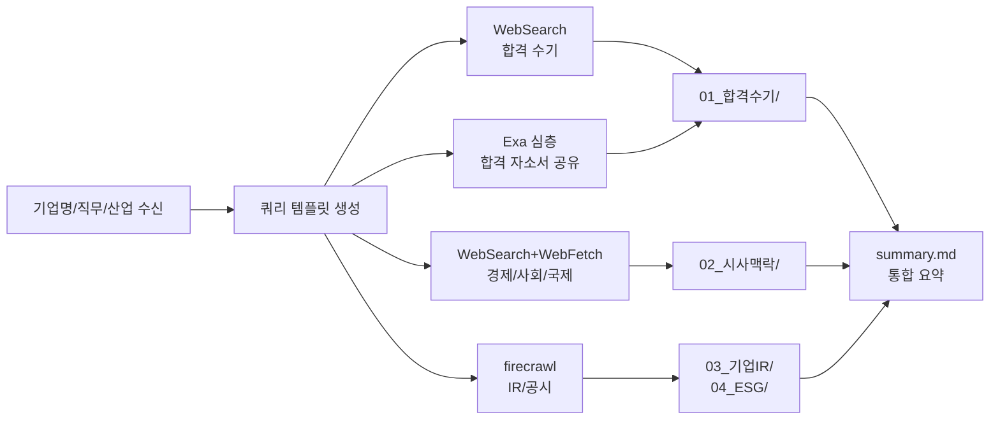
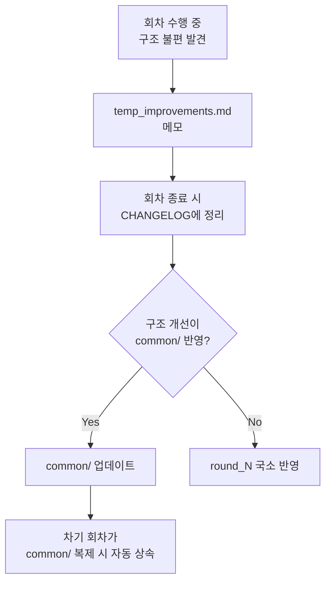

# D10. 순서도 및 절차도

회차 전체 실행 흐름과 의사결정 분기를 도식화.

## 하네스 엔지니어링 적용
| 기둥 | 역할 |
|------|------|
| 기둥1 | 흐름 단계가 CLAUDE.md "작업 순서" 섹션의 기준 |
| 기둥2 | 각 단계의 Exit 조건이 훅 검증 |
| 기둥3 | 단계별 허용 도구 변경 |
| 기둥4 | 단계 실패 시 자동 회복 절차 포함 |

## 1. 회차 전체 순서도

```mermaid
flowchart TD
  S([회차 시작]) --> A{evidence_vault<br/>준비됨?}
  A -- No --> A1[UC-01 실행<br/>자료 등록]
  A1 --> A
  A -- Yes --> B[/round new]
  B --> C[input/ 3종 투입<br/>company_form + JD + meta]
  C --> D[researcher 실행<br/>4종 리서치]
  D --> E{리서치<br/>성공?}
  E -- No --> E1[캐시 대체 + 사용자 알림]
  E -- Yes --> F[company_profile.md<br/>작성]
  E1 --> F
  F --> G[ideator 실행<br/>ideas.md 3+]
  G --> H[사용자 아이디어 선택]
  H --> I[writer 실행<br/>output 3종 작성]
  I --> J[/clear<br/>새 세션]
  J --> K[reviewer 실행<br/>독립 검증]
  K --> L{CRITICAL/HIGH<br/>있음?}
  L -- Yes --> M[writer 세션<br/>복귀 후 수정]
  M --> K
  L -- No --> N[사용자 최종 검토]
  N --> O{승인?}
  O -- No --> M
  O -- Yes --> P{N>=2?}
  P -- Yes --> Q[CHANGELOG.md<br/>작성]
  P -- No --> R[회차 종료]
  Q --> R
  R --> S2([End])
```

## 2. 리서치 절차도 (researcher 에이전트)



## 3. 회차 구조 개선 절차



## 4. 의사결정 분기 요약

| 분기 | 기준 | 행동 |
|---|---|---|
| evidence_vault 준비 | INDEX.md 존재 | 없으면 UC-01 선행 |
| 리서치 성공 | research_cache/round_N/summary.md 생성 | 실패 시 캐시 대체 |
| reviewer 판정 | CRITICAL/HIGH 0건 | 있으면 writer 복귀 |
| 사용자 승인 | 수동 | 거부 시 writer 복귀 |
| CHANGELOG 필요 | N >= 2 | 필수 작성 |
