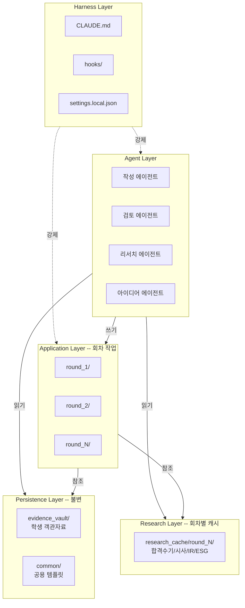

# D4. 아키텍처 설계서

## 하네스 엔지니어링 적용
| 기둥 | 역할 |
|------|------|
| 기둥1 | 계층명 용어를 CLAUDE.md 인용 |
| 기둥2 | 계층 간 의존성 역방향 호출을 훅이 차단 |
| 기둥3 | 계층별 읽기/쓰기 권한 분리 |
| 기둥4 | 아키텍처 테스트가 주간 자동 실행 |

## 1. 계층 구조



## 2. 폴더 구조 (최종)

```
260414_Student_Admission_AI/
├── CLAUDE.md                       # 60줄 하네스 컨텍스트
├── .claude/
│   ├── settings.local.json         # permissions + hooks
│   └── hooks/
│       ├── pre_tool_guard.sh       # 경로/PII 차단
│       ├── post_tool_validate.sh   # 허위사실/금지용어 감지
│       └── post_round_check.sh     # 회차 완결성 검증
├── docs/                           # 12종 설계문서
├── evidence_vault/                 # [L1] 학생 객관자료 (불변)
│   ├── INDEX.md
│   ├── 01_생활기록부/
│   ├── 02_성적증명서/
│   ├── 03_자격증/
│   ├── 04_어학점수/
│   ├── 05_수상내역/
│   └── 06_경험기록/
├── common/                         # [L1] 공용 자산
│   ├── templates/
│   │   ├── 자소서_문항별_STAR.md
│   │   ├── 이력서_표준양식.md
│   │   └── 포트폴리오_목차.md
│   ├── 합격패턴_라이브러리.md
│   └── 금지표현_사전.md
├── research_cache/                 # [L2] 회차별 리서치
│   └── round_N/
│       ├── 01_합격수기/
│       ├── 02_시사맥락/
│       ├── 03_기업IR/
│       └── 04_ESG/
├── round_1/                        # [L3] 1차 지원서
│   ├── input/
│   │   ├── company_form.md         # 기업 제공 양식
│   │   ├── job_description.md      # 직무기술서
│   │   └── meta.json               # 기업명/직무/마감일
│   ├── company_profile.md          # 기업 프로파일
│   ├── ideas.md                    # 기발한 아이디어 3+
│   ├── output/
│   │   ├── 자소서.md
│   │   ├── 이력서.md
│   │   └── 포트폴리오.md
│   └── CHANGELOG.md                # 2차부터 필수
├── round_2/                        # [L3] 2차 (구조 개선 반영)
│   └── (동일 구조)
└── agents/                         # [L4] 에이전트 정의
    ├── writer.md
    ├── reviewer.md
    ├── researcher.md
    └── ideator.md
```

## 3. 계층 의존성 규칙 (구조적 강제)

| 규칙 | 위반 예 | 강제 방법 |
|---|---|---|
| L1(evidence_vault) 쓰기 금지 — 등록 후 불변 | round_N 작업 중 생기부 수정 | pre_tool_guard: evidence_vault/ Write/Edit 차단 |
| L3(이전 회차) 쓰기 금지 — 회차 불변성 | round_2 작업 중 round_1/ 수정 | pre_tool_guard: round_M (M<현재) Write/Edit 차단 |
| L2 리서치 캐시는 현재 회차만 | round_2가 round_1 research_cache 쓰기 | pre_tool_guard: research_cache/round_M (M≠현재) 차단 |
| PII → 외부 MCP 금지 | evidence_vault/ 내용을 WebSearch에 전달 | pre_tool_guard: MCP 호출 parameter에 evidence_vault 경로/내용 스캔 |
| 코드 작성/리뷰 에이전트 분리 | writer가 자기 결과물 리뷰 | 훅이 동일 에이전트 연속 호출 감지 시 경고 |

## 4. 보안 경계

- evidence_vault/**: 읽기 전용 + 외부 전송 금지 (PII)
- round_*/output/**: 사용자 최종 산출물, 외부 전송 시 사용자 승인
- research_cache/**: 공개 자료만, PII 포함 금지
- .env: 접근 차단 (templates/research 인증키 저장 시)

## 5. 아키텍처 테스트 (CI)

`docs/architecture-test.md`에 명세:
1. `ls round_N/` 구조 검증 (input/company_profile/output/CHANGELOG)
2. evidence_vault/ 파일이 마지막 수정 이후 불변인지 확인
3. round_N의 evidence 인용 링크가 evidence_vault/ 내 유효 경로를 가리키는지
4. 금지 표현 사전 대비 output/ 스캔
