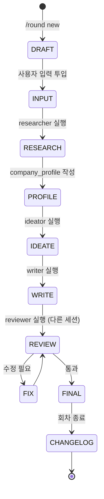

# D6. 소프트웨어 요구사항 명세서 (SRS)

D3 요구사항을 사용 시나리오 중심으로 확장한 상세 명세.

## 하네스 엔지니어링 적용
| 기둥 | 역할 |
|------|------|
| 기둥1 | 시나리오 ID를 회차별 실행 로그가 참조 |
| 기둥2 | 각 시나리오 Exit Criteria 훅 검증 |
| 기둥3 | 시나리오별 필요한 도구만 허용 |
| 기둥4 | 시나리오 실패 시 개선안을 CHANGELOG에 자동 기록 |

## 사용 시나리오

### UC-01: 최초 등록 (evidence_vault 구축)
**선행**: 프로젝트 초기화 완료
**흐름**:
1. 사용자가 생활기록부/성적/자격/어학 원본을 evidence_vault/ 하위에 투입
2. 에이전트가 INDEX.md 자동 생성 (파일별 요약 + 태그)
3. 사용자가 INDEX.md 검토 후 승인
**Exit**: evidence_vault/INDEX.md 존재 + 모든 파일 1회 이상 언급

### UC-02: 1차 지원서 작성
**선행**: UC-01 완료
**입력**: 기업명, 직무, 회사 제공 양식(company_form.md), 직무기술서(job_description.md), 마감일
**흐름**:
1. `/round new` → round_1/ 생성
2. input/에 사용자가 3개 파일 투입 + meta.json 생성
3. researcher 에이전트가 4종 리서치 (→ research_cache/round_1/)
4. writer가 company_profile.md 작성
5. ideator가 ideas.md 작성 (3개 이상 교차점)
6. writer가 output/ 3종 초안 작성
7. reviewer(다른 세션)가 금지표현/근거/STAR 구조 검증
8. 사용자 검토 → 수정 → 확정
**Exit**: round_1/output/ 3종 + reviewer 통과 + 사용자 확정

### UC-03: 2차 지원서 작성 (다른 기업)
**선행**: round_1 완료
**흐름**:
1. `/round new` → round_2/ 생성 (common/ 최신본 복제)
2. 사용자가 round_1 작업 중 느낀 구조 개선점을 common/ 또는 round_2/ 구조에 반영
3. CHANGELOG.md에 "round_1 대비 변경사항" 기록
4. UC-02의 3~8단계 재실행
**Exit**: round_2/output/ + CHANGELOG.md

### UC-04: 불합격 후 3차 재작성 (동일 기업)
**선행**: 동일 기업 2차 탈락
**흐름**:
1. `/round new` + 이전 기업 재지원 플래그
2. 불합격 원인 분석 세션 (reviewer가 round_2 output 재검토 + 합격 수기 대비 차이점)
3. 차이점을 CHANGELOG 상단에 "개선 가설" 기록
4. UC-02 3~8단계 재실행
**Exit**: round_3/output/ + 개선 가설 검증 로그

### UC-05: 기발한 아이디어 제안 (독립 실행)
**선행**: evidence_vault + 합격패턴_라이브러리 존재
**흐름**:
1. 사용자가 `/suggest` 호출
2. ideator가 evidence_vault × 합격패턴 교차 분석
3. 3~5개 비자명한 연결점 제안 (ex: "전국 1% 밖 성적이지만 전국대회 수상 3건 — '전문성 특화' 프레임 유리")
4. 사용자 선택 → 차기 회차의 지원동기/핵심성과 프레임에 반영
**Exit**: ideas.md 3개 이상 + 사용자 선택 기록

## 상태 전이 (회차)

## 에러 케이스

| 코드 | 상황 | 처리 |
|---|---|---|
| E-101 | evidence_vault 부족 | UC-01 보완 요청 |
| E-102 | input/ 누락 | 사용자에게 3개 필수 파일 요청 |
| E-103 | research MCP 호출 실패 | 오프라인 캐시 사용 + 경고 |
| E-104 | 금지 표현 감지 | writer에게 재작성 요청 |
| E-105 | 근거 인용 누락 | 해당 문장 evidence 제출 요청 |
| E-106 | 회차 불변성 위반 시도 | 훅이 차단 + 새 회차 제안 |
