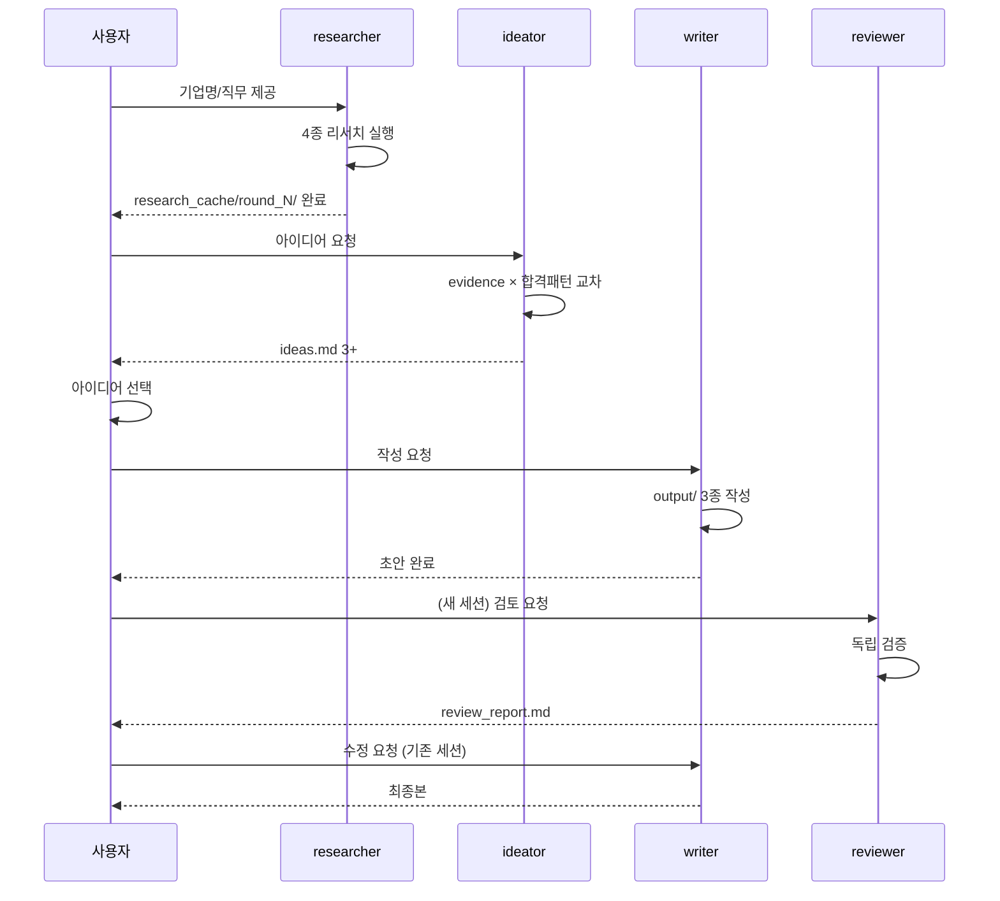

# D7. 상세 설계서

## 하네스 엔지니어링 적용
| 기둥 | 역할 |
|------|------|
| 기둥1 | 에이전트 정의 파일이 CLAUDE.md의 핵심 규칙 상속 |
| 기둥2 | 에이전트 간 역할 분리가 훅으로 강제 |
| 기둥3 | 에이전트별 허용 MCP/도구 분리 |
| 기둥4 | 에이전트 품질 저하 시 프롬프트 교체 가능 구조 |

## 1. 에이전트 4종

### A. writer (작성)
- **목적**: 자소서/이력서/포트폴리오 초안 작성
- **허용 도구**: Read(evidence_vault, common, research_cache 현재 회차, round_현재/input), Write(round_현재/output)
- **금지 도구**: WebSearch, WebFetch, Exa, firecrawl (리서치는 researcher 담당)
- **입력**: input/* + company_profile.md + ideas.md + research_cache/round_N/
- **출력**: output/자소서.md, output/이력서.md, output/포트폴리오.md
- **규칙**: D5 개발표준 100% 준수, 모든 수치/주장에 `[^ev*]` 또는 `[^rs*]` 인용

### B. reviewer (검토)
- **목적**: writer 산출물을 독립 세션에서 검증
- **허용 도구**: Read(all), Write(round_현재/review_report.md만)
- **금지 도구**: writer의 output 직접 수정
- **입력**: output/ 3종 + D5 개발표준 + 금지표현_사전
- **출력**: review_report.md (CRITICAL/HIGH/MEDIUM/LOW 등급)
- **규칙**: 다른 세션 실행, writer와 컨텍스트 공유 금지

### C. researcher (리서치)
- **목적**: 4종 리서치 (합격수기/시사/IR/ESG)
- **허용 도구**: WebSearch, WebFetch, mcp__exa-web-search__*, mcp__firecrawl__*
- **금지 도구**: evidence_vault 내용을 MCP 파라미터로 전달 (PII 차단)
- **입력**: 기업명, 직무, 산업
- **출력**: research_cache/round_N/{01~04}/*.md + summary.md
- **규칙**: 원문 저장 금지, 요약만 (NFR-002 컨텍스트 관리)

### D. ideator (아이디어)
- **목적**: 사용자 자료 × 합격 패턴 교차 분석 → 비자명 연결점 제안
- **허용 도구**: Read(evidence_vault, common/합격패턴_라이브러리, research_cache)
- **금지 도구**: Write(output/* 금지, ideas.md만 쓰기)
- **출력**: round_N/ideas.md
- **규칙**: 최소 3개 제안, 각 제안마다 evidence 링크 + 합격 패턴 링크 필수

## 2. 에이전트 상호작용



## 3. 회차 생성 스크립트 (개념)

```bash
# 개념 예시 (실제 구현은 Phase 7에서)
NEW=$((max_round + 1))
cp -r common/templates/round_skeleton/ round_${NEW}/
# round_1이면 CHANGELOG 생략, 2차부터 필수
if [ $NEW -ge 2 ]; then
  echo "# round_${NEW} CHANGELOG" > round_${NEW}/CHANGELOG.md
fi
```

## 4. 컨텍스트 관리 전략

| 시점 | 사용량 목표 | 대응 |
|---|---|---|
| UC-01 등록 후 | 20% | INDEX.md 이후 /clear |
| 리서치 완료 후 | 40% | summary.md만 남기고 원문은 파일 링크 |
| writer 완료 후 | 50% | reviewer는 **새 세션** (컨텍스트 0%) |
| 최종 확정 후 | 60% | /clear 후 차기 회차 준비 |

## 5. 프롬프트 개선 루프 (프롬프트 엔지니어링)

writer/reviewer/researcher/ideator 각 에이전트 프롬프트는 `agents/*.md`에 저장.
회차 실행 후 품질 저하 발견 시:
1. CHANGELOG에 "프롬프트 약점" 기록
2. 차기 회차 준비 시 해당 에이전트 프롬프트 갱신
3. 갱신 내역은 adr.md에 기록 (WHY)
