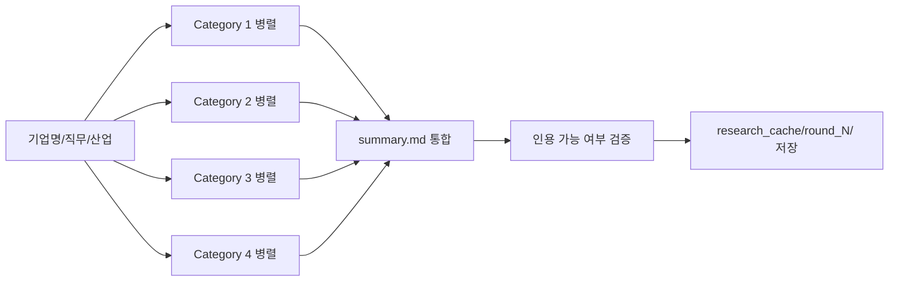

# D+2. 리서치 파이프라인 명세서

"최신 합격 사례/시사/경제·사회·국제정서/기업 IR" 4종 리서치를 회차마다 체계적으로 수행.

## 하네스 엔지니어링 적용
| 기둥 | 역할 |
|------|------|
| 기둥1 | 리서치 쿼리 템플릿을 CLAUDE.md 링크로 제공 |
| 기둥2 | PII 포함 쿼리 훅 차단 |
| 기둥3 | researcher 에이전트만 MCP 호출 허용 |
| 기둥4 | 쿼리 실패 패턴이 차기 회차 템플릿 개선 유발 |

## 1. 리서치 4대 카테고리

### Category 1: 합격 수기 (01_합격수기/)
**목적**: 동일/유사 기업·직무 합격자의 자소서 패턴 학습
**도구**: WebSearch + Exa
**쿼리 템플릿**:
```
[기업명] [직무] 합격 자소서
[기업명] 최종 합격 수기
[기업명] [직무] 서류 합격 팁
[유사업종] [직무] 자소서 첨삭
```
**수집 기준**: 최근 2년 내, 공개 출처만
**출력**: 각 케이스별 요약 + 핵심 패턴 추출 (STAR/지원동기 프레임)

### Category 2: 경제·사회·국제정서 (02_시사맥락/)
**목적**: 지원 산업과 연결된 거시 흐름 → 자소서 "동기" 섹션 근거
**도구**: WebSearch + WebFetch
**쿼리 템플릿**:
```
2026 [산업명] 전망
[산업명] 국제 정세 영향
[기업명 소속 섹터] 최근 이슈
글로벌 [산업] 공급망 변화
```
**수집 기준**: 최근 6개월
**출력**: 3-5줄 요약 + 2-3개 핵심 흐름 (기업 지원 동기와 연결 가능한 것 우선)

### Category 3: 기업 IR (03_기업IR/)
**목적**: 재무·사업전략·신사업 방향 → 지원동기의 "근거" 역할
**도구**: firecrawl (IR 페이지 파싱) + WebFetch
**쿼리/URL**:
- `[기업명] IR 최근 컨퍼런스콜`
- 공식 IR 사이트 크롤링
- 분기 실적 발표 자료
**출력**: 최근 분기 핵심 수치 + 신사업 언급 3건 + 경영진 메시지 1건

### Category 4: ESG / 지속가능경영 (04_ESG/)
**목적**: 기업 가치관 / 인재상 근거 → 자소서 "성장배경 / 가치관" 연결
**도구**: firecrawl
**대상**: 지속가능경영보고서 PDF, ESG 전담 페이지
**출력**: 기업이 강조하는 가치(환경/사회/지배구조) + 인재상 문구 + 대표 CSR 활동

## 2. 실행 순서



## 3. 인용 규약

모든 리서치 결과 파일은 다음 frontmatter 필수:
```yaml
---
category: "01_합격수기" | "02_시사맥락" | "03_기업IR" | "04_ESG"
source_type: WebSearch | WebFetch | Exa | firecrawl
query: "원본 쿼리"
source_url: "원본 URL"
fetched_at: "YYYY-MM-DD"
citable: true | false
citation_constraint: "요약만 / 직접인용 가능 / 원문 링크만"
---
```

citable=false인 경우 자소서 본문에서 인용 금지. 배경 이해용으로만 사용.

## 4. 저작권/PII 규약

- 블로그 합격 수기는 **문장 복제 금지**. 구조/프레임만 학습.
- 긴 인용(3문장 이상)은 출처 명시 + 원본 링크 필수.
- 학생 개인정보는 쿼리에 절대 포함 금지.
- 유료/로그인 필요 콘텐츠 우회 금지.

## 5. 캐시 전략

- research_cache/round_N/ 은 해당 회차 전용
- 동일 기업 재지원 시 이전 회차 캐시 참조 가능 (자동 diff)
- 6개월 이상 된 시사 자료는 재리서치 필수

## 6. 실패 처리

| 상황 | 처리 |
|---|---|
| MCP 미연결 | summary.md에 "오프라인" 표시 + 사용자에게 수동 자료 요청 |
| 쿼리 0건 | 쿼리 3회 재구성, 계속 실패 시 카테고리 스킵 + 경고 |
| 저작권 애매 | 요약만, 원문 저장 금지 |

## 7. 회차별 리서치 최소량 (KPI)

| 카테고리 | 최소 수집 건수 |
|---|---|
| 01_합격수기 | 3건 |
| 02_시사맥락 | 2건 |
| 03_기업IR | 2건 |
| 04_ESG | 1건 |

미달 시 `summary.md`에 "부족" 표시. writer는 해당 영역 주장 자제.
