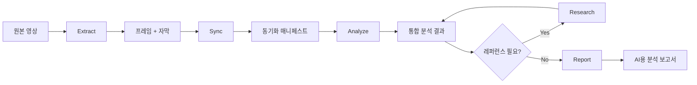

# 도메인 정의서 + 용어사전

> VideoAnalyzer 프로젝트의 도메인 언어를 통일한다.
> 모든 설계문서와 코드에서 이 정의를 따른다.

---

## 하네스 엔지니어링 적용

| 기둥 | 이 문서에서의 역할 |
|------|-------------------|
| 기둥1 (컨텍스트) | CLAUDE.md에서 핵심 용어 참조. 에이전트가 동일 언어 사용 |
| 기둥2 (CI/CD) | post-tool-validate 훅이 용어 일관성 검증 |
| 기둥3 (도구경계) | 용어사전 파일 읽기 전용 (에이전트 수정 금지) |
| 기둥4 (피드백) | 새 용어 발견 시 이 문서에 추가 -> 자기 진화 |

---

## 1. 도메인 개념도

## 2. 핵심 용어사전

| 한국어 | 영어 | 정의 | 동의어/약어 |
|--------|------|------|-------------|
| 프레임 추출 | Frame Extraction | 영상에서 설정 간격(초)마다 정지 이미지(JPG)를 저장하는 과정 | 스크린샷 추출 |
| 장면 분할 | Scene Segmentation | SSIM 기반으로 연속 프레임 간 시각 변화를 감지하여 의미 있는 장면 경계를 결정하는 과정 | Scene Detection |
| SSIM | Structural Similarity Index | 두 이미지의 구조적 유사도를 0~1로 측정하는 알고리즘. 0.85 이하 = 장면 전환 | 구조적 유사도 |
| 자막 동기화 | Subtitle Synchronization | 프레임 타임스탬프와 자막 타임스탬프를 매칭하여 "이 프레임이 나올 때 이 자막이 나온다"를 연결하는 과정 | 싱크 |
| 동기화 매니페스트 | Sync Manifest | 프레임-자막 매핑 정보를 담은 JSON 파일. 분석의 입력이 되는 중간 레이어 | manifest.json |
| 시각 분석 | Visual Analysis | LLM(Claude)이 Read 도구로 프레임 이미지를 직접 보고 분석하는 과정. 도표, 수식, 회로도 등 시각 정보 추출 | 멀티모달 분석 |
| 텍스트 분석 | Text Analysis | 자막(트랜스크립트) 텍스트의 의미를 분석하는 과정 | 자막 분석 |
| 통합 분석 | Integrated Analysis | 시각 분석 + 텍스트 분석 결과를 합쳐 완전한 학습 자료를 만드는 과정. 자막에 없는 시각 정보를 보완 | Combined Analysis |
| 레퍼런스 수집 | Reference Collection | 분석 중 언급된 이론/개념/외부 자료를 웹에서 검색하여 수집하는 과정 | Research |
| 품질 검증 | Quality Verification | 수집된 레퍼런스가 원하던 자료가 맞는지 LLM이 분석하여 확인하는 과정 | QV |
| AI용 보고서 | AI Analysis Report | LLM이 읽고 완벽하게 학습할 수 있도록 최적화된 분석 보고서. .md 포맷 | LLM Report |
| 이미지 설명서 | Image Descriptor | 프레임 이미지 아래에 작성되는 AI 가독 텍스트. 구조/코드/Mermaid로 이미지 내용을 재현 | AI Image Description |
| base64 임베딩 | Base64 Embedding | 이미지를 base64 문자열로 변환하여 .md 파일 내에 직접 삽입. 외부 파일 참조 없이 자기완결형 | 인라인 이미지 |
| Whisper 음성추출 | Whisper Transcription | OpenAI Whisper 모델로 영상 오디오에서 자막을 자동 생성하는 과정 | ASR, STT |

## 3. 파이프라인 Stage 용어

| Stage | 한국어 | 영어 | 입력 | 출력 |
|-------|--------|------|------|------|
| 1 | 추출 | Extract | 영상 + 자막(옵션) | frames/ + transcript/ |
| 2 | 동기화 | Sync | 프레임 + 자막 | manifest.json |
| 3 | 분석 | Analyze | 매니페스트 + 이미지 + 텍스트 | analysis/ |
| 4 | 수집 | Research | 분석 중 감지된 레퍼런스 니즈 | research/ |
| 5 | 보고 | Report | 통합 분석 + 레퍼런스 + 이미지 | AI용 보고서 .md |

## 4. 예시 3개

### 예시 1: 변압기 강의 영상 분석
- 영상: "변압기의 원리" (20분)
- Stage 1: 0.5초 간격 -> 2,400 프레임 + 자막 500줄
- Stage 2: SSIM 0.85 -> 45개 장면으로 분할
- Stage 3: "페러데이 법칙 수식 도표" 프레임에서 시각 분석으로 수식 추출 (자막에는 구두 설명만)
- Stage 4: "페러데이 법칙" 웹 검색 -> 위키백과 + 교과서 레퍼런스 수집+검증
- Stage 5: 45개 장면 통합 보고서 + 핵심 프레임 12장 base64 삽입

### 예시 2: 프로그래밍 튜토리얼 영상
- 영상: "Python 데코레이터 완전정복" (30분)
- Stage 3에서 코드 에디터 화면 프레임 -> 시각 분석으로 코드 추출 (자막은 구두 설명)
- 이미지 설명서: 코드 블록으로 재현 + 실행 흐름 Mermaid 다이어그램

### 예시 3: 공장 제조 공정 영상
- 영상: "LS ELECTRIC 초고압 변압기 제조" (15분)
- Stage 3에서 공정 장비/부품 사진 프레임 -> 시각 분석으로 장비명/공정 단계 식별
- 이미지 설명서: 공정 흐름도(Mermaid) + 부품 구조 텍스트 설명
