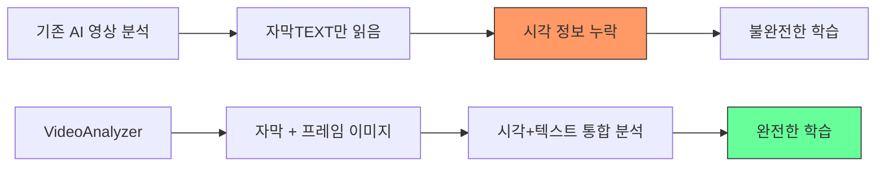
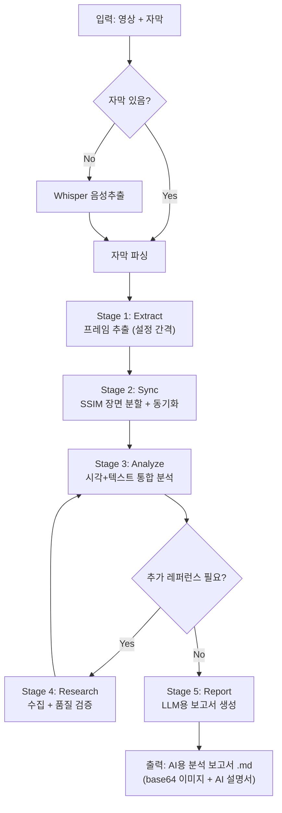
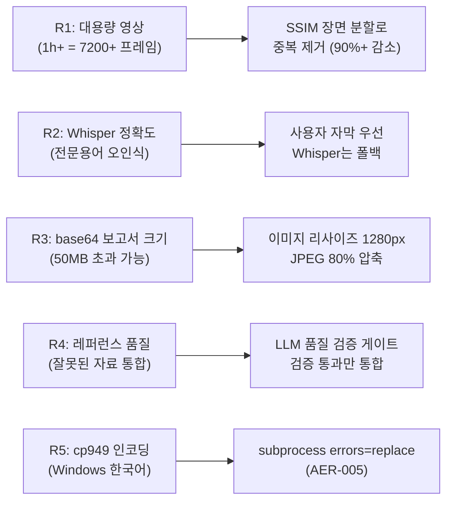

# 사업 기획서 -- VideoAnalyzer

> 교육 영상을 AI가 시각+텍스트 통합 분석하여 LLM 완벽 학습용 보고서를 생성하는 파이프라인.
> 작성일: 2026-04-14

---

## 하네스 엔지니어링 적용

| 기둥 | 이 문서에서의 역할 |
|------|-------------------|
| 기둥1 (컨텍스트) | CLAUDE.md에 프로젝트 목표/파이프라인 순서 요약 반영 |
| 기둥2 (CI/CD) | 범위 OUT 항목을 PreToolUse 훅으로 구조적 차단 |
| 기둥3 (도구경계) | 도구 목록을 settings.local.json allow/deny에 매핑 |
| 기둥4 (피드백) | 범위 변경 시 이 문서 갱신 -> CLAUDE.md 자동 반영 |

---

## 1. 프로젝트 개요

### 1-1. 프로젝트명
**VideoAnalyzer** -- AI 시각+텍스트 통합 영상 분석 파이프라인

### 1-2. 한 줄 요약
교육 영상을 프레임+자막으로 분해하고, AI가 시각 정보와 텍스트 정보를 모두 분석하여 LLM이 완벽 학습 가능한 "AI용 영상 분석 보고서"를 생성한다.

### 1-3. 배경 및 동기



**문제**: 기존 AI 영상 분석은 자막(텍스트)만 읽고 영상의 시각 정보(도표, 수식, 회로도, 실물 사진 등)를 무시한다. 교육 영상에서 시각적으로만 전달되는 핵심 학습 정보가 누락된다.

**해결**: 프레임 단위로 영상을 분해하여 AI가 이미지를 직접 "보고" 분석한 뒤, 텍스트 분석과 통합하여 LLM이 완벽 학습 가능한 보고서를 생성한다.

---

## 2. 프로젝트 목표

| # | 목표 | 측정 기준 |
|---|------|-----------|
| G1 | 영상 시각 정보 100% 포착 | 도표/수식/회로도 등 시각 요소 누락률 0% |
| G2 | LLM 최적화 보고서 생성 | 다른 LLM이 보고서만으로 영상 내용 완벽 재현 가능 |
| G3 | 자막 없는 영상 지원 | Whisper 음성추출로 자막 자동 생성 |
| G4 | 레퍼런스 자동 수집+검증 | 언급된 이론/개념의 외부 자료 수집 및 품질 검증 |
| G5 | 자기완결형 보고서 | 단일 .md 파일로 이미지 포함, 외부 참조 없음 |

---

## 3. 파이프라인 5단계



| Stage | 이름 | 입력 | 출력 | 핵심 도구 |
|-------|------|------|------|-----------|
| 1 | Extract | 영상 + 자막(옵션) | frames/ + transcript/ | opencv-python, openai-whisper |
| 2 | Sync | 프레임 + 자막 | manifest.json | scikit-image (SSIM) |
| 3 | Analyze | 매니페스트 + 이미지 + 텍스트 | analysis/ | Claude Read, sequential-thinking |
| 4 | Research | 분석 중 레퍼런스 니즈 | research/ | exa-web-search, firecrawl |
| 5 | Report | 통합 분석 + 이미지 | AI용 보고서 .md | Write, base64 인코딩 |

---

## 4. 범위 정의

### 4-1. 범위 IN (이 프로젝트가 하는 것)

| # | 항목 | 설명 |
|---|------|------|
| IN-01 | 로컬 영상 파일 처리 | .mp4, .avi, .mkv 등 |
| IN-02 | 자막 파싱 | .srt, .txt 포맷 |
| IN-03 | Whisper 음성추출 | 자막 없을 시 한국어/영어 자동 생성 |
| IN-04 | 프레임 추출 | 설정 간격(기본 0.5초) |
| IN-05 | SSIM 장면 분할 | 중복 프레임 제거, 의미 있는 장면 선별 |
| IN-06 | 시각+텍스트 통합 분석 | Claude Read 멀티모달 분석 |
| IN-07 | 레퍼런스 수집+검증 | 웹 검색 + LLM 품질 검증 |
| IN-08 | LLM용 보고서 생성 | base64 이미지 + AI 텍스트 설명서 |

### 4-2. 범위 OUT (이 프로젝트가 하지 않는 것)

| # | 항목 | 이유 |
|---|------|------|
| OUT-01 | 실시간 스트리밍 분석 | 로컬 파일 기반 배치 처리만 |
| OUT-02 | 영상 편집/변환 | 분석 전용, 영상 수정 없음 |
| OUT-03 | UI 대시보드 | CLI 파이프라인, 웹 UI 없음 |
| OUT-04 | 다국어 동시 자막 | 단일 언어 자막 처리 (한국어 우선) |
| OUT-05 | 클라우드 배포 | 로컬 실행 전용 |

---

## 5. 이해관계자

| 역할 | 담당 | 관심사 |
|------|------|--------|
| 프로젝트 오너 | 박용운 조교수 | 교육 영상 완벽 분석, LLM 학습 품질 |
| 개발자 | Claude Code (AI) | 파이프라인 구현, 하네스 준수 |
| 최종 사용자 | LLM AI | 보고서 읽고 영상 내용 완벽 학습 |
| 참조 제공자 | TransTest 프로젝트 | 프레임 추출/장면 분할 로직 재활용 |

---

## 6. 리스크 분석



| # | 리스크 | 영향 | 확률 | 완화 전략 |
|---|--------|------|------|-----------|
| R1 | 대용량 영상 프레임 폭발 | 높음 | 중 | SSIM 장면 분할로 90%+ 프레임 제거 |
| R2 | Whisper 전문용어 오인식 | 중 | 높음 | 사용자 제공 자막 우선, Whisper는 폴백 |
| R3 | 보고서 파일 크기 초과 | 중 | 중 | 이미지 리사이즈 + JPEG 80% 압축 |
| R4 | 검증 안 된 레퍼런스 통합 | 높음 | 중 | LLM 품질 검증 게이트 필수 통과 |
| R5 | Windows cp949 인코딩 오류 | 낮음 | 높음 | subprocess errors="replace" |

---

## 7. 일정 계획

| Phase | 산출물 | 상태 |
|-------|--------|------|
| Phase 1 | 프로젝트 프로파일 + 프롬프트 가공 | 완료 |
| Phase 2 | 설계문서 8종 선별 | 완료 |
| Phase 3 | 설계문서 8종 생성 | **진행중** |
| Phase 4 | 하네스 설계 (CLAUDE.md + hooks) | 대기 |
| Phase 5 | 4기둥 검증 (90점+) | 대기 |
| Phase 7 | 설치 + 보고 | 대기 |

---

## 8. 활용 도구/MCP/스킬/에이전트 총목록

| 카테고리 | 도구 | 용도 | Stage |
|----------|------|------|-------|
| MCP | exa-web-search | 레퍼런스 시맨틱 검색 | 4 |
| MCP | firecrawl | 웹 페이지 스크래핑 | 4 |
| MCP | sequential-thinking | 복잡 분석 ToT 추론 | 3,4 |
| MCP | fal-ai | 이미지 보정/변환 (필요 시) | 5 |
| MCP | memory | 분석 컨텍스트 저장 | 3,4 |
| 도구 | Claude Read (이미지) | 프레임 멀티모달 시각 분석 | 3 |
| 도구 | Bash (python) | 파이프라인 스크립트 실행 | 1,2 |
| 도구 | Write/Edit | 보고서/설정 파일 생성 | 5 |
| 에이전트 | gap-detector | 설계-구현 갭 검증 | QA |
| 에이전트 | code-analyzer | 코드 품질 분석 | QA |
| 참조 | TransTest 01_extract_frames.py | 프레임 추출 로직 개량 | 1 |
| 참조 | TransTest 02_scene_segment.py | SSIM 장면 분할 로직 개량 | 2 |

---

## 9. 실제 활용 예시

### 예시 1: 변압기 강의 영상 분석

```
입력: "변압기의 원리" 20분 강의 + .srt 자막
Stage 1: 0.5초 간격 -> 2,400 프레임 추출
Stage 2: SSIM 0.85 -> 45개 장면으로 분할 (95% 중복 제거)
Stage 3: "패러데이 법칙 수식 도표" 프레임 -> 시각 분석으로 수식 추출
         (자막에는 구두 설명만 있어 수식 자체는 누락되었을 것)
Stage 4: "패러데이 법칙" 웹 검색 -> 위키백과+교과서 레퍼런스 수집+검증
Stage 5: 45개 장면 통합 보고서 + 핵심 프레임 12장 base64 삽입
         + 각 프레임 아래 AI 이미지 설명서 (수식 LaTeX 재현, 회로도 Mermaid)
```

### 예시 2: 프로그래밍 튜토리얼 영상

```
입력: "Python 데코레이터 완전정복" 30분 영상 + 자막 없음
Stage 1: Whisper 음성추출 -> 자막 자동 생성 + 프레임 추출
Stage 2: 코드 에디터 화면 전환 감지 -> 28개 장면
Stage 3: 코드 에디터 프레임 -> 시각 분석으로 코드 추출
         (자막은 구두 설명뿐, 실제 코드는 화면에만 존재)
Stage 4: "Python decorator pattern" 레퍼런스 수집
Stage 5: 코드 블록 + 실행 흐름 Mermaid 다이어그램 포함 보고서
```

### 예시 3: 공장 제조 공정 영상

```
입력: "LS ELECTRIC 초고압 변압기 제조" 15분 + .srt 자막
Stage 1: 0.5초 간격 -> 1,800 프레임 + 자막 320줄
Stage 2: SSIM 0.85 -> 38개 장면 (공정 단계별 전환)
Stage 3: 공정 장비/부품 사진 프레임 -> 시각 분석으로 장비명/공정 단계 식별
         (자막: "이 공정에서..." -> 시각: 실제 장비 사진으로 구체적 장비명 식별)
Stage 4: "초고압 변압기 제조 공정" 레퍼런스 수집
Stage 5: 공정 흐름도(Mermaid) + 부품 구조 텍스트 설명 + 장비 사진 포함 보고서
```

---

## 10. 성공 기준

| # | 기준 | 측정 방법 |
|---|------|-----------|
| S1 | 시각 정보 포착률 100% | 영상 내 도표/수식/코드를 보고서에서 모두 확인 가능 |
| S2 | 보고서 자기완결성 | 단일 .md 파일만으로 이미지 깨짐 없이 열람 가능 |
| S3 | LLM 학습 가능성 | 다른 LLM에게 보고서 제공 시 영상 내용 질문 정답률 90%+ |
| S4 | 파이프라인 자동화 | 영상+자막 입력만으로 보고서까지 자동 생성 |
| S5 | 레퍼런스 품질 | 수집된 레퍼런스 정확도 95%+ (검증 게이트 통과) |
