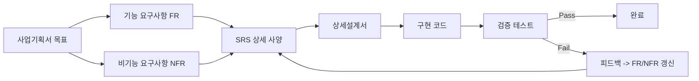
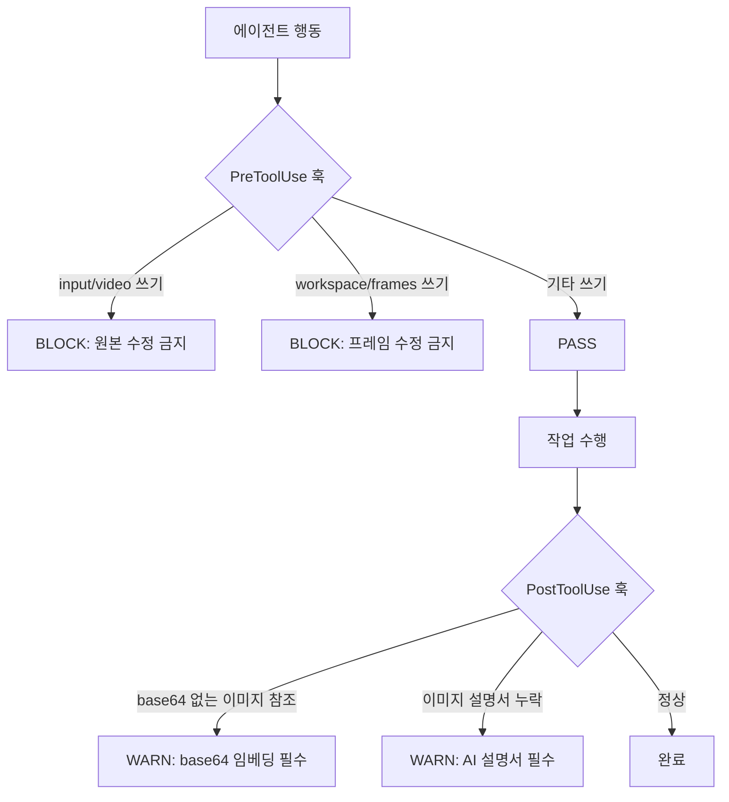
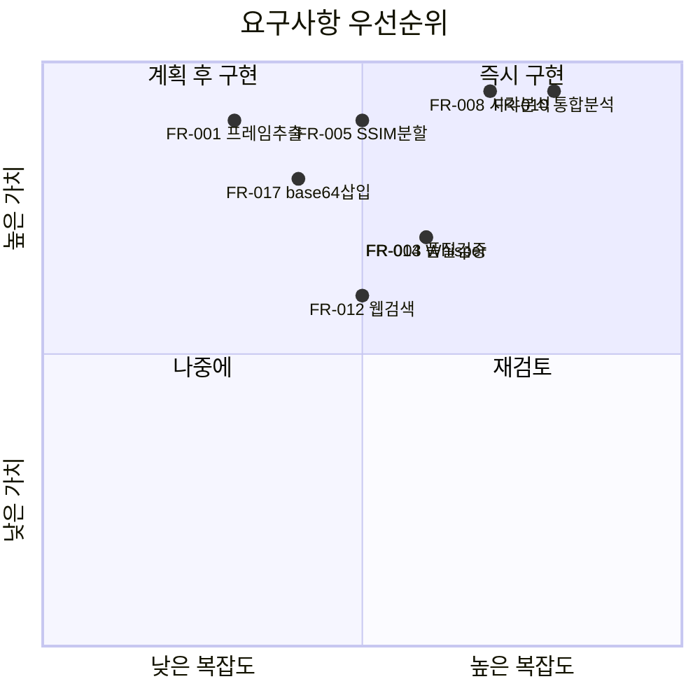

# 요구사항 정의서 -- VideoAnalyzer

> 기능/비기능 요구사항과 검증 방법을 정의한다.
> 작성일: 2026-04-14

---

## 하네스 엔지니어링 적용

| 기둥 | 이 문서에서의 역할 |
|------|-------------------|
| 기둥1 (컨텍스트) | FR 핵심 항목을 CLAUDE.md 규칙으로 압축 반영 |
| 기둥2 (CI/CD) | "검증 방법" 컬럼의 자동화 가능 항목을 훅으로 구현 |
| 기둥3 (도구경계) | FR별 필요 도구를 settings.local.json에 매핑 |
| 기둥4 (피드백) | "위반 시 대응" 컬럼이 피드백 루프의 구체적 행동 정의 |

---

## 1. 요구사항 추적 체계



---

## 2. 기능 요구사항 (Functional Requirements)

### Stage 1: Extract

| ID | 요구사항 | 우선순위 | 검증 방법 | 관련 도구 |
|----|----------|----------|-----------|-----------|
| FR-001 | 설정 가능한 간격으로 프레임 추출 (기본 0.5초, 사용자 지정 가능) | 필수 | config.json 간격 변경 후 프레임 수 확인 | opencv-python |
| FR-002 | 자막 파일(.srt/.txt) 파싱하여 타임스탬프+텍스트 JSON 변환 | 필수 | .srt 입력 -> timestamped JSON 출력 검증 | Python stdlib |
| FR-003 | 자막 없을 시 Whisper 자동 음성추출 (한국어 우선) | 필수 | 자막 없는 영상 -> Whisper 자막 생성 확인 | openai-whisper |
| FR-004 | 추출 프레임을 workspace/frames/에 JPG 저장 | 필수 | 디렉토리 내 파일 수 = 영상길이/간격 | opencv-python |

### Stage 2: Sync

| ID | 요구사항 | 우선순위 | 검증 방법 | 관련 도구 |
|----|----------|----------|-----------|-----------|
| FR-005 | SSIM 기반 장면 분할 (임계값 설정 가능, 기본 0.85) | 필수 | 연속 유사 프레임이 하나로 병합 확인 | scikit-image |
| FR-006 | 중복 프레임 제거 (SSIM > 임계값인 연속 프레임 병합) | 필수 | 분할 전후 프레임 수 비교 (90%+ 감소) | numpy |
| FR-007 | 프레임-자막 타임스탬프 동기화 매니페스트 JSON 생성 | 필수 | manifest.json 내 프레임-자막 매핑 정합성 확인 | Python stdlib |

### Stage 3: Analyze

| ID | 요구사항 | 우선순위 | 검증 방법 | 관련 도구 |
|----|----------|----------|-----------|-----------|
| FR-008 | LLM 시각 분석: 프레임 이미지를 Claude Read로 직접 분석 | 필수 | 분석 결과에 이미지에서만 추출 가능한 정보 포함 확인 | Claude Read |
| FR-009 | 텍스트 분석: 자막 텍스트 의미 분석 | 필수 | 분석 결과에 자막 핵심 내용 포함 확인 | LLM |
| FR-010 | 시각+텍스트 통합 분석 (자막에 없는 시각 정보 보완) | 필수 | 통합 결과가 개별 결과의 합보다 풍부한지 확인 | sequential-thinking |
| FR-011 | 분석 중 추가 레퍼런스 필요 여부 자동 감지 | 선택 | 이론/개념 언급 시 Stage 4 트리거 확인 | LLM |

### Stage 4: Research

| ID | 요구사항 | 우선순위 | 검증 방법 | 관련 도구 |
|----|----------|----------|-----------|-----------|
| FR-012 | 시맨틱 웹 검색으로 레퍼런스 수집 | 필수 | 검색 결과 관련도 확인 | exa-web-search |
| FR-013 | 웹 페이지 스크래핑으로 상세 내용 추출 | 필수 | 추출된 내용이 원문과 일치 확인 | firecrawl |
| FR-014 | 수집 자료 품질 검증 (원하던 자료가 맞는지 LLM 분석) | 필수 | 검증 통과율 95%+ | LLM |
| FR-015 | 검증된 자료만 분석 결과에 통합 | 필수 | 검증 실패 자료가 보고서에 미포함 확인 | LLM |

### Stage 5: Report

| ID | 요구사항 | 우선순위 | 검증 방법 | 관련 도구 |
|----|----------|----------|-----------|-----------|
| FR-016 | .md 포맷 LLM 최적화 보고서 생성 | 필수 | .md 파서로 구조 유효성 검증 | Write |
| FR-017 | 중요 프레임 base64 직접 삽입 (참조 경로 X) | 필수 | 보고서 내 `data:image/jpeg;base64,` 패턴 존재 확인 | Python base64 |
| FR-018 | 이미지 아래 AI용 텍스트 설명서 작성 | 필수 | 모든 이미지 아래 설명서 블록 존재 확인 | LLM |
| FR-019 | 이미지 설명서에 구조/코드/Mermaid 포함 | 필수 | 설명서 내 코드 블록 또는 Mermaid 존재 확인 | LLM |
| FR-020 | 이미지 리사이즈 (최대 1280px) + JPEG 80% 압축 | 필수 | 삽입 이미지 해상도/크기 검증 | Pillow |

---

## 3. 비기능 요구사항 (Non-Functional Requirements)

| ID | 카테고리 | 요구사항 | 기준 | 위반 시 대응 |
|----|----------|----------|------|-------------|
| NFR-001 | 성능 | 1시간 영상 처리 시간 | 30분 이내 (Stage 1-2) | SSIM 임계값 상향으로 프레임 수 감소 |
| NFR-002 | 용량 | 보고서 파일 크기 | 50MB 이내 (이미지 포함) | 이미지 품질 하향 또는 포함 이미지 수 제한 |
| NFR-003 | 호환성 | Python 버전 | 3.11+ | requirements.txt에 버전 명시 |
| NFR-004 | 호환성 | OS 환경 | Windows 11 (cp949 대응) | subprocess errors="replace" |
| NFR-005 | 보안 | API 키 보호 | .env + .gitignore | PostToolUse 훅으로 키 노출 차단 |
| NFR-006 | 유지보수 | 파이프라인 설정 외부화 | config.json으로 임계값/간격 관리 | 하드코딩 발견 시 PostToolUse 경고 |
| NFR-007 | 데이터 보호 | 원본 데이터 불변성 | input/, workspace/frames/ 읽기 전용 | PreToolUse 훅으로 쓰기 차단 |

---

## 4. 하네스 강제 규칙 (Enforcement Rules)



| # | 규칙 | 강제 수단 | 위반 시 |
|---|------|-----------|---------|
| E1 | 분석 시 프레임 이미지 Read 없이 텍스트만 분석 완료 금지 | CLAUDE.md 규칙 | 분석 결과 반려, 재실행 |
| E2 | 레퍼런스 수집 시 품질 검증 없이 보고서 통합 금지 | Stage 4 게이트 | 미검증 자료 제외 |
| E3 | 보고서 이미지는 base64 직접 삽입만 허용 | PostToolUse 훅 | 상대경로 참조 발견 시 경고 |
| E4 | 이미지 아래 AI용 텍스트 설명서 누락 금지 | PostToolUse 훅 | 설명서 없는 이미지 발견 시 경고 |
| E5 | workspace/frames/ 수정/삭제 금지 | PreToolUse 훅 | 쓰기 시도 BLOCK |
| E6 | 새 패키지 무단 설치 금지 | CLAUDE.md 규칙 | 사용자 승인 필수 |

---

## 5. 요구사항 우선순위 매트릭스



---

## 6. 실제 예시: 요구사항 검증 시나리오

### 예시 1: FR-008 시각 분석 검증

```
테스트 영상: 변압기 강의 (회로도 포함 장면)
1. 자막만 분석 -> "변압기는 전자기 유도를 이용한다" (구두 설명만)
2. 프레임 이미지 Read -> "I-V 특성 곡선, 권선비 N1:N2 = V1:V2 수식,
   등가 회로도 (누설 리액턴스 포함)" 추출
3. 검증: 시각 분석이 자막에 없는 수식/회로도를 포착했는가? -> PASS
```

### 예시 2: FR-017 base64 삽입 검증

```
보고서 생성 후 검증:
1. grep "data:image/jpeg;base64," report.md -> 매칭 존재 확인
2. grep "!\[.*\](\./" report.md -> 상대 경로 참조 없음 확인
3. 다른 디렉토리에서 report.md 열기 -> 이미지 정상 표시 확인
-> PASS (자기완결형)
```

### 예시 3: E1 하네스 강제 규칙 검증

```
시뮬레이션: 에이전트가 프레임 Read 없이 자막만으로 분석 시도
1. PostToolUse 훅이 analysis/ 출력에서 "이미지 분석" 섹션 체크
2. 이미지 분석 결과 없음 -> 경고 발생
3. 에이전트가 프레임 Read 후 재분석
-> 하네스 강제 규칙 정상 작동
```
