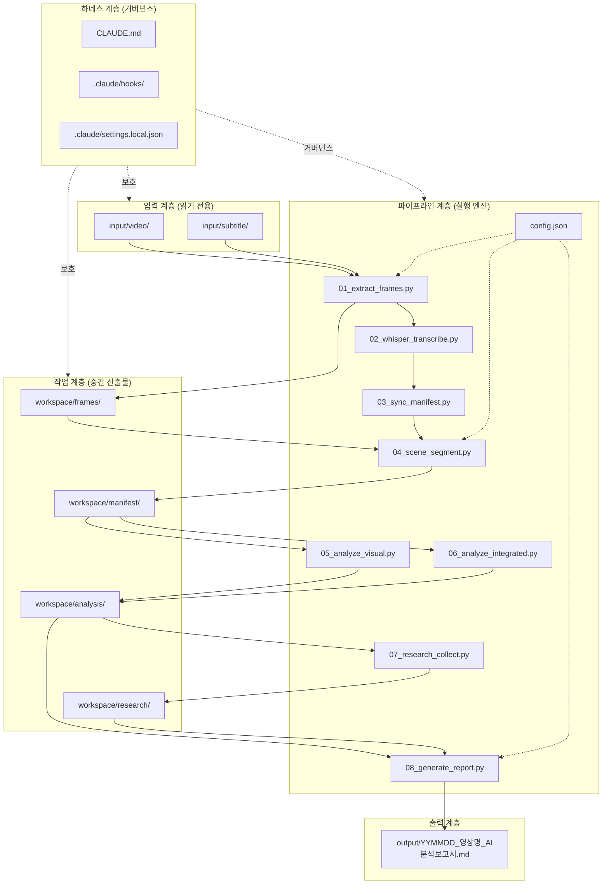
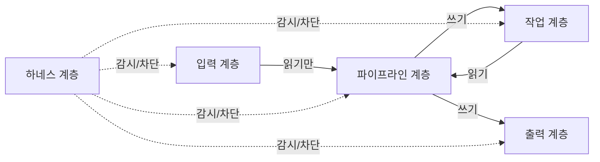
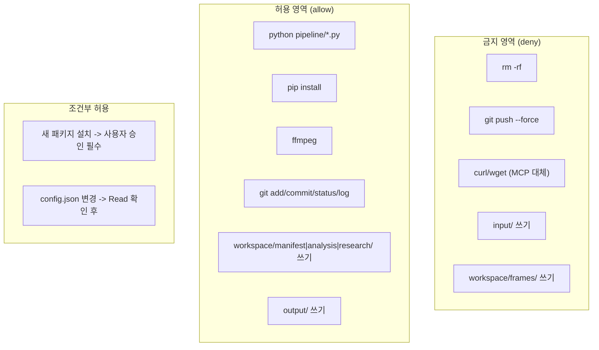
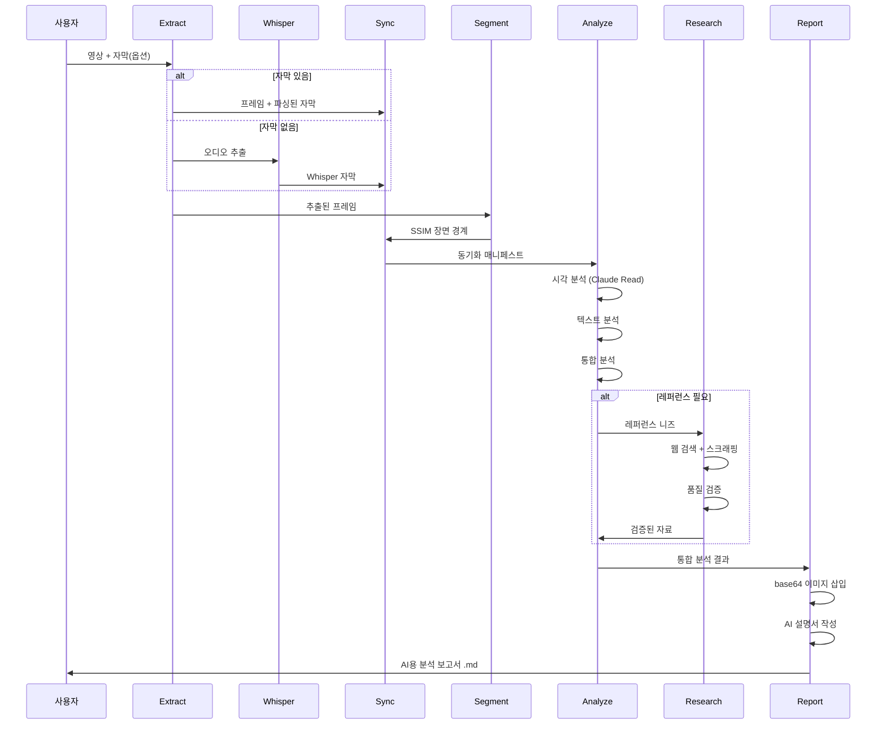

# 아키텍처 설계서 -- VideoAnalyzer

> 시스템 계층 구조, 의존성 규칙, 보안 경계를 정의한다.
> 작성일: 2026-04-14

---

## 하네스 엔지니어링 적용

| 기둥 | 이 문서에서의 역할 |
|------|-------------------|
| 기둥1 (컨텍스트) | 계층 구조/디렉토리 매핑을 CLAUDE.md 아키텍처 섹션에 반영 |
| 기둥2 (CI/CD) | 의존성 방향 위반을 PostToolUse 훅으로 감지 |
| 기둥3 (도구경계) | 보안 경계별 allow/deny를 settings.local.json에 매핑 |
| 기둥4 (피드백) | 아키텍처 결정 변경 시 adr.md에 ADR 추가 |

---

## 1. 시스템 아키텍처 개요



---

## 2. 디렉토리 구조

```
260414_VideoAnalyzer/
+-- CLAUDE.md                    # 하네스 런타임 규칙 (60줄 이하)
+-- code-convention.md           # 코딩 표준
+-- adr.md                       # 아키텍처 결정 기록
+-- .claude/
|   +-- settings.local.json      # 도구 경계 (allow/deny)
|   +-- hooks/
|       +-- pre-tool-guard.js    # 입력/프레임 쓰기 차단
|       +-- post-tool-validate.js # 출력 품질 검증
+-- docs/                        # 설계문서 8종
|   +-- 01_도메인정의서_용어사전.md
|   +-- 02_사업기획서.md
|   +-- 03_요구사항정의서.md
|   +-- 04_아키텍처설계서.md       # (이 문서)
|   +-- 05_개발표준정의서.md
|   +-- 06_SRS.md
|   +-- 07_상세설계서.md
|   +-- 08_순서도및절차도.md
+-- input/                       # 원본 데이터 (읽기 전용)
|   +-- video/                   # 원본 영상 (.mp4 등)
|   +-- subtitle/                # 자막 파일 (.srt/.txt)
|   +-- audio/                   # Whisper 추출 오디오
+-- pipeline/                    # 파이프라인 스크립트
|   +-- config.json              # 파이프라인 설정
|   +-- 01_extract_frames.py
|   +-- 02_whisper_transcribe.py
|   +-- 03_sync_manifest.py
|   +-- 04_scene_segment.py
|   +-- 05_analyze_visual.py
|   +-- 06_analyze_integrated.py
|   +-- 07_research_collect.py
|   +-- 08_generate_report.py
+-- workspace/                   # 중간 산출물
|   +-- frames/                  # 추출 프레임 (Stage 1 후 읽기 전용)
|   +-- manifest/                # 동기화 매니페스트
|   +-- analysis/                # 분석 중간 결과
|   +-- research/                # 레퍼런스 수집 자료
+-- output/                      # 최종 보고서
+-- Output/EngineeringPrompt/    # 설계문서 + 진행보고 이중저장
```

---

## 3. 계층별 의존성 규칙



| 규칙 | 설명 | 강제 수단 |
|------|------|-----------|
| 입력 불변 | input/ 디렉토리는 절대 수정/삭제 금지 | PreToolUse 훅 BLOCK |
| 프레임 보호 | workspace/frames/는 Stage 1 이후 읽기 전용 | PreToolUse 훅 BLOCK |
| 단방향 흐름 | 파이프라인은 Stage 순서대로만 진행 | 스크립트 번호 순서 강제 |
| 설정 외부화 | 임계값/간격 등은 config.json에서만 관리 | 코드 내 하드코딩 금지 |
| 하네스 우선 | 하네스 규칙이 파이프라인 로직보다 우선 | hooks 실행 순서 보장 |

---

## 4. 핵심 아키텍처 결정

### ADR-VA-001: 보고서 포맷 -- Markdown (.md)

**컨텍스트**: LLM이 학습하기 최적의 포맷 선택 필요.
**결정**: .md (Markdown)
**근거**:
1. 모든 LLM이 네이티브로 읽고 이해하는 포맷
2. 구조적 헤딩(#/##/###)으로 계층 탐색 가능
3. 코드 블록, 테이블, Mermaid 다이어그램 지원
4. base64 이미지 인라인 삽입으로 자기완결형 가능
5. Git 버전 관리 호환

### ADR-VA-002: 이미지 삽입 -- base64 인라인

**컨텍스트**: 보고서를 다른 환경에서 열어도 이미지가 깨지면 안 됨.
**결정**: `` 형태 직접 삽입. 상대경로 참조 금지.
**근거**:
- 단일 파일 자기완결성 (외부 파일 의존 없음)
- 복사/이동 시 이미지 깨짐 방지
- LLM은 base64 디코딩 가능

### ADR-VA-003: Whisper 폴백

**컨텍스트**: 일부 영상에는 자막이 없음.
**결정**: 자막 파일 있으면 파싱, 없으면 Whisper 자동 음성추출.
**근거**:
- 사용자 제공 자막이 항상 더 정확
- Whisper는 전문용어 오인식 가능성 있으므로 폴백으로만 사용

---

## 5. 보안 경계



---

## 6. 데이터 흐름 상세



---

## 7. AI용 이미지 설명서 구조

보고서 내 각 이미지 아래에 반드시 작성되는 텍스트 블록:

```markdown
#### 이미지 분석서: [프레임 ID] -- [타임스탬프]
- **화면 구성**: [레이아웃, 요소 배치 텍스트 설명]
- **시각 핵심 정보**: [자막에 없는, 이미지에서만 추출한 정보]
- **구조 재현**:
  [Mermaid 다이어그램 / 코드 블록 / 수식으로 이미지 내용을 텍스트 재현]
- **학습 포인트**: [이 이미지가 전달하는 핵심 지식]
```

---

## 8. 실제 예시

### 예시 1: 변압기 강의 -- 데이터 흐름

```
input/video/transformer_lecture.mp4 (20분, 720p)
input/subtitle/transformer_lecture.srt (500줄)

-> Stage 1: frames/ 에 2,400장 JPG
-> Stage 2: SSIM 0.85 -> 45개 장면, manifest.json
-> Stage 3: 장면 #12 "패러데이 법칙 수식 도표"
   - 시각: V=N*dPhi/dt 수식 + 회로도 추출
   - 텍스트: "패러데이 법칙에 의해 2차측 전압이..." 분석
   - 통합: 수식+회로도+구두설명 = 완전한 패러데이 법칙 학습 자료
-> Stage 4: "패러데이 법칙" exa 검색 -> 위키+교과서 수집+검증
-> Stage 5: output/260414_변압기강의_AI분석보고서.md
   - base64 삽입 12장 + 각 이미지 아래 AI 설명서
   - 총 파일 크기: ~15MB
```

### 예시 2: 코딩 튜토리얼 -- 이미지 설명서 적용

```
장면 #8: Python 코드 에디터 화면
- 자막: "이 데코레이터는 함수를 감싸서..."
- 프레임 이미지: 에디터에 실제 코드가 보임

AI 이미지 설명서:
#### 이미지 분석서: frame_0245 -- 05:32
- **화면 구성**: VSCode 에디터, 좌측 파일 탐색기, 중앙 코드 영역
- **시각 핵심 정보**: decorator 패턴 구현 코드 (자막에는 구두 설명만)
- **구조 재현**:
  ```python
  def my_decorator(func):
      def wrapper(*args, **kwargs):
          print("Before")
          result = func(*args, **kwargs)
          print("After")
          return result
      return wrapper
  ```
- **학습 포인트**: 클로저를 활용한 데코레이터 패턴, *args/**kwargs로 범용성 확보
```

### 예시 3: 제조 공정 -- 보안 경계 적용

```
보안 경계 검증:
1. 에이전트가 input/video/factory.mp4 삭제 시도
   -> PreToolUse 훅: BLOCK (입력 불변 규칙)
2. 에이전트가 workspace/frames/frame_0001.jpg 수정 시도
   -> PreToolUse 훅: BLOCK (프레임 보호 규칙)
3. 에이전트가 curl로 외부 파일 다운로드 시도
   -> settings.local.json deny: BLOCK (MCP로 대체)
4. 에이전트가 output/에 보고서 생성
   -> 허용 (출력 계층 쓰기 가능)
```
