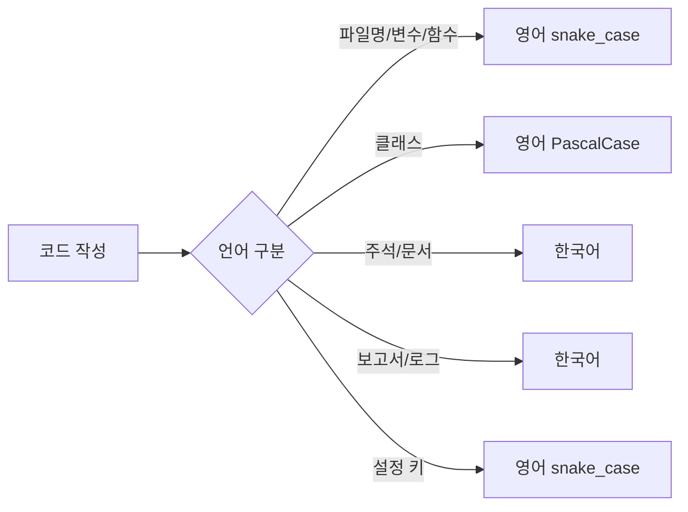
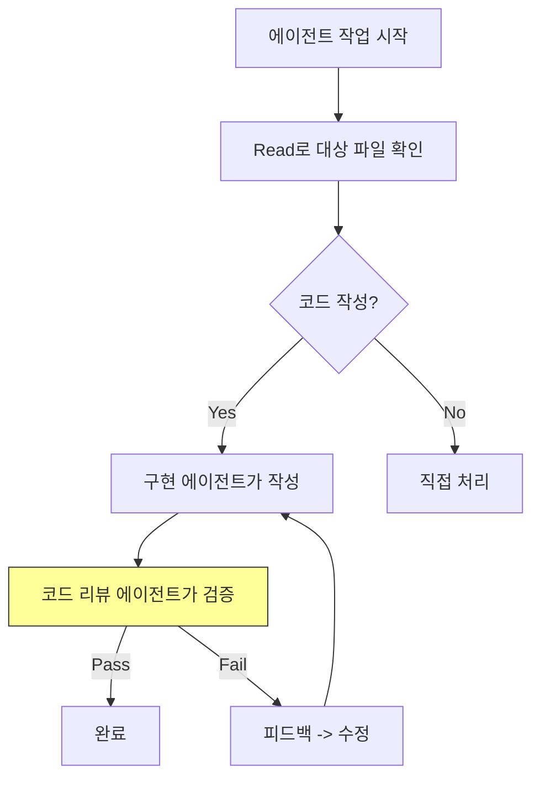

# 개발 표준 정의서 -- VideoAnalyzer

> 코딩 표준, 네이밍 규칙, 금지 패턴, 에이전트 운영 규칙을 정의한다.
> 작성일: 2026-04-14

---

## 하네스 엔지니어링 적용

| 기둥 | 이 문서에서의 역할 |
|------|-------------------|
| 기둥1 (컨텍스트) | code-convention.md로 분리, CLAUDE.md에서 참조 |
| 기둥2 (CI/CD) | 금지 패턴을 PostToolUse 훅으로 자동 감지 |
| 기둥3 (도구경계) | 도구 사용 규칙을 settings.local.json에 반영 |
| 기둥4 (피드백) | 코드 리뷰 시 발견된 패턴 위반을 규칙에 추가 |

---

## 1. 언어/포맷 규칙



| 대상 | 규칙 | 예시 |
|------|------|------|
| 파일명 | `NN_동사_목적어.py` | `01_extract_frames.py` |
| 함수명 | `snake_case` (동사_목적어) | `extract_frames()`, `calculate_ssim()` |
| 변수명 | `snake_case` | `frame_interval`, `ssim_threshold` |
| 클래스명 | `PascalCase` | `SceneSegmenter`, `ManifestBuilder` |
| 상수 | `UPPER_SNAKE` | `DEFAULT_INTERVAL`, `SSIM_THRESHOLD` |
| 주석/독스트링 | 한국어 | `"""프레임을 추출하여 JPG로 저장한다."""` |
| 설정 키 (config.json) | `snake_case` | `"frame_interval": 0.5` |
| 출력 파일명 | `YYMMDD_[이름]_[태그]` | `260414_변압기강의_AI분석보고서.md` |

---

## 2. Python 코딩 표준

### 2-1. 필수 패턴

```python
# 파일 헤더 (모든 pipeline/*.py 필수)
"""
VideoAnalyzer Pipeline - Stage N: [Stage명]
흡수 출처: TransTest/pipeline/0N_xxx.py 개량 (Reference-Port)
"""

import sys
from pathlib import Path

# 인코딩 안전장치 (AER-005)
import subprocess
result = subprocess.run(cmd, capture_output=True, text=True, errors="replace")

# config.json 읽기 (하드코딩 금지)
import json
CONFIG_PATH = Path(__file__).parent / "config.json"
with open(CONFIG_PATH, encoding="utf-8") as f:
    config = json.load(f)
```

### 2-2. 금지 패턴

| 패턴 | 이유 | 대안 |
|------|------|------|
| `eval()`, `exec()` | 보안 취약점 | 명시적 로직 |
| 절대경로 하드코딩 | 이식성 파괴 | `Path(__file__).parent` 상대경로 |
| `subprocess` without `errors="replace"` | cp949 인코딩 폭탄 (AER-005) | `errors="replace"` 필수 |
| `open()` without `encoding="utf-8"` | Windows 기본 cp949 | `encoding="utf-8"` 명시 |
| `import *` | 네임스페이스 오염 | 명시적 import |
| 중첩 3단계 이상 try-except | 에러 은폐 | 의미 있는 단위로 분리 |

---

## 3. config.json 표준

```json
{
  "pipeline": {
    "frame_interval": 0.5,
    "ssim_threshold": 0.85,
    "min_scene_duration": 3.0,
    "whisper_language": "ko",
    "whisper_model": "base"
  },
  "report": {
    "image_max_width": 1280,
    "image_quality": 80,
    "max_report_size_mb": 50,
    "output_format": "md"
  },
  "paths": {
    "input_video": "input/video",
    "input_subtitle": "input/subtitle",
    "workspace_frames": "workspace/frames",
    "workspace_manifest": "workspace/manifest",
    "workspace_analysis": "workspace/analysis",
    "workspace_research": "workspace/research",
    "output": "output"
  }
}
```

---

## 4. 에이전트 운영 규칙



| # | 규칙 | 설명 |
|---|------|------|
| A1 | 편집 전 Read 필수 | 파일 수정 전 반드시 Read로 현재 내용 확인 (AER-004) |
| A2 | 코드 작성 != 코드 리뷰 | 같은 에이전트가 작성과 리뷰를 겸하지 않음 |
| A3 | 컨텍스트 40% 이하 유지 | 구현 완료 후 컨텍스트 사용량 제한 |
| A4 | Script Before Edit | Python으로 해결 가능하면 직접 파일 편집 지양 |
| A5 | No Guessing | 불확실하면 파일 확인 먼저, 없으면 사용자에게 질문 |
| A6 | 패키지 설치 승인 | 새 패키지 설치 시 반드시 사용자 승인 |

---

## 5. Git 규칙

| 항목 | 규칙 |
|------|------|
| 커밋 메시지 | `feat(stage): 한국어 설명` / `fix(stage): 한국어 설명` |
| .gitignore | `input/video/`, `.env`, `__pycache__/`, `*.pyc` |
| 브랜치 | `main` (단독 개발, 브랜치 불필요) |
| 커밋 단위 | Stage 단위 또는 의미 있는 기능 단위 |

---

## 6. 실제 예시

### 예시 1: 파이프라인 스크립트 작성 패턴

```python
"""
VideoAnalyzer Pipeline - Stage 1: Extract
흡수 출처: TransTest/pipeline/01_extract_frames.py 개량 (Reference-Port)
"""
import json
import sys
from pathlib import Path

import cv2

CONFIG_PATH = Path(__file__).parent / "config.json"


def load_config() -> dict:
    """config.json에서 파이프라인 설정을 읽는다."""
    with open(CONFIG_PATH, encoding="utf-8") as f:
        return json.load(f)


def extract_frames(video_path: Path, output_dir: Path, interval: float) -> list[Path]:
    """영상에서 설정 간격으로 프레임을 추출한다."""
    cap = cv2.VideoCapture(str(video_path))
    fps = cap.get(cv2.CAP_PROP_FPS)
    frame_skip = int(fps * interval)
    # ... 추출 로직
    cap.release()
    return extracted_paths


if __name__ == "__main__":
    config = load_config()
    # 상대경로 사용 (절대경로 하드코딩 금지)
    project_root = Path(__file__).parent.parent
    video_dir = project_root / config["paths"]["input_video"]
    output_dir = project_root / config["paths"]["workspace_frames"]
    # ...
```

### 예시 2: 금지 패턴 vs 올바른 패턴

```python
# 금지: 절대경로 하드코딩
frames_dir = "C:/Users/pyu42/Projects/VideoAnalyzer/workspace/frames"

# 올바름: 상대경로
frames_dir = Path(__file__).parent.parent / "workspace" / "frames"

# 금지: subprocess 인코딩 미처리
result = subprocess.run(cmd, capture_output=True, text=True)

# 올바름: errors="replace" (AER-005)
result = subprocess.run(cmd, capture_output=True, text=True, errors="replace")

# 금지: open() 인코딩 미지정
with open("manifest.json") as f:

# 올바름: UTF-8 명시
with open("manifest.json", encoding="utf-8") as f:
```

### 예시 3: 커밋 메시지 패턴

```
feat(extract): 프레임 추출 스크립트 구현 (TransTest 개량)
feat(sync): SSIM 장면 분할 + 매니페스트 생성
fix(extract): Whisper 한국어 모델 경로 수정
docs(arch): 아키텍처 설계서 초안 작성
refactor(config): 하드코딩 임계값을 config.json으로 외부화
```
