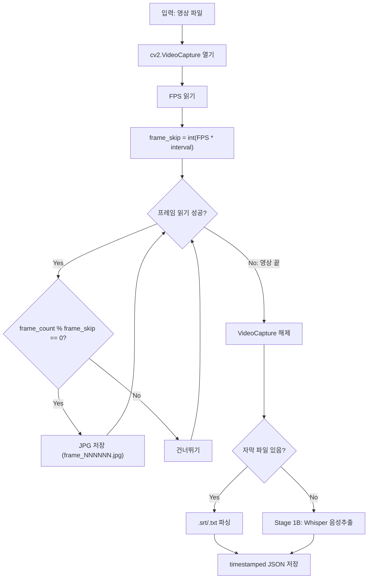
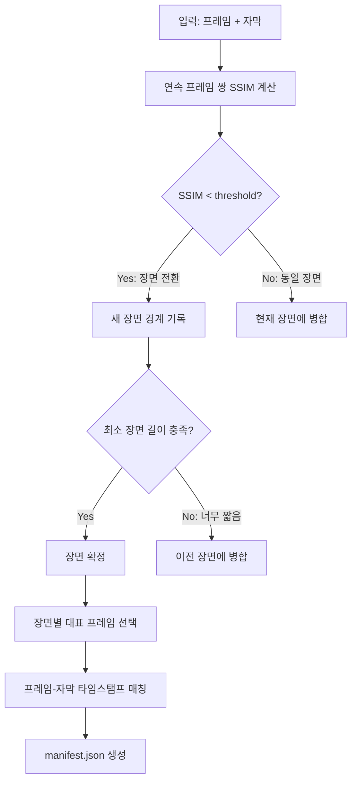
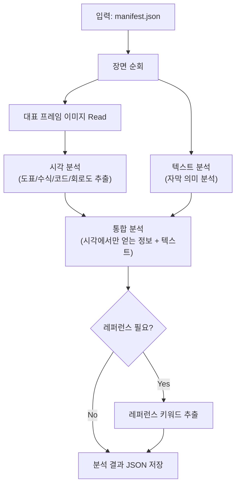
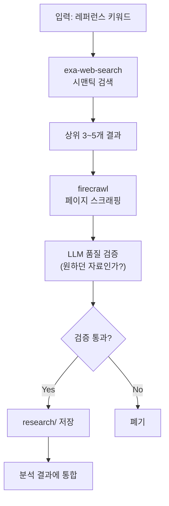
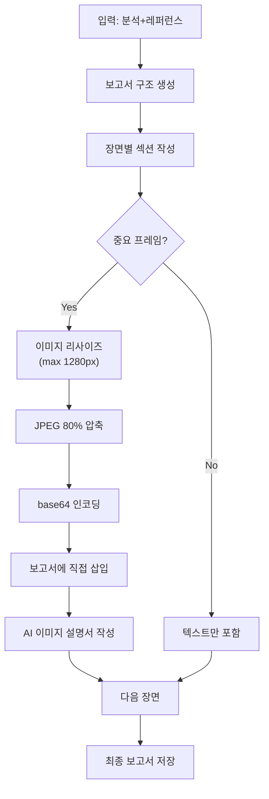

# SRS (요구사항 사양서) -- VideoAnalyzer

> 기능/비기능 요구사항의 상세 기술 사양을 정의한다.
> 작성일: 2026-04-14

---

## 하네스 엔지니어링 적용

| 기둥 | 이 문서에서의 역할 |
|------|-------------------|
| 기둥1 (컨텍스트) | 상세 사양이 CLAUDE.md 규칙의 기술적 근거 |
| 기둥2 (CI/CD) | 사양 기준값을 PostToolUse 훅 검증 임계값으로 사용 |
| 기둥3 (도구경계) | 사양에 명시된 도구만 allow 목록에 포함 |
| 기둥4 (피드백) | 사양 미달 시 NFR 기준값 조정 -> config.json 반영 |

---

## 1. 시스템 운영 환경

| 항목 | 사양 |
|------|------|
| OS | Windows 11 Home (10.0.26200+) |
| Python | 3.11+ |
| 인코딩 | 파일 I/O: UTF-8 강제, subprocess: errors="replace" |
| 디스크 | 입력 영상 + 프레임 + 보고서 = 영상 크기 x 3 예상 |
| 메모리 | Whisper base 모델: 최소 4GB RAM |
| GPU | Whisper: CPU 가능 (CUDA 선택적) |

---

## 2. Stage별 상세 기술 사양

### 2-1. Stage 1: Extract -- 프레임 추출



| 파라미터 | 기본값 | 범위 | config.json 키 |
|----------|--------|------|----------------|
| 프레임 추출 간격 | 0.5초 | 0.1~5.0초 | `pipeline.frame_interval` |
| 출력 포맷 | JPEG | JPEG/PNG | 코드 내 고정 (JPEG) |
| 프레임 파일명 패턴 | `frame_NNNNNN.jpg` | 6자리 제로패딩 | 코드 내 고정 |
| Whisper 모델 | base | tiny/base/small/medium/large | `pipeline.whisper_model` |
| Whisper 언어 | ko | ISO 639-1 | `pipeline.whisper_language` |

**입력 인터페이스**:
- 영상: `input/video/*.{mp4,avi,mkv,mov,webm}`
- 자막: `input/subtitle/*.{srt,txt}` (파일명이 영상과 동일)

**출력 인터페이스**:
- 프레임: `workspace/frames/frame_000001.jpg ~ frame_NNNNNN.jpg`
- 자막: `workspace/frames/transcript.json`

**transcript.json 스키마**:
```json
{
  "source": "srt|whisper",
  "language": "ko",
  "segments": [
    {
      "id": 1,
      "start": 0.0,
      "end": 3.5,
      "text": "안녕하세요, 오늘은 변압기에 대해..."
    }
  ]
}
```

### 2-2. Stage 2: Sync -- 동기화



| 파라미터 | 기본값 | 범위 | config.json 키 |
|----------|--------|------|----------------|
| SSIM 임계값 | 0.85 | 0.5~0.95 | `pipeline.ssim_threshold` |
| 최소 장면 길이 | 3.0초 | 1.0~10.0초 | `pipeline.min_scene_duration` |
| 대표 프레임 선택 | 중간 프레임 | 첫/중간/마지막 | 코드 내 고정 (중간) |

**manifest.json 스키마**:
```json
{
  "video_name": "변압기강의",
  "total_frames": 2400,
  "total_scenes": 45,
  "scenes": [
    {
      "scene_id": 1,
      "start_frame": 1,
      "end_frame": 53,
      "start_time": 0.0,
      "end_time": 26.5,
      "representative_frame": "frame_000027.jpg",
      "ssim_avg": 0.92,
      "transcript_segments": [1, 2, 3],
      "transcript_text": "안녕하세요, 오늘은 변압기에 대해 알아보겠습니다..."
    }
  ]
}
```

### 2-3. Stage 3: Analyze -- 통합 분석



**분석 결과 스키마** (`workspace/analysis/scene_NNN.json`):
```json
{
  "scene_id": 12,
  "visual_analysis": {
    "layout": "좌측 수식, 우측 회로도",
    "elements": ["패러데이 법칙 수식", "변압기 등가 회로"],
    "extracted_formulas": ["V = N * dPhi/dt"],
    "extracted_diagrams": ["변압기 T형 등가회로"]
  },
  "text_analysis": {
    "key_concepts": ["전자기 유도", "패러데이 법칙"],
    "summary": "패러데이 법칙에 의해 2차측 전압이 결정된다..."
  },
  "integrated_analysis": {
    "visual_only_info": "수식 V=N*dPhi/dt, T형 등가회로 (자막에 없음)",
    "text_only_info": "역사적 맥락, 응용 분야 설명",
    "combined_insight": "패러데이 법칙의 수학적 표현과 물리적 의미를 통합 이해"
  },
  "reference_needs": ["패러데이 법칙", "변압기 등가회로"]
}
```

### 2-4. Stage 4: Research -- 레퍼런스 수집+검증



**검증 기준**:
- 관련도: 검색 키워드와 내용 일치율 80%+
- 신뢰도: 학술 자료/공식 문서 우선
- 최신성: 5년 이내 자료 우선

### 2-5. Stage 5: Report -- 보고서 생성



| 파라미터 | 기본값 | config.json 키 |
|----------|--------|----------------|
| 이미지 최대 너비 | 1280px | `report.image_max_width` |
| JPEG 품질 | 80% | `report.image_quality` |
| 최대 보고서 크기 | 50MB | `report.max_report_size_mb` |
| 출력 포맷 | .md | `report.output_format` |
| 파일명 패턴 | `YYMMDD_[영상명]_AI분석보고서.md` | 코드 내 고정 |

---

## 3. 에러 처리 사양

| 에러 | 원인 | 처리 |
|------|------|------|
| 영상 파일 못 열기 | 코덱/포맷 문제 | 에러 메시지 + 지원 포맷 안내 |
| Whisper 메모리 부족 | 모델 크기 초과 | tiny 모델로 폴백 |
| SSIM 계산 실패 | 프레임 크기 불일치 | 리사이즈 후 재계산 |
| 웹 검색 실패 | 네트워크/API 오류 | 3회 재시도 후 건너뛰기 |
| base64 크기 초과 | 이미지 너무 큼 | 추가 압축 (품질 60%) |
| cp949 인코딩 오류 | Windows 한국어 환경 | errors="replace" (AER-005) |

---

## 4. 실제 예시

### 예시 1: 프레임 추출 계산

```
영상: 20분 (1200초), FPS=30, 간격=0.5초
frame_skip = 30 * 0.5 = 15
총 프레임 수 = 1200 / 0.5 = 2,400장
저장: frame_000001.jpg ~ frame_002400.jpg
디스크: 2,400 * ~50KB = ~120MB
```

### 예시 2: SSIM 장면 분할 계산

```
입력: 2,400 프레임, SSIM 임계값=0.85
SSIM 계산: 2,399회 (연속 프레임 쌍)
장면 전환 감지: SSIM < 0.85인 지점 58개
최소 장면 길이(3초) 필터: 58 -> 45개 장면 확정
중복 제거율: 1 - (45/2400) = 98.1%
```

### 예시 3: 보고서 크기 추정

```
장면: 45개
중요 프레임 (base64 삽입): 12장
이미지 크기: 1280px * JPEG 80% = ~80KB/장 -> base64 ~107KB/장
이미지 총량: 12 * 107KB = ~1.3MB
텍스트 (분석+설명서+레퍼런스): ~200KB
총 보고서 크기: ~1.5MB (50MB 한도 대비 3%)
```
