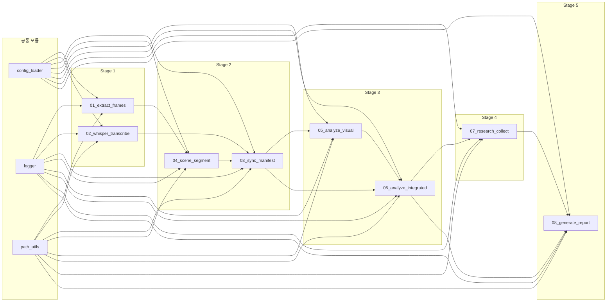
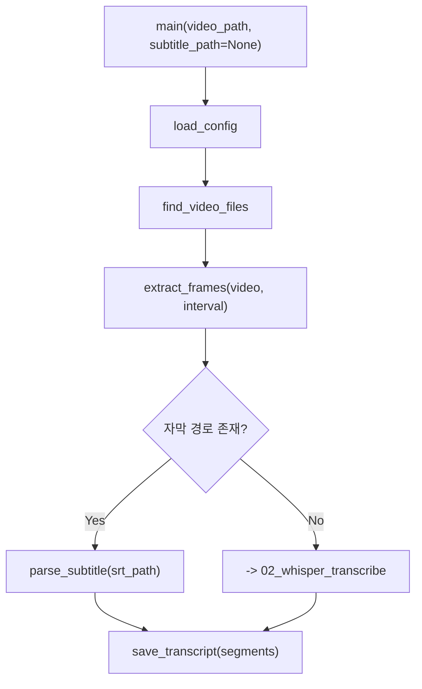
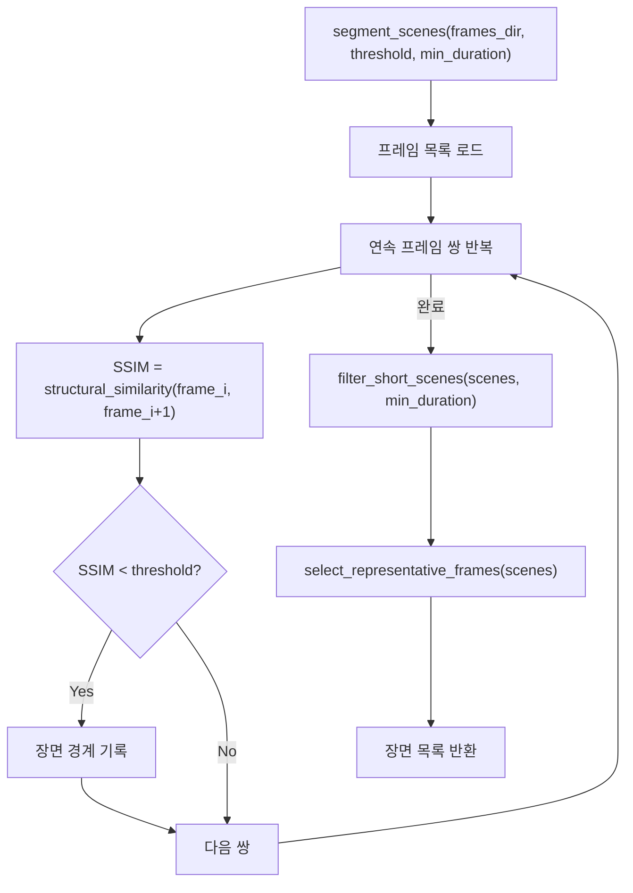
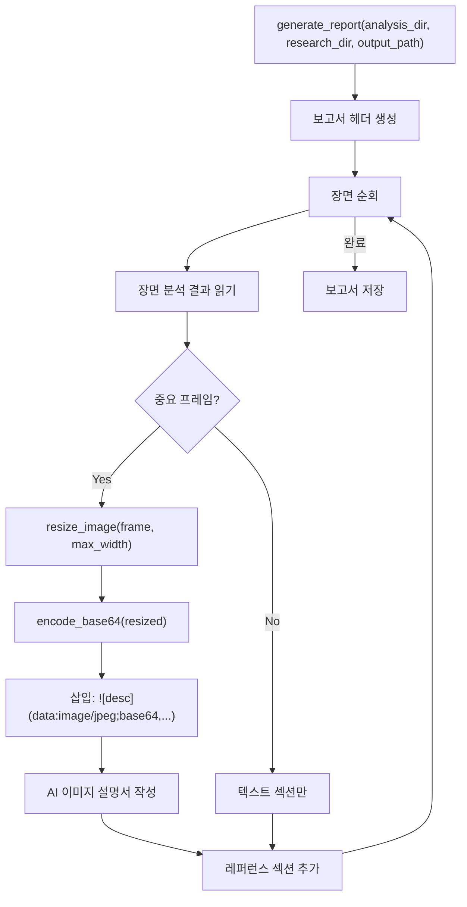

# 상세 설계서 -- VideoAnalyzer

> 파이프라인 각 스크립트의 입출력, 알고리즘, 인터페이스, 에러 처리를 상세 설계한다.
> 작성일: 2026-04-14

---

## 하네스 엔지니어링 적용

| 기둥 | 이 문서에서의 역할 |
|------|-------------------|
| 기둥1 (컨텍스트) | 모듈 인터페이스가 구현 시 참조 기준 |
| 기둥2 (CI/CD) | 함수 시그니처 변경 시 PostToolUse 훅이 감지 |
| 기둥3 (도구경계) | 모듈별 필요 라이브러리를 requirements.txt에 매핑 |
| 기둥4 (피드백) | 구현 중 설계 변경 발생 시 이 문서 갱신 |

---

## 1. 모듈 의존성 체계



---

## 2. 공통 모듈 상세

### 2-1. config_loader

```python
# pipeline/config_loader.py
"""설정 파일을 로드하고 검증한다."""

def load_config(config_path: Path = None) -> dict:
    """
    입력: config.json 경로 (기본: pipeline/config.json)
    출력: 검증된 설정 딕셔너리
    에러: FileNotFoundError, json.JSONDecodeError, ValueError (범위 초과)
    """

def validate_config(config: dict) -> bool:
    """
    검증 항목:
    - frame_interval: 0.1 <= x <= 5.0
    - ssim_threshold: 0.5 <= x <= 0.95
    - min_scene_duration: 1.0 <= x <= 10.0
    - image_max_width: 320 <= x <= 3840
    - image_quality: 10 <= x <= 100
    """
```

### 2-2. path_utils

```python
# pipeline/path_utils.py
"""프로젝트 경로를 상대경로로 관리한다."""

def get_project_root() -> Path:
    """pipeline/ 상위 디렉토리를 프로젝트 루트로 반환."""

def get_path(config: dict, key: str) -> Path:
    """config의 paths 섹션에서 상대경로를 절대경로로 변환."""

def ensure_dir(path: Path) -> Path:
    """디렉토리가 없으면 생성, 있으면 그대로 반환."""
```

---

## 3. Stage별 모듈 상세

### 3-1. 01_extract_frames.py



| 함수 | 입력 | 출력 | 알고리즘 |
|------|------|------|----------|
| `extract_frames(video_path, output_dir, interval)` | 영상 경로, 출력 디렉토리, 간격(초) | `list[Path]` 추출된 프레임 경로들 | cv2.VideoCapture, FPS 기반 frame_skip 계산 |
| `parse_subtitle(srt_path)` | .srt 파일 경로 | `list[dict]` 세그먼트 목록 | 정규식 SRT 파싱 (id, start, end, text) |
| `save_transcript(segments, output_path)` | 세그먼트, 출력 경로 | transcript.json 파일 | JSON 직렬화 |

**TransTest 참조점**:
- `C:\TransTest\pipeline\01_extract_frames.py`: cv2.VideoCapture 루프 구조 재활용
- 개량: 하드코딩 경로 -> config.json, 프레임 파일명 패턴 표준화

### 3-2. 02_whisper_transcribe.py

| 함수 | 입력 | 출력 | 알고리즘 |
|------|------|------|----------|
| `transcribe(video_path, model, language)` | 영상 경로, 모델명, 언어 | `list[dict]` 세그먼트 | Whisper model.transcribe() |
| `extract_audio(video_path, output_path)` | 영상 경로, 오디오 출력 경로 | .wav 파일 | ffmpeg -i video -vn audio.wav |

**에러 처리**: Whisper 메모리 부족 시 tiny 모델로 폴백

### 3-3. 04_scene_segment.py



| 함수 | 입력 | 출력 | 알고리즘 |
|------|------|------|----------|
| `calculate_ssim(frame_a, frame_b)` | 두 프레임 경로 | float (0~1) | skimage.metrics.structural_similarity, 그레이스케일 변환 |
| `segment_scenes(frames_dir, threshold, min_duration)` | 프레임 디렉토리, SSIM 임계값, 최소 장면 길이 | `list[Scene]` | 연속 SSIM 비교 + 필터 |
| `select_representative(scene)` | 장면 정보 | 대표 프레임 경로 | 장면 중간 프레임 선택 |

**TransTest 참조점**:
- `C:\TransTest\pipeline\02_scene_segment.py`: SSIM 비교 루프, 임계값 0.85 구조 재활용
- 개량: min_scene_duration 필터 추가, 대표 프레임 선택 로직 추가

### 3-4. 03_sync_manifest.py

| 함수 | 입력 | 출력 | 알고리즘 |
|------|------|------|----------|
| `build_manifest(scenes, transcript)` | 장면 목록, 자막 세그먼트 | manifest.json | 타임스탬프 범위 오버랩 매칭 |
| `match_transcript(scene, segments)` | 장면 시간 범위, 전체 세그먼트 | 해당 장면의 자막 텍스트 | start/end 시간 범위 교차 판정 |

### 3-5. 05_analyze_visual.py

이 모듈은 Claude Code 런타임에서 실행되는 분석 가이드 스크립트이다.

| 함수 | 입력 | 출력 | 알고리즘 |
|------|------|------|----------|
| `analyze_visual(frame_path)` | 프레임 이미지 경로 | 시각 분석 결과 dict | Claude Read 도구로 이미지 직접 분석 |
| `extract_visual_elements(analysis)` | 분석 결과 | 도표/수식/코드/회로도 목록 | LLM 구조화 추출 |

**하네스 강제**: 이 함수를 건너뛰고 텍스트만 분석하면 하네스 규칙 E1 위반

### 3-6. 06_analyze_integrated.py

| 함수 | 입력 | 출력 | 알고리즘 |
|------|------|------|----------|
| `integrate(visual, text)` | 시각/텍스트 분석 결과 | 통합 분석 dict | sequential-thinking MCP로 ToT 추론 |
| `detect_reference_needs(integrated)` | 통합 분석 결과 | 레퍼런스 키워드 목록 | 새 이론/개념 언급 감지 |

### 3-7. 07_research_collect.py

| 함수 | 입력 | 출력 | 알고리즘 |
|------|------|------|----------|
| `search(keyword)` | 검색 키워드 | 검색 결과 목록 | exa-web-search MCP 시맨틱 검색 |
| `scrape(url)` | 페이지 URL | 페이지 내용 텍스트 | firecrawl MCP 스크래핑 |
| `verify(content, keyword)` | 스크래핑 내용, 원래 키워드 | bool + 검증 결과 | LLM 관련도/신뢰도 판정 |

### 3-8. 08_generate_report.py



| 함수 | 입력 | 출력 | 알고리즘 |
|------|------|------|----------|
| `resize_image(path, max_width)` | 이미지 경로, 최대 너비 | PIL Image | Pillow 비율 유지 리사이즈 |
| `encode_base64(image, quality)` | PIL Image, JPEG 품질 | base64 문자열 | io.BytesIO + base64.b64encode |
| `write_image_descriptor(frame_id, timestamp, visual_analysis)` | 프레임 ID, 타임스탬프, 분석 결과 | markdown 텍스트 | 설명서 템플릿 채우기 |

---

## 4. 실제 예시

### 예시 1: config_loader 검증 실패 케이스

```python
# config.json에 ssim_threshold: 1.5 (범위 초과)
config = load_config()
# -> ValueError: ssim_threshold must be between 0.5 and 0.95, got 1.5

# config.json 파일 없음
config = load_config(Path("nonexistent.json"))
# -> FileNotFoundError: Config file not found: nonexistent.json
```

### 예시 2: SSIM 장면 분할 알고리즘 추적

```
프레임 시퀀스: [F1, F2, F3, F4, F5, F6]
SSIM 결과:    [0.95, 0.93, 0.72, 0.91, 0.88]
                                ^--- 장면 전환 (0.72 < 0.85)

장면 분할 결과:
  Scene 1: [F1, F2, F3] (SSIM 평균 0.94)
  Scene 2: [F4, F5, F6] (SSIM 평균 0.895)

대표 프레임: F2 (Scene 1 중간), F5 (Scene 2 중간)
```

### 예시 3: base64 인코딩 크기 추정

```python
# 원본 프레임: 1920x1080, ~300KB
# 리사이즈: 1280x720, JPEG 80% -> ~80KB
# base64 인코딩: 80KB * 4/3 = ~107KB (33% 오버헤드)
# 보고서 내 삽입: ~107KB 문자열

# 12장 삽입 시 총 이미지 용량: 12 * 107KB = ~1.3MB
# 50MB 한도 대비: 2.6% (충분한 여유)
```
