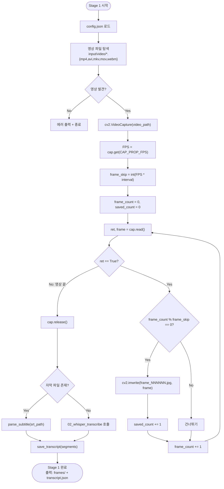
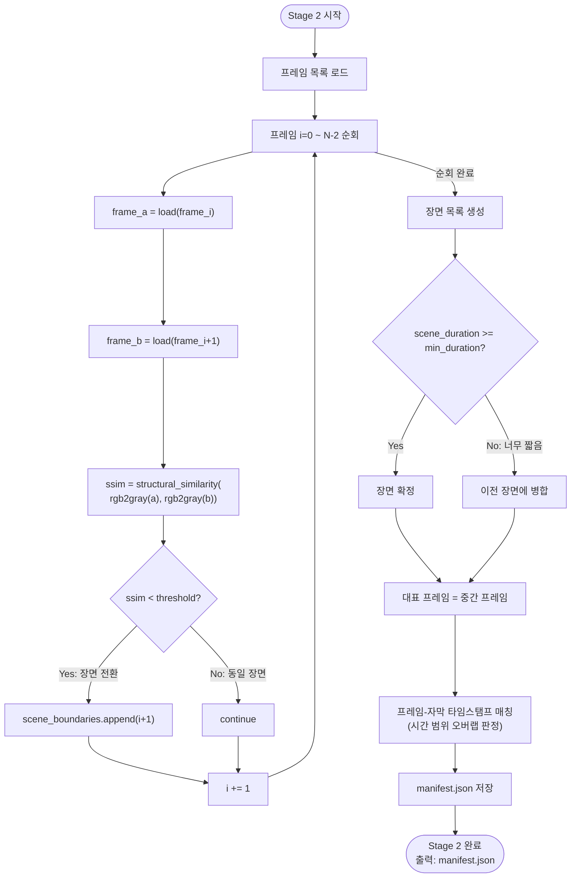
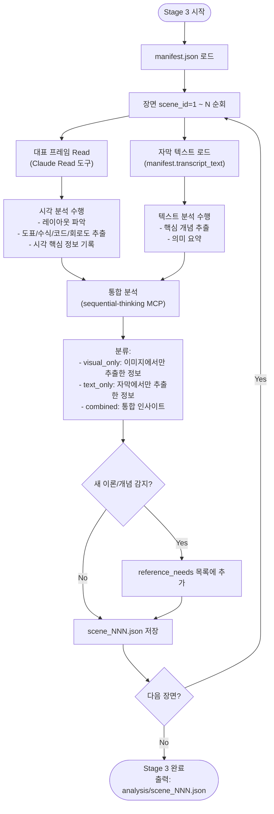
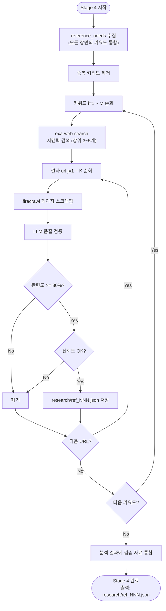
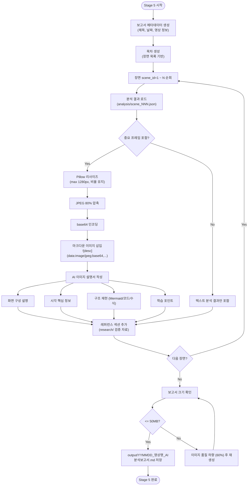
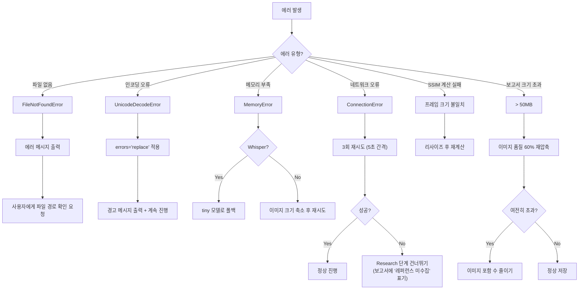

# 순서도 및 절차도 -- VideoAnalyzer

> 파이프라인의 전체 흐름, 분기 로직, 에러 처리 절차를 시각화한다.
> 작성일: 2026-04-14

---

## 하네스 엔지니어링 적용

| 기둥 | 이 문서에서의 역할 |
|------|-------------------|
| 기둥1 (컨텍스트) | 파이프라인 순서를 CLAUDE.md에 압축 반영 |
| 기둥2 (CI/CD) | 분기 조건을 훅 검증 로직에 매핑 |
| 기둥3 (도구경계) | 각 Stage별 허용 도구를 시각적으로 명시 |
| 기둥4 (피드백) | 에러 처리 절차가 피드백 루프의 구체적 흐름 |

---

## 1. 전체 파이프라인 흐름도

```mermaid
flowchart TD
    START([시작]) --> INPUT["입력 확인\n영상: input/video/\n자막: input/subtitle/"]
    INPUT --> V_CHECK{영상 파일 존재?}
    V_CHECK -->|No| V_ERR["에러: 영상 파일 없음\n-> 사용자 안내"]
    V_CHECK -->|Yes| S_CHECK{자막 파일 존재?}

    S_CHECK -->|Yes| PARSE["자막 파싱\n(.srt/.txt -> JSON)"]
    S_CHECK -->|No| WHISPER["Whisper 음성추출\n(모델: base, 언어: ko)"]
    WHISPER --> W_CHECK{추출 성공?}
    W_CHECK -->|No| W_FALLBACK["폴백: tiny 모델 재시도"]
    W_FALLBACK --> W_CHECK2{재시도 성공?}
    W_CHECK2 -->|No| W_ERR["에러: 음성추출 실패\n-> 수동 자막 요청"]
    W_CHECK2 -->|Yes| PARSE
    W_CHECK -->|Yes| PARSE

    PARSE --> EXTRACT["프레임 추출\n(간격: config.frame_interval)"]
    EXTRACT --> FRAMES["workspace/frames/\n(이후 읽기 전용)"]

    FRAMES --> SSIM["SSIM 장면 분할\n(임계값: config.ssim_threshold)"]
    SSIM --> FILTER["최소 장면 길이 필터\n(config.min_scene_duration)"]
    FILTER --> REPR["대표 프레임 선택\n(장면 중간 프레임)"]
    REPR --> MANIFEST["동기화 매니페스트 생성\n(프레임-자막 매칭)"]
    MANIFEST --> MF_SAVE["workspace/manifest/\nmanifest.json 저장"]

    MF_SAVE --> SCENE_LOOP["장면 순회 시작"]
    SCENE_LOOP --> VISUAL["시각 분석\n(Claude Read로 프레임 이미지 직접 분석)"]
    SCENE_LOOP --> TEXT["텍스트 분석\n(자막 의미 분석)"]
    VISUAL --> INTEGRATE["통합 분석\n(시각 + 텍스트 = 완전한 분석)"]
    TEXT --> INTEGRATE

    INTEGRATE --> REF_CHECK{레퍼런스 필요?}
    REF_CHECK -->|Yes| SEARCH["exa-web-search\n시맨틱 검색"]
    SEARCH --> SCRAPE["firecrawl\n페이지 스크래핑"]
    SCRAPE --> VERIFY["품질 검증\n(LLM 관련도/신뢰도 판정)"]
    VERIFY --> V_PASS{검증 통과?}
    V_PASS -->|Yes| MERGE["검증된 자료 통합"]
    V_PASS -->|No| DISCARD["폐기"]
    MERGE --> INTEGRATE
    DISCARD --> REF_NEXT{추가 검색?}
    REF_NEXT -->|Yes| SEARCH
    REF_NEXT -->|No| SAVE_ANALYSIS

    REF_CHECK -->|No| SAVE_ANALYSIS["workspace/analysis/\nscene_NNN.json 저장"]
    SAVE_ANALYSIS --> NEXT_SCENE{다음 장면?}
    NEXT_SCENE -->|Yes| SCENE_LOOP
    NEXT_SCENE -->|No| REPORT_START

    REPORT_START["보고서 생성 시작"] --> REPORT_HEADER["보고서 헤더 작성"]
    REPORT_HEADER --> REPORT_SCENE["장면별 섹션 작성"]
    REPORT_SCENE --> IMG_CHECK{중요 프레임?}
    IMG_CHECK -->|Yes| RESIZE["이미지 리사이즈\n(max 1280px)"]
    RESIZE --> COMPRESS["JPEG 80% 압축"]
    COMPRESS --> B64["base64 인코딩"]
    B64 --> EMBED["보고서에 직접 삽입"]
    EMBED --> DESCRIPTOR["AI 이미지 설명서 작성\n(구조/코드/Mermaid/학습포인트)"]
    IMG_CHECK -->|No| TEXT_ONLY["텍스트 섹션만"]
    DESCRIPTOR --> REPORT_NEXT
    TEXT_ONLY --> REPORT_NEXT{다음 장면?}
    REPORT_NEXT -->|Yes| REPORT_SCENE
    REPORT_NEXT -->|No| SIZE_CHECK

    SIZE_CHECK{"파일 크기 <= 50MB?"}
    SIZE_CHECK -->|Yes| SAVE_REPORT["output/\nYYMMDD_영상명_AI분석보고서.md"]
    SIZE_CHECK -->|No| REDUCE["이미지 품질 하향\n(80% -> 60%)"]
    REDUCE --> SIZE_CHECK

    SAVE_REPORT --> DONE([완료])
```



---

## 2. Stage 1 상세 절차: Extract



---

## 3. Stage 2 상세 절차: Sync



---

## 4. Stage 3 상세 절차: Analyze



---

## 5. Stage 4 상세 절차: Research



---

## 6. Stage 5 상세 절차: Report



---

## 7. 에러 처리 절차도



---

## 8. 실제 예시

### 예시 1: 정상 흐름 (변압기 강의)

```
[입력] transformer_lecture.mp4 (20분) + transformer_lecture.srt

Stage 1: 자막 있음 -> 파싱 + 프레임 추출 (2,400장)
Stage 2: SSIM 분할 -> 45장면, 매니페스트 생성
Stage 3: 45장면 x (시각+텍스트) 통합 분석
         장면#12에서 "패러데이 법칙" 레퍼런스 필요 감지
Stage 4: exa 검색 -> firecrawl 스크래핑 -> LLM 검증 통과 3건
Stage 5: 보고서 생성, 12장 base64 삽입, 각 이미지 아래 설명서
         파일 크기: 1.5MB -> 50MB 이내 PASS

[출력] output/260414_변압기강의_AI분석보고서.md
```

### 예시 2: Whisper 폴백 흐름 (자막 없는 영상)

```
[입력] python_decorator.mp4 (30분) + 자막 없음

Stage 1: 자막 없음 -> Whisper base 모델 실행
         -> MemoryError -> tiny 모델 폴백 -> 성공
         프레임 추출 (3,600장)
Stage 2: SSIM 분할 -> 28장면
Stage 3~5: 정상 흐름

[출력] output/260414_파이썬데코레이터_AI분석보고서.md
```

### 예시 3: 네트워크 에러 흐름 (오프라인 환경)

```
[입력] factory_process.mp4 (15분) + factory_process.srt

Stage 1~2: 정상 (로컬 처리)
Stage 3: 분석 완료, 레퍼런스 3건 필요 감지
Stage 4: exa-web-search -> ConnectionError
         재시도 3회 -> 모두 실패
         -> Research 단계 건너뛰기
Stage 5: 보고서 생성 (레퍼런스 섹션에 "미수집" 표기)

[출력] output/260414_제조공정_AI분석보고서.md
       (레퍼런스 없는 버전, 추후 온라인 시 보완 가능)
```
