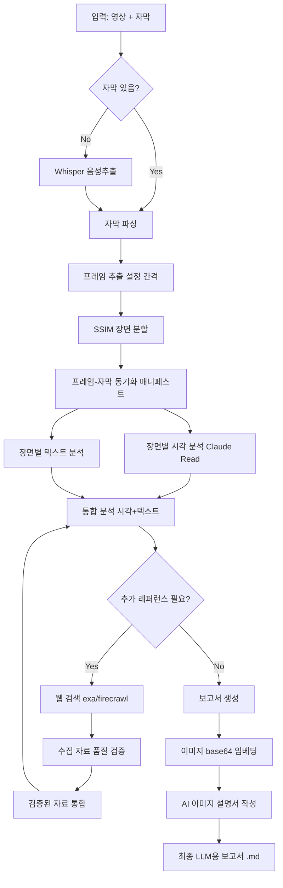

# VideoAnalyzer -- AI 시각+텍스트 통합 영상 분석 파이프라인

> 가공일: 2026-04-14
> 가공 방법: 프롬프트 엔지니어링 + 컨텍스트 엔지니어링 + 하네스 엔지니어링 3단계

---

## 원문 프롬프트 (Before)

영상을 원하는 프레임단위로 쪼개어 스샷을 저장하고, 제공하는 자막(자막이 없으면 음성추출도 함께 진행해야함)과 스샷을 싱크를 맞춰 동기화 해야해. 이렇게 하는 이유는 AI보고 동영상을 분석하라고 하면 영상은 보지도 않고 자막(text)만 보고 분석하는걸 보고 영상이미지에서도 분명 학습해야할 정보가 있음에도 불구하고 자막만 보고 학습하고 분석하니 100% 학습 및 분석이 되는것 같지 않아서 배우고 학습해야할 영상이미지 부분이 있으면 해당 영상이미지까지도 학습하고 분석에 활용할 수 있도록 하기 위함이야. 여기까지(추출한 프레임단위 이미지+자막(또는 음성추출)+싱크동기화) 진행했다면 해당 자료를 통한 완벽 해부 및 학습 및 분석을 수행합니다. 다음으로는 해부 및 학습 및 분석 결과를 기반으로 LLM AI용 해당영상 완벽분석 보고서를 제작합니다. 오리지날 분석에 사용된 동영상은 사람을 위한 영상이였다면 이건 너 또는 다른 LLM AI가 보고 완벽하게 학습할 수 있는 AI용 동영상 분석 보고서를 만드는거야. 제작하는 방법은 .md로 만들지, html로 만들지, docx로 만들지, ppt로 만들지, excle로 만들지 너의 입장에서 배우기 가장 최적화된 방법으로 제작할 수 있게 해줘. 또한 분석을 하면서 동영상에서 언급되거나 새로운 이론이 언급되거나 학습해야할 다른 지식이 언급되거나 확인해야할 레퍼런스가 필요하다거나 등등의 추가자료가 필요하다면 관련 자료를 수집하여 수집한 자료의 퀄리티도 향상시키기위해 수집한 자료도 따로 분석하여 원했던 자료가 맞는지 학습 및 분석 및 검증을 통해 우리자료에 통합시켜 한번더 진화된 보고서가 될 수 있도록 한다. 보고서를 표현하는 방법은 이미지도 중요하다고 판단되어 포함된 프레임의 원본 이미지를 삽입(단순참조 X, 만들어지는 패키지의 메인보고서 파일 하나만 보더라도 이미지가 깨지지 않아야 함)하는데 이는 AI를 위한게 아닌 사용자가 어떤 이미지를 특별하다고 생각하고 포함하였는지 확인용이며 이 이미지를 분석한 AI용 이미지설명서는 text형식(text로 표현하는 구조, 코딩 언어, 플로우차트 모두 포함)으로 이미지 아래에 작성한다.

---

## 가공된 프롬프트 (After)

### 프로젝트 목표

교육 영상을 프레임+자막으로 분해하고, AI가 시각 정보와 텍스트 정보를 모두 분석하여 LLM이 완벽 학습 가능한 "AI용 영상 분석 보고서"를 생성한다.

### 문제 정의

기존 AI 영상 분석은 자막(텍스트)만 읽고 영상의 시각 정보(도표, 수식, 회로도, 실물 사진 등)를 무시한다. 이로 인해 시각적으로만 전달되는 핵심 학습 정보가 누락된다.

### 파이프라인 5단계

#### Stage 1: Extract (추출)
- 입력: 영상 파일 (.mp4 등)
- 처리: 설정 가능한 간격(기본 0.5초)으로 프레임 추출
- 자막 분기: 자막 파일 있으면 파싱, 없으면 Whisper 음성추출
- 출력: frames/ (JPG) + transcript/ (timestamped JSON)
- [도구] Python opencv-python, openai-whisper
- [참조] C:\TransTest\pipeline\01_extract_frames.py 로직 개량

#### Stage 2: Sync (동기화)
- 입력: 프레임 타임스탬프 + 자막 타임스탬프
- 처리: SSIM 기반 장면 분할 -> 중복 제거 -> 의미 있는 장면만 선별
- 출력: manifest.json (프레임-자막 동기화 매핑)
- [도구] Python scikit-image (SSIM), numpy
- [참조] C:\TransTest\pipeline\02_scene_segment.py 로직 개량

#### Stage 3: Analyze (통합 분석)
- 입력: 동기화 매니페스트 + 프레임 이미지 + 자막 텍스트
- 처리:
  (a) 시각 분석: Claude Read 도구로 프레임 이미지 직접 분석 (멀티모달)
  (b) 텍스트 분석: 자막 텍스트 의미 분석
  (c) 통합: 시각에서만 얻을 수 있는 정보 + 텍스트 정보 = 완전한 학습 자료
- 출력: analysis/ (장면별 통합 분석 JSON)
- [도구] Claude Read (이미지 분석), sequential-thinking MCP (ToT 추론)
- [하네스 규칙] 텍스트만 보고 분석 완료 금지. 반드시 프레임 이미지 Read 필수

#### Stage 4: Research (레퍼런스 수집+검증+통합)
- 트리거: Stage 3 분석 중 새로운 이론/레퍼런스/추가 학습 필요 감지 시
- 처리:
  (a) 수집: exa-web-search MCP로 시맨틱 검색
  (b) 스크래핑: firecrawl MCP로 페이지 내용 추출
  (c) 품질 검증: 수집 자료가 원하던 것인지 LLM 분석으로 검증
  (d) 통합: 검증된 자료를 분석 결과에 통합 -> 진화된 보고서
- 출력: research/ (수집+검증된 레퍼런스 자료)
- [도구] mcp__exa-web-search, mcp__firecrawl, mcp__sequential-thinking

#### Stage 5: Report (LLM용 보고서 생성)
- 입력: 통합 분석 결과 + 검증된 레퍼런스 + 원본 프레임 이미지
- 출력 포맷: .md (Markdown) -- LLM 학습 최적화 포맷
  - 모든 LLM이 네이티브로 읽는 포맷
  - 구조적 헤딩으로 계층 탐색 가능
  - Mermaid 다이어그램 + 코드 블록 + 테이블 지원
- 이미지 삽입 규칙:
  (a) 중요 프레임 원본을 base64로 직접 삽입 (참조 경로 X, 깨짐 방지)
  (b) 이미지는 사용자 확인용 (어떤 이미지를 중요하다 판단했는지)
  (c) 이미지 아래에 AI용 텍스트 설명서 필수 작성:
      - text 구조 설명 (화면 구성, 요소 배치)
      - 코딩 언어 재현 (수식, 알고리즘)
      - Mermaid 플로우차트 재현 (프로세스, 회로)
      - 학습 포인트 (이 이미지가 전달하는 핵심 지식)
- 출력: output/YYMMDD_{영상명}_AI분석보고서.md

### 활용 도구/MCP/스킬/에이전트 총목록

| 카테고리 | 도구 | 용도 | Stage |
|----------|------|------|-------|
| MCP | exa-web-search | 레퍼런스 시맨틱 검색 | 4 |
| MCP | firecrawl | 웹 페이지 스크래핑 | 4 |
| MCP | sequential-thinking | 복잡 분석 ToT 추론 | 3,4 |
| MCP | fal-ai | 이미지 보정/변환 (필요 시) | 5 |
| MCP | memory | 분석 컨텍스트 저장 | 3,4 |
| 도구 | Claude Read (이미지) | 프레임 멀티모달 시각 분석 | 3 |
| 도구 | Bash (python) | 파이프라인 스크립트 실행 | 1,2 |
| 도구 | Write/Edit | 보고서/설정 파일 생성 | 5 |
| 도구 | WebSearch/WebFetch | 레퍼런스 검색 보조 | 4 |
| 에이전트 | gap-detector | 설계-구현 갭 검증 | QA |
| 에이전트 | code-analyzer | 코드 품질 분석 | QA |
| 에이전트 | Explore | 코드베이스 탐색 | 설계 |
| 스킬 | /pdca | PDCA 전체 주기 관리 | 전체 |
| 스킬 | /code-review | 코드 품질 분석 | QA |
| 참조 | TransTest 01_extract_frames.py | 프레임 추출 로직 | 1 |
| 참조 | TransTest 02_scene_segment.py | SSIM 장면 분할 로직 | 2 |

### 하네스 구조적 강제 규칙

1. 분석 시 프레임 이미지 Read 없이 텍스트만으로 분석 완료 금지
2. 레퍼런스 수집 시 품질 검증 없이 보고서 통합 금지
3. 보고서 이미지는 base64 직접 삽입만 허용 (상대경로 참조 금지)
4. 이미지 아래 AI용 텍스트 설명서 누락 금지
5. workspace/frames/ 수정/삭제 금지 (읽기 전용)
6. 새 패키지 무단 설치 금지 (사용자 승인 필수)

### 문서 작성 규칙

- 모든 지침/가이드/설계문서에 Mermaid 흐름도 + 실제 예시 3개 필수
- 4기둥 하네스 반영 테이블 포함

---

## 가공 과정 기록

### 1단계: 프롬프트 엔지니어링

| 원문 의도 | 가공 결과 |
|-----------|-----------|
| "프레임단위로 쪼개어" | Stage 1: Extract - 설정 가능한 간격 프레임 추출 |
| "자막이 없으면 음성추출" | Stage 1: Whisper 폴백 분기 추가 |
| "싱크를 맞춰 동기화" | Stage 2: Sync - SSIM 장면 분할 + 매니페스트 |
| "영상이미지까지도 학습하고 분석" | Stage 3: Analyze - Claude Read 멀티모달 필수 |
| "AI용 동영상 분석 보고서" | Stage 5: Report - .md 포맷 LLM 최적화 |
| "관련 자료를 수집하여...검증" | Stage 4: Research - MCP 수집+검증+통합 |
| "원본 이미지를 삽입" | base64 인라인 임베딩 (자기완결형) |
| "AI용 이미지설명서는 text형식으로" | 구조/코드/Mermaid 포함 텍스트 설명서 |

### 2단계: 컨텍스트 엔지니어링

- 사용 가능한 MCP 5개 식별 및 Stage별 매핑
- TransTest 참조 스크립트 2개 식별
- Claude Read 이미지 분석 능력을 Stage 3 핵심으로 배치
- bkit 에이전트/스킬 QA 단계 매핑

### 3단계: 하네스 엔지니어링

- "텍스트만 분석 금지" -> PostToolUse 훅으로 구조적 강제 가능
- "검증 없이 통합 금지" -> 파이프라인 Stage 4 게이트
- "base64 직접 삽입" -> 보고서 생성 스크립트에 내장
- "이미지 설명서 필수" -> 보고서 템플릿에 구조화
