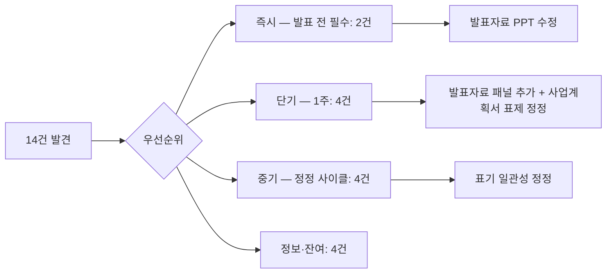

# 오류정정표 — 14건 통합 정정 가이드

> 사업계획서·발표자료 정정 항목 + 정정 위치 + 정정 전·후 + 우선순위
> 생성: 2026-04-15 KST | Source Hash: 7cfaec51

## 정정 흐름



## 가용 기능 활용

| 기능 | 활용 |
|------|------|
| issues.json 14건 | 정정 항목 원천 |
| FormatCompliance 가이드 | 작성서식 표기 기준 |
| 멀티모달 직독 PNG | 정정 전 실문 확인 |
| HWPX_Master | 사업계획서 본문 편집 (후속) |
| DocKit | 발표자료 PPTX 편집 (후속) |

## 정정 항목 (14건)

### 즉시 — 발표 전 필수 [HIGH]

#### E-1. Q1-001 발표자료 정량 정정

| 항목 | 내용 |
|------|------|
| 위치 | 발표자료 p1, AI 교양 거초 교과목 박스 |
| 정정 전 | "869명" |
| 정정 후 | "867명" |
| 근거 | 사업계획서 p58 핵심성과지표 분자값 |
| 검증 | 발표·사업계획서 동일 수치 (867 = 867 / 5,035) |

#### E-2. Q1-002 발표자료 오자 정정

| 항목 | 내용 |
|------|------|
| 위치 | 발표자료 p1, AI 교양 박스 |
| 정정 전 | "거초" |
| 정정 후 | "기초" |
| 근거 | 사업계획서 p58 "AI 기초 교육과정" |
| 검증 | 표기 통일 |

### 단기 — 1주 내 [HIGH]

#### E-3. Q3-001 발표자료 패널 추가 (Ⅲ 영역 20점)

| 패널 | 내용 | 근거 페이지 |
|------|------|-------------|
| ① 거버넌스 1패널 | AI·DX 추진단 + 운영위원회 + 4 센터 조직도 | plan p57 |
| ② 핵심성과지표 1패널 | 6대 KPI 그래프 (이수율·역량지수·만족도) | plan p58 |
| ③ 성과 공유확산 1패널 | 권역 확산 모델 + 매뉴얼 공유 계획 | plan p63 |

#### E-4. Q3-002 발표자료 패널 추가 (Ⅳ 영역 15점)

| 패널 | 내용 | 근거 페이지 |
|------|------|-------------|
| ④ 1차년도 사업비 1패널 | 총사업비 + 비목별 도넛/막대 차트 | plan p65~70 |

#### E-5. Q1-003 사업계획서 [증빙 P.N] 표기 통일

| 위치 | 정정 전 | 정정 후 |
|------|---------|---------|
| plan p11 | [증빙 P,1] | [증빙 P.1] |
| plan p34 | [증빙 P,4] | [증빙 P.4] |
| 그 외 9건 | [증빙 P.N] | (변경 없음) |

#### E-6. Q2-001 사업계획서 표제 보강

| 위치 | 정정 전 | 정정 후 |
|------|---------|---------|
| plan p8 목차 + 본문 | "2.1 AI·DX 교육과정 개발·운영 실적 및 계획" | "2.1 AI·DX 교육과정 개발·**운영체제 구축**·운영 실적 및 계획" |
| 근거 | 작성서식 Ⅱ.2.1 / 평가지표 20점 항목명 | |

### 중기 — 정정 사이클 [MEDIUM/LOW]

#### E-7. Q2-002 총괄표 명칭 정정

| 위치 | 정정 전 | 정정 후 |
|------|---------|---------|
| plan p15 표 명칭 | `<사업추진내용 총괄표>` | `<사업추진 계획 총괄표>` |
| 근거 | 작성서식 p5 ("서식 변경 불가" 명시) | |

#### E-8. Q2-003 Ⅰ.2 표제 띄어쓰기

| 위치 | 정정 전 | 정정 후 |
|------|---------|---------|
| plan p8 목차 + 본문 | "2. 사업 추진목표 및 학습자의 AID 목표역량" | "2. 사업추진 목표 및 학습자의 AID 목표역량" |

#### E-9. Q3-003 발표자료 SWOT 추가 [MEDIUM]

| 위치 | 추가 |
|------|------|
| 발표자료 p1 (지역 여건 박스 옆) | SWOT 4분면 압축 다이어그램 (1개) |
| 근거 | 사업계획서 p15 SWOT 매트릭스 |

### 정보·잔여 [LOW/INFO]

#### E-10. Q3-004 Ⅱ. 4영역 표제 100% 일치

| 항목 | 내용 |
|------|------|
| 판정 | 정정 불요 (긍정 발견) |

#### E-11. Q2-004 Ⅱ.3 통합표제 처리

| 항목 | 내용 |
|------|------|
| 판정 | 작성 가이드 위반 아님. 정정 불요 (정보 제공) |

#### E-12. Q4-002 사업추진목표 15점 충실

| 항목 | 내용 |
|------|------|
| 판정 | 정정 불요 (긍정 발견) |

#### E-13. Q4-003 핵심성과지표 산식 OK

| 항목 | 내용 |
|------|------|
| 판정 | 정정 불요 (긍정 발견) |

#### E-14. Q1-004 발표자료 5종 정량지표 추가 검증

| 항목 | 내용 |
|------|------|
| 위치 | 발표자료 p1: 21개 X+AI / 197명 교직원 / 102명 4건 / 269명 AI 전공 / 355명 재직자 |
| 액션 | 증빙자료 50p PNG 직독으로 원본 대조 (차기 라운드) |

## 예제 3종

### 예제 1 — 즉시 정정 (E-1)
```
정정 전: 발표자료 p1 "869명 AI 교양 거초 교과목 이수"
정정 후: 발표자료 p1 "867명 AI 교양 기초 교과목 이수"
효과: 사업계획서 p58과 정량 일치 + 오자 제거
```

### 예제 2 — 패널 추가 (E-3 + E-4)
```
정정 전: 발표자료 2p / 4 STRATEGY + Ⅱ 4영역만
정정 후: 발표자료 ~6p / Ⅲ 거버넌스+성과지표+공유확산 3패널 + Ⅳ 재정 1패널 추가
효과: 발표 가시성 65~70 → ~85점 회복
```

### 예제 3 — 표제 보강 (E-6)
```
정정 전: plan "2.1 AI·DX 교육과정 개발·운영 실적 및 계획"
정정 후: plan "2.1 AI·DX 교육과정 개발·운영체제 구축·운영 실적 및 계획"
효과: 평가지표 20점 항목명과 표제 정렬 → 형식 감점 회복
```

## 정정 후 점수 회복 추정

| 트랙 | 정정 전 | 정정 후 | 회복폭 |
|------|---------|---------|--------|
| 사업계획서 본문 | 85~95 | 90~98 | +3~+5 (E-5/E-6/E-7/E-8) |
| 발표자료 가시성 | 65~70 | ~85 | +15~+20 (E-3/E-4/E-9) |
| 정량 신뢰도 | 위험 | 안전 | (E-1/E-2) |

## 정정 체크리스트 (운영용)

- [ ] E-1 발표자료 869 → 867
- [ ] E-2 발표자료 '거초' → '기초'
- [ ] E-3 발표자료 거버넌스 패널 추가
- [ ] E-3 발표자료 성과지표 패널 추가
- [ ] E-3 발표자료 성과 공유확산 패널 추가
- [ ] E-4 발표자료 재정 비목별 패널 추가
- [ ] E-5 plan p11/p34 [증빙 P.N] 통일
- [ ] E-6 plan Ⅱ.2.1 표제 '체제 구축' 보강
- [ ] E-7 plan p15 표명칭 '<사업추진 계획 총괄표>'
- [ ] E-8 plan Ⅰ.2 띄어쓰기 정정
- [ ] E-9 발표자료 SWOT 다이어그램 추가
- [ ] E-14 발표자료 5종 정량 추가 검증
