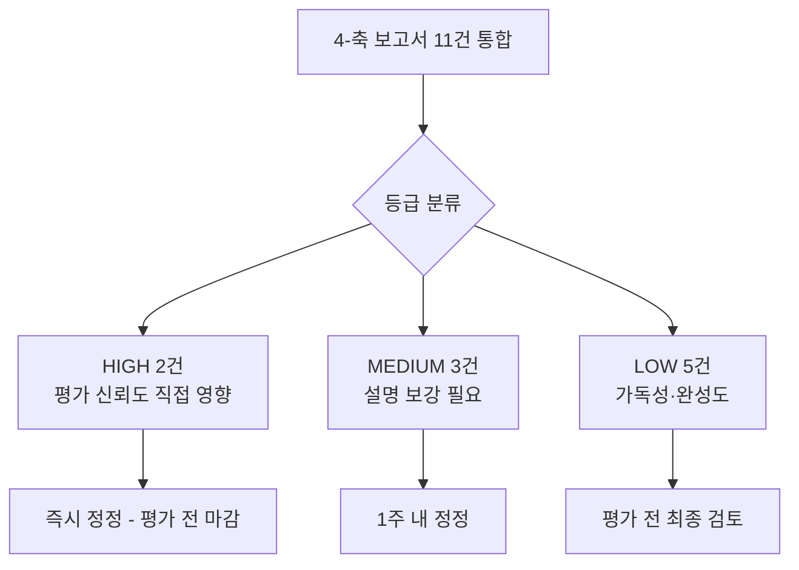
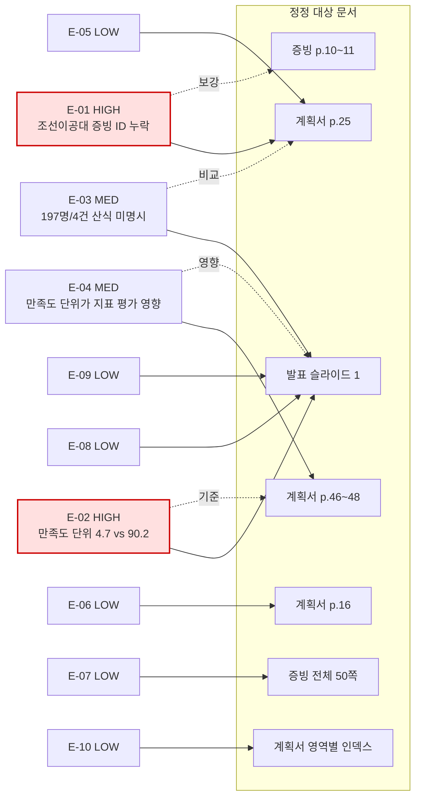

# 오류 정정표 — 4-축 통합

> 작성일: 2026-04-15 / 정정 대상: 사업계획서·증빙자료·발표자료
> 페이지 표기: 인쇄 페이지 우선 / 서술형 v2 표준 (IMP-044, IMP-045)

## 1. 정정 흐름

## 2. 정정 항목 관계도

## 3. 정정 항목 — 서술

### E-01 HIGH (출처 Q1 C-01) — 사업계획서 p.25 조선이공대 행에 증빙 ID를 부기해야 한다

사업계획서 p.25 (seq 35)의 "교직원·재직자·지역주민 교육 운영 실적" 표에서 순천제일대학교 행에는 증빙2-10·2-11·2-12가 명확히 인용되어 있으나, 조선이공대학교 행(교직원 1개/111명·1개/62명, 재직자 9개/223명·2개/20명, 지역민 2개/83명·4개/159명)에는 증빙 ID가 부기되어 있지 않다. 증빙자료 print 9~10 (seq 11~12)에 `증빙2-9 [조이공] AI·DX 분야 교육과정 개발·운영 실적` 캡션이 존재하나 교직원·재직자·지역민 통계의 직접 증빙으로는 식별되지 않는다. 정정 방향은 조선이공대 증빙 자료를 증빙2-9 후속(예: 2-9-1, 2-9-2, 2-9-3) 또는 신규 ID로 추가하고 사업계획서 p.25 표 내부 행에 명시 인용하는 것이다.

### E-02 HIGH (출처 Q3 P-02) — 발표자료의 만족도 단위(4.7점)를 100점 척도로 통일해야 한다

발표자료 슬라이드 1의 "교직원 대상 AI 연수 만족도 4.7점"은 5점 척도로 추정되나, 사업계획서 p.46~48 (seq 56~58)의 핵심성과지표 표에서 동일 지표(교직원 AI 연수 만족도)가 기준값 90.2점·1차 91.2점·2차 92.2점의 100점 척도로 표기되어 있다. 두 문서가 동일 지표를 다른 척도로 표기하고 있어 평가위원이 즉시 의문을 제기할 가능성이 매우 크다. 정정 방향은 발표자료를 100점 척도로 통일(4.7×20=94.0점 추정 환산)하거나, 슬라이드 노트에 환산값을 명기하는 것이다.

### E-03 MEDIUM (출처 Q1 C-02 = Q3 P-01) — 발표자료 "교직원 197명/4건"의 산식·기간을 명시해야 한다

발표자료 슬라이드 1의 "교직원 대상 AI 연수 197명/4건"은 사업계획서 p.25 실적 표(순천제일대 합산 32개/967명, 조선이공대 합산 2개/173명, 양 대학 합산 34개/1,140명) 어떤 산식과도 직접 일치하지 않는다. 정정 방향은 슬라이드 노트에 산정 기준(대상 범위·집계 기간·기준 시점)을 부기하거나, 계획서 합계와 일치하도록 재집계하는 것이다.

### E-04 MEDIUM (출처 Q4 Q-01) — 만족도 단위 불일치는 평가지표 C영역 적절성(7점)에 영향을 줄 수 있다

평가지표 C영역의 "성과지표 설정의 적절성(공통지표 및 자율지표) 7점"은 지표 자체뿐 아니라 표기·산정의 일관성도 평가할 가능성이 있다. E-02 정정으로 동시 해소 가능하나, 정정 후 두 문서 모두를 다시 읽어 단위 일관성을 재검증해야 한다.

### E-05 LOW (출처 Q1 C-03) — 증빙2-10~12 본문 수치는 텍스트로 직접 검증되지 않는다

증빙자료 p.10~11 (seq 12~13)의 증빙2-10·2-11·2-12는 캡션만 텍스트로 추출되며, 강좌별 명단·수치는 이미지 형식이라 본 분석 단계에서는 직접 검증이 불가능하다. 평가 대비를 위해 증빙 캡션 옆에 핵심 수치(예: "교직원 6개/231명 (2024)")를 텍스트로 병기하거나 별도 OCR 검증을 권고한다.

### E-06 LOW (출처 Q2 F-01) — 사업추진 계획 총괄표의 시각적 레이아웃 일치 확인

사업계획서 p.16 (seq 26)의 사업추진 계획 총괄표는 7개 컬럼 항목·순서가 작성서식 seq 5와 일치함은 확인되었으나, 컬럼 폭과 셀 병합의 시각적 동일성은 텍스트 추출만으로는 단정할 수 없다. 시각 검증으로 보강 권고한다.

### E-07 LOW (출처 Q2 F-02) — 증빙자료 50/60쪽 — 여유 10쪽 활용 가능

증빙자료가 작성서식 seq 42의 60쪽 한도 내 50쪽으로 작성되어 있어 10쪽의 여유분이 있다. 평가 보강 자료(예: 조선이공대 측 추가 증빙)를 추가할 수 있는 여지가 있다.

### E-08 LOW (출처 Q3 P-03) — 발표자료 "AI 교양 869명/21개" 산정 기준 미명시

슬라이드 1의 "AI 교양 기초 교과목 이수 869명 21개"는 계획서 p.46~48의 핵심성과지표가 비율(%) 또는 지수(건) 단위로 표기되어 있는 것과 표기 기준이 다르다. 슬라이드 노트에 산정 기준·기간을 부기 권고한다.

### E-09 LOW (출처 Q3 P-04) — 발표자료 "AI 전공 실습실 269명/35개" 범위 미명시

슬라이드 1의 "269명 35개" 표기 역시 대상 범위(전체 재학생/특정 학과/특정 연도)가 명시되지 않아 평가 발표 시 출처 질의에 대비 어렵다. 노트 부기 권고한다.

### E-10 LOW (출처 Q4 Q-02) — 평가지표 영역명을 각 장 첫 페이지에 병기 권고

평가지표 4영역(15점·50점·20점·15점)이 사업계획서 4개 장과 1:1 매핑되므로, 각 장 첫 페이지에 평가지표 항목명·배점을 병기하면 평가위원의 동선이 더욱 단축된다.

## 4. 통합 카운트 표

| 등급 | 건수 | ID 목록 |
|------|------|---------|
| HIGH | 2 | E-01, E-02 |
| MEDIUM | 2 | E-03, E-04 |
| LOW | 6 | E-05, E-06, E-07, E-08, E-09, E-10 |
| **합계** | **10건** | (Q1 C-02와 Q3 P-01은 동일사안 → E-03 단일 항목으로 통합) |

## 5. 정정 일정 권고

| 단계 | 시기 | 항목 | 책임 |
|------|------|------|------|
| 즉시 | -3일 | E-01, E-02 | 사업계획서·발표자료 책임자 |
| 단기 | -2~-1일 | E-03, E-04 | 발표자료 책임자 |
| 검토 | 평가 전일 | E-05~E-10 | 전체 검토 |

## 6. 직독 검증 로그(통합)

본 정정표가 인용한 모든 사실의 직독 출처는 4-축 보고서 5절(직독 검증 로그)에 페이지 단위로 나열되어 있다.

- Q1 보고서: `Output/Reports/260415_1700_cross_consistency_분석보고서.md`
- Q2 보고서: `Output/Reports/260415_1700_format_compliance_분석보고서.md`
- Q3 보고서: `Output/Reports/260415_1700_presentation_coverage_분석보고서.md`
- Q4 보고서: `Output/Reports/260415_1700_indicator_quality_분석보고서.md`
- 종합 보고서: `Output/Reports/260415_1700_종합_분석보고서.md`
- 페이지 매핑 출처: `.bkit_runtime/page_mapping.json`
