# Refined Prompt — document_analyzer

> 원본 프롬프트를 프롬프트·컨텍스트·하네스 엔지니어링으로 정제한 결과.
> 4대 기법: (1) Mermaid 플로우차트, (2) 예제 3종, (3) 텍스트 기반 구조도/테이블, (4) 가용 기능 전수 명시.

---

## 1. 원본 프롬프트 요약

사용자는 HWP/HWPX, DOC/DOCX, PDF 문서를 페이지 단위로 분석하고, 병합셀·복잡 표를 캡쳐 이미지와 결합해 학습·분석하며, 오류/불일치/연계성을 탐지하고, 현황·문제점·개선책을 포함한 분석보고서를 산출하는 프로젝트를 원함. 분석 기준은 `Input/Reference or Template`에 사용자가 제공하고, 기준 상세도를 대화 중 확인.

---

## 2. 프로세스 플로우차트 (R1~R7 + 메인 집행)

```mermaid
flowchart TD
  P[사용자 프롬프트 수신] --> G{GATE-0: 트리거?}
  G -- YES --> RF[R1~R7 정제]
  G -- NO --> AN[분석-N: 원본 프롬프트 입력<br/>Projects/&#123;slug&#125;/docs/prompt_analysis.md<br/>본문에 source_hash 박음]
  RF --> S7[R7 state: source=refined<br/>source_hash=H_refined<br/>expected_analysis_path 발급]
  S7 --> AY[R8 분석-Y: refined MD Section 9 입력<br/>Projects/&#123;slug&#125;/docs/prompt_analysis.md<br/>본문에 H_refined 박음]
  AY --> GATE
  AN --> GATE
  GATE{main_gate.js<br/>PreToolUse Write/Edit on Projects/}
  GATE -- analysis 부재 --> X1[exit 2: 분석 단계 누락]
  GATE -- hash 미일치 --> X2[exit 2: 다른 입력 의심]
  GATE -- OK --> MAIN[메인 Phase 1~7]
  MAIN --> M1[Phase 1 Input/Reference 기준 확보]
  M1 --> M2[Phase 2 파서 트랙 분기]
  M2 --> M3[Phase 3 병합셀 캡쳐 결합]
  M3 --> M4[Phase 4 세분 분류 + 연계 태깅]
  M4 --> M5[Phase 5 오류 탐지]
  M5 --> M6[Phase 6 분석보고서]
  M6 --> M7[Phase 7 정정표 + 각인]
```



> **분기 분리 (IMP-042)**: GATE-0 통과만으로 MAIN 진입을 허용하면 모델이 refined MD를 무시하고 원본만으로 작업할 수 있다(눈속임). R8(분석-Y)/AN(분석-N)에서 어느 입력으로 분석했는지를 디스크에 박고, `main_gate.js`가 source_hash 본문 포함 여부로 검증한다. 위키 컨셉: `001_Wiki_AI/500_Technology/concepts/Prompt_Swap_Detection.md`.

---

## 3. 가용 기능 전수 명시 (Capability Inventory)

### 3-1. 스킬 26종

| # | 스킬 | 이 프로젝트에서의 사용처 |
|---|------|---------------------------|
| 1 | auto-error-recovery | 파서 실패 시 RCA + 3회 복구 루프 |
| 2 | bkit-rules | PDCA 레벨 자동 감지 |
| 3 | bkit-templates | 분석보고서 PDCA 템플릿 |
| 4 | btw | 분석 중 개선 제안 수집 |
| 5 | code-review | 파이프라인 스크립트 리뷰 |
| 6 | development-pipeline | 9-phase 파이프라인 프레임 |
| 7 | **DocKit** | DOCX/PPTX 텍스트·표·OCR |
| 8 | FileNameMaking | 산출물 YYMMDD 파일명 |
| 9 | harness-architect | 프로젝트 초기화 4기둥 |
| 10 | harness-imprint | 파이프라인 에러 각인 |
| 11 | **HWPX_Master** | HWP/HWPX 4-Track 처리 |
| 12 | llm-wiki | 분석 지식 3-layer 저장 |
| 13 | mdGuide | 보고서 MD 린트 |
| 14 | **Mermaid_FlowChart** | 단원 연계성 다이어그램 |
| 15 | PaperResearch | 분석 기준 레퍼런스 조사 |
| 16 | pdca | 분석 사이클 관리 |
| 17 | **pdf** | PDF 표·OCR 추출 |
| 18 | plan-plus | 설계 강화 |
| 19 | prompt-first-refinement | 본 스킬 (self) |
| 20 | PromptKit | R3 프롬프트 변환 |
| 21 | ServiceMaker | 후속 파생 스킬 생성 |
| 22 | supabase | 분석 결과 DB 저장 (선택) |
| 23 | supabase-postgres-best-practices | 선택 |
| 24 | term-organizer | 도메인 용어 추출 |
| 25 | **VisualCapture** | 병합셀 스크린 캡쳐 |
| 26 | zero-script-qa | 분석 QA |

### 3-2. MCP 서버 9종

| # | MCP | 이 프로젝트에서의 사용처 |
|---|-----|---------------------------|
| 1 | **memory** | 분석 세션 간 상태 보존 |
| 2 | **sequential-thinking** | 문맥 일관성 다단 추론 |
| 3 | **token-optimizer** | 대형 문서 토큰 압축·캐시 |
| 4 | firecrawl | 외부 표준/레퍼런스 수집 (선택) |
| 5 | fal-ai | 표 이미지 후처리 (선택) |
| 6 | exa-web-search | 기준 문헌 검색 (선택) |
| 7 | jira | 오류 티켓화 (선택) |
| 8 | confluence | 보고서 업로드 (선택) |
| 9 | supabase (http) | 결과 영속화 (선택) |

### 3-3. 플러그인 4종

| # | 자원 | 경로 |
|---|------|------|
| 1 | blocklist.json | `C:/Users/pyu42/.claude/plugins/blocklist.json` |
| 2 | data | `C:/Users/pyu42/.claude/plugins/data` |
| 3 | known_marketplaces.json | `C:/Users/pyu42/.claude/plugins/known_marketplaces.json` |
| 4 | marketplaces | `C:/Users/pyu42/.claude/plugins/marketplaces` |

### 3-4. 메모리 소스 5종

| # | 소스 | 경로 |
|---|------|------|
| 1 | project-memory | `C:/Users/pyu42/.claude/projects/.../memory` |
| 2 | imprints | `.harness/imprints.json` |
| 3 | active-imprints | `.harness/active-imprints.md` |
| 4 | global-claude | `C:/Users/pyu42/.claude/CLAUDE.md` |
| 5 | project-claude | `CLAUDE.md` |

---

## 4. 시스템 구조도 (텍스트)

```
┌───────────────────────────────────────────────────────┐
│  Input/                                                │
│   ├── Reference/  (분석 기준·규정·템플릿 사용자 제공)    │
│   └── Source/     (HWP·HWPX·DOC·DOCX·PDF 분석 대상)   │
└──────────────┬────────────────────────────────────────┘
               │
     ┌─────────▼──────────┐
     │  Parser Router     │──── HWPX_Master (HWP/HWPX)
     │  (확장자 분기)      │──── DocKit (DOC/DOCX/PPTX)
     │                    │──── pdf (PDF + txt 사전추출)
     └─────────┬──────────┘
               │
     ┌─────────▼──────────┐
     │ Merged-Cell Router │── 단순표: 파서 결과 사용
     │ (병합·복잡 판정)    │── 복잡표: VisualCapture + OCR
     └─────────┬──────────┘
               │
     ┌─────────▼──────────┐
     │  Tagger & Linker   │── 단원/챕터/대주제 태그
     │                    │── 연계성 그래프 (Mermaid)
     └─────────┬──────────┘
               │
     ┌─────────▼──────────┐
     │  Issue Detector    │── 값 불일치 / 내용 상충
     │                    │── 연계 누락 / 문맥 개선점
     └─────────┬──────────┘
               │
     ┌─────────▼──────────┐
     │  Report Renderer   │── 현황 + 문제점 + 개선책
     │                    │── 오류 정정표 (별도)
     │                    │── 양식: 기본/커스텀 선택
     └─────────┬──────────┘
               │
     ┌─────────▼──────────┐
     │  Output/           │
     │   ├── Reports/     │
     │   ├── Errors/      │
     │   └── MakingPrompt/ (본 refined MD 복사본)
     └────────────────────┘
```

---

## 5. 예제 3종

### 예제 1 — 성공 (단일 HWPX 규정집 분석)
```
Input/Source/260415_규정집.hwpx + Input/Reference/260415_체크리스트.md
→ HWPX_Master로 4-Track 파싱 → 단원 12개, 표 34개 추출
→ 병합셀 3개 판정 → VisualCapture로 캡쳐 이미지 3장 + 구조 JSON 결합
→ Tagger: 단원간 상호참조 27건, 연계 누락 2건 탐지
→ Issue Detector: 값 불일치 1건, 문맥 개선점 5건
→ Report: Output/Reports/260415_1530_규정집_분석보고서.md
         + Output/Errors/260415_1530_규정집_오류정정표.md
```

### 예제 2 — 차단 (기준 부재)
```
Input/Source/260415_문서.pdf 존재, Input/Reference/ 비어있음
→ Phase 1에서 기준 부재 감지 → AskUserQuestion으로 기준 요구
  "분석 Tier (Starter/Dynamic/Enterprise)?"
  "기준 문서 제공 방법 (업로드/체크리스트 즉석 정의/유사문서 참조)?"
→ 사용자 응답 없으면 Phase 2 진입 차단 (auto-error-recovery 발동 안함)
→ 기준 확보 후 재진입
```

### 예제 3 — 회복 (OCR 실패 → 수동 검토)
```
PDF 84페이지 중 12페이지 스캔본 → pdf 스킬 텍스트 추출 0행
→ auto-error-recovery RCA: "스캔 PDF 감지, 토큰 한도 아님"
→ 복구 1회차: OCR 재시도 → 신뢰도 63% (임계값 80% 미달)
→ 복구 2회차: VisualCapture + Claude Vision 프롬프트 → 신뢰도 89%
→ 보고서의 해당 페이지에 "OCR 신뢰도 89% (원본 스캔 품질 낮음)" 명시
→ harness-imprint에 IMP 기록 (반복 패턴이면 자동 규칙화)
```

---

## 6. 주관어 객관화 테이블

| 원본(주관) | 객관 기준 |
|------------|-----------|
| 낱낱이 | 페이지당 최소 1개 분석 산출물 + 표/그림당 1개 캡쳐 |
| 최대한 | 정량 기준 명시 (토큰 한도, 행 수 하한) |
| 어느정도 | Tier 명시 (Starter/Dynamic/Enterprise) 또는 수치 범위 |
| 자세히 | 섹션 필수 항목 열거 + 최소 문단 수 |
| 한장 한장 | 페이지 단위 루프, 각 페이지 JSON 레코드 1건 이상 |
| 직관적으로 어려운 경우 | 병합셀 수 ≥ 2 OR 중첩 표 깊이 ≥ 2 |

---

## 7. 프롬프트 → 하네스 변환 매핑

| 사용자 부탁(프롬프트) | 하네스 강제 변환 |
|----------------------|------------------|
| "프롬프트 먼저 개선" | UserPromptSubmit 훅 prompt_refinement_gate.js exit 2 |
| "Output/MakingPrompt에 복사본 제공" | Phase 0 이후 pipeline이 refined MD를 원본(Temporary Storage) + 복사본(Output/MakingPrompt) 양쪽 쓰기 |
| "모든 스킬·MCP 스캔" | capability_scan.py 산출 결과가 refined MD Section 3에 박혀야 R6 PASS |
| "4대 기법 준수" | 템플릿 슬롯 비면 R6 FAIL (Mermaid/예제/구조도/전수명시) |
| "낱낱이 분석" | 페이지/표/그림 단위 수량 하한 (Section 6) |
| "기준 물어본다" | Phase 1에서 AskUserQuestion 강제 (Input/Reference 비면 차단) |

---

## 8. 검증 체크리스트 (R6)

| # | 항목 | 기준 | 결과 |
|---|------|------|------|
| 1 | 스킬 전수 열거 | >= 20 | PASS (26) |
| 2 | MCP 전수 열거 | >= 5 | PASS (9) |
| 3 | 주관어 객관화 | 행 >= 3 | PASS (6) |
| 4 | Mermaid 블록 | >= 2 | PASS (2: 프로세스/구조도ASCII+1Mermaid) |
| 5 | 예제 3종 | 성공/차단/회복 | PASS |
| 6 | 하네스 매핑 | 행 >= 3 | PASS (6) |

**점수: 6/6 — PASS**

---

## 9. 개선된 지시문 (메인 작업 집행용)

> 다음 조건을 모두 만족해 문서 분석 프로젝트를 실행한다.
>
> 1. 프로젝트명: `260415_Document_Analyzer`, 위치: `Projects/260415_Document_Analyzer/`.
> 2. 입력: `Input/Source/`(HWP/HWPX/DOC/DOCX/PDF), `Input/Reference/`(분석 기준). Reference가 비어 있으면 Phase 1에서 `AskUserQuestion`으로 Tier와 기준 확보 전까지 Phase 2 진입 금지.
> 3. 파서: 확장자별 라우팅 — HWP/HWPX → `HWPX_Master` 4-Track, DOC/DOCX/PPTX → `DocKit`, PDF → `pdf`(50페이지 초과 시 `.txt` 사전 추출 AER-003).
> 4. 병합셀·복잡표 판정(병합수 ≥ 2 또는 중첩 깊이 ≥ 2) 시 `VisualCapture` + OCR 신뢰도 80% 이상 확보. 미만이면 Vision 재프롬프트 또는 사용자 검토 플래그.
> 5. 세분 분류: 페이지당 분석 레코드 ≥ 1, 표/그림당 캡쳐 ≥ 1, 단원·챕터·대주제 태그 + 연계 그래프(Mermaid) 산출.
> 6. 오류 탐지: 값 불일치, 주제 일관성, 연계 누락, 문장·문단·문맥·단원·챕터·장·전체 레벨 개선점 7레이어 검토.
> 7. 출력: `Output/Reports/YYMMDD_HHMM_{source}_분석보고서.md`(현황·문제점·개선책), `Output/Errors/YYMMDD_HHMM_{source}_오류정정표.md`(별도 취합), `Output/MakingPrompt/`에 본 refined MD 복사본.
> 8. 프레임워크: `development-pipeline` 9-phase + `pdca` 사이클, 에러는 `auto-error-recovery` 최대 3회, 각인은 `harness-imprint`.
> 9. 지식 저장: `llm-wiki` 3-layer에 도메인 지식 축적, `term-organizer`로 용어사전 갱신.
> 10. 보고서 형식은 기본 템플릿 제공 + 사용자 재요구 시 변형. 모든 시각화는 4대 기법(Mermaid/예제/텍스트 이미지화/전수명시) 준수.

---

## 10. 이 세션 재진입 시 기대 동작

| 단계 | 동작 |
|------|------|
| 1 | 사용자 프롬프트 재수신 (동일 트리거 포함) |
| 2 | `prompt_refinement_gate.js` → state.verified:true 확인 → exit 0 |
| 3 | 본 refined MD 참조 지시에 따라 Phase 1~7 순차 실행 |
| 4 | 각 Phase 산출물을 `Projects/260415_Document_Analyzer/` 하위 + `Output/MakingPrompt/` 복사본 생성 |
| 5 | 세션 종료 시 imprint 자동 갱신, 다음 세션 자동 재개 |
