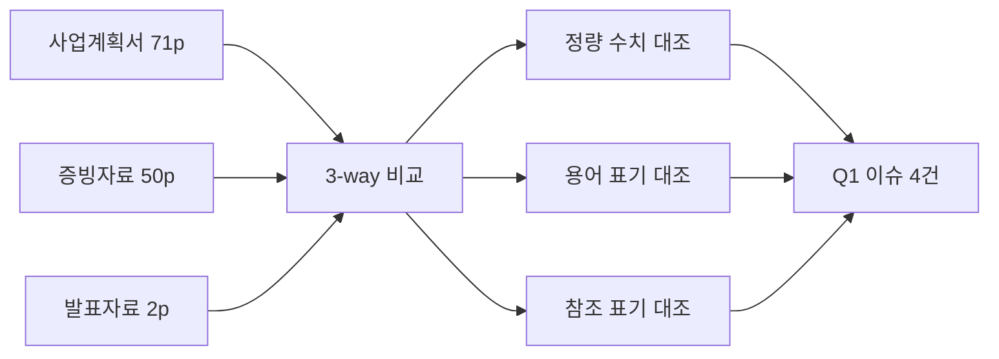

# [Q1] Cross-Document Parity 분석보고서

> 사업계획서 · 증빙자료 · 발표자료 3-way 동일 부분 획일성 검증
> 생성: 2026-04-15 KST | Source Hash: 7cfaec51 (refined)

## 분석 흐름



## 가용 기능 활용

| 단계 | 사용 |
|------|------|
| 페이지 추출 | pdfplumber + pypdf (Python) |
| 캡쳐 | pdf2image + Poppler |
| 직독 | Claude 멀티모달 (PNG read) |
| 인덱스 | 자체 mapping_4way.json |
| 메모리 | bkit_runtime/issues.json |

## 발견 4건

### 4-1. AI 교양·기초 교육과정 이수자 정량 불일치 [HIGH]

| 출처 | 수치 | 표기 |
|------|------|------|
| 발표자료 p1 | **869명** | "AI 교양 거초 교과목 이수" |
| 사업계획서 p58 핵심성과지표 분자 | **867명** | "AI 기초 교육과정 이수자 수" |
| 산식 분모 | 5,035명 | "전체 재학생 수" |

**현황**: 발표자료와 사업계획서 핵심성과지표가 2명 차이.
**문제점**: 평가위원이 두 문서를 동시 검토 시 어느 수치가 정본인지 모호.
**개선책**: 사업계획서가 산식·분자분모로 검증 가능하므로 867명이 정본 가능성 높음. 발표자료 869→867로 정정 권장.

### 4-2. '거초' vs '기초' 용어 오자 [HIGH]

| 출처 | 표기 |
|------|------|
| 발표자료 p1 | "AI 교양 **거초** 교과목" |
| 사업계획서 p58 | "AI **기초** 교육과정" |

**현황**: 발표자료에 '거초'(오자 추정)와 사업계획서 '기초' 혼재.
**문제점**: 발표 시 평가위원에게 작성 부주의 인상.
**개선책**: 발표자료 '거초'→'기초'로 정정.

### 4-3. [증빙 P,N] vs [증빙 P.N] 표기 단일 문서 내 혼용 [MEDIUM]

| 표기 | 페이지 | 건수 |
|------|--------|------|
| P,N (콤마) | plan p11([증빙 P,1]), p34([증빙 P,4]) | 2 |
| P.N (점) | p39, p43, p46, p49, p52, p57(×2), p58(×2) | 9 |

**현황**: 사업계획서 11개 단원 헤딩에 두 표기 혼용. 초기 2개 단원만 콤마.
**문제점**: 단순 오자지만 작성 일관성 평가 감점 요인.
**개선책**: p11과 p34를 [증빙 P.1]과 [증빙 P.4]로 정정 (다수 표기에 통일).

### 4-4. 발표자료 추가 정량지표 검증 잔여 [LOW]

발표자료 p1 정량지표 5종(21개 X+AI 교과목, 197명 교직원, 102명/4건, 269명 AI 전공, 355명 재직자)은 사업계획서·증빙자료 원본 대조가 본 라운드에서 미수행됨.

**개선책**: 차기 정정표 작성 단계에서 증빙자료 PNG 추가 직독으로 검증 권장.

## 예제 3종

### 예제 1 — 검출 성공 (정량 불일치)
```
입력: pres_p1 OCR + plan_p58 표
처리: 동일 지표명 후보 매칭 → 산식 분자값 비교
출력: Q1-001 (869 vs 867, 2 차이)
```

### 예제 2 — 검출 차단 (작성 가이드 차이는 별 축)
```
입력: format "사업추진 계획 총괄표" vs plan "사업추진내용 총괄표"
처리: Q1 cross-doc parity 대상 아님 (Source 간 비교 아님)
출력: Q2 format compliance로 라우팅 (Q2-002)
```

### 예제 3 — 검출 회복 (헤딩 추출 실패 → 직독 우회)
```
입력: 발표자료 헤딩 정규식 0건
처리: pres PNG 멀티모달 직독으로 우회
출력: 정량 5종·STRATEGY 4종 추출 성공
```

## 권고 우선순위
1. (HIGH) Q1-001 + Q1-002 발표자료 정정 → 발표 전 필수
2. (MEDIUM) Q1-003 사업계획서 표기 통일
3. (LOW) Q1-004 증빙자료 추가 검증
