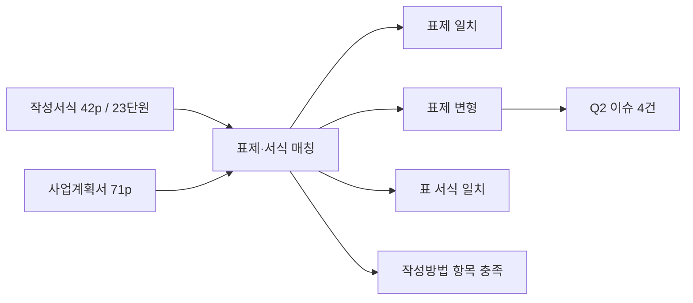

# [Q2] 작성서식 준수 분석보고서

> 작성서식(Reference) → 사업계획서(Source) 표제·서식 준수 검증
> 생성: 2026-04-15 KST | Source Hash: 7cfaec51

## 분석 흐름



## 가용 기능 활용

| 단계 | 사용 |
|------|------|
| 헤딩 추출 | extract_headings.py 정규식 (Roman/Numeric) |
| 매핑 | map_4way.py + 수동 23 단원 스키마 |
| 직독 | plan p8(목차) PNG로 표제 검증 |

## 발견 4건

### 4-1. Ⅱ.2.1 단원 표제에서 핵심 키워드 누락 [MEDIUM]

| 출처 | 표제 |
|------|------|
| 작성서식 Ⅱ.2.1 | "AI·DX 교육과정 개발·**운영체제 구축**·운영 실적 및 계획" |
| 사업계획서 2.1 (목차 p8) | "AI·DX 교육과정 개발·운영 실적 및 계획" |

**현황**: '체제 구축' 키워드 누락.
**문제점**: 평가지표 20점 항목명("AI·DX 교육과정 개발·운영체제 구축·운영 실적 및 계획의 우수성")과 정렬 어긋남.
**개선책**: 사업계획서 표제를 작성서식 표기 그대로 정정.

### 4-2. 총괄표 명칭 변형 [LOW]

| 출처 | 명칭 |
|------|------|
| 작성서식 p5 | `<사업추진 계획 총괄표>` (표 서식 변경 불가 명시) |
| 사업계획서 p15 | `<사업추진내용 총괄표>` |

**현황**: '계획' → '내용' 명칭 변형.
**문제점**: 표 서식은 동일하나 명칭이 작성 가이드와 불일치.
**개선책**: 표 명칭을 `<사업추진 계획 총괄표>`로 정정.

### 4-3. Ⅰ.2 표제 띄어쓰기 차이 [LOW]

| 출처 | 표제 |
|------|------|
| 작성서식 p3 | "2. 사업추진 목표 및 학습자의 AID 목표역량" |
| 사업계획서 p8 목차 | "2. 사업 추진목표 및 학습자의 AID 목표역량" |

**현황**: 띄어쓰기 위치 차이.
**개선책**: 작성서식 표기 그대로 통일.

### 4-4. Ⅱ.3 통합표제 처리 [INFO]

| 출처 | 처리 |
|------|------|
| 작성서식 | Ⅱ.3.1 / Ⅱ.3.2 별개 단원 |
| 사업계획서 | "3. AI·DX 기반 교수학습 혁신 및 교직원 역량강화 (3.1, 3.2 하위)" 통합표제 |

**현황**: 사업계획서가 통합표제 + 하위 분리. 내용은 모두 다룸.
**판정**: 작성 가이드 위반 아님. 정보 제공.

## 거짓 양성 (Phase 4 가설)

| Phase 4 의심 | Phase 5 검증 |
|--------------|--------------|
| Ⅱ.총괄표 plan 누락 | plan p15에 존재 (명칭 변형은 4-2) |
| Ⅱ.1 plan 누락 | plan p18 목차 확인 (헤딩 정규식 한계가 원인) |

## 예제 3종

### 예제 1 — 표제 일치 (긍정)
```
format Ⅰ.1.1 "대학의 AI·DX 교육여건 분석"
plan p11 "1.1 대학의 AI·DX 교육여건 분석" — 일치 OK
```

### 예제 2 — 표제 변형 (이슈 발생)
```
format Ⅱ.2.1 "...개발·운영체제 구축·운영..."
plan 2.1 "...개발·운영..."
→ Q2-001 키워드 누락
```

### 예제 3 — 헤딩 추출 한계 회복
```
extract_headings.py: Ⅱ.1 plan 매핑 0
→ plan p8 목차 PNG 직독으로 18p 존재 확인
→ 거짓 양성 판정
```

## 종합 평가
- 23단원 중 표제 정확 일치 ~19, 변형 3, 정보 1.
- 작성서식 핵심 작성방법 항목(SWOT·통계 출처·중장기 연계·이해관계자 의견수렴) → plan p11/p15/p17 모두 충족 확인.
- 형식 감점 예상: -3~-7점 / 100점 (항목 명칭 정렬 정정 시 회복 가능)
