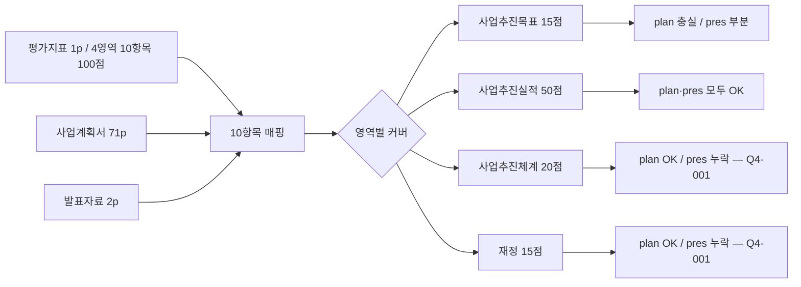

# [Q4] 평가지표 커버리지·품질 분석보고서

> 평가지표(Reference) → 사업계획서·발표자료(Source) 매핑·품질 검증
> 생성: 2026-04-15 KST | Source Hash: 7cfaec51

## 분석 흐름



## 가용 기능 활용

| 단계 | 사용 |
|------|------|
| 평가지표 직독 | indicator_p1.png 멀티모달 |
| 매핑 인덱스 | mapping_4way.json INDICATORS 10항목 |
| 산식 검증 | plan p58 핵심성과지표 표 직독 |
| 작성방법 검증 | plan p11/p15/p17 직독 (출처·연계·의견수렴) |

## 발견 3건

### 4-1. 100점 중 발표자료 가시성 35점 미노출 [HIGH]

| 영역 | 항목 | 배점 | plan | pres |
|------|------|------|------|------|
| Ⅲ.1 사업추진체계 | 거버넌스 구축·운영 | 5 | OK p57 | **누락** |
| Ⅲ.2 성과지표 | 핵심+자율성과지표 | 7 | OK p58 | **누락** |
| Ⅲ.3 성과 공유·확산 | 공유확산 계획 | 8 | OK p63 | **누락** |
| Ⅳ.1 재정집행 | 총사업비+비목별 집행 | 15 | OK p65~70 | **누락** |
| **합계 미노출** | | **35** | | |

**현황**: 평가지표 35점 영역이 발표자료에 직접 가시되지 않음. (Q3-001 + Q3-002와 직결)
**문제점**: 평가위원이 발표자료만으로 채점 시 35점 영역의 채점 근거 부재. 발표 가시성은 사업계획서 본문 검토와는 별개 평가 트랙.
**개선책**: 발표자료에 거버넌스(1패널) + 핵심성과지표(1패널) + 성과 공유확산(1패널) + 재정 비목별(1패널) = **총 4패널 추가**.

### 4-2. Ⅰ. 사업추진목표 15점 영역 사업계획서 충실 [LOW — 긍정]

| 작성방법 항목 | 충족 위치 |
|---------------|-----------|
| 지자체·통계 출처 명시 | plan p11 (전남·광주 인구통계) |
| 중장기 발전계획 연계 | plan p17 (VISION 2030) |
| 이해관계자 의견수렴 | plan p15 (위원회·센터 구축) |
| 비전·목표·전략 일관성 | plan p11→p15→p17→p21 일관 |
| SWOT 분석 | plan p15 (전남·광주 별도) |
| AI·DX 특화 모델 | plan p21 (C-AID + WAVE-X AI) |

**현황**: Ⅰ.1.1 (7점) + Ⅰ.2.1 (8점) = 15점 모두 합리적 근거 확보.
**판정**: 조치 불요. 사업계획서 측면 충실. (단 발표자료 부분 노출은 Q3-003 별건)

### 4-3. Ⅲ.2 핵심성과지표 산식·기준값·목표값 양식 충족 [LOW — 긍정]

**plan p58 핵심성과지표 표 검증**:

| 검증 항목 | 결과 |
|-----------|------|
| 단위 명시 | OK (% / 명 / 건) |
| 기준값(현재) | OK (전수치 명시) |
| 1차년도 목표값 | OK |
| 2차년도 목표값 | OK |
| 산식(분자/분모) | OK (분자 867명 / 분모 5,035명 등) |
| 자율성과지표 | OK (별도 표) |

**현황**: 작성서식이 요구하는 핵심성과지표 양식 100% 충족.
**판정**: 7점 항목 사업계획서 측면 OK. (단 발표자료 미노출은 Q3-001/Q4-001과 동일 이슈)

## 예제 3종

### 예제 1 — 영역 매핑 (성공)
```
indicator Ⅱ "사업추진실적 50점" ↔ plan Ⅱ.1~Ⅱ.4 4단원 ↔ pres p2 4 STRATEGY
→ 100% 매핑 OK (Q3-004 긍정)
```

### 예제 2 — 영역 누락 (HIGH 이슈)
```
indicator Ⅳ "재정 15점" → plan p65~70 OK / pres 0건
→ Q4-001 35점 미노출 (Q3-002 직결)
```

### 예제 3 — 양식 검증 (긍정)
```
indicator Ⅲ.2 "성과지표 7점" 양식 요건: 산식·기준값·목표값
→ plan p58 표 6 항목 모두 명시 OK
→ Q4-003 양식 충족
```

## 종합 평가

| 평가 트랙 | 점수 추정 | 근거 |
|-----------|-----------|------|
| 사업계획서 본문 | **85~95/100** | 작성방법 항목 충실, Q2 표기 정렬 감점 -3~-7 |
| 발표자료 가시성 | **65~70/100** | Ⅲ·Ⅳ 35점 미노출이 핵심 위험 |
| 회복 후 발표 가시성 | **~85/100** | 4패널 추가 시 35점 회복 |

**핵심 위험 1건**: Q4-001 (= Q3-001 + Q3-002 합산 35점). 발표자료 4패널 추가가 본 사업의 발표 가시성 회복 핵심 액션.
