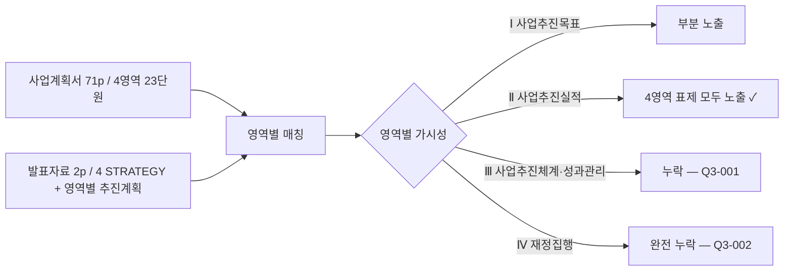

# [Q3] 발표자료 커버리지 분석보고서

> 사업계획서(Source) → 발표자료(Source) 누락 여부 검증
> 생성: 2026-04-15 KST | Source Hash: 7cfaec51

## 분석 흐름



## 가용 기능 활용

| 단계 | 사용 |
|------|------|
| 발표자료 직독 | pres_p1.png + pres_p2.png 멀티모달 |
| 사업계획서 인덱스 | mapping_4way.json |
| 4영역 매칭 | 작성서식 23 단원 스키마 |

## 발견 4건

### 4-1. Ⅲ. 사업추진체계 및 성과관리 발표자료 누락 [HIGH]

**사업계획서 본문 (plan p57~p63)**:
- AI·DX 추진 거버넌스 총괄 체계
- 거버넌스 구축·운영 방안 + 거버넌스별 주요 기능
- 핵심성과지표 총괄표 + 세부계획
- 자율성과지표 설정
- 성과관리 계획
- 성과 공유·확산 계획

**발표자료 (pres p1+p2)**:
- 거버넌스/성과지표/성과관리/공유확산 키워드 직접 노출 0
- 영역별 추진계획 4개로만 압축 (Ⅱ 영역만)

**영향**: 평가지표 5+7+8 = **20점 영역의 발표 가시성 결함**.
**개선책**: 발표자료에 ① 거버넌스 1패널 ② 핵심성과지표 1패널 ③ 성과관리·공유확산 1패널 추가.

### 4-2. Ⅳ. 재정집행 계획 발표자료 완전 누락 [HIGH]

**사업계획서 본문 (plan p65~p70)**:
- 총사업비 구성
- 1차년도(2026년) 비목별 집행 계획
- 1차년도 사업비 구성 (비목별 표 + 그래프)

**발표자료**: 재정/사업비/예산 키워드 0건.

**영향**: 평가지표 **15점 영역** 발표 가시성 0. 발표 시 사업비 질문(예: "1차년도 비목별 분배는?") 즉각 답변 불가.
**개선책**: 발표자료에 1차년도 총사업비 + 비목별 도넛/막대 차트 1패널 필수 추가.

### 4-3. Ⅰ.1.1 SWOT/전략 매트릭스 발표자료 부분만 [MEDIUM]

| 출처 | 포함 |
|------|------|
| 사업계획서 p15 | 전남 동부권 SWOT 4사분면 + 광주권 SWOT 별도 |
| 발표자료 p1 | 지역 여건/필요성 박스 (인구·디지털 전환 수요 통계) |
| 누락 | SWOT 매트릭스 자체, 전략 도출 논리 |

**영향**: 여건 분석 → 전략 도출 깊이 검증 불가.
**개선책**: 발표자료에 SWOT 4분면 압축 다이어그램 1개 추가.

### 4-4. Ⅱ. 4영역 표제 100% 일치 [LOW — 긍정]

| 작성서식 영역 | 발표자료 p2 핵심과제 |
|---------------|----------------------|
| Ⅱ.1 인프라 및 추진체계 | "인프라 및 추진체계" |
| Ⅱ.2 교육과정 개발·운영체제 | "교육과정 개발·운영체제" |
| Ⅱ.3 교수학습 혁신·교직원 역량강화 | "교수학습 혁신 및 교직원 역량강화" |
| Ⅱ.4 교육환경 개선·산학연계 | "교육환경 개선 및 산학연계" |

**판정**: 50점 영역의 가시성 OK. 조치 불요.

## 예제 3종

### 예제 1 — 직접 매칭 (긍정)
```
plan Ⅱ. 4영역 ↔ pres p2 핵심과제 4영역 → 표제 100% 일치
```

### 예제 2 — 영역 누락 (HIGH 이슈)
```
plan Ⅳ.1.1~1.2.3 (재정 4단원) → pres 키워드 0건
→ Q3-002 완전 누락
```

### 예제 3 — 부분 노출 (MEDIUM)
```
plan p15 SWOT 4사분면 → pres p1 지역 여건 박스만
→ 분석 깊이 가시성 결함 (Q3-003)
```

## 종합 평가
- 발표자료 가시성 위험: **35점/100점 미노출** (Q3-001 20점 + Q3-002 15점)
- 발표 가시성 점수 추정: **65~70/100**
- 회복 가능성: 발표자료에 거버넌스+성과지표+재정 3패널 추가 시 ~85/100 회복 가능
