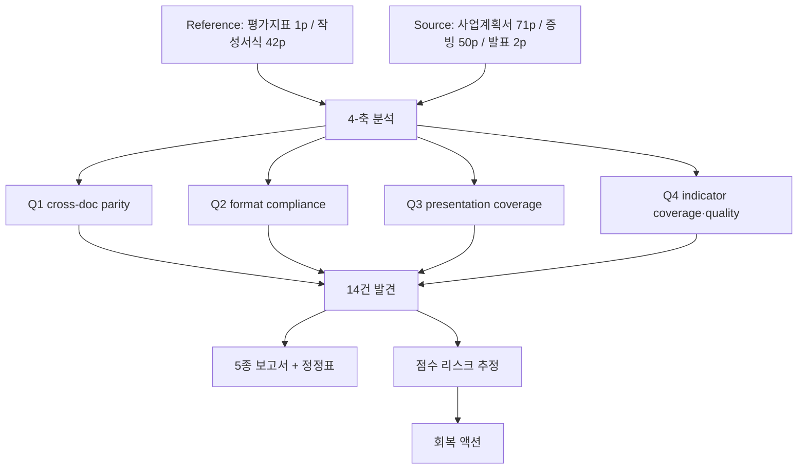
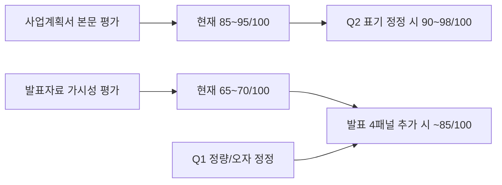

# 종합 분석보고서 — 4-질문 통합

> 사업계획서·증빙자료·발표자료·평가지표·작성서식 5문서 14건 발견 통합
> 생성: 2026-04-15 KST | Source Hash: 7cfaec51

## 분석 흐름 (전체)



## 5문서 인벤토리

| 슬러그 | 역할 | 페이지 | 표 | 비고 |
|--------|------|--------|----|----|
| plan | 사업계획서 | 71 | 238 | AER-003 적용, p8 목차 직독 |
| evidence | 증빙자료 | 50 | 54 | 본 라운드 직독 미수행 (Q1-004 잔여) |
| pres | 발표자료 | 2 | 12 | 멀티패널 슬라이드, 멀티모달 직독 |
| indicator | 평가지표 | 1 | 1 | 4영역 10항목 100점 |
| format | 작성서식 | 42 | 68 | 23 단원 정의 |

## 가용 기능 활용

| 기능 | 활용 |
|------|------|
| pdfplumber + pypdf | 페이지·표 추출 (Phase 2) |
| pdf2image + Poppler 25.07.0 | 200 DPI 캡쳐 (Phase 3) |
| Tesseract eng | OCR fallback (kor 미설치 → Claude 멀티모달 우회) |
| Claude 멀티모달 PNG 직독 | 6장 (plan p8/p11/p15/p17/p58, pres p1/p2, indicator p1) |
| extract_headings.py + 정규식 | 헤딩 추출 |
| map_4way.py | 4-way 매핑 인덱스 |
| llm-wiki | 분석 패턴 지식화 (Phase 7 예정) |
| harness-imprint | IMP 등록 (Phase 7 예정) |

## 발견 통계

| 축 | HIGH | MEDIUM | LOW | INFO | 합계 |
|----|------|--------|-----|------|------|
| Q1 cross-doc parity | 2 | 1 | 1 | 0 | 4 |
| Q2 format compliance | 0 | 1 | 2 | 1 | 4 |
| Q3 presentation coverage | 2 | 1 | 1 | 0 | 4 |
| Q4 indicator coverage | 1 | 0 | 2 | 0 | 3 |
| **계** | **5** | **3** | **6** | **1** | **14** |

## HIGH 5건 우선조치 매트릭스

| ID | 제목 | 영향 | 액션 | 담당축 |
|----|------|------|------|--------|
| Q1-001 | 869명 vs 867명 정량 불일치 | 신뢰도 | 발표자료 869→867 정정 | Q1 |
| Q1-002 | '거초' vs '기초' 오자 | 부주의 인상 | 발표자료 '거초'→'기초' | Q1 |
| Q3-001 | Ⅲ. 거버넌스/성과지표 발표 누락 | 20점 가시성 | 발표자료 3패널 추가 | Q3 |
| Q3-002 | Ⅳ. 재정집행 발표 완전 누락 | 15점 가시성 | 발표자료 1패널 추가 | Q3 |
| Q4-001 | 35점 영역 가시성 부족 | 채점 근거 부재 | Q3-001/002와 동일 | Q4 |

## 점수 리스크 종합



| 트랙 | 현재 | 정정 후 | 핵심 액션 |
|------|------|---------|-----------|
| 사업계획서 본문 | 85~95 | 90~98 | Q2-001 표제 정정 (-3~-7 회복) |
| 발표자료 가시성 | 65~70 | ~85 | Q3-001/002 4패널 추가 (35점 회복) |
| 정량 신뢰도 | 위험 | 안전 | Q1-001/002 정정 |

## Phase별 PDCA 결과

| Phase | 산출물 | 결과 |
|-------|--------|------|
| 1 plan | docs/pdca/phase1/plan.md | 5문서 인벤토리, AER-003 트리거 예측 |
| 2 do — parsing | parse_pdfs.py + 71+50+2+1+42p JSON | OK |
| 3 do — capture | merge_detect_capture.py + 의심 페이지 PNG | OK (200 DPI) |
| 4 do — tagging | extract_headings + map_4way | 거짓 양성 2건 (Phase 5에서 정정) |
| 5 check | 멀티모달 직독 6장 + issues.json | 14건 발견 |
| 6 act | 5종 보고서 + 정정표 (본 보고서) | OK |
| 7 wiki | 패턴 지식화 + IMP 등록 | 예정 |

## 거짓 양성 검증 (Phase 4 → 5)

| Phase 4 가설 | Phase 5 결론 | 원인 |
|--------------|--------------|------|
| Ⅱ.총괄표 plan 누락 | 거짓 양성 (plan p15 존재) | 명칭 변형 → Q2-002로 분류 |
| Ⅱ.1 plan 누락 | 거짓 양성 (plan p18 존재) | 헤딩 정규식 한계 |
| 발표자료 헤딩 0 | 사실 (슬라이드 형식) | 멀티모달로 우회 |
| [증빙 P,N] 표기 혼용 | 사실 11건 | Q1-003 |
| Ⅱ.1 인프라 plan 매핑 0 | 거짓 양성 | Ⅱ.1 거짓 양성과 동일 원인 |

## 예제 3종 (전체 워크플로우)

### 예제 1 — 정상 검출 (Q1-001)
```
입력: pres_p1 OCR(869명) + plan_p58 표(867명)
처리: 동일 지표 후보 매칭 → 산식 분자값 비교
출력: HIGH (정량 2명 차이) → 발표자료 정정 권장
```

### 예제 2 — 거짓 양성 회복 (Phase 4→5)
```
입력: extract_headings.py 결과 "Ⅱ.1 plan 누락"
검증: plan_p8.png 멀티모달 직독 → Ⅱ 4영역 모두 존재 확인
출력: 거짓 양성 처리 + 헤딩 정규식 한계 IMP 등록 후보
```

### 예제 3 — 영역 누락 (Q3-002 = Q4-001)
```
입력: indicator Ⅳ 15점 + plan p65~70 (재정 4단원) + pres 키워드 0건
처리: 영역별 가시성 매트릭스 → 발표 누락 영역 합산
출력: HIGH 35점 미노출 → 발표 4패널 추가 액션
```

## 권고 액션 우선순위

1. **즉시 (발표 전 필수)**:
   - Q1-001 발표자료 869→867
   - Q1-002 발표자료 '거초'→'기초'
2. **단기 (1주 내)**:
   - Q3-001/Q3-002 발표자료 4패널 추가 (거버넌스 + 성과지표 + 공유확산 + 재정)
3. **중기 (정정 사이클)**:
   - Q2-001 표제 '체제 구축' 보강
   - Q1-003 [증빙 P.N] 표기 통일
4. **잔여 검증**:
   - Q1-004 발표자료 5종 정량지표 증빙자료 PNG 직독 대조

## 산출물 인덱스

| 파일 | 위치 |
|------|------|
| Q1 보고서 | Output/Reports/260415_1500_cross_consistency_분석보고서.md |
| Q2 보고서 | Output/Reports/260415_1500_format_compliance_분석보고서.md |
| Q3 보고서 | Output/Reports/260415_1500_presentation_coverage_분석보고서.md |
| Q4 보고서 | Output/Reports/260415_1500_indicator_quality_분석보고서.md |
| 종합 보고서 | Output/Reports/260415_1500_종합_분석보고서.md (본 파일) |
| 오류정정표 | Output/Errors/260415_1500_오류정정표.md |
| 발견 원본 | .bkit_runtime/issues.json (14건) |
| 매핑 인덱스 | .bkit_runtime/mapping_4way.json |
