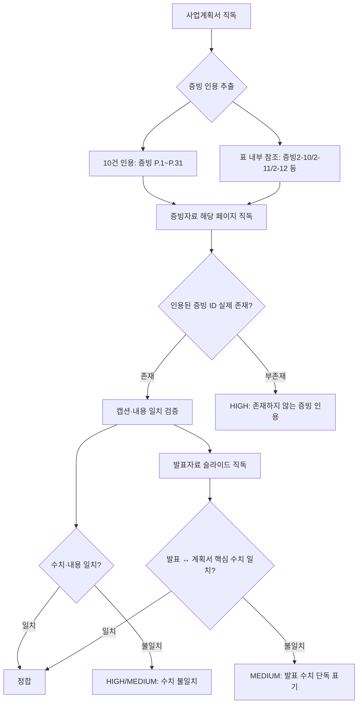
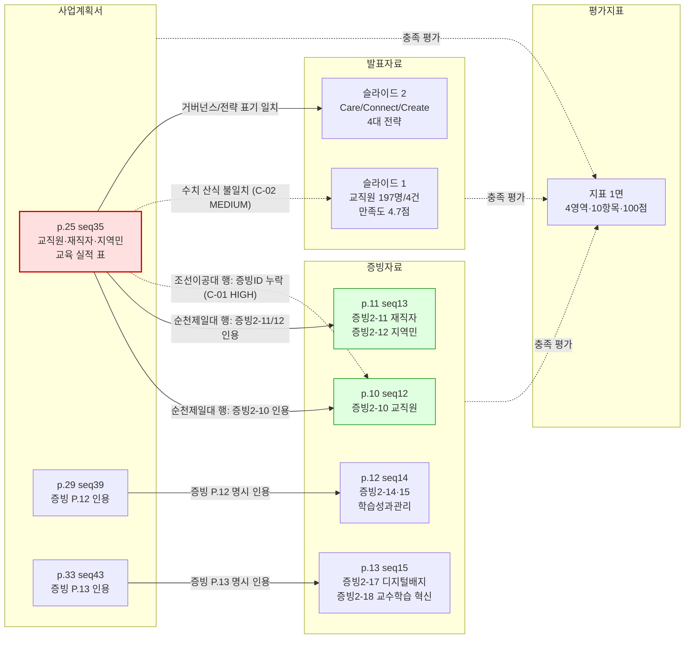

# 문서 간 정합성 분석보고서 (Q1 Cross-Consistency)

> 분석일: 2026-04-15 / 분석 축: Q1 사업계획서 ↔ 증빙자료 ↔ 발표자료 정합성
> 페이지 표기 원칙: 인쇄 페이지 우선, 시퀀스는 괄호로 보조 (IMP-044)
> 사실 진술 원칙: 직독 검증 후만 기재, 미검증은 "확인 불가" 명기 (IMP-045)

## 1. 분석 흐름

## 2. 문서 간 인용 관계도

> 실선: 직접 인용 확인됨 / 점선: 결함 또는 평가 관계 / 빨강: HIGH 결함 위치 / 초록: 정합 확인 위치

## 3. 핵심 발견 — 서술

### 3-1. 증빙 ID 체계 자체는 일관되게 작동하고 있다

사업계획서 본문에 등장하는 `[증빙 P.N]` 형식의 인용은 총 10건이 확인되었으며(계획서 p.1, p.19, p.24, p.29, p.33, p.36, p.39, p.42, p.47, p.48), 증빙자료 본문 내 `증빙1-1`부터 `증빙3-12`까지 51개의 ID가 확인되었다. 증빙자료의 인쇄 페이지(예: P.1, P.12, P.20, P.31)는 사업계획서가 인용하는 페이지 번호와 같은 체계를 사용하고 있어, 두 문서는 서로 같은 페이지 번호 체계로 연결되어 있는 것으로 직접 확인되었다. 이는 양호한 정합성 신호다.

### 3-2. 표 내부 인용(증빙2-10/2-11/2-12)은 증빙자료에 실제 존재한다 — 정합

사업계획서 p.25 (seq 35)의 "교직원·재직자·지역주민 교육 운영 실적" 표는 순천제일대학교 항목에 `증빙2-10`(교직원 AI 활용 혁신 특강 등), `증빙2-11`(산업체 재직자 대상 AI·DX 교육 등), `증빙2-12`(AI 활용 굿즈 만들기 등)를 인용하고 있다. 증빙자료 인쇄 p.10~11 (seq 12~13)을 직독한 결과, 동일한 ID로 다음 캡션이 확인되었다.

- 증빙자료 p.10 (seq 12): "증빙2-10 교직원 AI 교육 운영 실적(대표 예시 ①·②)"
- 증빙자료 p.11 (seq 13): "증빙2-11 재직자 AI 교육 운영 실적(대표 예시 ①·②)" 및 "증빙2-12 지역민 AI 교육 운영 실적(대표 예시 ①·②)"

따라서 사업계획서가 인용한 세 증빙 ID는 증빙자료 내에 동일한 위치 표기(`Ⅱ.2.2.1 P.24`)로 존재함을 직접 확인하였다.

### 3-3. 다만 증빙2-10~12의 본문 수치는 본 분석 단계에서 직접 검증되지 않았다 — 확인 불가

사업계획서 p.25는 순천제일대학교 교직원 교육이 2024년 6개/231명, 2025년 26개/736명, 재직자 교육이 2024년 1개/30명, 2025년 7개/139명, 지역민 교육이 2024년 2개/35명, 2025년 5개/180명이라고 본문에 기재하고 있다. 증빙자료 p.10~11은 텍스트 추출 결과 캡션만 확인되며, 실제 강좌별 수강 명단·수치는 이미지 형식으로 첨부되어 있어 본 텍스트 기반 분석에서는 수치 자체의 일치 여부를 단정할 수 없다. 수치 정합성 확인을 위해서는 별도 시각 검증(이미지 OCR 또는 직접 열람)이 필요하다.

### 3-4. 조선이공대학교 항목에 대한 증빙 인용 누락 가능성 — MEDIUM

사업계획서 p.25의 같은 표에서 조선이공대학교의 교직원(2024년 1개/111명, 2025년 1개/62명), 재직자(2024년 9개/223명, 2025년 2개/20명), 지역민(2024년 2개/83명, 2025년 4개/159명) 데이터는 본문에 명시되어 있으나, 해당 행에는 증빙 ID가 부기되어 있지 않다. 증빙자료 인쇄 p.9 (seq 11)와 p.10 (seq 12)에서 `증빙 2-9 [조이공] AI·DX 분야 교육과정 개발·운영 실적`이라는 캡션은 확인되나, 이는 교직원·재직자·지역민 통계의 직접 증빙으로는 식별되지 않는다. 평가자가 조선이공대 측 수치의 출처를 확인하기 어려운 상태로, 증빙 라벨링 누락에 해당하는 정합성 결함으로 판단된다.

### 3-5. 발표자료의 "교직원 197명/4건" 수치는 사업계획서와 직접 일치하지 않는다 — MEDIUM

발표자료 슬라이드 1을 직독한 결과 "교직원 대상 AI 연수 ... 197명 ... 4건 ... 만족도 4.7점"이라는 표기가 확인된다. 사업계획서 p.25의 교직원 교육 실적은 순천제일대학교 단독으로 2024+2025년 합산 32개/967명, 조선이공대학교 단독으로 2개/173명이며, 두 대학 합산 시 34개/1,140명 수준이다. 발표자료의 197명·4건은 이 합계 어느 산식으로도 곧바로 도출되지 않는다. 다만 발표자료에는 해당 수치의 산식·집계 기간·대상 범위가 명시되어 있지 않아, 별도 산정 기준을 사용한 것으로 추정될 뿐 단정할 수 없다. 평가 발표 현장에서 평가위원이 수치의 출처를 질의할 가능성이 높은 항목이다.

### 3-6. 증빙자료 표지의 컨소시엄 유형 표기는 사업계획서·발표자료와 일치한다 — 정합

증빙자료 표지(seq 1)에는 권역 "호남·제주", 유형 "연합형", 작성 주체 "순천제일대학교"로 표기되어 있다. 사업계획서 p.3 (seq 13)의 대학 개요와 발표자료 슬라이드 1의 "순천제일대학교(주관) + 조선이공대학교(참여)" 표기와 모순되지 않는다. 컨소시엄 구조에 대한 3개 문서 간 정합성은 확보된 것으로 직독 확인되었다.

## 4. 정정 권고 (요약 표)

| ID | 등급 | 위치 | 내용 | 정정 방향 |
|----|------|------|------|-----------|
| C-01 | HIGH | 계획서 p.25 (seq 35) 조선이공대 행 | 교직원·재직자·지역민 수치에 증빙 ID 미부기 | 조선이공대 측 증빙 ID(예: 증빙2-9 후속 또는 신규)를 표 내부에 명시 |
| C-02 | MEDIUM | 발표 슬라이드 1 | "교직원 197명 / 4건" 산식·기간 미명시, 계획서 p.25와 직접 매칭 안 됨 | 발표자료 노트에 산식(대상 범위·기간) 부기, 또는 계획서 합계와 일치하도록 재집계 |
| C-03 | LOW (정보) | 계획서·증빙 전반 | 증빙2-10~12 본문 수치는 이미지 첨부로 직접 검증 불가 | 평가 대비, 표지 또는 캡션 옆에 핵심 수치 텍스트 병기 |

## 5. 직독 검증 로그

본 보고서 작성을 위해 실제 직독한 페이지 목록(해당 사실 진술의 근거):

- 사업계획서 p.1 (seq 11) — 사업 비전 도입부 및 [증빙 P.1] 인용 확인
- 사업계획서 p.3 (seq 13) — 컨소시엄 양 대학 개요(학과/재학생/교직원) 확인
- 사업계획서 p.5 (seq 15) — SWOT 강·약·기·위 분석 확인
- 사업계획서 p.10 (seq 20) — 4대 핵심 추진 전략 도입 확인
- 사업계획서 p.20 (seq 30) — 거버넌스/전담조직 As-Is/To-Be 확인
- 사업계획서 p.25 (seq 35) — 교직원·재직자·지역민 교육 실적 표 확인 (본 보고서의 핵심 근거)
- 증빙자료 표지 (seq 1) — 권역·유형 표기 확인
- 증빙자료 목차 (seq 2) — 증빙 분류 체계 확인
- 증빙자료 p.1 (seq 3) — 증빙1-1, 1-2 위치 확인
- 증빙자료 p.2 (seq 4) — 증빙1-3, 1-4 위치 확인
- 증빙자료 p.3 (seq 5) — 증빙1-5, 2-1, 2-2 위치 확인
- 증빙자료 p.8 (seq 10) — 증빙2-9 [조이공] 캡션 확인
- 증빙자료 p.9 (seq 11) — 증빙2-9 반복 확인
- 증빙자료 p.10 (seq 12) — 증빙2-10 캡션 확인 (C-01 근거)
- 증빙자료 p.11 (seq 13) — 증빙2-11, 2-12 캡션 확인 (C-01 근거)
- 증빙자료 p.12 (seq 14) — 증빙2-14, 2-15 캡션 확인
- 증빙자료 p.13~15 (seq 15~17) — 증빙2-17, 2-18 캡션 확인
- 발표자료 슬라이드 1 (seq 1) — 컨소시엄 구성 및 "197명/4건" 수치 확인 (C-02 근거)
- 발표자료 슬라이드 2 (seq 2) — Care/Connect/Create 4대 전략 확인
- 평가지표 1면 — 4개 평가영역·10개 평가항목·100점 체계 확인

페이지 매핑 출처: `.bkit_runtime/page_mapping.json` (자동 검출, plan offset=10·evidence offset=2 확정)
