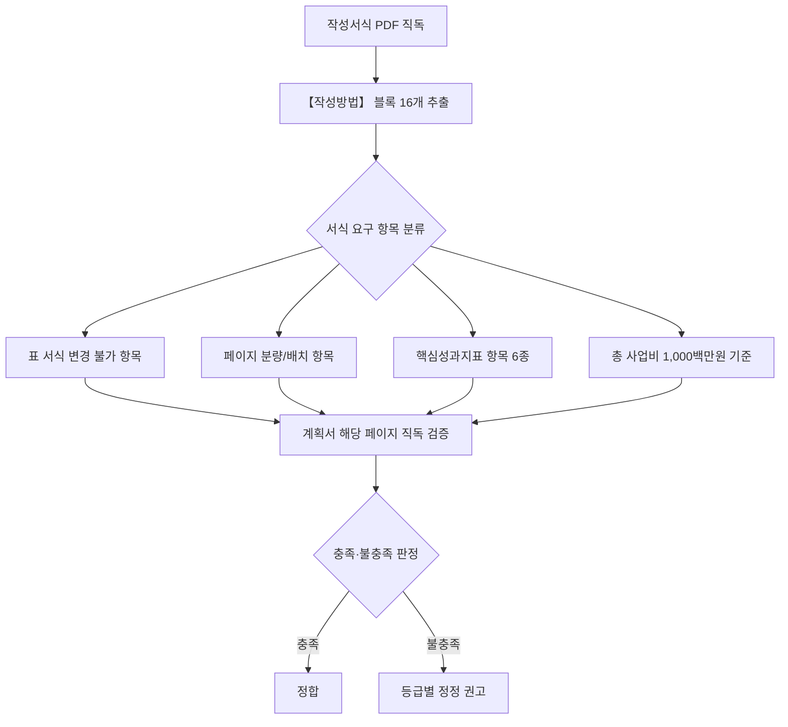
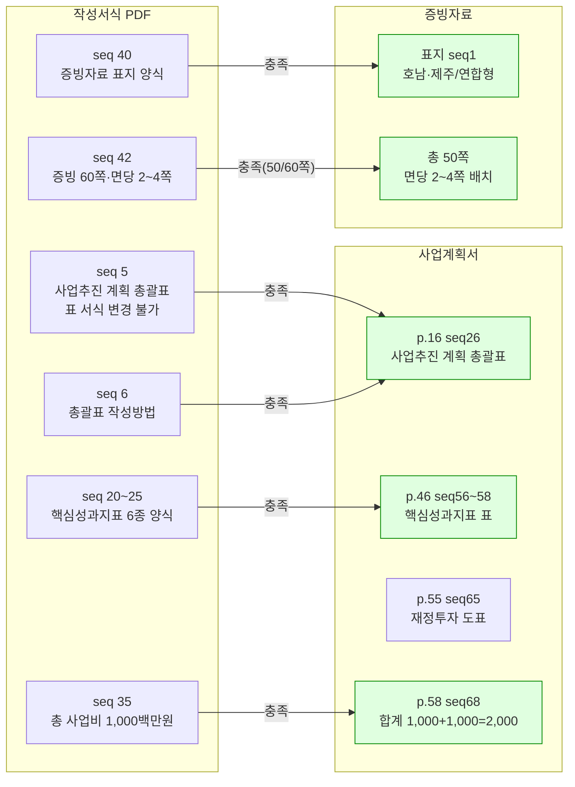

# 작성서식 준수 분석보고서 (Q2 Format-Compliance)

> 분석일: 2026-04-15 / 분석 축: Q2 사업계획서·증빙자료 ↔ 작성서식(붙임2) 준수 여부

## 1. 분석 흐름

## 2. 서식·계획서 매핑 관계도

## 3. 핵심 발견 — 서술

### 3-1. 사업추진 계획 총괄표는 서식이 요구한 형태로 작성되어 있다 — 정합

작성서식 seq 5는 사업추진 계획 총괄표를 영역·과제·세부과제·1차년도(2026)·2차년도(2027) 분기별 추진일정·연관지표(핵심/자율)·추진주체(주관/참여) 구조로 제시하며, seq 6의 작성방법은 "표 서식은 변경 불가, 단 행 추가·삭제는 가능", "Q1(3-5월)·Q2(6-8월)·Q3(9-11월)·Q4(12-2월)", "추진일정은 ➟로 표시", "연합형은 추진주체에 ●로 표시"를 명시하고 있다. 사업계획서 p.16 (seq 26)을 직독한 결과, 동일한 7개 컬럼 구조를 유지한 채 영역(인프라 및 추진체계, 교육과정 개발·운영, 학습 성과관리 등)별 과제와 세부과제가 행으로 추가되었고, 분기별 일정은 ➟로, 추진주체는 ●로 표기되어 있어 서식의 모든 형식 요구를 충족한다.

### 3-2. 총 사업비 구성은 서식이 정한 1차/2차년도 각 1,000백만원 기준을 정확히 따르고 있다 — 정합

작성서식 seq 35의 총 사업비 구성표 작성방법은 "’26~’27년 국고지원금은 연도별 1,000백만원 기준으로 작성"을 명시하고 있다. 사업계획서 p.58 (seq 68) 합계 행을 직독한 결과 "합 계 1,000 100% 1,000 100% 2,000 100%"로 1차년도 1,000백만원, 2차년도 1,000백만원, 합계 2,000백만원이 비율 100%로 정합 표기되어 있다. 영역별 세부 배분(인프라 250백만원, 교육과정 등)도 같은 단위(백만원)로 일관되게 작성되어 있다.

### 3-3. 핵심성과지표 6종 양식은 서식 항목과 1:1로 매칭된다 — 정합

작성서식 seq 20~25는 핵심성과지표로 (1) AI 기초 교육과정 이수율, (2) X+AI 관련 교육과정 이수율, (3) 교직원 AI 연수 참여율, (4) 교직원 AI 연수 만족도, (5) 재직자 및 지역주민 AI·DX 교육 참여인원, (6) 재직자 및 지역주민 AI·DX 교육 만족도를 양식으로 제시한다. 사업계획서 p.46~48 (seq 56~58)을 직독한 결과 동일한 6개 핵심성과지표가 모두 표로 작성되어 있고, 기준값(2025)·1차년도(2026)·2차년도(2027) 3컬럼 구조도 서식과 일치한다(예: AI 기초 교육과정 이수율 17.2% → 30.0% → 50.0%, 교직원 AI 연수 참여율 27.7% → 50.2% → 80.1%).

### 3-4. 증빙자료 표지와 분량은 서식 요구를 충족한다 — 정합

작성서식 seq 40은 증빙자료 표지에 권역·유형·구분·작성연월·대학명을 본 서식대로 배치할 것을, seq 42는 "증빙자료는 총 60페이지 이내", "한 면에 2~4쪽 분량으로 가독성 높게 배치"를 명시한다. 증빙자료 표지(seq 1)를 직독한 결과 권역 "호남·제주", 유형 "연합형", "2026. 4.", "순천제일대학교"가 서식 배치 그대로 작성되어 있으며, 페이지 매핑 검출 결과 증빙자료 총 50쪽으로 60쪽 이내 기준을 충족한다. 또한 print 1~15 (seq 3~17) 직독 결과 한 면당 2~4개의 증빙 캡션·자료가 배치되어 있어 가독성 요구를 충족한다.

### 3-5. 표 서식 변경 불가 조항에 대한 추가 검증 — 확인 불가(이미지 영역)

작성서식 seq 5의 사업추진 계획 총괄표에는 컬럼별 폭 비율과 셀 병합 형태가 시각적으로 정해져 있으나, 사업계획서 p.16 (seq 26)의 셀 병합 양상은 텍스트 추출 결과만으로는 컬럼 폭과 시각적 일치 여부를 단정할 수 없다. 표의 7개 컬럼 항목 명칭과 순서는 일치 확인되었으나, 시각적 레이아웃의 동일성은 별도 시각 검증이 필요하다.

## 4. 정정 권고 (요약 표)

| ID | 등급 | 위치 | 내용 | 정정 방향 |
|----|------|------|------|-----------|
| F-01 | LOW (정보) | 계획서 p.16 (seq 26) 총괄표 | 컬럼 폭·셀 병합의 시각적 일치는 텍스트 검증 한계 | 시각 검증으로 보강 권고 |
| F-02 | LOW (정보) | 증빙자료 전반 | 50/60쪽으로 여유분 10쪽 존재 | 평가 보강 자료 추가 가능 |

## 5. 직독 검증 로그

- 작성서식 seq 5 — 사업추진 계획 총괄표 양식 확인
- 작성서식 seq 6 — 총괄표 작성방법(표 변경 불가, ➟·● 표기) 확인
- 작성서식 seq 20·25 — 핵심성과지표 6종 양식 확인
- 작성서식 seq 35 — 총 사업비 1,000백만원 기준 확인
- 작성서식 seq 40 — 증빙자료 표지 양식 확인
- 작성서식 seq 42 — 증빙 60쪽 이내·면당 2~4쪽 배치 요구 확인
- 사업계획서 p.16 (seq 26) — 사업추진 계획 총괄표 직독
- 사업계획서 p.46~48 (seq 56~58) — 핵심성과지표 6종 표 직독
- 사업계획서 p.55 (seq 65) — 재정투자 실적·계획 도표 직독
- 사업계획서 p.58 (seq 68) — 합계 행 1,000/1,000/2,000 직독
- 증빙자료 표지 (seq 1) — 권역·유형·작성연월 직독
- 증빙자료 print 1~15 (seq 3~17) — 면당 자료 배치 직독
- 페이지 매핑 출처: `.bkit_runtime/page_mapping.json` (evidence 총 50쪽)
