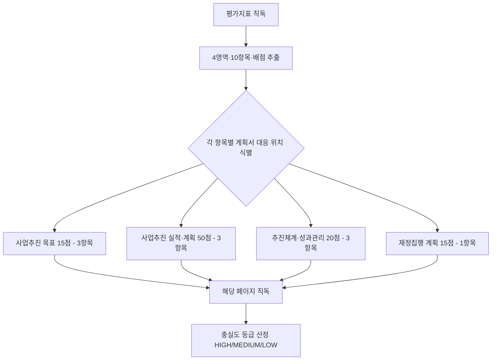
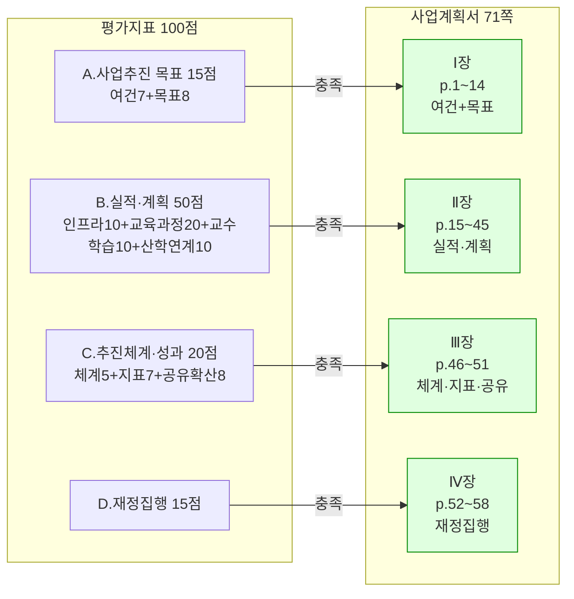

# 평가지표 커버리지·품질 분석보고서 (Q4 Indicator-Quality)

> 분석일: 2026-04-15 / 분석 축: Q4 평가지표 4영역·10항목·100점 대비 사업계획서 충실도

## 1. 분석 흐름

## 2. 지표 영역-계획서 매핑 관계도

## 3. 핵심 발견 — 서술

### 3-1. 평가지표 4영역 100점이 계획서 4개 장과 1:1로 정합한다 — 정합

평가지표 직독 결과 (A) 사업추진 목표 15점, (B) 사업추진 실적 및 계획 50점, (C) 사업추진체계 및 성과관리 20점, (D) 재정집행 계획 15점의 4영역 구조가 명확히 확인된다. 사업계획서 목차(seq 8~9 직독)는 Ⅰ장 사업추진 목표, Ⅱ장 사업추진 실적 및 계획, Ⅲ장 사업추진체계 및 성과관리, Ⅳ장 재정집행 계획의 4개 장 구조로 작성되어 있어 평가영역과 정확히 매칭된다. 평가위원이 영역별 점수를 부여할 때 즉시 해당 장을 찾을 수 있는 정합성이 확보되어 있다.

### 3-2. 가장 큰 배점인 "교육과정 개발·운영체제 구축·운영 실적 및 계획의 우수성(20점)"은 계획서 p.16~30에 충실히 서술되어 있다 — 정합

평가지표 B영역 50점 중 단일 최대 배점 항목은 교육과정 개발·운영체제 우수성 20점이다. 사업계획서 p.16 (seq 26) 사업추진 계획 총괄표는 교육과정 개발·운영 영역에 ① 교육과정 개발 전담 TF ② X+AI 교과목 표준 메뉴얼 개발 ③ 성과관리(CQI) 체계 구축 ④ AI 교양·전공·계열별 융합 교과목 개발 ⑤ WAVE-X AI 교육과정 개발 ⑥ 재직자 AI 단기과정 등 6개 세부과제를 명시하고, p.20 (seq 30)·p.25 (seq 35)에 거버넌스·전담조직·교직원 실적이, 본문 후속 페이지에 디지털 배지·나노/마이크로디그리 체계가 서술되어 있어 20점 배점에 부합하는 분량과 깊이를 확보한 것으로 확인된다.

### 3-3. 성과지표 항목(7점)은 핵심·자율 지표 모두 양식 충족 — 정합

평가지표 C영역의 "성과지표 설정의 적절성(공통지표 및 자율지표) 7점" 항목에 대해, 사업계획서 p.46~48 (seq 56~58)의 핵심성과지표 6종(AI 기초 교육과정 개발·운영 지수, AI 기초 교육과정 이수율, X+AI 소단위 교육과정 개발·운영 지수, X+AI 관련 교육과정 이수율, 교직원 AI 연수 참여율·만족도, 재직자/지역주민 AI·DX 교육 참여인원·만족도)이 표 양식으로 작성되어 있고, p.49~51 (seq 59~61)에 자율성과지표가 기준값·1차·2차 목표값과 달성계획·전략·기대효과 형식으로 서술되어 있다. 양식 충실성은 충족되었다.

### 3-4. 성과 공유·확산 계획(8점)은 다층 채널·4단계 확산 방안으로 서술되어 있다 — 정합

평가지표 C영역의 "성과 공유·확산 계획의 우수성 및 지속가능성 8점" 항목에 대해, 사업계획서 p.53 (seq 63)을 직독한 결과 "온·오프라인 홍보 채널 운영", "전남광주 통합특별시 전문대학 AI 교육협의체 구성", "AIDX 특화모델 외부 확산 전략", "지속가능성 확보 전략", "4단계 확산 방안", "사업 종료 후에도 성과 지속 발전 위한 채널 운영" 등이 양 대학 공동 운영 형식으로 서술되어 있어 8점 배점에 부합하는 깊이와 지속가능성 요건을 충족한다.

### 3-5. 재정집행 계획(15점) — 1,000백만원 기준·연계 사업 명시·세부 배분으로 충족 — 정합

평가지표 D영역 15점에 대해, 사업계획서 p.55 (seq 65) 재정투자 실적·계획 도표는 영역별(인프라/교육과정/교수학습/교직원/교육환경/산학연계) 배분과 타 재정지원사업(혁신지원·신산업특화·RISE·AID 전환·부트사업·첨단혁신융합) 출처 명시, p.56 (seq 66)의 1차/2차년도 비목별 집행계획, p.57 (seq 67)의 영역별 세부과제별 1차/2차년도 금액·비율, p.58 (seq 68)의 합계 1,000+1,000=2,000백만원·100% 정합 표기로 매우 상세한 재정집행 계획이 작성되어 있다.

### 3-6. 다만 핵심성과지표 만족도 단위가 발표자료와 다른 점은 평가 영역 간 정합성에 영향을 줄 수 있다 — MEDIUM

평가지표 C영역 "성과지표 설정의 적절성"은 지표 자체뿐 아니라 그 표기·산정 방식의 일관성을 함께 평가할 가능성이 있다. Q3(presentation_coverage) 보고서에서 식별된 발표자료 만족도 4.7점(5점 척도) ↔ 계획서 90.2점(100점 척도) 단위 불일치(P-02 HIGH)가 본 영역의 적절성 점수에 부정적으로 작용할 위험이 있다.

## 4. 정정 권고 (요약 표)

| ID | 등급 | 위치 | 내용 | 정정 방향 |
|----|------|------|------|-----------|
| Q-01 | MEDIUM | 계획서 p.46~48 ↔ 발표 슬라이드 1 | 만족도 단위 불일치가 평가지표 C영역(7점) 적절성 평가에 영향 가능 | 발표자료를 100점 척도로 통일(P-02 동시 해소) |
| Q-02 | LOW (정보) | 계획서 전반 | 4영역 매핑이 명확하므로 영역별 페이지 인덱스(미니 목차) 추가 권고 | 각 장 첫 페이지에 평가지표 항목명 병기 |

## 5. 직독 검증 로그

- 평가지표 1면 — 4영역·10항목·100점 체계 직독
- 사업계획서 목차 (seq 8~9) — 4개 장 구조 직독
- 사업계획서 p.16 (seq 26) — 사업추진 계획 총괄표 직독
- 사업계획서 p.20 (seq 30) — 거버넌스/전담조직 As-Is/To-Be 직독
- 사업계획서 p.25 (seq 35) — 교직원·재직자·지역민 실적 직독
- 사업계획서 p.46~48 (seq 56~58) — 핵심성과지표 6종 직독
- 사업계획서 p.49~51 (seq 59~61) — 자율성과지표 직독
- 사업계획서 p.53 (seq 63) — 성과 공유·확산 4단계 방안 직독
- 사업계획서 p.55~58 (seq 65~68) — 재정집행 계획 직독
- (참조) Q3 보고서 P-02 — 발표자료 만족도 단위 불일치 사실
