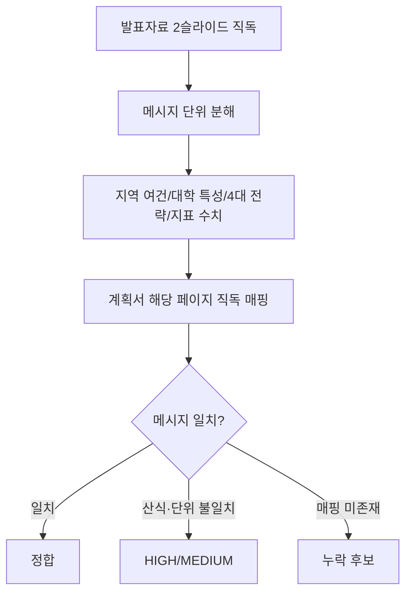
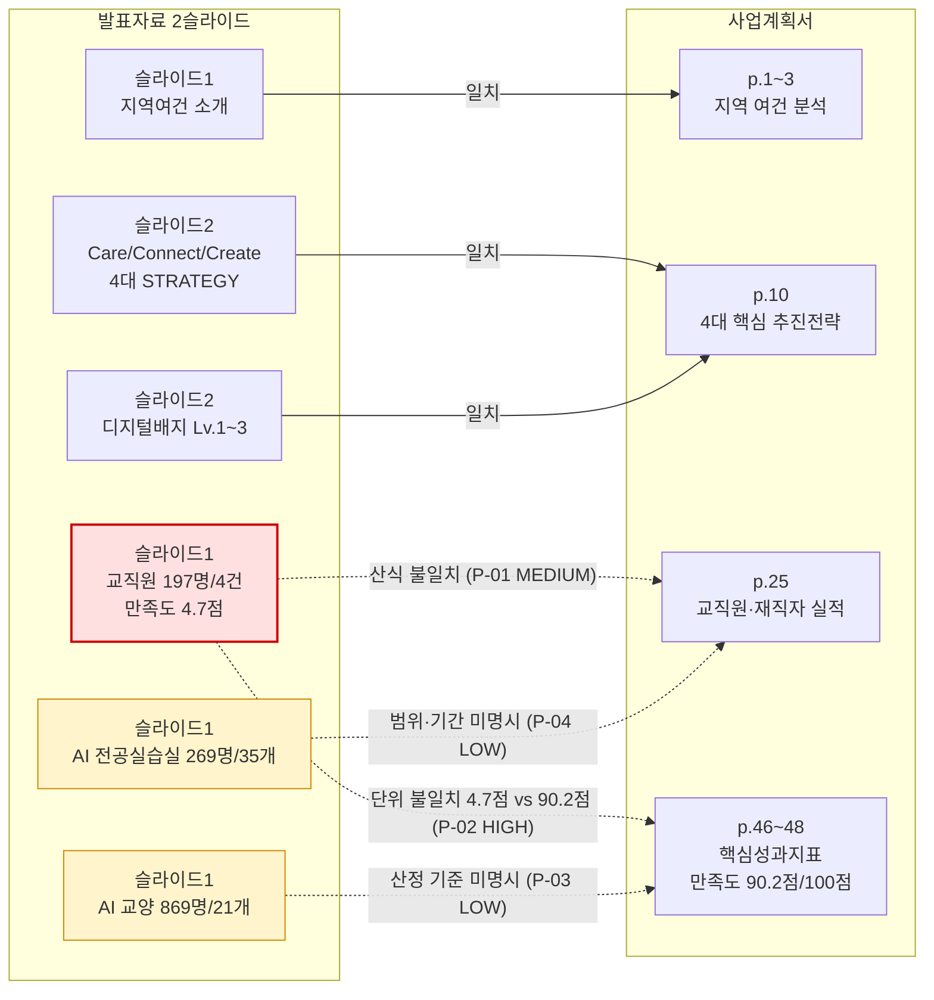

# 발표자료 커버리지 분석보고서 (Q3 Presentation-Coverage)

> 분석일: 2026-04-15 / 분석 축: Q3 발표자료(2슬라이드) ↔ 사업계획서 핵심 메시지 매칭

## 1. 분석 흐름

## 2. 발표자료-계획서 매핑 관계도

## 3. 핵심 발견 — 서술

### 3-1. 4대 추진 전략(Care/Connect/Create)은 슬라이드 2와 계획서 p.10이 정확히 일치한다 — 정합

발표자료 슬라이드 2를 직독한 결과 "Care(데이터 기반 맞춤형 지원·AI 리터러시 강화) → Connect(교양-전공-산업-AI 유기적 연결) → Create(AI 기반 현장 문제 해결 실무 역량 창출)" 3단계 순환 구조와 4개 STRATEGY(전 학과 X+AI 소양교육과정·AI 기반 맞춤형 학습자 지원·산학일체형 DX 협력 모델·평생학습 거점형 유연학사 체계)가 디지털배지 Lv.1~3과 함께 제시되어 있다. 사업계획서 p.10 (seq 20) "4대 핵심 추진 전략" 도입부 직독에서도 동일한 STRATEGY 01("전 학과 X+AI 융합 교육과정 체계 구축")이 확인되며, 발표자료의 4대 전략 메시지가 계획서 본문과 정합한다.

### 3-2. 교직원 AI 연수 만족도 단위가 발표(4.7점 척도)와 계획서(100점 척도)에서 다르다 — HIGH

발표자료 슬라이드 1 직독에서 "교직원 대상 AI 연수 ... 만족도 4.7점"이 확인된다. 사업계획서 p.46~48 (seq 56~58)의 핵심성과지표 표 "교직원 AI 연수 만족도"는 기준값 90.2점, 1차년도 91.2점, 2차년도 92.2점으로 표기되어 있어 100점 만점 척도임이 명확하다. 발표자료의 4.7점은 5점 척도로 추정되며, 동일 지표를 두 문서가 서로 다른 척도로 표기하고 있다. 평가위원이 "만족도 4.7점이 핵심성과지표상 어느 값에 해당하는가"를 질문할 가능성이 매우 높다. 환산값(예: 4.7/5×100 = 94.0점)을 발표자료 노트에 명기하거나 발표자료 자체를 100점 척도로 통일할 필요가 있다.

### 3-3. 발표자료의 "교직원 197명/4건" 산식이 계획서 실적과 직접 매칭되지 않는다 — MEDIUM

발표자료 슬라이드 1의 "교직원 대상 AI 연수 197명/4건" 표기는 사업계획서 p.25 (seq 35) 실적 표(순천제일대 교직원 2024년 6개/231명, 2025년 26개/736명; 조선이공대 2024년 1개/111명, 2025년 1개/62명)의 어느 단순 합계와도 직접 일치하지 않는다. 순천제일대 단독 2024년 수치(6개/231명)에 가깝지도 않고, 합계(34개/1,140명)와도 다르다. 발표자료에 산정 기준(대상 범위·기간·집계 시점)이 명시되지 않아 평가자가 출처를 확인하기 어렵다. (Q1 보고서 C-02와 동일 사항)

### 3-4. 슬라이드 1의 "AI 교양 869명/21개", "AI 전공 실습실 269명/35개" 수치도 산정 기준이 명시되지 않았다 — LOW

발표자료 슬라이드 1에는 "AI 교양 기초 교과목 이수 869명 21개"와 "AI 전공 실습실 269명 35개"가 표기되어 있다. 사업계획서 p.46~48의 핵심성과지표는 비율(%) 또는 지수(건) 단위로 표기되어 있어 절대 인원·과목 수 표기는 발표자료 고유 정보로 보이며, 직접 매핑이 가능한 계획서 본문 위치는 본 분석 단계에서 확인되지 않았다. 산정 기준·기간이 슬라이드 노트에 부기되어야 평가자 질의에 대비 가능하다.

### 3-5. 컨소시엄 구조와 양 대학 특성화 요약은 계획서·발표자료가 정합한다 — 정합

발표자료 슬라이드 1 "순천제일대학교(주관) + 조선이공대학교(참여) ... C-AID 특성화 모델 + WAVE-X AI 특성화 모델"은 사업계획서 p.3 (seq 13)의 양 대학 개요(순천제일대 23개 학과·재학생 2,539명, 조선이공대 26개 학과·재학생 2,806명) 및 p.5 (seq 15)의 SWOT 분석에서 확인되는 양 대학 특성화 방향과 모순되지 않는다. 컨소시엄 메시지의 정합성은 확보된 것으로 직독 확인된다.

## 4. 정정 권고 (요약 표)

| ID | 등급 | 위치 | 내용 | 정정 방향 |
|----|------|------|------|-----------|
| P-01 | MEDIUM | 발표 슬라이드 1 | "교직원 197명/4건" 산식 미명시 | 슬라이드 노트에 산정 기준(대상·기간) 부기 또는 계획서 합계와 일치 |
| P-02 | HIGH | 발표 슬라이드 1 ↔ 계획서 p.46 | 교직원 만족도 단위 불일치(5점 vs 100점) | 발표자료 100점 척도로 통일 또는 환산값 병기 |
| P-03 | LOW | 발표 슬라이드 1 | "AI 교양 869명/21개" 산정 기준 미명시 | 노트에 기준 부기 |
| P-04 | LOW | 발표 슬라이드 1 | "AI 전공 실습실 269명/35개" 범위 미명시 | 노트에 범위·기간 부기 |

## 5. 직독 검증 로그

- 발표자료 슬라이드 1 — 지역 여건·교직원 197명·만족도 4.7점·AI 교양 869명·AI 전공 실습실 269명 직독
- 발표자료 슬라이드 2 — Care/Connect/Create + 4대 STRATEGY + 디지털배지 Lv.1~3 직독
- 사업계획서 p.1~3 (seq 11~13) — 지역 여건 분석 및 양 대학 개요 직독
- 사업계획서 p.5 (seq 15) — SWOT 강·약·기·위 직독
- 사업계획서 p.10 (seq 20) — 4대 핵심 추진 전략 도입 직독
- 사업계획서 p.25 (seq 35) — 교직원·재직자·지역민 실적 표 직독
- 사업계획서 p.46~48 (seq 56~58) — 핵심성과지표 6종 표 직독(만족도 90.2/91.2/92.2점 확인)
