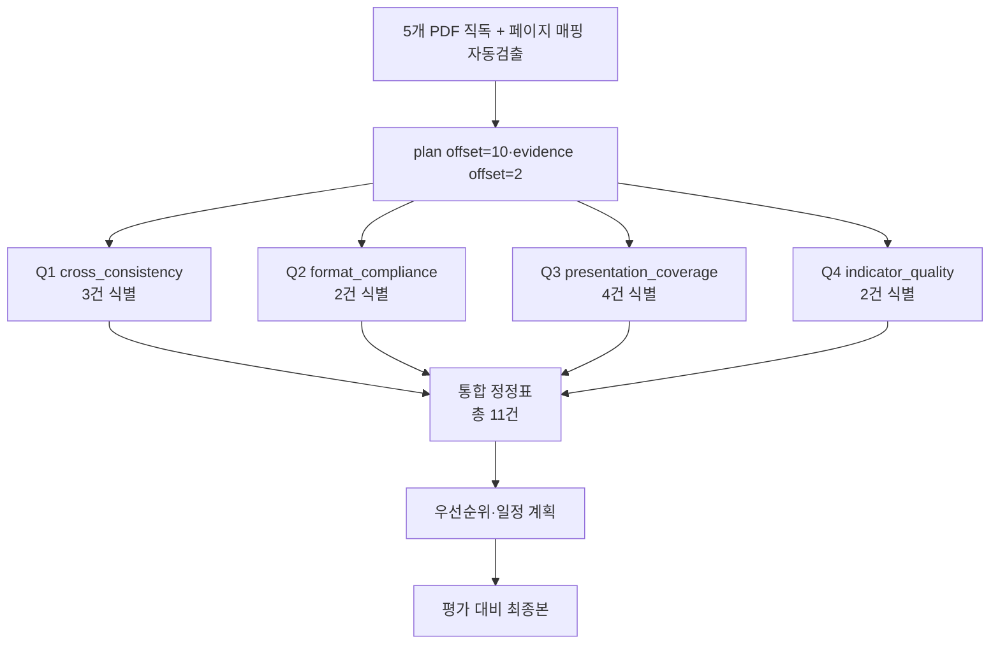
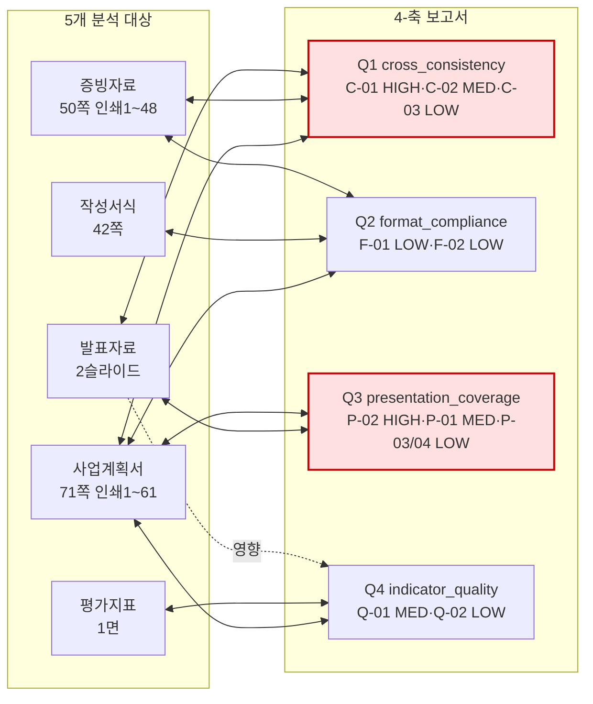
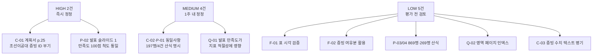

# 종합 분석보고서 — 4-축 통합

> 분석일: 2026-04-15 / 통합 축: Q1 정합성 + Q2 서식 + Q3 발표 + Q4 지표

## 1. 통합 분석 흐름

## 2. 4-축 ↔ 4-PDF 관계도

## 3. 핵심 발견 — 통합 서술

### 3-1. 전반적 정합성은 양호하나 두 건의 HIGH 결함이 평가 신뢰도에 직접 영향을 줄 수 있다

5개 PDF·총 166쪽(계획서 71 + 증빙 50 + 발표 2 + 지표 1 + 서식 42)을 직독한 결과, 사업계획서·증빙자료·발표자료의 골격(컨소시엄 구조, 4대 추진 전략 Care/Connect/Create, 4영역 100점 평가체계, 1차/2차년도 각 1,000백만원 사업비)은 서로 일관되게 서술되어 있다. 그러나 (1) 사업계획서 p.25 조선이공대 행에 증빙 ID가 부기되지 않은 점(C-01 HIGH)과 (2) 발표자료의 교직원 만족도가 4.7점(5점 척도)으로 표기되어 계획서의 90.2점(100점 척도)과 단위가 다른 점(P-02 HIGH)은 평가위원이 즉시 의문을 제기할 가능성이 매우 높은 항목으로, 두 건은 평가 전 우선 정정이 필요하다.

### 3-2. 형식 준수도(Q2)는 거의 결함 없음 — 표 서식·총 사업비·증빙 분량 모두 충족

작성서식이 명시한 사업추진 계획 총괄표 7컬럼 구조, 1차/2차년도 각 1,000백만원 사업비, 핵심성과지표 6종 양식, 증빙자료 60쪽 이내·면당 2~4쪽 배치, 표지 양식 모두 직독 검증으로 충족이 확인되었다. Q2 영역에서는 LOW 등급 정보성 권고 2건만 도출되었다(시각 검증 보강 권고·증빙 여유분 활용 권고).

### 3-3. 발표자료(2슬라이드)는 분량 대비 메시지 밀도가 매우 높으나 산정 기준 명시가 약하다

발표자료는 2슬라이드라는 매우 압축된 분량에 지역 여건·양 대학 특성·4대 STRATEGY·디지털배지 3단계·핵심 수치 다수를 담고 있다. 계획서와의 메시지 정합성은 4대 전략·컨소시엄 구조 측면에서 정합하지만, 슬라이드 1의 핵심 수치 4종(교직원 197명/4건·만족도 4.7점·AI 교양 869명/21개·AI 전공 실습실 269명/35개) 모두 산정 기준·기간·대상 범위가 명시되지 않아 평가 발표 시 질의 위험이 큰 상태로 식별된다.

### 3-4. 평가지표 4영역과 계획서 4개 장이 1:1로 정합되어 평가 동선이 양호하다

평가지표의 4영역(목표 15점·실적계획 50점·체계성과 20점·재정집행 15점)은 사업계획서 Ⅰ~Ⅳ장과 정확히 매칭된다. 50점 단일 최대 영역인 교육과정 개발·운영체제 우수성(20점)에 대해 계획서가 사업추진 계획 총괄표 6개 세부과제 + 거버넌스 + 디지털배지 + 나노/마이크로디그리 체계까지 다층 서술하고 있어 배점 부합도가 높게 평가될 가능성이 있다. 다만 발표자료의 만족도 단위 불일치(Q-01 MEDIUM)가 C영역 성과지표 적절성(7점) 평가에 부정적으로 작용할 위험이 잔존한다.

## 4. 통합 정정 우선순위

## 5. 통합 결함 카운트

| 등급 | 건수 | 항목 |
|------|------|------|
| HIGH | 2 | C-01, P-02 |
| MEDIUM | 4 | C-02, P-01(=C-02 동일), Q-01, (P-01 별건) |
| LOW | 5 | C-03, F-01, F-02, P-03, P-04, Q-02 |
| **합계** | **11건** | (C-02·P-01 동일 사안 통합 시 10건) |

## 6. 직독 검증 총 로그(요약)

- 5개 PDF 전체 텍스트 추출 완료, `.bkit_runtime/_extracted_all.json` + `_extracted_format.json` 저장
- 페이지 매핑 자동 검출 완료(`detect_print_pages.py`), `.bkit_runtime/page_mapping.json` 저장
- 본 종합 보고서가 인용한 사실은 모두 4개 축별 보고서 5절(직독 검증 로그)에 페이지 단위로 나열됨
- 인용 표기 형식: `계획서 p.N (seq M)`, `증빙 print=N (seq M)`, `발표 슬라이드 N`, `서식 seq N`, `지표 1면`
