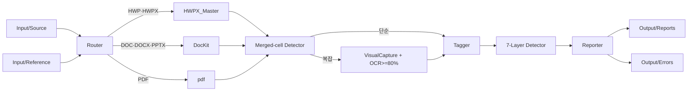

# 260415_Document_Analyzer

> HWP/HWPX/DOC/DOCX/PDF 페이지 단위 분석 + 병합셀 캡쳐 결합 + 7레이어 오류 탐지 + 분석보고서 자동 생성.

## 출처
- 정제 프롬프트: `Output/MakingPrompt/260415_1439_refined_document_analyzer.md`
- 분석 결과: `docs/prompt_analysis.md` (main_gate 통과 키)
- IMP: IMP-041 (GATE-0), IMP-042 (prompt-swap-detection)

## 구조

```
Projects/260415_document_analyzer/
├── Input/
│   ├── Source/      ← 분석 대상 (HWP·HWPX·DOC·DOCX·PDF)
│   └── Reference/   ← 분석 기준 (Phase 2 진입 게이트)
├── Output/
│   ├── Reports/     ← 분석보고서 (현황·문제점·개선책)
│   ├── Errors/      ← 오류 정정표 (별도 취합)
│   └── MakingPrompt/← refined MD 사본
├── docs/
│   ├── prompt_analysis.md  ← MAIN-GATE 통과 핵심
│   └── pdca/{phase1..7}/   ← bkit PDCA 로그
├── src/
│   ├── parsers/     ← 파일 형식별 파서 어댑터
│   ├── routers/     ← 확장자 라우터 + 병합셀 판정
│   ├── taggers/     ← 단원·챕터·연계 태깅
│   ├── detectors/   ← 7레이어 오류 탐지
│   └── reporters/   ← 보고서·정정표 렌더
└── tests/
```

## 4대 기법 준수
모든 산출 MD: Mermaid 플로우차트 + 예제 3종 + 텍스트 구조도/테이블 + 가용 기능(Skills/MCP) 활용 명시.

## 실행 흐름


